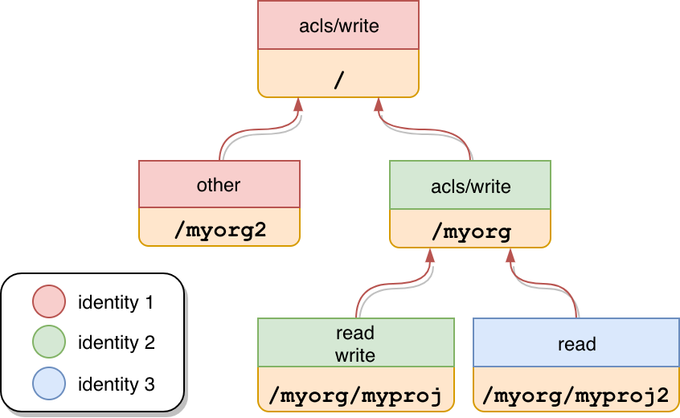

# Access Control Lists

Access Control Lists are rooted in the `/v1/acls` collection.

An ACL defines the applications' data access restriction using the following three parameters:
         
- permission: the value used to limit a client (user, group) access to resources.
- identity: a client identity reference, e.g. a certain user, a group, an anonymous user or someone who is authenticated to a certain realm.
- path: the location where to apply the restrictions. Examples of paths are: `/`, `/myorg` or `/myorg/myproject`

Access to resources in the system depends on the access control list set for them. Depending on the access control list, 
a caller may need to prove its identity by means of an **access token** passed to the `Authorization` 
header (`Authorization: Bearer {token}`). Please visit @ref:[Authentication](authentication.md) to learn more about how 
to retrieve an access token.

@@@ note { .tip title="Authorization notes" }	

When modifying ACLs, the caller must have `acls/write` permissions on the path where the ACLs are being modified or 
its ancestors.

When reading ACLs, the caller must have `acls/read` permissions on the path where the ACLs are being modified or its 
ancestors.

@@@
 
## Default permissions

When the service starts for the first time, it applies the default permissions to `/`. This gives all permissions to 
the anonymous user to enable setting up realms. It is recommended to replace these permissions once user has setup an 
authorization realm.

## ACLs Hierarchy

It is important to know that ACLs are represented in a tree-like structure depending on their path. Imagine the 
following scenario: 

Each block is identified by a path that contains a list of permissions for a certain identity (identities are color 
code divided). 

There is a special set of permissions which restrict the use of the ACLs API:

- **acls/read** - an auth. token containing an identity with this permission is allowed to fetch a collection of ACL 
from any other identity.
- **acls/write** - an auth. token containing an identity with this permission is allowed to perform the call to the 
following endpoints: @ref:[create ACLs](#create-acls), @ref:[replace ACLs](#replace-acls), 
@ref:[subtract ACLs](#subtract-acls), @ref:[append ACLs](#append-acls) and @ref:[delete ACLs](#delete-acls).

Those permissions need to be present in the current `{path}` where the API interaction occurs or in any parent path. 
In other words, they are inherited.

Let's clarify this concept with an example from the previous diagram. `identity 1` could call the 
@ref:[create ACLs](#create-acls) endpoint on any `{path}` while `identity 2` could only call the same endpoint for 
any path child of `/myorg` (like `/myorg/myproj`). At the same time, `identity 3` could not perform any of the write 
operations.

## Create ACLs

This operation creates a collection of ACL on the provided path.
```
PUT /v1/acls/{path}
  {...}
```
...where `{path}` is the target location for the ACL collection.

The json payload contains the collection of ACL to set.

**Example**

Request
:   @@snip [acls-add.sh](assets/acls/acls-add.sh)

Payload
:   @@snip [acls-add.json](assets/acls/acls-add.json)

Response
:   @@snip [acls-added-ref.json](assets/acls/acls-added-ref.json)


## Replace ACLs

This operation overrides the collection of ACL on the provided path.
```
PUT /v1/acls/{path}?rev={previous_rev}
  {...}
```

...where:

- `{previous_rev}`: Number - the last known revision for the ACL collection. Not required for replacing empty ACLs.
- `{path}`: String - is the target location for the ACL collection.

The json payload contains the collection of ACL to set.

**Example**

Request
:   @@snip [acls-replace.sh](assets/acls/acls-replace.sh)

Payload
:   @@snip [acls-add.json](assets/acls/acls-add.json)

Response
:   @@snip [acls-replaced-ref.json](assets/acls/acls-replaced-ref.json)


## Subtract ACLs

This operation removes the provided ACL collection from the existing collection of ACL on the provided path.

```
PATCH /v1/acls/{path}?rev={previous_rev}
  {...}
```
...where:

- `{previous_rev}`: Number - the last known revision for the ACL collection.
- `{path}`: String - is the target location for the ACL collection.
 
The json payload contains the collection of ACL to remove.

**Example**

Request
:   @@snip [acls-subtract.sh](assets/acls/acls-subtract.sh)

Payload
:   @@snip [acls-subtract.json](assets/acls/acls-subtract.json)

Response
:   @@snip [acls-subtracted-ref.json](assets/acls/acls-subtracted-ref.json)

## Append ACLs

This operation appends the provided ACL collection to the existing collection of ACL on the provided path.

```
PATCH /v1/acls/{path}?rev={previous_rev}
  {...}
```
...where:

- `{previous_rev}`: Number - the last known revision for the ACL collection. Not required for appending to empty ACLs.
- `{path}`: String - is the target location for the ACL collection.

The json payload contains the collection of ACL to add.

**Example**

Request
:   @@snip [acls-append.sh](assets/acls/acls-append.sh)

Payload
:   @@snip [acls-append.json](assets/acls/acls-append.json)

Response
:   @@snip [acls-appended-ref.json](assets/acls/acls-appended-ref.json)


## Delete ACLs

This operation deletes the entire collection of ACL on the provided path.

```
DELETE /v1/acls/{path}?rev={previous_rev}
```

...where:
 
- `{previous_rev}`: Number - the last known revision for the ACL collection.
- `{path}`: String - is the target location for the ACL collection.

Request
:   @@snip [acls-delete.sh](assets/acls/acls-delete.sh)

Response
:   @@snip [acls-deleted-ref.json](assets/acls/acls-deleted-ref.json)


## Fetch ACLs

```
GET /v1/acls/{path}?rev={rev}&self={self}
```

...where 

- `{path}`: String - is the target location for the ACL collection.
- `{rev}`: Number - the revision of the ACL to be retrieved. This parameter is optional and it defaults to the current revision.
- `{self}`: Boolean - if `true`, only the ACLs containing the identities found on the auth. token are included in the 
response. If `false` all the ACLs on the current `{path}` are included. This parameter is optional and it defaults to `true`.

The ability to use the query parameter `self=false` depends on whether or not any of the identities found on the auth. 
token contains the `acls:read` permission on the provided `{path}` or its ancestors. For further details, check 
@ref:[ACLs hierarchy](#acls-hierarchy).

Request
:   @@snip [acls-get.sh](assets/acls/acls-get.sh)

Response
:   @@snip [acls-fetched.json](assets/acls/acls-fetched.json)


## List ACLs

```
GET /v1/acls/{path}?ancestors={ancestors}&self={self}
```

...where 

- `{path}`: String - is the target location for the ACL collection.
- `{ancestors}`: Boolean - if `true`, the ACLs of the parent `{path}` are included in the response. If `false` only 
the ACLs on the current `{path}` are included. This parameter is optional and it defaults to `false`.
- `{self}`: Boolean - if `true`, only the ACLs containing the identities found on the auth. token are included in the 
response. If `false` all the ACLs on the current `{path}` are included. This parameter is optional and it defaults to 
`true`.

The ability to use the query parameter `self=false` and `ancestors=true` depends on whether or not any of the identities 
found on the auth. token contains the `acls:read` permission on the provided `{path}` or its parents. For further 
details, check @ref:[ACLs hierarchy](#acls-hierarchy).

The `{path}` can contain the special character `*` which can be read as `any`. 

Let's imagine we have the ACLs from the @ref:[following diagram in place](#acls-hierarchy). If we query this endpoint 
with the path `/myorg/*`, we are selecting the ACLs defined in `/myorg/myproj` and `myorg/myproj2`. Likewise If we use 
the path `/*`, we are selecting the ACLs defined in `/myorg` and `myorg2`.

The following examples illustrate listings from the diagram on the section @ref:[ACLs hierarchy](#acls-hierarchy) with 
the following considerations:

- identity 1: Is a group called `one`
- identity 2: Is a group called `two`
- identity 3: Is a user called `me`
- The auth. token is linked to the `identity 1`.

Request
:   @@snip [acls-list.sh](assets/acls/acls-list.sh)

Response
:   @@snip [acls-listed.json](assets/acls/acls-listed.json)

Request (with ancestors)
:   @@snip [acls-list-ancestors.sh](assets/acls/acls-list-ancestors.sh)

Response (with ancestors)
:   @@snip [acls-listed-ancestors.json](assets/acls/acls-listed-ancestors.json)

## ACL Server Sent Events

This endpoint allows clients to receive automatic updates from the ACLs in a streaming fashion.

```
GET /v1/acls/events
```

where `Last-Event-Id` is an optional HTTP Header that identifies the last consumed ACL event. It can be used for cases 
when a client does not want to retrieve the whole event stream, but to start after a specific event.

The response contains a series of ACL events, represented in the following way

```
data:{payload}
event:{type}
id:{id}
```

where...

- `{payload}`: Json - is the actual payload of the current ACL
- `{type}`: String - is a type identifier for the current ACL. Possible types are: AclAppended, AclSubtracted, 
  AclReplaced, AclDeleted
- `{id}`: String - is the identifier of the ACL event. It can be used in the `Last-Event-Id` HTTP Header

**Example**

Request
:   @@snip [acl-event.sh](assets/acls/event.sh)

Response
:   @@snip [acl-event.json](assets/acls/event.json)