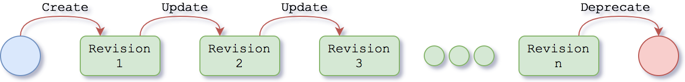

@@@ index

* @ref:[Operating on resources](operating-on-resources.md)
* @ref:[Realms](iam-realms-api.md)
* @ref:[Authentication](authentication.md)
* @ref:[Permissions](iam-permissions-api.md)
* @ref:[ACLs](iam-acls-api.md)
* @ref:[Identities](iam-identities.md)
* @ref:[Organizations](admin-orgs-api.md)
* @ref:[Projects](admin-projects-api.md)
* @ref:[Schemas](kg-schemas-api.md)
* @ref:[Resolvers](kg-resolvers-api.md)
* @ref:[Views](views/index.md)
* @ref:[Storages](kg-storages-api.md)
* @ref:[Files](kg-files-api.md)
* @ref:[Archives](kg-archives-api.md)
* @ref:[Resources](kg-resources-api.md)
* @ref:[Error Signaling](error-signaling.md)

@@@

# API Reference

Nexus Delta expose a RESTful interface over HTTP(S) for synchronous communication. The generally adopted transport 
format is JSON based, specifically @link:[JSON-LD](https://json-ld.org/){ open=new }.

The API provides access and management of several primary resource types.

## Realms 
A realm provides with the necessary information to perform authentication against a certain 
@link:[OIDC](https://en.wikipedia.org/wiki/OpenID_Connect){ open=new } provider .  

@ref:[Operations on realms](iam-realms-api.md)

## Permissions 
A permission is the basic unit to provide a way to limit applications' access to sensitive information.  

@ref:[Operations on permisions](iam-permissions-api.md)

## ACLs

In order to restrict applications' access to data by placing restrictions on them, three parameters are important:

- permission: the value used to limit a client (user, group) access to resources.
- identity: a client identity reference, e.g. a certain user, a group, an anonymous user or someone who is 
  authenticated to a certain realm.
- path: the location where to apply the restrictions

An ACL defines the set of **permissions** that certain **identities** have on a concrete **path**.

@ref:[Operations on ACLs](iam-acls-api.md)

## Identities
Identities endpoint can be used to fetch user identities.

@ref:[Operations on identities](iam-identities.md)

## Organizations 

The top-level grouping resource in the platform, called organization

@ref:[Operations on organizations](admin-orgs-api.md)

## Projects

The 2nd level grouping resources in the platform, called project. Projects provide isolation of ACLs, resource 
resolution and indices (ElasticSearch index and Blazegraph namespace).

@ref:[Operations on projects](admin-projects-api.md)

## Schemas

A schema is a resource which defines a set of rules and constrains using @link:[SHACL](https://www.w3.org/TR/shacl/){ open=new }. 

@ref:[Operations on schemas](kg-schemas-api.md)

## Resolvers

A resolver is a resource which defines the way ids are retrieved inside a project.

@ref:[Operations on resolvers](kg-resolvers-api.md)

## Views

A view is a resource which defines the way indexing is applied to certain resources inside a project.

@ref:[Operations on views](views/index.md)

## Storages

A storage is a resource which represents a backend where files are stored. It describes where and how files are created and retrieve.

@ref:[Operations on storages](kg-storages-api.md)

## Files

A file is a binary attachment resource.

@ref:[Operations on files](kg-files-api.md)

## Archives

An archive is a collection of resources stored inside an archive file. The archiving format chosen for this purpose is tar (or tarball).

@ref:[Operations on archives](kg-archives-api.md)

## Resources

A resource is the most generic entity on the Knowledge Graph. Resources can be `schemas`, `resolvers`, `views`,
`storages`, `files` or `data`.

@ref:[Operations on resources](kg-resources-api.md)

## Resource Lifecycle

Nexus Delta is build using the @link:[event sourcing](https://martinfowler.com/eaaDev/EventSourcing.html){ open=new } 
approach. This strategy captures all changes to an application state as a sequence of events.

All resources in the system generally follow the very same lifecycle, as depicted in the diagram below. Every 
interaction with an API resource (creation, updates, state changes) is recorded into the system as revisions.

Data is never removed from the system, but rather is marked as deprecated. Depending on the type of resource, the 
deprecation flag may have various semantics:

- **Organizations**: the resource itself and sub-resources cannot be updated. Views and resolvers contained within 
  this organization will not be considered during indexing and resolution processes.
- **Projects**: the resource itself and sub-resources cannot be updated. Views and resolvers contained within this 
  project will not be considered during indexing and resolution processes.
- **Schemas**: the resource itself cannot be updated and new data conformant to it cannot be created
- **Resolvers**: the resource itself will not be considered during the resolution process
- **Views**: the resource itself will not be considered during the indexing process
- **Storages**: no new files can be created against the deprecated storage
- **Files**: attachments cannot be added/deleted
- **Data**: the resource itself cannot be updated

`Archives` resources are an exception. Those resources are ephemeral. They will be automatically removed from the 
system after certain time. This time is configurable (config property `app.archives.cache-invalidate-after`) and it 
defaults to 5 hours.

Future policies may use this flag to determine if or when the deprecated data may be archived.

[SHACL]: https://www.w3.org/TR/shacl/
