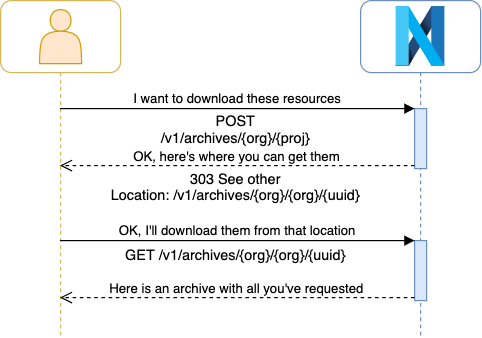

# Archives

An archive is a collection of resources stored inside an archive file. The archiving format chosen for this purpose is 
tar (or tarball). Archive resources are rooted in the `/v1/archives/{org_label}/{project_label}/` collection.

Each archive... 

- belongs to a `project` identifier by the label `{project_label}`
- inside an `organization` identifier by the label `{org_label}` 

Access to resources in the system depends on the access control list set for them. Depending on the access control 
list, a caller may need to prove its identity by means of an **access token** passed to the `Authorization` 
header (`Authorization: Bearer {token}`). Please visit @ref:[Authentication](authentication.md) to learn more about 
how to retrieve an access token.

@@@ note { .tip title="Authorization notes" }	

When modifying archives, the caller must have `archives/write` permissions on the current path of the project or the 
ancestor paths.

When reading archives, the caller must have `resources/read` permissions on the current path of the project or the 
ancestor paths.

@@@

## Archive lifecycle

Contrarily to the rest of the platform resources, archives are not persisted resources, given their nature. Therefore 
there are no update, tag or deprecation operations available on archive resources.

An archive resource will be automatically erased from the system after certain after certain time. This time is 
configurable (config property `app.archives.cache-invalidate-after`) and it defaults to 5 hours.

## Archive format

```
{
    "resources" : [
        {
            "@type": "Resource",
            "resourceId": "{resource_id}",
            "project": "{project}",
            "path": "{path}",
            "originalSource": "{originalSource}",
            "rev": "{rev}",
            "tag": "{tag}"
        },
        {
            "@type": "File",
            "resourceId": "{resource_id}",
            "project": "{project}",
            "path": "{path}",
            "rev": "{rev}",
            "tag": "{tag}"
        },
        {...}       
    ]
}
```

where...

- `{resource_id}`: Iri - the @id value of the resource to be added to the archive.
- `{project}`: String - the project (in the format 'myorg/myproject') where the specified resource belongs. This field 
  is optional. It defaults to the current project.
- `{path}`: Path - the relative path on the archive where this resource is going to stored. This field is optional. It 
  defaults to `{project}/{resourceId}.json` for a Resource type and `{project}/{filename}` for File type.
- `{originalSource}`: Boolean - flag to decide the whether to fetch the original payload or the payload with metadata 
  and JSON-LD algorithm applied. This field optional and is only allowed for Resource type. It defaults to true.
- `{rev}`: Long - the revision of the resource. This field is optional. It defaults to the latest revision.
- `{tag}`: String - the tag of the resource. This field is optional. This field cannot be present at the same time as 
  `rev` field.

In order to decide whether we want to select a resource or a file, the `@type` discriminator is used with the following 
possibilities:

- `Resource`: targets a resource
- `File`: targets a file

## Create an archive using POST

This endpoint is used to describe the archive and to subsequently consume it.
```
POST /v1/archives/{org_label}/{project_label}
```

The json payload:

- If the `@id` value is found on the payload, this @id will be used.
- If the `@id` value is not found on the payload, an @id will be generated as follows: `base:{UUID}`. The `base` is 
  the `prefix` defined on the resource's project (`{project_label}`).

The response will be an HTTP 303 Location redirect, which will point to the url where to consume the archive (tarball).

The following diagram can help to understand the HTTP exchange


**Example**

The following example shows how to create an archive containing 3 files. 2 of them are resources and the other is a file.
As a response, the tarball will be offered.

Request
:   @@snip [archive.sh](assets/archives/archive.sh)

Payload
:   @@snip [archive.json](assets/archives/archive.json)


## Create an archive using PUT

This alternative endpoint to create an archive is useful in case you want to split the creation of the archive resource 
and the consumption of it. 

It can also be useful in cases where one user wants to create the definition of the archive and share the link with 
another user who then is going to consume it.

```
PUT /v1/archives/{org_label}/{project_label}/{archive_id}
```

**Example**

Request
:   @@snip [archive-put.sh](assets/archives/archive-put.sh)

Payload
:   @@snip [archive.json](assets/archives/archive.json)

Response
:   @@snip [archive-created.json](assets/archives/archive-created.json)

Note that if the payload contains an @id different from the `{archive_id}`, the request will fail.

## Fetch an archive

When fetching an archive, the response format can be chosen through HTTP content negotiation, using the **Accept** HTTP 
header.

- **application/ld+json**: JSON-LD output response to retrieve the archive metadata. Further specifying the query 
  parameter `format=compacted|expanded` will provide with the JSON-LD 
  @link:[compacted document form](https://www.w3.org/TR/json-ld11/#compacted-document-form){ open=new } or the 
  @link:[expanded document form](https://www.w3.org/TR/json-ld11/#expanded-document-form){ open=new }.
- **\*/\***: retrieves the archive content.
- **application/x-tar**: retrieves the archive content.

```
GET /v1/archives/{org_label}/{project_label}/{archive_id}
```

**Example**

Request (tarball)
:   @@snip [archive-fetch.sh](assets/archives/archive-fetch.sh)

Request (metadata)
:   @@snip [archive-fetch-meta.sh](assets/archives/archive-fetch-meta.sh)

Response
:   @@snip [archive-fetched-meta.json](assets/archives/archive-fetched-meta.json)