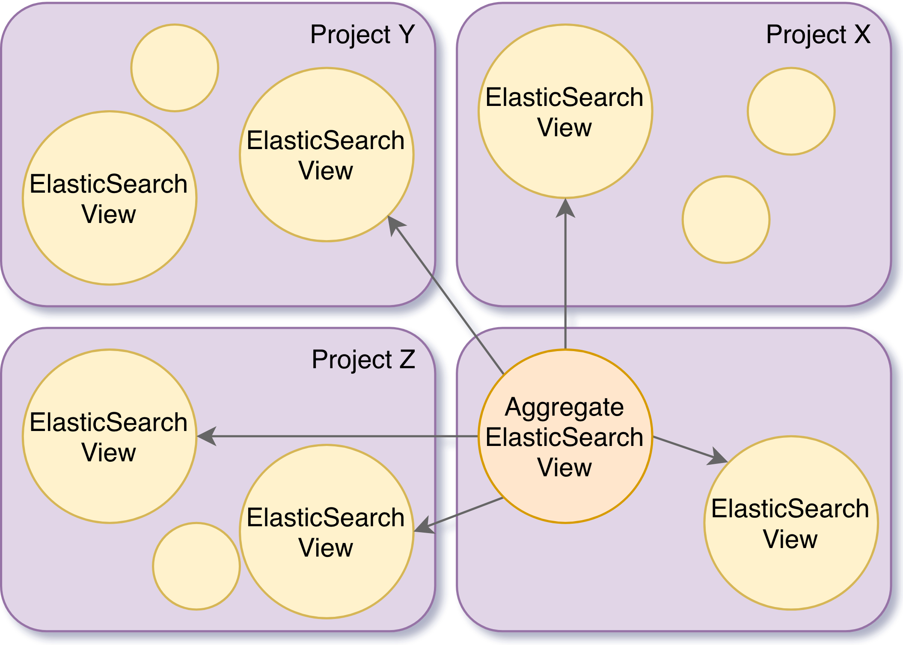

# AggregateElasticSearchView

This view is an aggregate of ElasticSearchViews. The view itself does not create any index, but it references the 
already existing indices of the linked ElasticSearchViews.

When performing queries on the `_search` endpoint, this view will make use of the 
@link:[multi-index](https://www.elastic.co/guide/en/elasticsearch/reference/current/multi-index.html){ open=new } query 
capabilities of ElasticSearch in order to select the indices of every view present on this aggregate view.

If the caller does not have the permission `views/query` on all the projects defined on the aggregated view, only a 
subset of indices (or none) will be selected, respecting the defined permissions.



## Payload

```json
{
  "@id": "{someid}",
  "@type": "AggregateElasticSearchView",
  "views": [ 
    {
        "project": "{project}",
        "viewId": "{viewId}"
    },
    ...
  ]
}
```

where...
 
- `{project}`: String - The project, defined as `{org_label}/{project_label}`, where the `{viewId}` is located.
- `{viewId}`: Iri - The view @id value to be aggregated.

## Endpoints

The following sections describe the endpoints that are specific to an AggregateElasticSearchView.

The general view endpoints are described on the @ref:[parent page](index.md#endpoints).

### Search Documents

Provides aggregated search functionality across all the `ElasticSearchView`s referenced from the target `view_id`.

```
POST /v1/views/{org_label}/{project_label}/{view_id}/_search
  {...}
```
The supported payload is defined on the 
@link:[ElasticSearch documentation](https://www.elastic.co/guide/en/elasticsearch/reference/current/search-request-body.html){ open=new }

The string `documents` is used as a prefix of the default ElasticSearch `view_id`

**Example**

Request
:   @@snip [elastic-view-search.sh](../assets/views/elastic-view-search.sh)

Payload
:   @@snip [elastic-view-payload.json](../assets/views/elastic-view-search-payload.json)

Response
:   @@snip [elastic-view-search.json](../assets/views/elastic-view-search.json)
