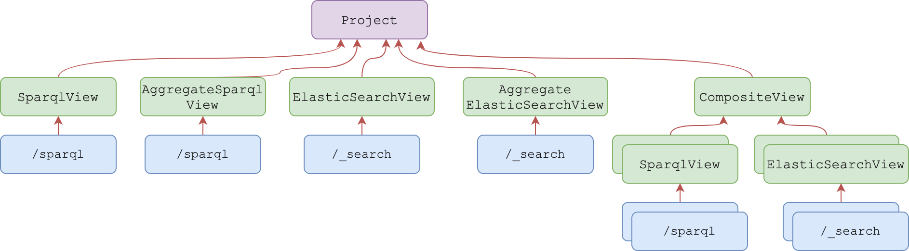

@@@ index

* @ref:[Elastic search view](elasticsearch-view-api.md)
* @ref:[Sparql view](sparql-view-api.md)
* @ref:[Composite view](composite-view-api.md)
* @ref:[Aggregated Elastic search view](aggregated-es-view-api.md)
* @ref:[Aggregated Sparql view](aggregated-sparql-view-api.md)

@@@

# Views

Views are rooted in the `/v1/views/{org_label}/{project_label}` collection and are used to index the selected resources 
into a bucket. 

Each view belongs to a `project` identifier by the label `{project_label}` inside an `organization` identifier by the label `{org_label}`.


[](../assets/views/defaults.png)

There are several types of views, which relies on different technology to perform the indexing

## ElasticSearchView

A view which stores the targeted Json resources into an ElasticSearch Document.

The Documents created on each view are isolated from Documents created on other views by using different ElasticSearch
indices.

@ref:[More information](elasticsearch-view-api.md)

## AggregateElasticSearchView

This view describes an aggregation of multiple existing ElasticSearch views. This approach is useful for searching
documents across multiple ElasticSearch views.

When querying an AggregateElasticSearchView, the query is performed on each of the described views and the results
are aggregated by ElasticSearch.

@ref:[More information](aggregated-es-view-api.md)

## SparqlView

A view that creates a Sparql namespace. which converts the targeted Json resources intro RDF triples and stores them in 
a Sparql store.

The triples created on each view are isolated from triples created on another view.

@ref:[More information](sparql-view-api.md)

## AggregateSparqlView

This view describes an aggregation of multiple existing Sparql views. This approach is useful for searching triples
across multiple Sparql views.

When querying an AggregateSparqlView, the query is performed on each of the described views. The Sparql store does
not have means for aggregating the query and for that reason this approach is very limited.

@ref:[More information](aggregated-sparql-view-api.md)

## CompositeView

A view which is composed by multiple `sources` and `projections`.

A source defines from where to retrieve the resources. It is the input for the indexing in a later stage.

A projection defines the type of indexing and the transformations to apply to the data.

Composite views are useful when aggregating data across multiple projects (local or remote) using multiple sources. 
Afterwards, by defining multiple projections, the data can be adapted to the client needs.

@ref:[More information](composite-view-api.md)

## List views

```
GET /v1/views/{org_label}/{project_label}?from={from}
                                         &size={size}
                                         &deprecated={deprecated}
                                         &rev={rev}
                                         &type={type}
                                         &createdBy={createdBy}
                                         &updatedBy={updatedBy}
                                         &q={search}
                                         &sort={sort}
```

where...

- `{from}`: Number - is the parameter that describes the offset for the current query; defaults to `0`
- `{size}`: Number - is the parameter that limits the number of results; defaults to `20`
- `{deprecated}`: Boolean - can be used to filter the resulting views based on their deprecation status
- `{rev}`: Number - can be used to filter the resulting views based on their revision value
- `{type}`: Iri - can be used to filter the resulting views based on their `@type` value. This parameter can appear 
  multiple times, filtering further the `@type` value
- `{createdBy}`: Iri - can be used to filter the resulting views based on their creator
- `{updatedBy}`: Iri - can be used to filter the resulting views based on the person which performed the last update
- `{search}`: String - can be provided to select only the views in the collection that have attribute values matching 
  (containing) the provided string
- `{sort}`: String - can be used to sort views based on a payloads' field. This parameter can appear multiple times to 
  enable sorting by multiple fields.The default is done by `_createdBy` and `@id`.


**Example**

Request
:   @@snip [view-list.sh](../assets/views/list.sh)

Response
:   @@snip [view-list.json](../assets/views/list.json)

## Server Sent Events

From Delta 1.5, it is possible to fetch SSEs for all resolvers or just resolvers
in the scope of an organization or a project.

```
GET /v1/views/events # for all view events in the application
GET /v1/views/{org_label}/events # for view events in the given organization
GET /v1/views/{org_label}/{project_label}/events # for view events in the given project
```

The caller must have respectively the `events/read` permission on `/`, `{org_label}` and `{org_label}/{project_label}`.

- `{org_label}`: String - the selected organization for which the events are going to be filtered
- `{project_label}`: String - the selected project for which the events are going to be filtered
- `Last-Event-Id`: String - optional HTTP Header that identifies the last consumed resource event. It can be used for
  cases when a client does not want to retrieve the whole event stream, but to start after a specific event.

@@@ note { .warning }

The event type for views SSEs have been changed so that it is easier to distinguish them from other types of resources.

@@@

**Example**

Request
:   @@snip [resolvers-sse.sh](../assets/views/sse.sh)

Response
:   @@snip [resolvers-sse.json](../assets/views/sse.json)