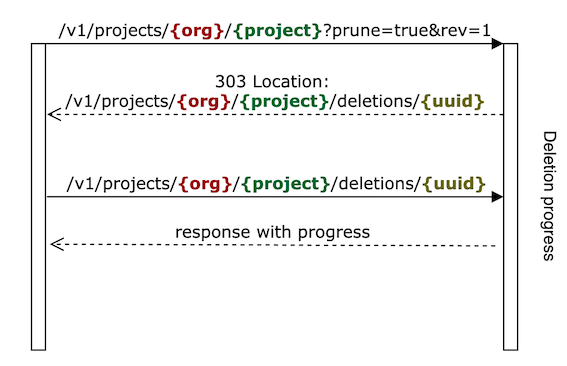

# Projects

Projects belong to an `organization` and are rooted in the corresponding `/v1/projects/{org_label}` path.
The purposes of projects are:

- Group and categorize sub-resources.
- Define global settings that apply for operations on all sub-resources. 
- Provide isolation from resources inside other projects. This behavior can be partially changed by defining 
  @ref:[resolvers](resolvers-api.md) and aggregated views @ref:[[1]](views/aggregated-es-view-api.md) @ref:[[2]](views/aggregated-sparql-view-api.md)

@@@ note { .tip title="Authorization notes" }	

When  creating projects, the caller must have `projects/create` permissions on the current path of the project or the 
ancestor paths.

When  updating projects, the caller must have `projects/write` permissions on the current path of the project or the 
ancestor paths.

When  reading projects, the caller must have `projects/read` permissions on the current path of the project or the 
ancestor paths.

When  deleting projects, the caller must have `projects/delete` permissions on the current path of the project or the
ancestor paths.

Please visit @ref:[Authentication & authorization](authentication.md) section to learn more about it.

@@@


## Payload

```
{
  "description": "{description}",
  "base": "{base}",
  "vocab": "{vocab}",
  "apiMappings": [
   {
      "prefix": "{prefix}",
      "namespace": "{namespace}"
    },
    ...
  ]
}
```

where...
 
- `{description}`: String - an optional description for this project.
- `{base}`: IRI - the @link:[JSON-LD @base](https://www.w3.org/TR/json-ld11/#base-iri){ open=new } used for generating fully qualified IRI ids
  when performing operations on a sub-resource URIs and payloads (when no other @base is present in the @context payload).
  E.g.: Let base be `http://localhost:8080/`. When a @ref:[resource is created](resources-api.md#create-using-post) and no `@id` is present in the 
  payload, the platform will generate an @id which will look like `http://localhost:8080/{UUID}`. This field is optional 
  and will default to `{{base}}/v1/resources/{org_label}/{project_label}/_/`.
- `{vocab}`: IRI - the @link:[JSON-LD @vocab](https://www.w3.org/TR/json-ld11/#default-vocabulary){ open=new } 
  for all unqualified predicates in children resources' payload (when no other @vocab is present in the @context payload and the resources' payload is not a JSON-LD aware payload). E.g. if the vocab is set to `https://schema.org/`, when 
  a field a resource is created and a field `name` is present in the payload, it will be expanded to 
  `http://schema.org/name` by the system during indexing and fetch operations. This field is optional and will default 
  to `{{base}}/v1/vocabs/{org_label}/{project_label}/`.
- `{apiMappings}`: Json object - provides a convenient way to compact/expand URIs when performing operations on a 
  sub-resource. This field is optional.

### API Mappings
The `apiMappings` Json object array maps each `prefix` to its `namespace`. This is useful in order to generate IRI ids on API endpoints using the `prefix` as an alias or curie instead of a fully expanded url encoded IRI.

@@@ note { .tip }

The api mappings only apply to children resources URIs but not to their payload. 
Please, use the @link:[JSON-LD @context](https://www.w3.org/TR/json-ld11/#the-context){ open=new } to achieve compaction/expansion on resources' payload.

@@@

Having the following `apiMappings`:

```json
{
  "apiMappings": [
   {
      "prefix": "{prefix}",
      "namespace": "{namespace}"
    },
    { ... }
  ]
}
```

where...

- `{prefix}`: String - a @link:[curie](https://www.w3.org/TR/2010/NOTE-curie-20101216/){ open=new } or an alias. 
- `{namespace}`: IRI - the actual resolution of the `prefix` field. 

Let's see an example:
 
```json
 {
   "apiMappings": [
    {
       "prefix": "person",
       "namespace": "http://example.com/some/person"
     },
     {
       "prefix": "schemas",
       "namespace": "https://bluebrainnexus.io/schemas/"
     }
   ]
 }
```

The previous project api mappings allows us to @ref:[create a schema](schemas-api.md#create-using-put) using the 
following endpoints:

- `/v1/schemas/{org_label}/{project_label}/person`. The `@id` of the resulting schema will be `http://example.com/some/person`
- `/v1/schemas/{org_label}/{project_label}/schema:other`. The `@id` of the resulting schema will be `https://bluebrainnexus.io/schemas/other`

## Create

```
PUT /v1/projects/{org_label}/{label}
  {...}
```

...where  `{label}` is the user friendly name assigned to this project. The semantics of the `label` should be
consistent with the type of data provided by its sub-resources, since it'll be a part of the sub-resources' URI.

**Example**

Request
:   @@snip [create.sh](assets/projects/create.sh)

Payload
:   @@snip [create.json](assets/projects/create.json)

Response
:   @@snip [created.json](assets/projects/created.json)


## Update

This operation overrides the project payload.

In order to ensure a client does not perform any changes to a project without having had seen the previous revision of
the project, the last revision needs to be passed as a query parameter.

```
PUT /v1/projects/{org_label}/{label}?rev={previous_rev}
  {...}
```
... where 

- `{previous_rev}`: Number - the last known revision for the organization.
- `{label}`: String - the user friendly name that identifies this project.

**Example**

Request
:   @@snip [update.sh](assets/projects/update.sh)

Payload
:   @@snip [update.json](assets/projects/update.json)

Response
:   @@snip [updated.json](assets/projects/updated.json)


## Deprecate

Locks the project, so no further operations (except for deletion) can be performed on it or on the children resources.

Deprecating a project is considered to be an update as well. 

```
DELETE /v1/projects/{org_label}/{label}?rev={previous_rev}
```

... where 

- `{previous_rev}`: Number - the last known revision for the organization.
- `{label}`: String - the user friendly name that identifies this project.

**Example**

Request
:   @@snip [deprecate.sh](assets/projects/deprecate.sh)

Response
:   @@snip [deprecated.json](assets/projects/deprecated.json)

## Delete

Deletes the target project and all its resources. 

Once the request is processed, an asynchronous task gets trigger which deletes the data generated from each resource type (e.g.: the indices generated by the views resources, the binaries generated by the files resources).
During this time, no write operation can be performed at the project level nor at the resources level for the target project.
When the task is finished, the target project can be recreated if desired.



Deletion only works when the configuration flag `app.database.deny-cleanup` is set to `false` and the current project is not referenced somewhere else (e.g.: a `CrossProjectResolver`, an `AggregatedView`, etc.).

```
DELETE /v1/projects/{org_label}/{label}?rev={previous_rev}&prune=true
```
... where

- `{previous_rev}`: Number - the last known revision for the organization.
- `{label}`: String - the user friendly name that identifies this project.

Request
:   @@snip [delete.sh](assets/projects/delete.sh)

Response
:   @@snip [delete.json](assets/projects/deleted.json)

The response contains the progress of the deletion process:

- **Deleting**: The deletion has just started.
- **ResourcesDataDeleted**: The data associated to resources has been deleted (e.g.: indices or binaries).
- **CachesDeleted**: The caches holding information about the deleted resources has been cleared.
- **ResourcesDeleted**: The project and all its resources has successfully been deleted from the primary store.

## Fetch (current version)

```
GET /v1/projects/{org_label}/{label}
```

...where `{label}` is the user friendly name that identifies this project.

**Example**

Request
:   @@snip [fetch.sh](assets/projects/fetch.sh)

Response
:   @@snip [fetched.json](assets/projects/fetched.json)


## Fetch (specific version)

```
GET /v1/projects/{org_label}/{label}?rev={rev}
```

...where

- `{label}`: String - the user friendly name that identifies this project.
- `{rev}`: Number - the revision of the project to be retrieved.

**Example**

Request
:   @@snip [fetch.sh](assets/projects/fetchAt.sh)

Response
:   @@snip [fetchedAt.json](assets/projects/fetchedAt.json)


## List

```
GET /v1/projects?from={from}
                 &size={size}
                 &deprecated={deprecated}
                 &rev={rev}
                 &createdBy={createdBy}
                 &updatedBy={updatedBy}
                 &label={label}
                 &sort={sort}
```
or the variation to filter a specific organization `{org_label}`:
```
GET /v1/projects/{org_label}?from={from}
                             &size={size}
                             &deprecated={deprecated}
                             &rev={rev}
                             &createdBy={createdBy}
                             &updatedBy={updatedBy}
                             &label={label}
                             &sort={sort}
```

where...

- `{from}`: Number - the offset from which to start the listings. Defaults to `0`
- `{size}`: Number - the maximum amount fo results to be returned. Defaults to `30`
- `{deprecated}`: Boolean - filter the resulting projects based on their deprecation status. Optional parameter.
- `{rev}`: Number - filter the resulting projects based on their revision value. Optional parameter.
- `{createdBy}`: Iri - filter the resulting projects based on their creator. Optional parameter.
- `{updatedBy}`: Iri - filter the resulting projects based on the person which performed the last update. Optional parameter.
- `{label}`: String - filter the resulting projects based on its label. E.g.: `label=my` will match
  any project's label that contains the string `my`. Optional parameter.
- `{sort}`: String - orders the resulting projects based on its metadata fields.  Optional parameter that can appear multiple times, further specifying the ordering criteria. Defaults to `_createdAt`, ordering projects by creation date.

**Example**

Request
:   @@snip [list.sh](assets/projects/list.sh)

Response
:   @@snip [listed.json](assets/projects/listed.json)

## List deletions

Lists all the projects that were deleted or are in the process to be deleted.

```
GET /v1/projects/deletions
```

Request
:   @@snip [delete.sh](assets/projects/list-delete.sh)

Response
:   @@snip [delete.json](assets/projects/list-deleted.json)

## Server Sent Events

This endpoint allows clients to receive automatic updates from the projects in a streaming fashion.

```
GET /v1/projects/events
```

where `Last-Event-Id` is an optional HTTP Header that identifies the last consumed project event. It can be used for 
cases when a client does not want to retrieve the whole event stream, but to start after a specific event.

The response contains a series of project events, represented in the following way

```
data:{payload}
event:{type}
id:{id}
```

where...

- `{payload}`: Json - is the actual payload of the current project
- `{type}`: String - is a type identifier for the current project. Possible types are: ProjectCreated, ProjectUpdated 
  and ProjectDeprecated
- `{id}`: String - is the identifier of the project event. It can be used in the `Last-Event-Id` HTTP Header

**Example**

Request
:   @@snip [sse.sh](assets/projects/sse.sh)

Response
:   @@snip [sse.json](assets/projects/sse.json)


## Fetch statistics

@@@ note { .warning }

This endpoint is experimental and the response structure might change in the future.

@@@

```
GET /v1/projects/{org_label}/{label}/statistics
```
It returns:

- the dateTime of the latest consumed event (`lastProcessedEventDateTime`).
- the number of consumed events (`eventsCount`).
- the number of consumed resources (`resourcesCount`). A resource might be made of multiple events (create, update, deprecate), so this number will always be smaller or equal to `eventsCount`.

**Example**

Request
:   @@snip [fetch-statistics.sh](assets/projects/fetch-statistics.sh)

Response
:   @@snip [fetched-statistics.json](assets/projects/fetched-statistics.json)

## Automatic project deletion

@@@ note { .warning }

This endpoint is experimental and the response structure might change in the future.

The functionality is provided through the `project-deletion` plugin that is bundled with the software, but disabled by
default. Due to the risk of inadvertently deleting unwanted projects, the plugin is disabled by default, but also
provided in a different location than the default plugin location (the `disabled` sub-folder in the `plugins` folder).

The plugin can be enabled by sym-linking or copying the plugin to the `plugins` folder and the configuring the plugin
accordingly:

- enable the plugin `-Dplugins.project-deletion.enabled=true`
- adjust the inclusion and exclusion filters `-Dplugins.project-deletion.included-projects.1=".+""` and
  `-Dplugins.project-deletion.excluded-projects.1=".+protected.+""`

For details on available configuration, please visit @link:[the plugin configuration](https://github.com/BlueBrain/nexus/blob/master/delta/plugins/project-deletion/src/main/resources/project-deletion.conf).

@@@

```
GET /v1/project-deletion/config
```

It returns the configuration of the project deletion plugin.

**Example**

Request
:   @@snip [fetch-project-deletion-config.sh](assets/projects/fetch-project-deletion-config.sh)

Response
:   @@snip [fetched-project-deletion-config.json](assets/projects/fetched-project-deletion-config.json)
