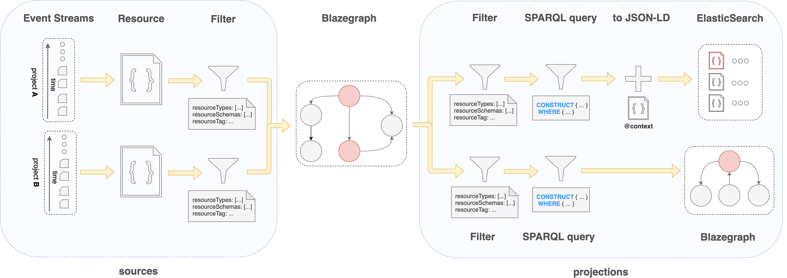

# CompositeView

This view is composed by multiple `sources` and `projections`.

## Processing pipeline

An asynchronous process gets triggered for every view. This process can be visualized as a pipeline with different stages. 

The first stage is the input of the pipeline: a stream of sources.

The last stage takes the resulting output from the pipeline and index it on the configured projection.

[](../assets/views/composite/pipeline.png)

## Sources

A source defines the location where to retrieve the resources. It is the input of the pipeline.

There are 3 types of sources available.

### ProjectEventStream

This source reads events in a streaming fashion from the current project event log.

The events are offered to the projections stage.

```json
{
   "sources": [
      {
         "@id": "{sourceId},
         "@type": "ProjectEventStream",
         "resourceSchemas": [ "{resourceSchema}", ...],
         "resourceTypes": [ "{resourceType}", ...],
         "resourceTag": "{tag}"
      }
   ],
   ...
}
```
where...

- `{sourceId}`: Iri - The identifier of the source. This field is optional. When missing, a randomly generated Iri will be assigned.
- `{resourceSchema}`: Iri - Selects only resources that are validated against the provided schema Iri. This field is optional.
- `{resourceType}`: Iri - Select only resources of the provided type Iri. This field is optional.
- `{tag}`: String - Selects only resources with the provided tag. This field is optional.

### CrossProjectEventStream

This source reads events in a streaming fashion from the defined project event log in the current Nexus Delta deployment.

The specified list of identities will be used to retrieve the resources from the project. The identities must have `events/read` permission on the target project in order to read events.

The events are offered to the projections stage.

```json
{
   "sources": [
      {
         "@id": "{sourceId}",
         "@type": "CrossProjectEventStream",
         "project": "{project}",
         "identities": [ {_identity_}, {...} ],
         "resourceSchemas": [ "{resourceSchema}", ...],
         "resourceTypes": [ "{resourceType}", ...],
         "resourceTag": "{tag}"
      }
   ],
   ...
}
```
where...

- `{sourceId}`: Iri - The identifier of the source. This field is optional. When missing, a randomly generated Iri 
  will be assigned.
- `{project}`: String - the target project (in the format 'myorg/myproject').
- `_identity_`: Json object - the identity against which to enforce ACLs during the resource retrieval process.
- `{resourceSchema}`: Iri - Selects only resources that are validated against the provided schema Iri. This field is 
  optional.
- `{resourceType}`: Iri - Select only resources of the provided type Iri. This field is optional.
- `{tag}`: String - Selects only resources with the provided tag. This field is optional.

### RemoteProjectEventStream

This source reads events in a streaming fashion from the defined project event log in a remote Nexus Delta deployment.
The provided `token` must have `events/read` permissions on the target project in order to read events.

The events are offered to the projections stage.

```json
{
   "sources": [
      {
         "@id": "{sourceId}",
         "@type": "RemoteProjectEventStream",
         "project": "{project}",
         "endpoint": "{endpoint}",
         "token": "{token}",
         "resourceSchemas": [ "{resourceSchema}", ...],
         "resourceTypes": [ "{resourceType}", ...],
         "resourceTag": "{tag}"
      }
   ],
   ...
}
```

where...

- `{sourceId}`: Iri - The identifier of the source. This field is optional. When missing, a randomly generated Iri 
  will be assigned.
- `{project}`: String - the remote project (in the format 'myorg/myproject').
- `{endpoint}`: Iri - the Nexus deployment endpoint.
- `{token}`: String - the Nexus deployment token. This field is optional. When missing, the Nexus endpoint will be 
  accessed without authentication.
- `{resourceSchema}`: Iri - Selects only resources that are validated against the provided schema Iri. This field is 
  optional.
- `{resourceType}`: Iri - Select only resources of the provided type Iri. This field is optional.
- `{tag}`: String - Selects only resources with the provided tag. This field is optional.

## Intermediate Sparql space

After the events are gathered from each source, the following steps are executed:

1. Convert event into a resource.
2. Discard undesired resources (resources not matching the source `resourceSchemas`, `resourceTypes` or `resourceTag`).
3. Store the RDF triple representation of a resource in an intermediate Sparql space. This space will be used by the 
   projections in the following pipeline steps.

## Projections

A projection defines the type of indexing and the query to transform the data. It is the output of the pipeline.

There are 2 types of projections available

### ElasticSearchProjection

This projection executes the following steps:

1. Discard undesired resources (resources not matching the projection `resourceSchemas`, `resourceTypes` or `resourceTag`).
2. Transform the resource by executing an SPARQL @link:[construct query](https://www.w3.org/TR/rdf-sparql-query/#construct){ open=new } against the intermediate Sparql space.
3. Convert the resulting RDF triples into JSON using the provided JSON-LD context.
4. Stores the resulting JSON as a Document in an ElasticSearch index.

```json
{
   "projections": [
      {
         "@id": "{projectionId}",
         "@type": "ElasticSearchProjection",
         "indexGroup": {elasticsearchIndexGroup},
         "mapping": _elasticsearch mapping_,
         "settings": _elasticsearch settings_,
         "query": "{query}",
         "context": _context_,
         "resourceSchemas": [ "{resourceSchema}", ...],
         "resourceTypes": [ "{resourceType}", ...],
         "resourceTag": "{tag}",
         "includeMetadata": {includeMetadata},
         "includeDeprecated": {includeDeprecated},
         "permission": {permission}
      }
   ],
   ...
}
```

where...

- `{projectionId}`: Iri - The identifier of the projection. This field is optional. When missing, a randomly generated 
  Iri will be assigned.
- `{elasticsearchIndexGroup}`: String - Allow to add a prefix to the name of the created index so as to make easier to query all of the indices
  with a same index group by using a wildcard (ex: `delta_mygroup_*`). This field is optional.
- `_elasticsearch mapping_`: Json object - Defines the value types for the Json keys, as stated at the 
  @link:[ElasticSearch mapping documentation](https://www.elastic.co/guide/en/elasticsearch/reference/current/mapping.html){ open=new }.
- `_elasticsearch settings_`: Json object - Defines the indexing configuration, as stated at the 
  @link:[ElasticSearch settings documentation](https://www.elastic.co/guide/en/elasticsearch/reference/current/index-modules.html#index-modules-settings){ open=new }.
- `_context_`: Json - the JSON-LD context value applied to the query results.
- `{query}`: @link:[Sparql Construct Query](https://www.w3.org/TR/rdf-sparql-query/#construct){ open=new } - Defines the Sparql query to execute against the
  intermediate Sparql space for each target resource.
- `{resourceSchema}`: Iri - Selects only resources that are validated against the provided schema Iri to perform the 
  query. This field is optional.
- `{resourceType}`: Iri - Select only resources of the provided type Iri to perform the query. This field is optional.
- `{tag}`: String - Selects only resources with the provided tag to perform the query. This field is optional.
- `{includeMetadata}`: Boolean - If true, the resource's nexus metadata (`_constrainedBy`, `_deprecated`, ...) will be 
  included in the ElasticSearch document. The default value is `false`.
- `{includeDeprecated}`: Boolean - If true, deprecated resources are also indexed. The default value is `false`.
- `{permission}`: String - the permission necessary to query this projection. Defaults to `views/query`.

### SparqlProjection

This projection executes the following steps:

1. Discard undesired resources.
2. Transform the resource by executing an Sparql construct query against the intermediate Sparql space.
3. Stores the resulting RDF Triple in a Blazegraph namespace.

```json
{
   "projections": [
      {
         "@id": "{projectionId}",
         "@type": "SparqlProjection",
         "query": "{query}",
         "resourceSchemas": [ "{resourceSchema}", ...],
         "resourceTypes": [ "{resourceType}", ...],
         "resourceTag": "{tag}",
         "includeMetadata": {includeMetadata},
         "includeDeprecated": {includeDeprecated},
        "permission": "{permission}"
      }
   ],
   ...
}
```

where...

- `{projectionId}`: Iri - The identifier of the projection. This field is optional. When missing, a randomly generated 
  Iri will be assigned.
- `{resourceSchema}`: Iri - Selects only resources that are validated against the provided schema Iri to perform the 
  query. This field is optional.
- `{resourceType}`: Iri - Select only resources of the provided type Iri to perform the query. This field is optional.
- `{tag}`: String - Selects only resources with the provided tag to perform the query. This field is optional.
- `{includeMetadata}`: Boolean - If true, the resource's nexus metadata (`_constrainedBy`, `_deprecated`, ...) will be 
  stored in the ElasticSearch document. Otherwise it won't. The default value is `false`.
- `{includeDeprecated}`: Boolean - If true, deprecated resources are also indexed. The default value is `false`.
- `{query}`: @link:[Sparql Construct Query](https://www.w3.org/TR/rdf-sparql-query/#construct){ open=new } - Defines the Sparql query to 
  execute against the intermediate Sparql space for each target resource.
- `{permission}`: String - the permission necessary to query this projection. Defaults to `views/query`. 


## Payload

```json
{
  "@id": "{someid}",
  "@type": "CompositeView",
  "sources": [ _source_, ...],
  "projections": [ _projection_, ...],
  "rebuildStrategy": {
    "@type": "Interval",
    "value": "{interval_value}"
  }
}
```

where...

- `_source_`: Json - The source definition.
- `_projection_`: Json - The projection definition.
- `{interval_value}`: String - The maximum interval delay for a resource to be present in a projection, in a human-readable format (e.g.: 10 minutes). 

Note: The `rebuildStrategy` block is optional. If missing, the view won't be automatically restarted.

### Example

The following example creates a Composite view containing 3 sources and 2 projections.

The incoming data from each of the sources is stored as RDF triples in the intermediate Sparql space . 

The ElasticSearch projection `http://music.com/es` queries the Sparql intermediate namespace when the current resource in the pipeline has the type `http://music.com/Band`.

The Sparql projection `http://music.com/sparql` queries the Sparql intermediate namespace when the current resource in the pipeline has the type `http://music.com/Album`.

The view is restarted every 10 minutes if there are new resources in any of the sources since the last time it was restarted. This allows to deal with partial graph visibility issues.

```json
{
  "@type": "CompositeView",
  "sources": [
    {
      "@id": "http://music.com/source_bands",
      "@type": "ProjectEventStream",
      "resourceTypes": [ "http://music.com/Band" ]
    },
    {
      "@id": "http://music.com/source_albums",
      "@type": "CrossProjectEventStream",
      "project": "myorg/albums",
      "identities": {
        "@type": "Anonymous"
      },
      "resourceTypes": [ "http://music.com/Album" ]
    },
    {
      "@id": "http://music.com/source_songs",
      "@type": "RemoteProjectEventStream",
      "endpoint": "http://localhost:8080/v1",
      "project": "myorg/songs",
      "resourceTypes": [ "http://music.com/Song" ]
    }
  ],
  "projections": [
    {
      "@id": "http://music.com/es",
      "@type": "ElasticSearchProjection",
      "indexGroup": "music",
      "mapping": {
        "properties": {
          "@type": {
            "type": "keyword"
          },
          "@id": {
            "type": "keyword"
          },
          "name": {
            "type": "keyword"
          },
          "genre": {
            "type": "keyword"
          },
          "start": {
            "type": "integer"
          },
          "album": {
            "type": "nested",
            "properties": {
              "title": {
                "type": "text"
              }
            }
          }
        },
        "dynamic": false
      },
      "query": "prefix music: <http://music.com/> CONSTRUCT {{resource_id} music:name ?bandName ; music:genre      ?bandGenre ; music:start      ?bandStartYear ; music:album      ?albumId . ?albumId music:title ?albumTitle . } WHERE {{resource_id}   music:name       ?bandName ; music:start ?bandStartYear; music:genre ?bandGenre . OPTIONAL {{resource_id} ^music:by ?albumId . ?albumId        music:title   ?albumTitle . } }",
      "context": {
        "@base": "http://music.com/",
        "@vocab": "http://music.com/"
      },
      "resourceTypes": [ "http://music.com/Band" ]
    },
    {
      "@id": "http://music.com/sparql",
      "@type": "SparqlProjection",
      "query": "prefix xsd: <http://www.w3.org/2001/XMLSchema#> prefix music: <http://music.com/> prefix nxv: <https://bluebrain.github.io/nexus/vocabulary/> CONSTRUCT { {resource_id}             music:name               ?albumTitle ; music:length             ?albumLength ; music:numberOfSongs      ?numberOfSongs } WHERE {SELECT ?albumReleaseDate ?albumTitle (sum(xsd:integer(?songLength)) as ?albumLength) (count(?albumReleaseDate) as ?numberOfSongs) WHERE {OPTIONAL { {resource_id}           ^music:on / music:length   ?songLength } {resource_id} music:released             ?albumReleaseDate ; music:title                ?albumTitle . } GROUP BY ?albumReleaseDate ?albumTitle }",
      "context": {
        "@base": "http://music.com/",
        "@vocab": "http://music.com/"
      },
      "resourceTypes": [ "http://music.com/Album" ]
    }
  ],
  "rebuildStrategy": {
    "@type": "Interval",
    "value": "10 minute"
  }
}
```


## Create using POST

```
POST /v1/views/{org_label}/{project_label}
  {...}
```

The json payload:

- If the `@id` value is found on the payload, this `@id` will be used.
- If the `@id` value is not found on the payload, an `@id` will be generated as follows: `base:{UUID}`. The `base` is the
  `prefix` defined on the resource's project (`{project_label}`).

**Example**

Request
:   @@snip [create.sh](../assets/views/composite/create.sh)

Payload
:   @@snip [payload.json](../assets/views/composite/payload.json)

Response
:   @@snip [created.json](../assets/views/composite/created.json)

## Create using PUT

This alternative endpoint to create a view is useful in case the json payload does not contain an `@id` but you want to
specify one. The `@id` will be specified in the last segment of the endpoint URI.

```
PUT /v1/views/{org_label}/{project_label}/{view_id}
  {...}
```

Note that if the payload contains an `@id` different from the `{view_id}`, the request will fail.

**Example**

Request
:   @@snip [create-put.sh](../assets/views/composite/create-put.sh)

Payload
:   @@snip [payload.json](../assets/views/composite/payload.json)

Response
:   @@snip [created-put.json](../assets/views/composite/created-put.json)

## Update

This operation overrides the payload.

In order to ensure a client does not perform any changes to a resource without having had seen the previous revision of
the view, the last revision needs to be passed as a query parameter.

```
PUT /v1/views/{org_label}/{project_label}/{view_id}?rev={previous_rev}
  {...}
```

... where `{previous_rev}` is the last known revision number for the view.

@@@ note { .warning }

Updating a view creates new Elasticsearch indices and Blazegraph namespaces and deletes the existing ones. The indexing process will start from the
beginning.

@@@

**Example**

Request
:   @@snip [update.sh](../assets/views/composite/update.sh)

Payload
:   @@snip [payload.json](../assets/views/composite/payload.json)

Response
:   @@snip [updated.json](../assets/views/composite/updated.json)

## Tag

Links a view revision to a specific name.

Tagging a view is considered to be an update as well.

```
POST /v1/views/{org_label}/{project_label}/{view_id}/tags?rev={previous_rev}
  {
    "tag": "{name}",
    "rev": {rev}
  }
```

... where

- `{previous_rev}`: is the last known revision number for the resource.
- `{name}`: String - label given to the view at specific revision.
- `{rev}`: Number - the revision to link the provided `{name}`.

**Example**

Request
:   @@snip [tag.sh](../assets/views/composite/tag.sh)

Payload
:   @@snip [tag.json](../assets/tag.json)

Response
:   @@snip [tagged.json](../assets/views/composite/tagged.json)

## Deprecate

Locks the view, so no further operations can be performed. It also stops indexing any more resources into it and deletes all the underlying Elasticsearch indices and Blazegraph namespaces.

Deprecating a view is considered to be an update as well.

@@@ note { .warning }

Deprecating a view deletes all the underlying Elasticsearch indices and Blazegraph namespaces, making the view not searchable.

@@@

```
DELETE /v1/views/{org_label}/{project_label}/{view_id}?rev={previous_rev}
```

... where `{previous_rev}` is the last known revision number for the view.

**Example**

Request
:   @@snip [deprecate.sh](../assets/views/composite/deprecate.sh)

Response
:   @@snip [deprecated.json](../assets/views/composite/deprecated.json)

## Fetch

```
GET /v1/views/{org_label}/{project_label}/{view_id}?rev={rev}&tag={tag}
```

where ...

- `{rev}`: Number - the targeted revision to be fetched. This field is optional and defaults to the latest revision.
- `{tag}`: String - the targeted tag to be fetched. This field is optional.
  `{rev}` and `{tag}` fields cannot be simultaneously present.

**Example**

Request
:   @@snip [fetch.sh](../assets/views/composite/fetch.sh)

Response
:   @@snip [fetched.json](../assets/views/composite/fetched.json)

## Fetch original payload

```
GET /v1/views/{org_label}/{project_label}/{view_id}/source?rev={rev}&tag={tag}
```

where ...

- `{rev}`: Number - the targeted revision to be fetched. This field is optional and defaults to the latest revision.
- `{tag}`: String - the targeted tag to be fetched. This field is optional.
  `{rev}` and `{tag}` fields cannot be simultaneously present.

**Example**

Request
:   @@snip [fetchSource.sh](../assets/views/composite/fetch-source.sh)

Response
:   @@snip [fetched.json](../assets/views/composite/payload.json)


## Fetch tags

```
GET /v1/views/{org_label}/{project_label}/{view_id}/tags?rev={rev}&tag={tag}
```

where ...

- `{rev}`: Number - the targeted revision to be fetched. This field is optional and defaults to the latest revision.
- `{tag}`: String - the targeted tag to be fetched. This field is optional.

`{rev}` and `{tag}` fields cannot be simultaneously present.

**Example**

Request
:   @@snip [fetch_tags.sh](../assets/views/composite/tags.sh)

Response
:   @@snip [tags.json](../assets/tags.json)

## Search Documents in projection(s)

```
POST /v1/views/{org_label}/{project_label}/{view_id}/projections/{projection_id}/_search
  {...}
```

where `{projection_id}` is the @id value of the target `ElasticSearch` projection. The reserved value `_`  means "every projection".

The supported payload is defined on the 
@link:[ElasticSearch documentation](https://www.elastic.co/guide/en/elasticsearch/reference/current/search-request-body.html){ open=new }


**Example**

Request
:   @@snip [es-query.sh](../assets/views/composite/es-query.sh)

Payload
:   @@snip [es-query.json](../assets/views/composite/es-query.json)

Response
:   @@snip [es-query-response.json](../assets/views/composite/es-query-response.json)


## SPARQL query in projection(s)

```
POST /v1/views/{org_label}/{project_label}/{view_id}/projections/{projection_id}/sparql
  {query}
```

```
GET /v1/views/{org_label}/{project_label}/{view_id}/projections/{projection_id}/sparql?query={query}
```

where `{projection_id}` is the @id value of the target `Sparql` projection. The reserved value `_`  means "every projection".

In both endpoints, `{query}` is defined by the 
@link:[SPARQL documentation](https://www.w3.org/TR/rdf-sparql-query/#basicpatterns){ open=new }

The `Content-Type` HTTP header for POST request is `application/sparql-query`.

From Delta 1.5, we have added support for multiple Content Negotiation types when querying the SPARQL view, allowing clients to request different response formats. The Content Negotiation is controlled by the HTTP `Accept` header. The following values are supported:

- **application/ld+json**: Returns an expanded JSON-LD document. This is supported for a subset of SPARQL queries.
- **application/n-triples**: Returns the n-triples representation. This is supported for a subset of SPARQL queries
- **application/rdf+xml**: Returns an XML document.
- **application/sparql-results+xml**: Returns the sparql results in XML.
- **application/sparql-results+json**: Returns the sparql results in Json (default).

**Example**

Request
:   @@snip [sparql-query.sh](../assets/views/composite/sparql-query.sh)

Response
:   @@snip [sparql-query-response.txt](../assets/views/composite/sparql-query-response.txt)

## SPARQL query in the intermediate space

```
POST /v1/views/{org_label}/{project_label}/{view_id}/sparql
  {query}
```

```
GET /v1/views/{org_label}/{project_label}/{view_id}/sparql?query={query}
```

In both endpoints, `{query}` is defined by the 
@link:[SPARQL documentation](https://www.w3.org/TR/rdf-sparql-query/#basicpatterns){ open=new }

The `Content-Type` HTTP header for POST request is `application/sparql-query`.

From Delta 1.5, we have added support for multiple Content Negotiation types when querying the SPARQL view, allowing clients to request different response formats. The Content Negotiation is controlled by the HTTP `Accept` header. The following values are supported:

- **application/ld+json**: Returns an expanded JSON-LD document. This is supported for a subset of SPARQL queries.
- **application/n-triples**: Returns the n-triples representation. This is supported for a subset of SPARQL queries
- **application/rdf+xml**: Returns an XML document.
- **application/sparql-results+xml**: Returns the sparql results in XML.
- **application/sparql-results+json**: Returns the sparql results in Json (default).

**Example**

Request
:   @@snip [sparql-query-intermediate.sh](../assets/views/composite/sparql-query-intermediate.sh)

Response
:   @@snip [sparql-query-intermediate-response.txt](../assets/views/composite/sparql-query-intermediate-response.txt)


## Fetch statistics

This endpoint displays statistical information about each of the composite view projections.

```
GET /v1/views/{org_label}/{project_label}/{view_id}/statistics
```

**Example**

Request
:   @@snip [statistics-intermediate.sh](../assets/views/composite/statistics-intermediate.sh)

Response
:   @@snip [statistics-response.json](../assets/views/composite/statistics-response.json)

where:

- `totalEvents` - sum of total number of events from each source
- `processedEvents` - sum of number of events that have been considered by each source
- `remainingEvents` - sum of number of events that remain to be considered by each source
- `discardedEvents` - sum of number of events that have been discarded by each source (were not evaluated due to 
  filters, e.g. did not match schema, tag or type defined in the source)
- `evaluatedEvents` - sum of number of events that have been used to update the intermediate Sparql space of each source
- `lastEventDateTime` - timestamp of the last event in the sources
- `lastProcessedEventDateTime` - timestamp of the last event processed by the sources
- `delayInSeconds` - number of seconds between the last processed event timestamp and the last known event timestamp
- `sourceId` - the @id unique value of the source
 
## Fetch source(s) statistics

This endpoint displays statistical information about the projections related to the `{source_id}` source.

```
GET /v1/views/{org_label}/{project_label}/{view_id}/sources/{source_id}/statistics
```

where `{source_id}` is the @id value of the source. The reserved value `_`  means "every source".

**Example**

Request
:   @@snip [statistics-sources.sh](../assets/views/composite/statistics-sources.sh)

Response
:   @@snip [statistics-response.json](../assets/views/composite/statistics-response.json)

where:

- `totalEvents` - total number of events for the provided source
- `processedEvents` - number of events that have been considered by the provided source
- `remainingEvents` - number of events that remain to be considered by the provided source
- `discardedEvents` - number of events that have been discarded by the provided source (were not evaluated due to 
  filters, e.g. did not match schema, tag or type defined in the source)
- `evaluatedEvents` - number of events that have been used to update the intermediate Sparql of the provided source
- `lastEventDateTime` - timestamp of the last event from the provided source
- `lastProcessedEventDateTime` - timestamp of the last event processed by the provided source
- `delayInSeconds` - number of seconds between the last processed event timestamp and the last known event timestamp
 
## Fetch projection(s) statistics

This endpoint displays statistical information about the provided projection.
 
```
GET /v1/views/{org_label}/{project_label}/{view_id}/projections/{projection_id}/statistics
```

where `{projection_id}` is the @id value of the projection. The reserved value `_`  means "every projection".


**Example**

Request
:   @@snip [statistics-projections.sh](../assets/views/composite/statistics-projections.sh)

Response
:   @@snip [statistics-response.json](../assets/views/composite/statistics-response.json)

where:

- `sourceId` - the @id unique value of the source
- `projectionId` - the @id unique value of the projection
- `totalEvents` - total number of events for the provided source
- `processedEvents` - number of events that have been considered by the projection
- `remainingEvents` - number of events that remain to be considered by the projection
- `discardedEvents` - number of events that have been discarded (were not evaluated due to filters, e.g. did not match 
  schema, tag or type defined in the projection)
- `evaluatedEvents` - number of events that have been used to update the projection index
- `lastEventDateTime` - timestamp of the last event in the source
- `lastProcessedEventDateTime` - timestamp of the last event processed by the projection
- `delayInSeconds` - number of seconds between the last processed event timestamp and the last known event timestamp

## Fetch indexing

```
GET /v1/views/{org_label}/{project_label}/{view_id}/offset
```

**Example**

Request
:   @@snip [offset.sh](../assets/views/composite/offset.sh)

Response
:   @@snip [offset-response.json](../assets/views/composite/offset-response.json)

where...

- `sourceId` - @id identifying the view's source.
- `projectionId` - @id identifying the view's projection.
- `instant` - timestamp of the last event processed by the views' projection.
- `value` - the value of the offset.

## Fetch projection(s) indexing

```
GET /v1/views/{org_label}/{project_label}/{view_id}/projections/{projection_id}/offset
```
where `{projection_id}` is the @id value of the projection. The reserved value `_`  means "every projection".

**Example**

Request
:   @@snip [offset-projection.sh](../assets/views/composite/offset-projection.sh)

Response
:   @@snip [offset-projections-response.json](../assets/views/composite/offset-projections-response.json)

where...

- `sourceId` - @id identifying the view's source.
- `projectionId` - @id identifying the view's projection.
- `instant` - timestamp of the last event processed by the views' projection.
- `value` - the value of the offset.

## Restart indexing

This endpoint restarts the view indexing process. It does not delete the created indices/namespaces but it overrides 
the graphs/documents when going through the event log.
 
```
DELETE /v1/views/{org_label}/{project_label}/{view_id}/offset
```

**Example**

Request
:   @@snip [restart.sh](../assets/views/composite/restart.sh)

Response
:   @@snip [restarted.json](../assets/views/composite/restarted.json)

## Restart projection(s) indexing

This endpoint restarts indexing process for the provided projection(s) while keeping the sources (and the intermediate
Sparql space) progress.

```
DELETE /v1/views/{org_label}/{project_label}/{view_id}/projections/{projection_id}/offset
```

**Example**

Request
:   @@snip [restart.sh](../assets/views/composite/restart.sh)

Response
:   @@snip [restarted.json](../assets/views/composite/restarted.json)


## Restart projection

This endpoint restarts indexing process for the provided projection while keeping the sources (and the intermediate 
Sparql space) progress.
 
```
DELETE /v1/views/{org_label}/{project_label}/{view_id}/projections/{projection_id}/offset
```

where `{projection_id}` is the @id value of the projection. The reserved value `_`  means "every projection".

**Example**

Request
:   @@snip [restart-projection.sh](../assets/views/composite/restart-projection.sh)

Response
:   @@snip [restarted-projection.json](../assets/views/composite/restarted-projection.json)
