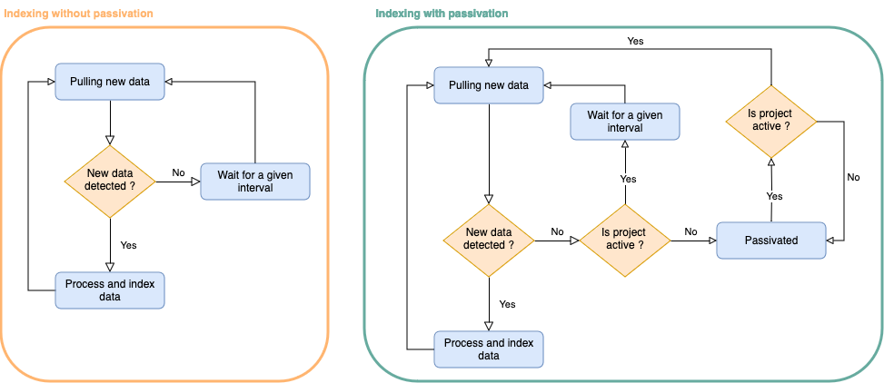

@@@ index

* @ref:[Elastic search view](elasticsearch-view-api.md)
* @ref:[Pipes](pipes.md)
* @ref:[Aggregated Elastic search view](aggregated-es-view-api.md)
* @ref:[Sparql view](sparql-view-api.md)
* @ref:[Aggregated Sparql view](aggregated-sparql-view-api.md)
* @ref:[Composite view](composite-view-api.md)

@@@

# Views

Views are rooted in the `/v1/views/{org_label}/{project_label}` collection and are used to index the selected resources 
into a bucket. 

Each view belongs to a `project` identifier by the label `{project_label}` inside an `organization` identifier by the label `{org_label}`.


[](../assets/views/defaults.png)

There are several types of views, which relies on different technology to perform the indexing

## ElasticSearchView

A view which stores the targeted Json resources into an ElasticSearch Document.

The Documents created on each view are isolated from Documents created on other views by using different ElasticSearch
indices.

@ref:[More information](elasticsearch-view-api.md)

## AggregateElasticSearchView

This view describes an aggregation of multiple existing ElasticSearch views. This approach is useful for searching
documents across multiple ElasticSearch views.

When querying an AggregateElasticSearchView, the query is performed on each of the described views and the results
are aggregated by ElasticSearch.

@ref:[More information](aggregated-es-view-api.md)

## SparqlView

A view that creates a Sparql namespace. which converts the targeted Json resources intro RDF triples and stores them in 
a Sparql store.

The triples created on each view are isolated from triples created on another view.

@ref:[More information](sparql-view-api.md)

## AggregateSparqlView

This view describes an aggregation of multiple existing Sparql views. This approach is useful for searching triples
across multiple Sparql views.

When querying an AggregateSparqlView, the query is performed on each of the described views. The Sparql store does
not have means for aggregating the query and for that reason this approach is very limited.

@ref:[More information](aggregated-sparql-view-api.md)

## CompositeView

A view which is composed by multiple `sources` and `projections`.

A source defines from where to retrieve the resources. It is the input for the indexing in a later stage.

A projection defines the type of indexing and the transformations to apply to the data.

Composite views are useful when aggregating data across multiple projects (local or remote) using multiple sources. 
Afterwards, by defining multiple projections, the data can be adapted to the client needs.

@ref:[More information](composite-view-api.md)

## Indexing

All the API calls modifying a view (creation, update, tagging, deprecation) can specify whether the view should be indexed
synchronously or in the background. This behaviour is controlled using `indexing` query param, which can be one of two values:

- `async` - (default value) the view will be indexed asynchronously
- `sync` - the view will be indexed synchronously and the API call won't return until the indexing is finished

## List views

There are three available endpoints to list views in different scopes.

### Within a project

```
GET /v1/views/{org_label}/{project_label}?from={from}
                                         &size={size}
                                         &deprecated={deprecated}
                                         &rev={rev}
                                         &type={type}
                                         &createdBy={createdBy}
                                         &updatedBy={updatedBy}
                                         &q={search}
                                         &sort={sort}
                                         &aggregations={aggregations}
```

### Within an organization

This operation returns only views from projects defined in the organisation `{org_label}` and where the caller has the `resources/read` permission.

```
GET /v1/views/{org_label}?from={from}
                         &size={size}
                         &deprecated={deprecated}
                         &rev={rev}
                         &type={type}
                         &createdBy={createdBy}
                         &updatedBy={updatedBy}
                         &q={search}
                         &sort={sort}
                         &aggregations={aggregations}
```

### Within all projects

This operation returns only views from projects where the caller has the `resources/read` permission.

```
GET /v1/views?from={from}
             &size={size}
             &deprecated={deprecated}
             &rev={rev}
             &type={type}
             &createdBy={createdBy}
             &updatedBy={updatedBy}
             &q={search}
             &sort={sort}
             &aggregations={aggregations}
```

#### Parameter description

- `{from}`: Number - is the parameter that describes the offset for the current query; defaults to `0`
- `{size}`: Number - is the parameter that limits the number of results; defaults to `20`
- `{deprecated}`: Boolean - can be used to filter the resulting views based on their deprecation status
- `{rev}`: Number - can be used to filter the resulting views based on their revision value
- `{type}`: Iri - can be used to filter the resulting views based on their `@type` value. This parameter can appear 
  multiple times, filtering further the `@type` value
- `{createdBy}`: Iri - can be used to filter the resulting views based on their creator
- `{updatedBy}`: Iri - can be used to filter the resulting views based on the person which performed the last update
- `{search}`: String - can be provided to select only the views in the collection that have attribute values matching 
  (containing) the provided string
- `{sort}`: String - can be used to sort views based on a payloads' field. This parameter can appear multiple times to 
  enable sorting by multiple fields. The default is done by `_createdBy` and `@id`.
- `{aggregations}`: Boolean - if `true` then the response will only contain aggregations of the `@type` and `_project` fields; defaults to `false`. See @ref:[Aggregations](../resources-api.md#aggregations).


**Example**

Request
:   @@snip [view-list.sh](../assets/views/list.sh)

Response
:   @@snip [view-list.json](../assets/views/list.json)

## Passivation

@@@ note

This feature remains experimental and is not enabled by default.

Its configuration and implementation is subject to change.

@@@

Before this feature, when an indexing routine linked to a view consumed every resource to index, it was
waiting for a fixed delay before attempting to pull eventual changes which may have happened during this interval.

As it was repeated for every indexing routine when a Nexus deployment has a multitude of projects and views, this ended up
with a overhead on the database.

Passivation allows to reduce an overhead by centralizing those calls with a process dedicated to look for eventual 
changes in projects.

With passivation when a view is considered active and has indexed all available data, that is to say a change on one of its resources has been pushed 
on a given interval (by default in the last `10 minutes` and configurable), it keeps the same approach and looks for eventual data at a given interval.

When there is no change in the last `10 minutes`, the view is marked as inactive and gets passivated, that is to say
it stops looking for eventual changes and relies on the dedicated process looking for eventual changes to wake it up when this one
detects a change.



The process detecting project changes is divided in 2 parts:

* A writing part which is computing incrementally the maximum offset and modified date for every project in Nexus and saves it in
the primary store.
This part relies on @ref:[the state log](../../architecture.md#anatomy) and the incremental approach allows it to be a lot faster than a sql query or a materialized view
which can take seconds (or more) to execute.
* A reading part which reads back those values in the database and computes for the different projects if those are active or not.
This part is called by the different indexing routines so that they know if they have to get out of their passivation state.

The default configuration is defined @link:[here](https://github.com/BlueBrain/nexus/blob/master/delta/app/src/main/resources/app.conf#L54) 
in the `elem-query` and `project-last-update` configuration keys.

The values defined there are quite conservative and when passivation is enabled, the different delays and intervals can be 
reduced according to your needs (they should not be lower than `200ms` though):

* A shorter interval/delay will improve indexing speed but will increase the pressure on the primary store
* A longer one will on the other hand reduce the pressure on the primary store but will also reduce indexing speed


## Indexing failures

### Listing indexing failures

This endpoint returns the indexing failures for the view `{view_id}`. The caller must have `view/write` permission on `{org_label}/{project_label}`.

```
GET /v1/views/{org_label}/{project_label}/{view_id}/failures
    ?from={from}
    &size={size}
    &instant={instant}
```

#### Parameter description

- `{from}`: Number - is the parameter that describes the offset for the current query; defaults to `0`
- `{size}`: Number - is the parameter that limits the number of results; defaults to `20`
- `{instant}`: Time Range - can be used to filter the results based on the moment they were risen

**Example**

Request
:   @@snip [failures.sh](../assets/views/failures.sh)

Response
:   @@snip [failures.json](../assets/views/failures.json)

## Server Sent Events

From Delta 1.5, it is possible to fetch SSEs for all views or just views
in the scope of an organization or a project.

```
GET /v1/views/events # for all view events in the application
GET /v1/views/{org_label}/events # for view events in the given organization
GET /v1/views/{org_label}/{project_label}/events # for view events in the given project
```

The caller must have respectively the `events/read` permission on `/`, `{org_label}` and `{org_label}/{project_label}`.

- `{org_label}`: String - the selected organization for which the events are going to be filtered
- `{project_label}`: String - the selected project for which the events are going to be filtered
- `Last-Event-Id`: String - optional HTTP Header that identifies the last consumed resource event. It can be used for
  cases when a client does not want to retrieve the whole event stream, but to start after a specific event.

@@@ note { .warning }

The event type for views SSEs have been changed so that it is easier to distinguish them from other types of resources.

@@@

**Example**

Request
:   @@snip [views-sse.sh](../assets/views/sse.sh)

Response
:   @@snip [views-sse.json](../assets/views/sse.json)