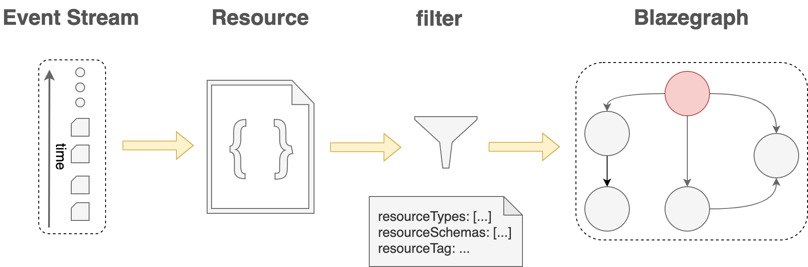

# SparqlView

This view creates a Blazegraph `namespace` and stores the targeted resources as RDF triples into a Blazegraph instance.

The triples created on each view are isolated from triples created on another view through the namespace.

A default view gets automatically created when the project is created but other views can be created.

@@@ note { .tip title="Authorization notes" }

When modifying views, the caller must have `views/write` permissions on the current path of the project or the
ancestor paths.

When querying views, the caller must have the `views/query` (or a custom permission from Delta v1.5) permission on the current path of the project or the ancestor paths.

When  reading views, the caller must have `resources/read` permissions on the current path of the project or the
ancestor paths.

Please visit @ref:[Authentication & authorization](../authentication.md) section to learn more about it.

@@@

## Processing pipeline

An asynchronous process gets trigger for every view. This process can be visualized as a pipeline with different stages. 

The first stage is the input of the pipeline: a stream of events scoped for the project where the view was created.

The last stage takes the resource, generated through the pipeline steps, and extracts its RDF triples to store them in a Blazegraph namespace.

[](../assets/views/blazegraph/sparql/pipeline.png)


## Payload

```json
{
  "@id": "{someid}",
  "@type": "SparqlView",
  "resourceSchemas": [ "{resourceSchema}", ...],
  "resourceTypes": [ "{resourceType}", ...],
  "resourceTag": "{resourceTag}",
  "includeMetadata": {includeMetadata},
  "includeDeprecated": {includeDeprecated},
  "permission": {permission}
}
```

where...

- `{resourceSchema}`: Iri - Selects only resources that are validated against the provided schema Iri. This field is optional.
- `{resourceType}`: Iri - Selects only resources of the provided type Iri. This field is optional.
- `{resourceTag}`: String - Selects the resources with the provided tag. This field is optional.
- `{includeMetadata}`: Boolean - If true, the resource's nexus metadata (`_constrainedBy`, `_deprecated`, ...) will be stored in the Sparql graph. Otherwise it won't. The default value is `false`.
- `{includeDeprecated}`: Boolean - If true, deprecated resources are also indexed. The default value is `false`.
- `{permission}`: String - The required permission to be able to query the view. The default value is `views/query`. Option available from Delta v1.5


### Example

The following example creates an Sparql view that will index resources not deprecated and with tag `mytag`.

The resulting RDF triples will contain the resources metadata.

```json
{
  "@id": "https://bluebrain.github.io/nexus/vocabulary/myview",
  "@type": "SparqlView",
  "includeMetadata": true,
  "includeDeprecated": false,
  "resourceTag": "mytag"
}

```

## Create using POST

```
POST /v1/view/{org_label}/{project_label}
  {...}
```

The json payload:

- If the `@id` value is found on the payload, this `@id` will be used.
- If the `@id` value is not found on the payload, an `@id` will be generated as follows: `base:{UUID}`. The `base` is
  the `prefix` defined on the view's project (`{project_label}`).

**Example**

Request
:   @@snip [create.sh](../assets/views/blazegraph/sparql/create.sh)

Payload
:   @@snip [payload.json](../assets/views/blazegraph/sparql/payload.json)

Response
:   @@snip [created.json](../assets/views/blazegraph/sparql/created.json)

## Create using PUT

This alternative endpoint to create a view is useful in case the json payload does not contain an `@id` but you want
to specify one. The `@id` will be specified in the last segment of the endpoint URI.
```
PUT /v1/views/{org_label}/{project_label}/{view_id}
  {...}
```

**Example**

Note that if the payload contains an @id different from the `{view_id}`, the request will fail.

Request
:   @@snip [create.sh](../assets/views/blazegraph/sparql/create-put.sh)

Payload
:   @@snip [payload.json](../assets/views/blazegraph/sparql/payload.json)

Response
:   @@snip [created.json](../assets/views/blazegraph/sparql/created.json)

## Update

This operation overrides the payload.

In order to ensure a client does not perform any changes to a view without having had seen the previous revision of
the view, the last revision needs to be passed as a query parameter.

```
PUT /v1/views/{org_label}/{project_label}/{view_id}?rev={previous_rev}
  {...}
```
... where `{previous_rev}` is the last known revision number for the view.

**Example**

Request
:   @@snip [update.sh](../assets/views/blazegraph/sparql/update.sh)

Payload
:   @@snip [payload.json](../assets/views/blazegraph/sparql/payload.json)

Response
:   @@snip [updated.json](../assets/views/blazegraph/sparql/updated.json)


@@@ note { .warning }

Updating a view creates a new Blazegraph namespace and deletes the existing one. The indexing process will start from the
beginning.

@@@

## Tag

Links a view's revision to a specific name.

Tagging a view is considered to be an update as well.

```
POST /v1/views/{org_label}/{project_label}/{view_id}/tags?rev={previous_rev}
  {
    "tag": "{name}",
    "rev": {rev}
  }
```
... where

- `{previous_rev}`: Number - the last known revision for the resolver.
- `{name}`: String - label given to the view at specific revision.
- `{rev}`: Number - the revision to link the provided `{name}`.

**Example**

Request
:   @@snip [tag.sh](../assets/views/blazegraph/tag.sh)

Payload
:   @@snip [tag.json](../assets/tag.json)

Response
:   @@snip [tagged.json](../assets/views/blazegraph/sparql/tagged.json)


## Deprecate

Locks the view, so no further operations can be performed. It also stops the indexing process and delete the associated namespace.

Deprecating a view is considered to be an update as well.

```
DELETE /v1/views/{org_label}/{project_label}/{view_id}?rev={previous_rev}
```

... where `{previous_rev}` is the last known revision number for the view.

**Example**

Request
:   @@snip [deprecate.sh](../assets/views/blazegraph/deprecate.sh)

Response
:   @@snip [deprecated.json](../assets/views/blazegraph/sparql/deprecated.json)


## Fetch

```
GET /v1/views/{org_label}/{project_label}/{view_id}?rev={rev}&tag={tag}
```

where ...

- `{rev}`: Number - the targeted revision to be fetched. This field is optional and defaults to the latest revision.
- `{tag}`: String - the targeted tag to be fetched. This field is optional.
  `{rev}` and `{tag}` fields cannot be simultaneously present.

**Example**

Request
:   @@snip [fetch.sh](../assets/views/blazegraph/fetch.sh)

Response
:   @@snip [fetched.json](../assets/views/blazegraph/sparql/fetched.json)

If the @ref:[redirect to Fusion feature](../../../getting-started/running-nexus/configuration/index.md#fusion-configuration) is enabled and
if the `Accept` header is set to `text/html`, a redirection to the fusion representation of the resource will be returned.

## Fetch original payload

```
GET /v1/views/{org_label}/{project_label}/{view_id}/source?rev={rev}&tag={tag}
```
where ...

- `{rev}`: Number - the targeted revision to be fetched. This field is optional and defaults to the latest revision.
- `{tag}`: String - the targeted tag to be fetched. This field is optional.
  `{rev}` and `{tag}` fields cannot be simultaneously present.

**Example**

Request
:   @@snip [fetchSource.sh](../assets/views/blazegraph/fetchSource.sh)

Response
:   @@snip [payload.json](../assets/views/blazegraph/sparql/payload.json)

## Fetch tags

```
GET /v1/views/{org_label}/{project_label}/{view_id}/tags?rev={rev}&tag={tag}
```
where ...

- `{rev}`: Number - the targeted revision to be fetched. This field is optional and defaults to the latest revision.
- `{tag}`: String - the targeted tag to be fetched. This field is optional.

`{rev}` and `{tag}` fields cannot be simultaneously present.

**Example**

Request
:   @@snip [fetchTags.sh](../assets/views/blazegraph/tags.sh)

Response
:   @@snip [tags.json](../assets/tags.json)

## SPARQL query

Provides search functionality on the `SparqlView` content.

```
POST /v1/views/{org_label}/{project_label}/{view_id}/sparql
  {query}
```
or
```
GET /v1/views/{org_label}/{project_label}/{view_id}/sparql?query={query}
```

In both endpoints, `{query}` is defined by the @link:[SPARQL documentation](https://www.w3.org/TR/rdf-sparql-query/#basicpatterns){ open=new }

The `Content-Type` HTTP header for POST request is `application/sparql-query`.

From Delta 1.5, we have added support for multiple Content Negotiation types when querying the SPARQL view, allowing clients to request different response formats. The Content Negotiation is controlled by the HTTP `Accept` header. The following values are supported:

- **application/ld+json**: Returns an expanded JSON-LD document. This is supported for a subset of SPARQL queries.
- **application/n-triples**: Returns the n-triples representation. This is supported for a subset of SPARQL queries
- **application/rdf+xml**: Returns an XML document.
- **application/sparql-results+xml**: Returns the sparql results in XML.
- **application/sparql-results+json**: Returns the sparql results in Json (default).

**Example**

Request
:   @@snip [search.sh](../assets/views/blazegraph/search.sh)

Response
:   @@snip [sparql-view-search.json](../assets/views/blazegraph/search.json)

## Fetch indexing

```
GET /v1/views/{org_label}/{project_label}/{view_id}/offset
```

**Example**

Request
:   @@snip [offset.sh](../assets/views/blazegraph/sparql/offset.sh)

Response
:   @@snip [offset.json](../assets/views/blazegraph/sparql/offset.json)

where...

- `instant` - timestamp of the last event processed by the view
- `value` - the value of the offset

## Fetch statistics

```
GET /v1/views/{org_label}/{project_label}/{view_id}/statistics
```

**Example**

Request
:   @@snip [statistics.sh](../assets/views/statistics.sh)

Response
:   @@snip [statistics.json](../assets/views/statistics.json)

where...

- `totalEvents` - total number of events in the project
- `processedEvents` - number of events that have been considered by the view
- `remainingEvents` - number of events that remain to be considered by the view
- `discardedEvents` - number of events that have been discarded (were not evaluated due to filters, e.g. did not match schema, tag or type defined in the view)
- `evaluatedEvents` - number of events that have been used to update an index
- `lastEventDateTime` - timestamp of the last event in the project
- `lastProcessedEventDateTime` - timestamp of the last event processed by the view
- `delayInSeconds` - number of seconds between the last processed event timestamp and the last known event timestamp
 
## Restart indexing

This endpoint restarts the view indexing process. It does not delete the created namespaces but it overrides the resource GRAPH when going through the event log.

```
DELETE /v1/views/{org_label}/{project_label}/{view_id}/offset
```

**Example**

Request
:   @@snip [view-restart.sh](../assets/views/blazegraph/restart.sh)

Response
:   @@snip [view-restart.json](../assets/views/blazegraph/restart.json)
