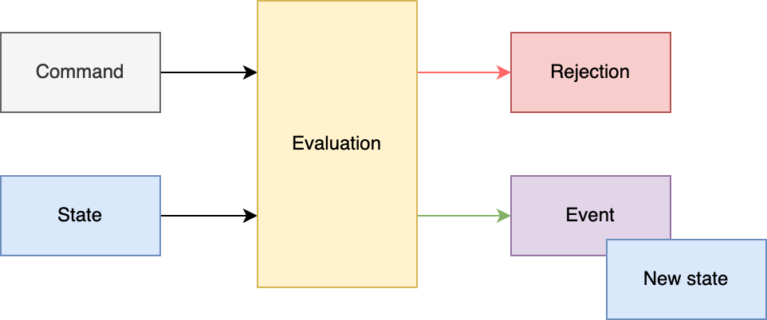

# Architecture

Blue Brain Nexus is a collection of software components that address various organizational needs relating to data
storage, management, analysis and consumption. It was designed to support the data-driven science iterative cycle at
Blue Brain but its genericity allows for its use in arbitrary contexts.

This document focuses on the characteristics of the Nexus Delta and its design choices.

## Ecosystem

Nexus Delta is a low latency, scalable and secure service that realizes a range of functions to support data management
and knowledge graph lifecycles. It uses @link:[PostgreSQL]{ open=new } as a primary store (source of truth for 
all the information in the system), @link:[Elasticsearch]{ open=new } for full text search and @link:[Blazegraph]{ open=new } 
for graph based data access.

@@@ note { .tip title="Change of primary store in Nexus 1.8" }

Until 1.8, Cassandra was the preferred primary store for Nexus.

Please visit @ref:[Release Notes for Nexus 1.8](../releases/v1.8-release-notes.md#new-primary-store) to learn more about the reasons behind 
this change.

@@@

An overview of the Blue Brain Nexus ecosystem is presented in the figure below:

@@@ div { .half .center }

@@@

@ref:[Nexus Fusion] is a web interface that helps scientists with their day-to-day data-driven activities but also
facilitates the system administrative tasks. It uses the Nexus.js (a javascript SDK) that provides as set of primitives
for building web applications for Nexus Delta.

@ref:[Nexus Forge] is a domain-agnostic, generic and extensible Python framework that enables non-expert users to create
and manage knowledge graphs using the Python programming language.

## Clustering

One of the more important design goals for the system was to be able to scale in order to support arbitrary increases in
usage and data volume. Nexus Delta can be configured to run as single node or in a cluster configuration where the load
on the system is distributed to all members:

* The state of the cluster is handled by the primary store
* The nodes don't communicate directly with each other but through changes in the primary store
* The load is distributed in the cluster in a round-robin way

Adding and removing nodes requires for the moment to:

* Stop the cluster
* Change the @link:[cluster configuration] by updating the number of nodes and defining the index for each of them
* Start the cluster

@@@ div { .half .center }

@@@

@@@ note { .tip title="New clustering deployment" }

Until 1.8, Nexus was relying on akka-cluster to run in a clustered way.

Please visit @ref:[Release Notes for Nexus 1.8](../releases/v1.8-release-notes.md#new-clustering-deployment) to learn more about the reasons behind
this change.

@@@

@link:[PostgreSQL]{ open=new } and @link:[Elasticsearch]{ open=new } were chosen for their reliability, their flexibility 
and their scalability.

@link:[Blazegraph]{ open=new } was initially chosen to handle graph access patterns, but it is currently the only part 
of the system that cannot be scaled horizontally. We're currently looking for open source alternatives that offer 
clustering out of the box or solutions that would coordinate multiple Blazegraph nodes. 

## Anatomy

Nexus Delta was built following the Command Query Responsibility Segregation (@link:[CQRS]{ open=new }) pattern where 
there's a clear separation between the read and write models. 

Intent to change an entity is represented by commands that are validated for access and consistency before being evaluated.

Successful evaluations of commands emit:

* Events that are persisted to the event log
* Updated states that are persisted in the state log.

@@@ div { .three-quarters .center }

@@@

The event log is an append-only log where no update or deletion can occur.

The state log works differently:

* Append new entries when a new entity is created or tagged (when this operation is available) 
* Update and push back to the end of the log entities that have been updated

The changes on the event and the state logs are performed in the same transaction to make sure that the state log remains consistent.

@link:[PostgreSQL]{ open=new } is used as a primary store which represents the source of truth and which is responsible
for performing the reads and writes of the logs.

Both the event and state log can be queried in different ways that allow among other things to:

* Reconstruct the state of a single resource at a given point in time
* Fetch the latest states of entities of a given type in a chronological order

@@@ div { .three-quarters .center }

@@@

Asynchronous processes (projections) rely on the range of queries offered by those logs to process data for multiple
purposes. For instance, they allow to transform and then push data from the primary store to other data stores like Elasticsearch or
Blazegraph.

@@@ div { .three-quarters .center }

@@@

The projections can persist their progress such that they can be resumed in case of a crash.

Native interfaces are also offered as part of the read (query) model for querying Elasticsearch and Blazegraph.

Projections and the separation between reads and writes have some interesting properties:

*   The system is eventually consistent and does not require a healing mechanism for handling synchronization errors
*   The primary store acts as a bulkhead in case of arbitrary data ingestion spikes
*   The primary store and the stores used for indices can be independently sized; indexing speed is allowed to vary
    based on the performance of each store
*   The system continues to function with partial degradation instead of becoming unavailable if a store suffers
    downtime

## Resource Orientation

Nexus Delta is built following the REpresentational State Transfer (@link:[REST]{ open=new }) architectural style where 
its functions are consumed via access and manipulation of resources. All information in the system (system 
configuration or user data) is represented as resources. The @ref:[API Reference] describes all supported resource 
types, the addressing scheme and available operations.

The subset of events that correspond to single resource represent the resource lifecycle as depicted in the figure
below. A resource lifecycle is a series of state transitions, each generating a unique revision.

@@@ div { .center }

@@@

User data is represented as sub-resources to projects which in turn are sub-resources of organizations. Organization
and project resources provide logical grouping and isolation allowing for variation in configuration and access control
policies.

@@@ div { .three-quarters .center }

@@@

Resource identification is based on HTTP Internationalized Resource Identifiers (@link:[IRI]{ open=new }s) and uniqueness is guaranteed
within the scope of a project. This allows the system to be used in a multi-tenant configuration but at the same time
it implies that project and organization identifiers are part of a resource addressing scheme.

In order to avoid limitations in URL lengths and for convenience, resource identifiers can be aliased and compacted
(@link:[CURIE]{ open=new }) using project level configurations.

## Authentication and Authorization

The system supports @link:[OpenID Connect]{ open=new }, @link:[OAuth 2.0]{ open=new } and 
@link:[JSON Web Tokens]{ open=new } (JWTs) standards and can be configured to use identity providers that support these 
standards. Proof of identity can be provided by passing a Bearer JWT in the Authorization header of the HTTP requests 
when consuming the RESTful API.

Nexus Delta can use @link:[LDAP]{ open=new } as an identity management system through several off-the-shelf products 
that implement these protocols on top of LDAP, like for example @link:[Keycloak]{ open=new }.

The authorization flow is as follows:

*   the provided JWT is validated against the configured identity providers
*   the subject and group claims are used to generate the set of @ref:[identities] of the caller (when no Bearer JWT is 
    provided, the assumed identity is Anonymous)
*   access to perform the intent is verified by comparing the collection of caller identities with the configured list
    of @ref:[ACLs] for the target resource(s)

[Nexus Fusion]: ../fusion/index.md
[Nexus Forge]: ../forge.md
[PostgreSQL]: https://www.postgresql.org/
[Elasticsearch]: https://www.elastic.co/elasticsearch/
[Blazegraph]: https://blazegraph.com/
[cluster configuration]: https://github.com/BlueBrain/nexus/blob/$git.branch$/delta/app/src/main/resources/app.conf#L290
[CQRS]: https://martinfowler.com/bliki/CQRS.html
[Server Sent Events]: https://html.spec.whatwg.org/multipage/server-sent-events.html
[REST]: https://en.wikipedia.org/wiki/Representational_state_transfer
[API Reference]: api/index.md
[IRI]: https://datatracker.ietf.org/doc/html/rfc3987
[CURIE]: https://www.w3.org/TR/curie/
[LDAP]: https://en.wikipedia.org/wiki/Lightweight_Directory_Access_Protocol
[OpenID Connect]: https://openid.net/developers/how-connect-works/
[OAuth 2.0]: https://datatracker.ietf.org/doc/html/rfc6749
[JSON Web Tokens]: https://jwt.io/
[Keycloak]: https://www.keycloak.org/
[identities]: api/identities.md
[ACLs]: api/acls-api.md
