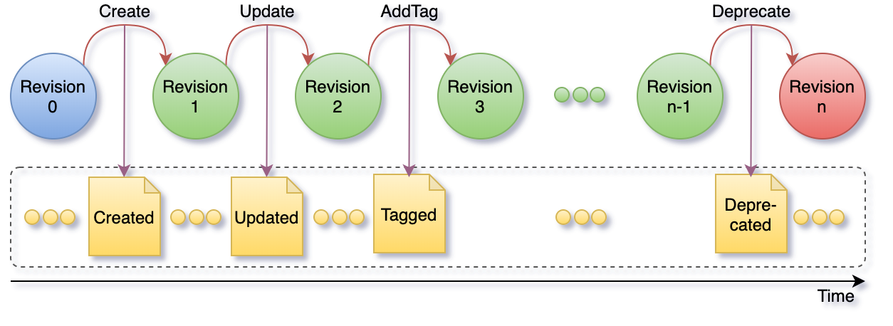

# Architecture

Blue Brain Nexus is a collection of software components that address various organizational needs relating to data
storage, management, analysis and consumption. It was designed to support the data-driven science iterative cycle at
Blue Brain but its genericity allows for its use in arbitrary contexts.

This document focuses on the characteristics of the Nexus Delta and its design choices.

## Ecosystem

Nexus Delta is a low latency, scalable and secure service that realizes a range of functions to support data management
and knowledge graph lifecycles. It uses @link:[Apache Cassandra]{ open=new } as a primary store (source of truth for 
all the information in the system), @link:[ElasticSearch]{ open=new } for full text search and @link:[BlazeGraph]{ open=new } 
for graph based data access.

An overview of the Blue Brain Nexus ecosystem is presented in the figure below:

@@@ div { .half .center }

@@@

@ref:[Nexus Fusion] is a web interface that helps scientists with their day-to-day data-driven activities but also
facilitates the system administrative tasks. It uses the Nexus.js (a javascript SDK) that provides as set of primitives
for building web applications for Nexus Delta.

@ref:[Nexus CLI] is a command line interface for scripting and automating the system administrative tasks. It also
provides the ability to execute off-process data projections to stores that are not directly supported by Nexus Delta.

@ref:[Nexus Forge] is a domain-agnostic, generic and extensible Python framework that enables non-expert users to create
and manage knowledge graphs using the Python programming language.

## Clustering

One of the more important design goals for the system was to be able scale in order to support arbitrary increases in
usage and data volume. Nexus Delta can be configured to run as single node or in a cluster configuration where the load
on the system is distributed to all members.

@link:[Akka Cluster]{ open=new } was chosen for a decentralized, fault-tolerant, peer-to-peer based cluster membership. 
It uses the @link:[Gossip Protocol]{ open=new } to randomly spread the cluster state. Nodes in the cluster communicate 
over TCP using @link:[Akka Remoting]{ open=new } for coordination and distribution of load.

@@@ div { .half .center }

@@@

@link:[Apache Cassandra]{ open=new } and @link:[ElasticSearch]{ open=new } were chosen for their horizontal scaling 
characteristics and for favouring availability over globally strong consistency.

@link:[BlazeGraph]{ open=new } was initially chosen to handle graph access patterns, but it is currently the only part 
of the system that cannot be scaled horizontally. We're currently looking for open source alternatives that offer 
clustering out of the box or solutions that would coordinate multiple BlazeGraph nodes. 

## Anatomy

Nexus Delta was built following the Command Query Responsibility Segregation (@link:[CQRS]{ open=new }) pattern where 
there's a clear separation between the read and write models. Intent to change the application state is represented by 
commands that are validated for access and consistency before being evaluated. Successful evaluations of commands emit 
events that are persisted to the global event log.

Asynchronous processes (projections) replay the event log and process the information for efficient consumption. The
information in the recorded events is transformed into documents (in the case of ElasticSearch) and named graphs (in
the case of BlazeGraph) and persisted in the respective stores. The projections persist their progress such that
they can be resumed in case of a crash.

Sources of events for projections are both the primary store and other (remote) Nexus Delta deployments through the
@link:[Server Sent Events]{ open=new } W3C recommendation. This allows for data aggregation when building indices.

Native interfaces are offered as part of the read (query) model for querying ElasticSearch and BlazeGraph.

@@@ div { .center }

@@@

Asynchronous indexing (projections) and the separation between reads and writes have some interesting consequences:

*   the system is eventually consistent and does not require a healing mechanism for handling synchronization errors
*   the primary store acts as a bulkhead in case of arbitrary data ingestion spikes
*   the primary store and the stores used for indices can be independently sized; indexing speed is allowed to vary
    based on the performance of each store
*   the system continues to function with partial degradation instead of becoming unavailable if a store suffers
    downtime

@link:[Apache Cassandra]{ open=new } is used as an eventsourced primary store and represents the source of truth for 
all the information in the system. Updates are not performed in place, state changes are appended to the event log. 
The state of the system is derived from the sequence of events in the log.

The global event log is partitioned such that there's no need to replay the entire log. Subsets can be replayed, like
for example when reconstructing the current state of a single resource. 

@@@ div { .three-quarters .center }

@@@

## Resource Orientation

Nexus Delta is built following the REpresentational State Transfer (@link:[REST]{ open=new }) architectural style where 
its functions are consumed via access and manipulation of resources. All information in the system (system 
configuration or user data) is represented as resources. The @ref:[API Reference] describes all supported resource 
types, the addressing scheme and available operations.

The subset of events that correspond to single resource represent the resource lifecycle as depicted in the figure
below. A resource lifecycle is a series of state transitions, each generating a unique revision.

@@@ div { .center }

@@@

User data is represented as sub-resources to projects which in turn are sub-resources of organizations. Organization
and project resources provide logical grouping and isolation allowing for variation in configuration and access control
policies.

@@@ div { .three-quarters .center }

@@@

Resource identification is based on HTTP Internationalized Resource Identifiers (@link:[IRI]{ open=new }s) and uniqueness is guaranteed
within the scope of a project. This allows the system to be used in a multi-tenant configuration but at the same time
it implies that project and organization identifiers are part of a resource addressing scheme.

In order to avoid limitations in URL lengths and for convenience, resource identifiers can be aliased and compacted
(@link:[CURIE]{ open=new }) using project level configurations.

## Authentication and Authorization

The system supports @link:[OpenID Connect]{ open=new }, @link:[OAuth 2.0]{ open=new } and 
@link:[JSON Web Tokens]{ open=new } (JWTs) standards and can be configured to use identity providers that support these 
standards. Proof of identity can be provided by passing a Bearer JWT in the Authorization header of the HTTP requests 
when consuming the RESTful API.

Nexus Delta can use @link:[LDAP]{ open=new } as an identity management system through several off-the-shelf products 
that implement these protocols on top of LDAP, like for example @link:[Keycloak]{ open=new }.

The authorization flow is as follows:

*   the provided JWT is validated against the configured identity providers
*   the subject and group claims are used to generate the set of @ref:[identities] of the caller (when no Bearer JWT is 
    provided, the assumed identity is Anonymous)
*   access to perform the intent is verified by comparing the collection of caller identities with the configured list
    of @ref:[ACLs] for the target resource(s)

[Nexus Fusion]: ../fusion/index.md
[Nexus CLI]: ../utilities/nexus-python-cli.md
[Nexus Forge]: ../forge.md
[Apache Cassandra]: https://cassandra.apache.org/
[ElasticSearch]: https://www.elastic.co/elasticsearch/
[BlazeGraph]: https://blazegraph.com/
[Akka Cluster]: https://doc.akka.io/docs/akka/current/typed/cluster-concepts.html
[Gossip Protocol]: https://en.wikipedia.org/wiki/Gossip_protocol
[Akka Remoting]: https://doc.akka.io/docs/akka/current/remoting-artery.html
[CQRS]: https://martinfowler.com/bliki/CQRS.html
[Server Sent Events]: https://www.w3.org/TR/eventsource/
[REST]: https://en.wikipedia.org/wiki/Representational_state_transfer
[API Reference]: ./api/current/index.md
[IRI]: https://tools.ietf.org/html/rfc3987
[CURIE]: https://www.w3.org/TR/curie/
[LDAP]: https://en.wikipedia.org/wiki/Lightweight_Directory_Access_Protocol
[OpenID Connect]: https://openid.net/connect/
[OAuth 2.0]: https://tools.ietf.org/html/rfc6749
[JSON Web Tokens]: https://jwt.io/
[Keycloak]: https://www.keycloak.org/
[identities]: ./api/current/iam-identities.md
[ACLs]: ./api/current/iam-acls-api.md
