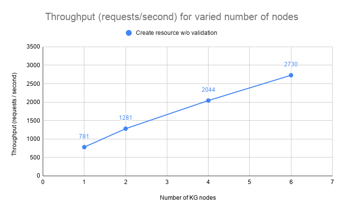
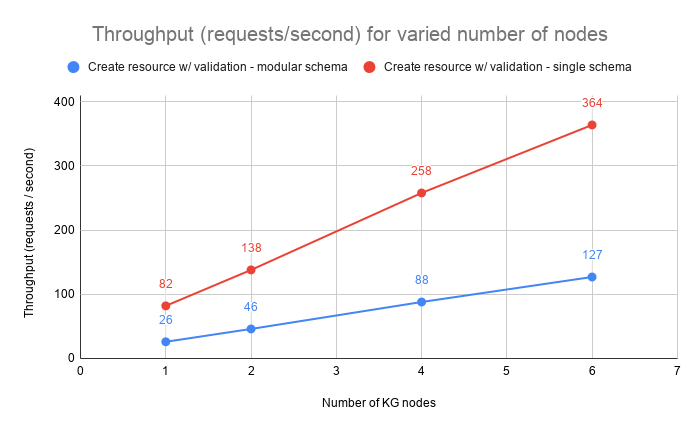

# Benchmarks

The main goal of the benchmarks is to analyze the hardware requirements for a Nexus deployment and to find potential
issues and / or bottlenecks. In particular, we are most interested in the following metrics:

*   **throughput** - how many requests per second the system can handle
*   **latency** - the time the system needed to provide response to the requests

... and how they were affected by different factors, especially:

*   **data volume** - how does the volume of the data in the system affect the performance
*   **hardware configuration and scalability** - does assigning more hardware increase the performance of the system and
    can the system scale both horizontally and vertically.
*   **clustering** - what's the effect of changing from a single node to clustered deployment, as well as, what's the
    effect of adding more nodes to the cluster.

The test scenarios and scripts can be found in the @link:[nexus-benchmarks](https://github.com/BlueBrain/nexus-benchmarks){ open=new }
repository.

The tests were run against version 1.2.1 in October 2019 using @link:[Gatling](https://gatling.io/){ open=new } version 3.2.1.

# Environment

The system was deployed on AWS EKS using the following basic configuration:

*   8 compute nodes of 16 vCPU, 64 GB RAM, 2 x 300 GB NVMe disks
*   nginx ingress controller
*   1 Keycloak pod using MariaDB as its storage
*   6 Cassandra pods each with 4 vCPU, 6 GB HEAP, local NVMe storage, replication factor of 3
*   3 Elasticsearch pods each with 4 vCPU, 8 GB HEAP, local NVMe storage
*   1 Blazegraph pod with 8 vCPU, 16 GB HEAP, local NVMe storage
*   1 Prometheus pod and 1 Jaeger pod

The services were deployed as follows:

*   3 pod IAM cluster, each node using 4 vCPU, 4 GB HEAP
*   3 pod Admin cluster, each node using 4 vCPU, 4 GB HEAP
*   1 to 6 pods KG cluster, each node with 8 vCPU, 8 GB HEAP

# Data volume

Prior to the test execution a reasonable amount of data was injected into the system to ensure the system behaves well
under a typical volume, specifically 120,000,000 resources were created across 27 projects using an exponential
distribution. The total number of triples (22 for each resource + 11 system metadata) was approximately: 4,000,000,000.

The following resource template was used for both pre-created resources and the resources created during the tests:
```
{
  "@type": [
    "http://www.w3.org/ns/prov#Activity",
    "https://neuroshapes.org/StimulusExperiment"
  ],
  "http://www.w3.org/ns/prov#used": {
    "@id": "https://nexus-sandbox.io/neurosciencegraph/data/049b569d-98ba-4a54-a9cb-45f5c5cd3b40",
    "@type": [
      "http://www.w3.org/ns/prov#Entity",
      "https://neuroshapes.org/PatchedCell"
    ],
    "http://schema.org/name": "Some PatchedCell"
  },
  "http://www.w3.org/ns/prov#wasAssociatedWith": {
    "@id": "https://nexus-sandbox.io/v1/realms/random/users/someuser",
    "@type": "http://www.w3.org/ns/prov#Agent"
  },
  "https://neuroshapes.org/hadProtocol": {
    "@id": "https://nexus-sandbox.io/neurosciencegraph/data/3f189851-c3de-470d-894e-68abe116bfe4",
    "@type": [
      "https://neuroshapes.org/Protocol",
      "https://neuroshapes.org/ExperimentalProtocol",
      "http://www.w3.org/ns/prov#Entity"
    ],
    "http://schema.org/name": "Some Protocol"
  },
  "https://neuroshapes.org/stimulus": {
    "https://neuroshapes.org/stimulusType": {
      "@id": "http://stimulusont.org/H20S8",
      "http://www.w3.org/2000/01/rdf-schema#label": "H20S8"
    }
  }
}
```

# Scenarios

The main focus of the tests is to identify the throughput and latency for the primary operations as most of the
secondary operations would either have the same results or be irrelevant. For example:

*   tagging or deprecating a resource is equivalent to performing a create without validation
*   updating a resource is equivalent to creating a new one (with or without validation)
*   accessing the incoming or outgoing link is irrelevant as the system just delegates the operation to the triple store

The primary operations are:

*   create without validation
*   create with validation using a schema that imports others as transitive dependencies
*   create with validation using a schema with the same collection of shapes but without any dependencies
*   fetch a resource by id while injecting the metadata in the resource RDF graph representation and returning it as json
*   fetch a resource source json representation

Each test has been run for 5 minutes using a concurrency level (users) of 16 for each KG node
(e.g.: 6 KG nodes -> 96 users).

# Results

## Highlights and conclusions

The system scales almost linearly with the number of nodes in terms of throughput and the latency remains within
acceptable values.

In most cases the increase of latency is minimal as adding additional nodes to the cluster increases
the necessary data exchange between nodes when handling requests. The chance for the required data to be handled by the
node that accepts each request decreases from 100% (single node) to ~16% (6 node cluster) and if executing the request
implies interaction with multiple resources (like in the case of creating a resource with validation where the schema
has import definitions) the chances drop close to 1%.

The latency increase for creating resources with validation using a self contained (single) schema is caused by the
fact that the system is CPU bound while performing heavy operations. The the values for the 50 and 95 percentiles show
that there's a higher deviation in the values for this operation. This is explained by nodes processing different
number of validations depending on how requests are distributed between the members of the cluster.








## Raw results

The following sections show the exact numbers for throughput and latency of the system for each test configuration.

### Create Resource, No Validation

The test evaluates the throughput and latency at 50, 75, 95 and 99 percentiles when creating new unconstrained
resources.

| Nodes | Users | Throughput (req/s) | p50 (ms) | p75 (ms) | p95 (ms) | p99 (ms) |
|-------|-------|--------------------|----------|----------|----------|----------|
|     1 |    16 |                781 |       16 |       21 |       42 |       57 |
|     2 |    32 |               1281 |       20 |       29 |       50 |       66 |
|     4 |    64 |               2044 |       25 |       37 |       65 |       89 |
|     6 |    96 |               2730 |       40 |       62 |       96 |      130 |

### Create Resource, Validation, CrossProject Resolution, Modular Schema

The test evaluates the throughput and latency at 50, 75, 95 and 99 percentiles when creating new resources constrained
by schemas hosted in a separate project than the one used for creation. The schema uses transitive imports of other
schemas and contexts.

| Nodes | Users | Throughput (req/s) | p50 (ms) | p75 (ms) | p95 (ms) | p99 (ms) |
|-------|-------|--------------------|----------|----------|----------|----------|
|     1 |    16 |                 26 |      618 |      638 |      666 |      699 |
|     2 |    32 |                 46 |      682 |      712 |      768 |      977 |
|     4 |    64 |                 88 |      719 |      753 |      822 |     1067 |
|     6 |    96 |                127 |      743 |      806 |      898 |     1051 |

### Create Resource, Validation, InProject Resolution, Modular Schema

The test evaluates the throughput and latency at 50, 75, 95 and 99 percentiles when creating new resources constrained
by schemas hosted in the same project as the one used for creation. The schema uses transitive imports of other
schemas and contexts.

| Nodes | Users | Throughput (req/s) | p50 (ms) | p75 (ms) | p95 (ms) | p99 (ms) |
|-------|-------|--------------------|----------|----------|----------|----------|
|     1 |    16 |                 28 |      569 |      590 |      620 |      650 |
|     2 |    32 |                 48 |      655 |      685 |      736 |      926 |
|     4 |    64 |                 97 |      658 |      687 |      739 |      867 |
|     6 |    96 |                125 |      758 |      799 |      879 |      977 |

### Create Resource, Validation, InProject Resolution, Single Schema

The test evaluates the throughput and latency at 50, 75, 95 and 99 percentiles when creating new resources constrained
by a schema hosted in the same project as the one used for creation. The schema has all the necessary shapes defined in
the same resource and does not reference other schemas or contexts.

| Nodes | Users | Throughput (req/s) | p50 (ms) | p75 (ms) | p95 (ms) | p99 (ms) |
|-------|-------|--------------------|----------|----------|----------|----------|
|     1 |    16 |                 82 |      201 |      228 |      272 |      316 |
|     2 |    32 |                138 |      211 |      301 |      410 |      504 |
|     4 |    64 |                258 |      153 |      317 |      668 |      838 |
|     6 |    96 |                364 |      147 |      273 |      879 |     1198 |

### Fetch Resource

The test evaluates the throughput and latency at 50, 75, 95 and 99 percentiles when getting a resource by its id. It
shows the impact of transforming the original json representation into an RDF graph, injecting the system metadata
(e.g. rev, deprecated, project, org etc.) and presenting the result in a JSON-LD representation.

| Nodes | Users | Throughput (req/s) | p50 (ms) | p75 (ms) | p95 (ms) | p99 (ms) |
|-------|-------|--------------------|----------|----------|----------|----------|
|     1 |    16 |                777 |       20 |       21 |       28 |       33 |
|     2 |    32 |               1518 |       20 |       22 |       28 |       45 |
|     4 |    64 |               3000 |       20 |       22 |       30 |       47 |
|     6 |    96 |               4393 |       19 |       25 |       40 |       61 |

### Fetch Resource Source

The test evaluates the throughput and latency at 50, 75, 95 and 99 percentiles when getting a resource by its id in its
original representation.

| Nodes | Users | Throughput (req/s) | p50 (ms) | p75 (ms) | p95 (ms) | p99 (ms) |
|-------|-------|--------------------|----------|----------|----------|----------|
|     1 |    16 |               1050 |       15 |       16 |       17 |       26 |
|     2 |    32 |               2103 |       15 |       16 |       18 |       30 |
|     4 |    64 |               3821 |       16 |       17 |       19 |       37 |
|     6 |    96 |               5648 |       16 |       17 |       21 |       37 |