# Benchmarks v1.4.2

The tests were run against version 1.4.2 in January 2021 using @link:[Gatling](https://gatling.io/){ open=new } version 3.5.0.

These are the most recent benchmarks. For older benchmarks of Nexus version 1.2.1 see @ref:[here](v1.2.1.md).

# Environment

The system was deployed on AWS EKS using the following basic configuration:

*   Up to 12 compute nodes of 16 vCPU, 64 GB RAM
*   [AWS EBS storage](https://aws.amazon.com/ebs/) - gp3, 10 000 IOPS, throughput 250 MB/s
*   Nginx ingress controller
*   1 Keycloak pod using its internal database H2 as storage, 5GB gp2 storage
*   1 to 12 Cassandra pods each with 3.5 vCPU, 12 GB HEAP, 250 GB EBS storage
*   1 Elasticsearch pod with 2 vCPU, 8 GB HEAP, 50GB gp2 storage
*   1 Blazegraph pod with 2 vCPU, 4 GB HEAP, 50GB gp2 storage
*   1 Prometheus pod and 1 Grafana pod, 50GB gp2 storage

The services were deployed as follows:

*   1 to 12 Delta pods with 8 vCPU, 8GB HEAP

# Data volume

Prior to the test execution a reasonable amount of data was injected into the system to ensure the system behaves well
under a typical volume, specifically 120,000,000 resources were created across 27 projects using an exponential
distribution. The total number of triples (22 for each resource + 11 system metadata) was approximately: 4,000,000,000.

The following resource template was used for both pre-created resources and the resources created during the tests:
```
{
  "@type": [
    "http://www.w3.org/ns/prov#Activity",
    "https://neuroshapes.org/StimulusExperiment"
  ],
  "http://www.w3.org/ns/prov#used": {
    "@id": "https://nexus-sandbox.io/neurosciencegraph/data/049b569d-98ba-4a54-a9cb-45f5c5cd3b40",
    "@type": [
      "http://www.w3.org/ns/prov#Entity",
      "https://neuroshapes.org/PatchedCell"
    ],
    "http://schema.org/name": "Some PatchedCell"
  },
  "http://www.w3.org/ns/prov#wasAssociatedWith": {
    "@id": "https://nexus-sandbox.io/v1/realms/random/users/someuser",
    "@type": "http://www.w3.org/ns/prov#Agent"
  },
  "https://neuroshapes.org/hadProtocol": {
    "@id": "https://nexus-sandbox.io/neurosciencegraph/data/3f189851-c3de-470d-894e-68abe116bfe4",
    "@type": [
      "https://neuroshapes.org/Protocol",
      "https://neuroshapes.org/ExperimentalProtocol",
      "http://www.w3.org/ns/prov#Entity"
    ],
    "http://schema.org/name": "Some Protocol"
  },
  "https://neuroshapes.org/stimulus": {
    "https://neuroshapes.org/stimulusType": {
      "@id": "http://stimulusont.org/H20S8",
      "http://www.w3.org/2000/01/rdf-schema#label": "H20S8"
    }
  }
}
```

# Scenarios

The main focus of the tests is to identify the throughput and latency for the primary operations as most of the
secondary operations would either have the same results or be irrelevant. For example:

*   tagging or deprecating a resource is equivalent to performing a create without validation
*   updating a resource is equivalent to creating a new one (with or without validation)
*   accessing the incoming or outgoing link is irrelevant as the system just delegates the operation to the triple store

The primary operations are:

*   create without validation
*   create with validation using a schema that imports others as transitive dependencies
*   create with validation using a schema with the same collection of shapes but without any dependencies
*   fetch a resource by id while injecting the metadata in the resource RDF graph representation and returning it as json
*   fetch a resource source json representation

Each test has been run for 5 minutes using a concurrency level of 32 for each Delta node
(e.g.: 6 Delta nodes -> 192 users), except for the single node test where a concurrency level of 16 was used.

# Results

## Highlights and conclusions

The system scales almost linearly with the number of nodes in terms of throughput and the latency remains within
acceptable values.

In most cases the increase of latency is minimal as adding additional nodes to the cluster increases
the necessary data exchange between nodes when handling requests. The chance for the required data to be handled by the
node that accepts each request decreases from 100% (single node) to ~16% (6 node cluster) and if executing the request
implies interaction with multiple resources (like in the case of creating a resource with validation where the schema
has import definitions) the chances drop close to 1%.

The latency increase for creating resources with validation using a self contained (single) schema is caused by the
fact that the system is CPU bound while performing heavy operations. The the values for the 95th percentiles show
that there's a higher deviation in the values for this operation. This is explained by nodes processing different
number of validations depending on how requests are distributed between the members of the cluster.

As the benchmarks were performed using EBS (remote) storage for the Cassandra instances this may have influenced the latency during the benchmarks. However, when re-running the benchmarks the results were very similar. In addition, when studying the overall performance of the system and comparing it to the previous benchmarks which used local storage the performance still behaves as expected.

It can be also be observed that enabling authentication does not add any significant amount of latency to the benchmarks.

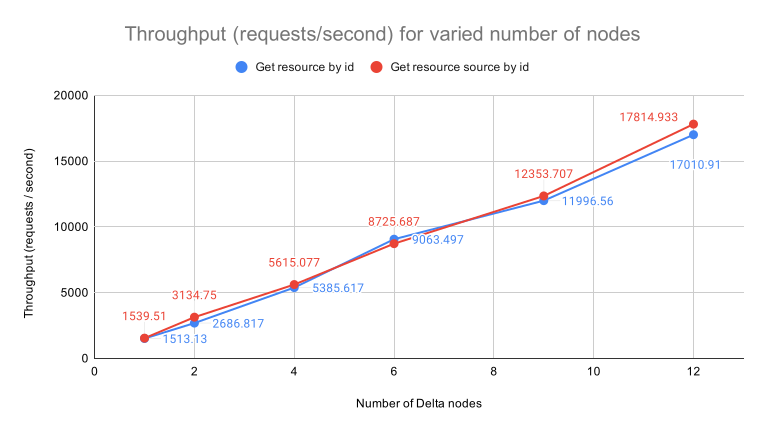

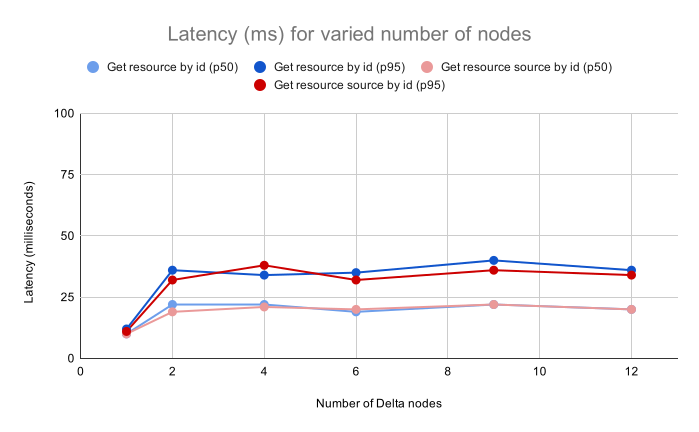

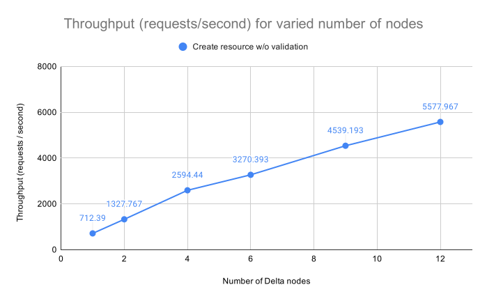

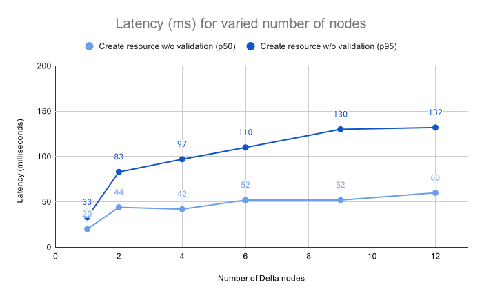


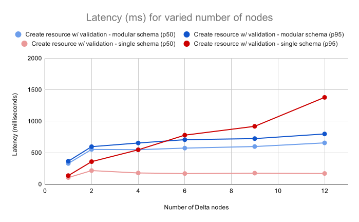

## Raw results

The following sections show the exact numbers for throughput and latency of the system for each test configuration.

### Create Resource, No Validation

The test evaluates the throughput and latency at 50, 75, 95 and 99 percentiles when creating new unconstrained resources.

| Nodes | Concurrency | Throughput (req/s) | p50 (ms) | p75 (ms) | p95 (ms) | p99 (ms) |
|-------|-------------|--------------------|----------|----------|----------|----------|
|     1 |          16 |                712 |       20 |       24 |       33 |       81 |
|     2 |          64 |               1328 |       44 |       54 |       83 |      110 |
|     4 |         128 |               2594 |       42 |       56 |       97 |      125 |
|     6 |         192 |               3270 |       52 |       71 |      110 |      143 |
|     9 |         288 |               4539 |       52 |       77 |      130 |      172 |
|    12 |         384 |               5578 |       60 |       86 |      132 |      174 |

### Create Resource, Validation, InProject Resolution, Modular Schema

The test evaluates the throughput and latency at 50, 75, 95 and 99 percentiles when creating new resources constrained by schemas hosted in the same project as the one used for creation. The schema uses transitive imports of other schemas and contexts.

| Nodes | Concurrency | Throughput (req/s) | p50 (ms)  |  p75 (ms) |  p95 (ms) |  p99 (ms) |
|-------|-------------|--------------------|-----------|-----------|-----------|-----------|
|     1 |           8 |                 24 |       329 |       340 |       365 |       437 |
|     2 |          32 |                 58 |       552 |       596 |       640 |       709 |
|     4 |          64 |                116 |       548 |       587 |       654 |       793 |
|     6 |          96 |                164 |       573 |       614 |       707 |       915 |
|     9 |         144 |                237 |       598 |       638 |       724 |       899 |
|    12 |         192 |                288 |       656 |       702 |       798 |      1044 |

### Create Resource, Validation, InProject Resolution, Single Schema

The test evaluates the throughput and latency at 50, 75, 95 and 99 percentiles when creating new resources constrained by a schema hosted in the same project as the one used for creation. The schema has all the necessary shapes defined in the same resource and does not reference other schemas or contexts.

| Nodes | Concurrency | Throughput (req/s) | p50 (ms)  |  p75 (ms) |  p95 (ms) |  p99 (ms) |
|-------|-------------|--------------------|-----------|-----------|-----------|-----------|
|     1 |           8 |                 73 |       105 |       122 |       136 |       157 |
|     2 |          32 |                141 |       216 |       277 |       358 |       428 |
|     4 |          64 |                266 |       178 |       297 |       546 |       692 |
|     6 |          96 |                367 |       169 |       246 |       779 |      1159 |
|     9 |         144 |                532 |       175 |       240 |       919 |      1350 |
|    12 |         192 |                626 |       170 |       218 |      1379 |      2216 |

### Fetch Resource

The test evaluates the throughput and latency at 50, 75, 95 and 99 percentiles when getting a resource by its id. It
shows the impact of transforming the original json representation into an RDF graph, injecting the system metadata
(e.g. rev, deprecated, project, org etc.) and presenting the result in a JSON-LD representation.

| Nodes | Concurrency | Throughput (req/s)  | p50 (ms) | p75 (ms) | p95 (ms) | p99 (ms) |
|-------|-------------|---------------------|----------|----------|----------|----------|
|     1 |          16 |                1513 |       10 |       11 |       12 |       19 |
|     2 |          64 |                2687 |       22 |       25 |       36 |       45 |
|     4 |         128 |                5386 |       22 |       24 |       34 |       45 |
|     6 |         192 |                9063 |       19 |       23 |       35 |       47 |
|     9 |         288 |               11997 |       22 |       26 |       40 |       53 |
|    12 |         384 |               17011 |       20 |       25 |       36 |       50 |

### Fetch Resource Source

The test evaluates the throughput and latency at 50, 75, 95 and 99 percentiles when getting a resource by its id in its
original representation.

| Nodes | Concurrency | Throughput (req/s)  | p50 (ms) | p75 (ms) | p95 (ms) | p99 (ms) |
|-------|-------------|---------------------|----------|----------|----------|----------|
|     1 |          16 |                1539 |       10 |       10 |       11 |       18 |
|     2 |          64 |                3135 |       19 |       22 |       32 |       39 |
|     4 |         128 |                5615 |       21 |       23 |       38 |       47 |
|     6 |         192 |                8726 |       20 |       22 |       32 |       45 |
|     9 |         288 |               12354 |       22 |       26 |       36 |       50 |
|    12 |         384 |               17815 |       20 |       24 |       34 |       46 |

## Results with authentication

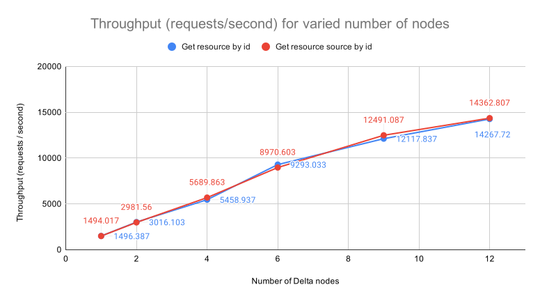

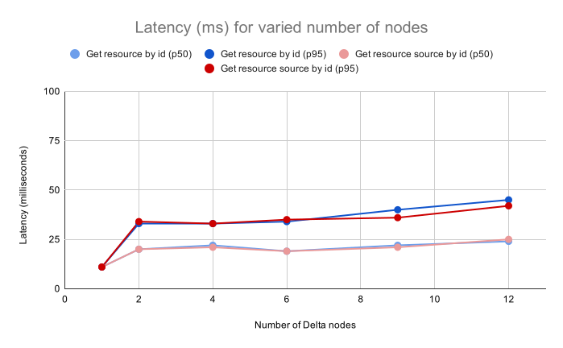

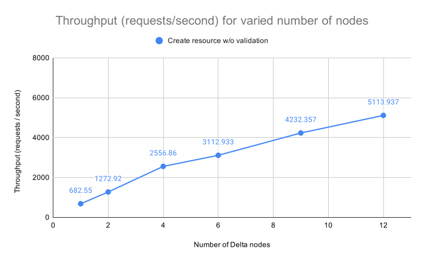

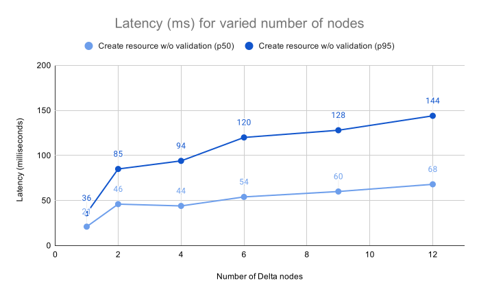

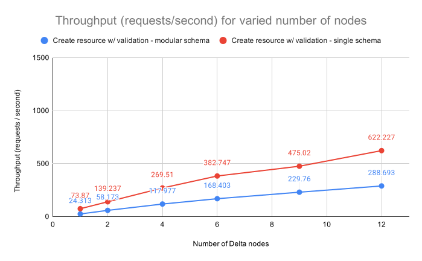

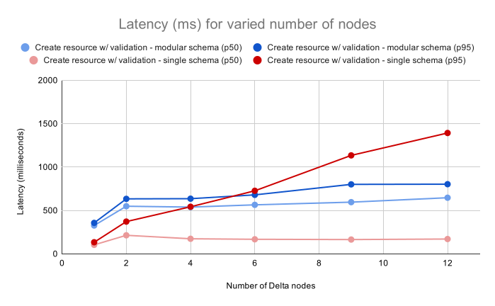

## Raw results with authentication

The following sections show the exact numbers for throughput and latency of the system for each test configuration when enabling authentication. It can be noted that the authentication does not add any significant performance penalty.

### Create Resource, No Validation (with authentication)

The test evaluates the throughput and latency at 50, 75, 95 and 99 percentiles when creating new unconstrained resources.

| Nodes | Concurrency | Throughput (req/s) | p50 (ms) | p75 (ms) | p95 (ms) | p99 (ms) |
|-------|-------------|--------------------|----------|----------|----------|-----------|
|     1 |          16 |                683 |       21 |       25 |       36 |        67 |
|     2 |          64 |               1273 |       46 |       57 |       85 |       110 |
|     4 |         128 |               2557 |       44 |       58 |       94 |       118 |
|     6 |         192 |               3113 |       54 |       74 |      120 |       154 |
|     9 |         288 |               4232 |       60 |       85 |      128 |       169 |
|    12 |         384 |               5114 |       68 |       94 |      144 |       189 |

### Create Resource, Validation, InProject Resolution, Modular Schema (with authentication)

The test evaluates the throughput and latency at 50, 75, 95 and 99 percentiles when creating new resources constrained by schemas hosted in the same project as the one used for creation. The schema uses transitive imports of other schemas and contexts.

| Nodes | Concurrency | Throughput (req/s) | p50 (ms)  |  p75 (ms) |  p95 (ms) |  p99 (ms) |
|-------|-------------|--------------------|-----------|-----------|-----------|-----------|
|     1 |           8 |                 24 |       327 |       337 |       357 |       374 |
|     2 |          32 |                 58 |       549 |       592 |       634 |       707 |
|     6 |          96 |                168 |       565 |       607 |       680 |       784 |
|     9 |         144 |                230 |       596 |       646 |       801 |      1431 |
|    12 |         192 |                289 |       647 |       695 |       803 |      1124 |

### Create Resource, Validation, InProject Resolution, Single Schema (with authentication)

The test evaluates the throughput and latency at 50, 75, 95 and 99 percentiles when creating new resources constrained by a schema hosted in the same project as the one used for creation. The schema has all the necessary shapes defined in the same resource and does not reference other schemas or contexts.

| Nodes | Concurrency | Throughput (req/s) | p50 (ms)  |  p75 (ms) |  p95 (ms) |  p99 (ms) |
|-------|-------------|--------------------|-----------|-----------|-----------|-----------|
|     1 |           8 |                 74 |       104 |       121 |       134 |       146 |
|     2 |          32 |                139 |       214 |       286 |       372 |       445 |
|     4 |          64 |                270 |       174 |       295 |       543 |       674 |
|     6 |          96 |                383 |       168 |       244 |       727 |       998 |
|     9 |         144 |                622 |       171 |       219 |      1393 |      2249 |
|    12 |         192 |                 24 |       329 |       340 |       365 |       437 |

### Fetch Resource (with authentication)

The test evaluates the throughput and latency at 50, 75, 95 and 99 percentiles when getting a resource by its id. It
shows the impact of transforming the original json representation into an RDF graph, injecting the system metadata
(e.g. rev, deprecated, project, org etc.) and presenting the result in a JSON-LD representation.

| Nodes | Concurrency | Throughput (req/s)  | p50 (ms) | p75 (ms) | p95 (ms) | p99 (ms) |
|-------|-------------|---------------------|----------|----------|----------|----------|
|     1 |          16 |                1496 |       11 |       11 |       11 |       14 |
|     2 |          64 |                3016 |       20 |       24 |       33 |       37 |
|     4 |         128 |                5459 |       22 |       24 |       33 |       44 |
|     6 |         192 |                9293 |       19 |       22 |       34 |       48 |
|     9 |         288 |               12118 |       22 |       25 |       40 |       53 |
|    12 |         384 |               14268 |       24 |       30 |       45 |       61 |

### Fetch Resource Source (with authentication)

The test evaluates the throughput and latency at 50, 75, 95 and 99 percentiles when getting a resource by its id in its
original representation.

| Nodes | Concurrency | Throughput (req/s)  | p50 (ms) | p75 (ms) | p95 (ms) | p99 (ms) |
|-------|-------------|---------------------|----------|----------|----------|----------|
|     1 |          16 |                1494 |       11 |       11 |       11 |       14 |
|     2 |          64 |                2982 |       20 |       24 |       34 |       37 |
|     4 |         128 |                5690 |       21 |       23 |       33 |       44 |
|     6 |         192 |                8971 |       19 |       23 |       35 |       49 |
|     9 |         288 |               12491 |       21 |       25 |       36 |       49 |
|    12 |         384 |               14363 |       25 |       30 |       42 |       54 |
