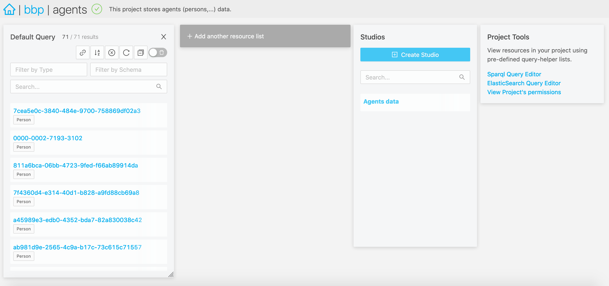

# Admin

The Nexus Fusion admin app allows you to manage your Nexus Delta instance. In particular, you can:

- list, create, edit and deprecate organizations,
- list, create, edit and deprecate projects within an organization,
- check permissions on your projects and organizations,
- create, view, edit, and deprecate resources within your projects,
- query your Knowledge Graph with SPARQL and Elasticsearch views,
- create new Studios (or edit or deprecate them, as Studios are resources),
- check the indexing status of your projects.

> Note: Some organizations in Nexus Delta are created to support Nexus Fusion internals, such as the `webapps` organization. Be careful when deleting those.

## Organizations and Projects Indexes

When creating a project, you can use "Advanced Settings" to set Base, Vocab and API mapping for the project.

Base is an IRI used as a @link:[curie](https://www.w3.org/TR/2010/NOTE-curie-20101216/){ open=new } for generating
'@id' of this child resources of the project.

Vocab is an IRI used as a @link:[curie](https://www.w3.org/TR/2010/NOTE-curie-20101216/){ open=new } prefix for all
unqualified predicates in child resources of the project. JSON object - provides a convenient way to deal with URIs
when performing operations on a sub-resource. This field is optional.

More info can be found @ref:[here](../delta/api/current/admin-projects-api.md#api-mappings) regarding API Mappings.

### Creating a New Organization

@@@ div { .center }

@@@

### Creating a New Project

@@@ div { .center }

@@@

@@@ div { .center }

@@@

## Project View

The project view in your admin app is the center stage to manage a project.

@@@ div { .center }



@@@

- On the left hand side, you will find the `Default Query`. You can filter and search resources, order them, as well
  as share that query with your peers. You can create as many queries as you like by clicking `+ Add another resource list`.
- On the right hand side, you find the `Project Tools`. You'll find the SPARQL and Elasticsearch query editors, and
  check the project permissions. You can also @ref:[create a new resource](admin.md#creating-a-new-resource) and upload files.
- "Manage studios for this project", will take you to the studio sub application. There you can create/edit/update
  studios for this project.

In the header, the breadcrumbs menu shows the organization and project your are in. You can also check the indexing
status of your project.

### Creating a New Resource

Navigate to the project where you want to create a resource. Click on the “Create Resource” button in the right sidebar.
Build the JSON payload with the help of the interactive editor, then hit “Save”.

## Resource View

In resource view, you can see various visual representations of a Nexus Resource. Based on the resource type, you will
see a set of plugins, each displayed on its own expandable section. By default, there will only be an admin plugin.
You can read more about admin plugin @ref:[here](plugins.md#default-plugins).

## Resource Descriptions

In order to enable users to visualize and describe their data, we've included a description editor and viewer. Resource descriptions are rendered first with a templating system ([handlebars](https://handlebarsjs.com/guide/)), then as markdown, to allow users to show off their resources using a combination of HTMl and markdown that can be used to render resource properties, iterate through resource lists, and other features you would find familiar in an HTML templating system, even allowing the display of images saved in nexus.

The description is saved as a simple string inside the resource's `description` property.

Markdown is rendered using [showdown](https://github.com/showdownjs/showdown), with templating provided by [handlebars](https://handlebarsjs.com/guide/).

This featured is also used in the @ref:[Studio](studio.md) SubApp as in the Studio Description feature, and as a slightly different form inside the @ref:[Search](search.md) Result View Card.

### Example of a description with markdown

Resource:

```
{
  "@id": "myID",

}
```

Description:

```
# This is a title
> Quote


```

Result:

// show image here

### Editing a Resource Description

For users with write permissions on a Resource, there's a tab available in the resource editing section, just after the JSON viewer. There you can use a full WYSIWYG editor to type out your description, and preview it, before saving.

// show image here
