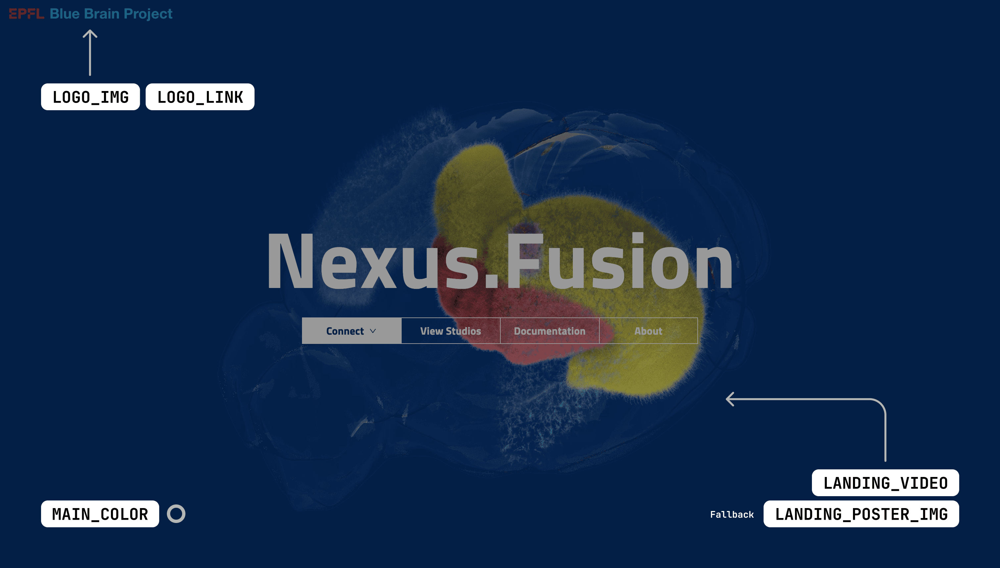
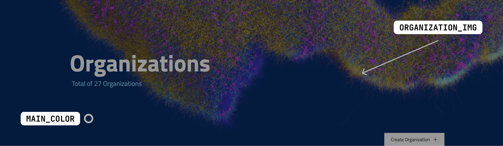
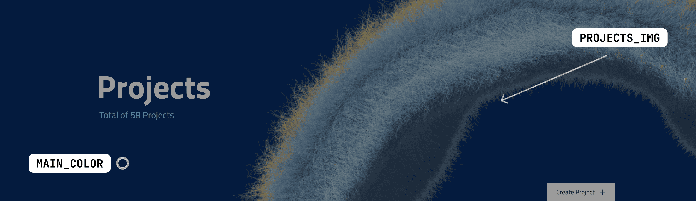
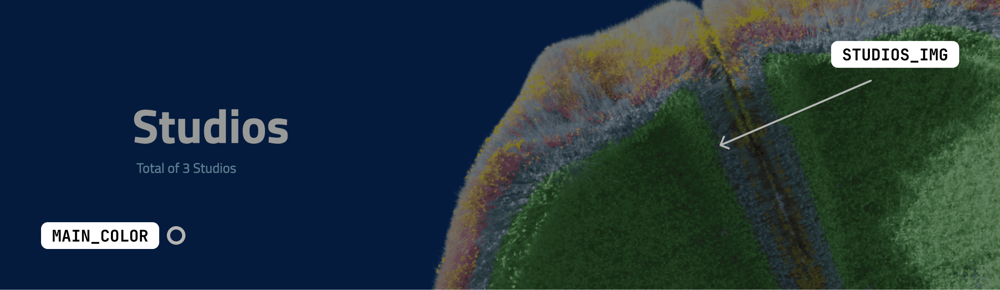

# Architecture

## Technology Overview

Nexus Fusion is a partially server-side rendered single-page web app powered by @link:[React.js](https://react.dev){ open=new }.
It is written in @link:[TypeScript](https://www.typescriptlang.org/){ open=new }, and therefore must be transpiled
into native browser JavaScript, during a build step, before being served.

The build step produces a server artifact to run on a Node.js server, with client-side assets and JavaScript.

We produce a Docker image that is able to serve the compiled assets directly, which is available on
@link:[Dockerhub](https://hub.docker.com/r/bluebrain/nexus-web){ open=new }.

Although the application is served by a Node.js server, the client communicates directly to @ref:[Nexus Delta](../delta/index.md) using @ref:[Nexus.js](../utilities/index.md#nexus-js).

## Pages

Nexus Fusion has undergone a significant restructuring to transition from a SubApp-based architecture to a page-based structure. This change will prepare the application for a full migration to file-system based routing system and help separate the application's main features.

Pages serve a specific top level entity or functionality concerns of diverse users and activities, and provide varying access privileges to each. The main features that can be accessed from the home page are: @ref:[Organizations](../fusion/organizations.md), @ref:[Projects](../fusion/projects.md), @ref:[Studios](../fusion/studios.md) and @ref:[My data](../fusion/my-data.md).

The page @ref:[Project](../fusion/project.md), is responsible for handling all aspects of managing a single project.

@@@ note { .tip title="Change of search page" }

The search page has been removed, but every element that was previously available on the search page now has a link on the home page. These links redirect users to the appropriate global search type page.

@@@

The pages in Nexus Fusion are part of the source code and reside in the `src/pages` folder. While all the previous features are still available in the current version of Nexus Fusion, we expect their functionality to evolve and change in the upcoming releases.

## Plugins

Plugins are ways to render resources. You can find more about them @ref:[here](plugins.md). It is important to note
that the plugin repository is hosted separately from Nexus Fusion. Nexus Fusion will request a Plugin Manifest from
this repository at run-time, and fetch plugins to render during run time based on a config. Both the plugins, the
configuration, and the manifest should be hosted somewhere Nexus Fusion can request it.

## Customization

Customize the Nexus codebase appearance by setting environment variables. Defaults are provided by Nexus Fusion if not set.

### Environment Variables for Customization

#### Landing Page Customization

- `LOGO_IMG`: HTTPS URL for the application logo. Recommended: SVG format with transparent background. Ideal size: ~35 px height, max 250 px width. @link:[Click here for an example SVG](https://github.com/BlueBrain/nexus-web/blob/main/src/shared/images/EPFL_BBP_logo.svg){ open=new }.
- `LOGO_LINK`: HTTPS URL redirecting from the logo. Example: <https://www.epfl.ch/en/>
- `LANDING_VIDEO`: HTTPS URL for a landing page video. Requirements: MP4 format, H.264 codec, ~10MB, 1920×1080 resolution. @link:[Click here for an example video](https://raw.githubusercontent.com/BlueBrain/nexus-web/main/src/shared/videos/BrainRegionsNexusPage.mp4){ open=new }. Ensure that the video's main color is not too bright, as the text on top of it will be white.
- `LANDING_POSTER_IMG`: HTTPS URL for a loading image on the landing page, displayed while the video loads. @link:[Click here for an example poster image](https://github.com/BlueBrain/nexus-web/blob/main/src/shared/images/BrainRegionsNexusPage.jpg){ open=new }. Please use a PNG or JPG image that matches the size and color of the video. Aim for the image to have the same dimensions as the video. Ensure that the image size is kept under 200 KB to improve loading time and user experience.
- `MAIN_COLOR`: Main background color in hex code. Example color: #062d68

#### Page Specific Customization

- `ORGANIZATION_IMG`: Provide the HTTPS URL for an image on the organization page. @link:[Click here for an example image](https://github.com/BlueBrain/nexus-web/blob/main/src/shared/images/sscx-by-layers-v3.png){ open=new }. The recommended dimensions are approximately 1500 × 450 pixels. Please ensure that the image size is kept under 200 KB to improve loading time and user experience.
- `PROJECTS_IMG`: Share the HTTPS URL for an image on the projects page. @link:[Click here for an example image](https://github.com/BlueBrain/nexus-web/blob/main/src/shared/images/hippocampus.png){ open=new }. The recommended dimensions are approximately 1500 × 450 pixels. Please ensure that the image size is kept under 200 KB to improve loading time and user experience.
- `STUDIOS_IMG`: Provide the HTTPS URL for an image on the studios page. @link:[Click here for an example image](https://github.com/BlueBrain/nexus-web/blob/main/src/shared/images/neocortex.png){ open=new }. The recommended dimensions are approximately 1500 × 450 pixels. Please ensure that the image size is kept under 200 KB to improve loading time and user experience.

#### Additional Options

- `FORGE_LINK`: HTTPS URL for the `Forge templates` button (only if using Nexus Forge). Example: `https://some-url.com`

For a comprehensive list of environment variables, see the @link:[Environment Variables List](https://github.com/BlueBrain/nexus-web/blob/main/README.md#env-variables-list){ open=new }.
