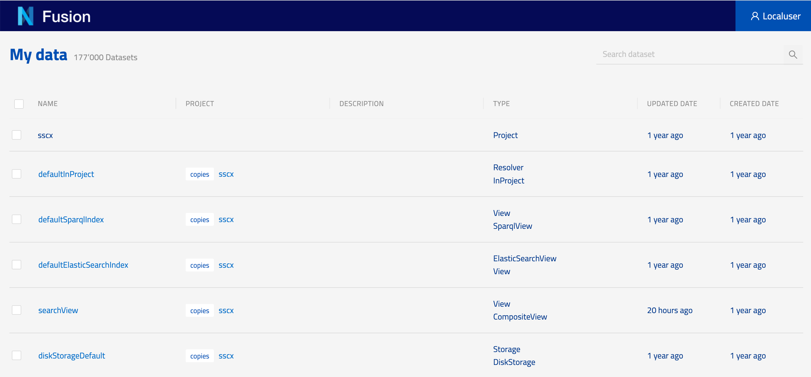
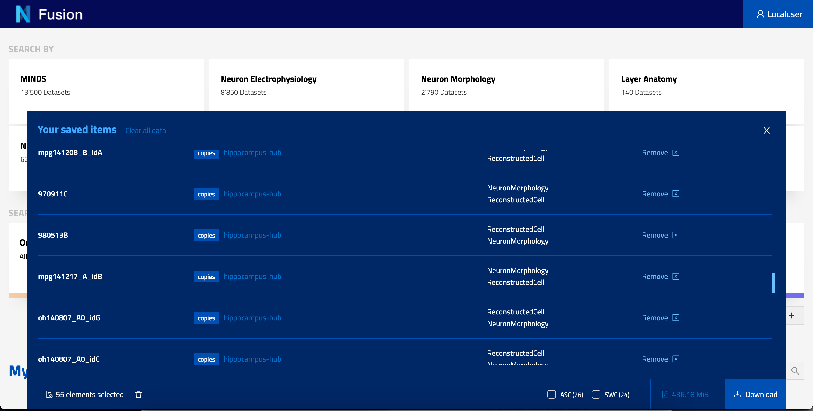
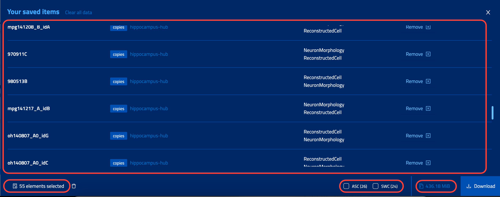

# User data

The My Data page within the Nexus Fusion platform serves as a central repository for all datasets that have been created or updated by the logged in user. This feature enables users to easily access and manage the data that they are interested in, without the need to navigate through irrelevant data.

# Data Panel

Data Panel is a central location where users can gather and explore data using a variety of external tools. Through this feature, users can select different types of data from various locations within the application, including the My Data page, Global search pages, and Studios page.

By aggregating all relevant data into a single location, the Data panel streamlines the data exploration and analysis process by providing the ability to select specific file extensions for download allows users to easily export data for use in other applications or platforms.

### Data Panel action bar

The Data Panel action bar offers users the ability to select specific file type extensions for download, streamlining the process of exporting data for use in other applications or platforms.

Moreover, the Data Panel action bar provides users with valuable data insights, such as the number of resources selected and the size of the data to be downloaded.

