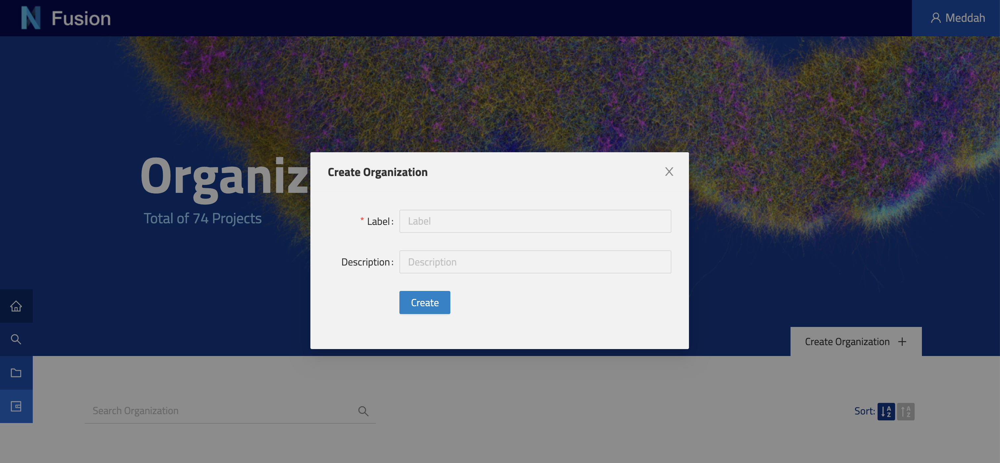

# Organizations

The Nexus Fusion platform provides users with the ability to manage a high-level entity that encompasses all projects within their ecosystem.
This feature is accessible through the organizations page, which presents users with a comprehensive overview of all the organizations managed within a given Blue Brain Nexus deployment. Users who possess the necessary permissions are also able to create new organizations through this interface.

> Note: Some organizations in Nexus Delta are created to support Nexus Fusion internals, such as the `webapps` organization. Be careful when deleting those.

Furthermore, it is noteworthy that the capability to create new organizations is not limited solely to the organizations page. Rather, this functionality is available from various locations throughout the application, including the homepage and the global search types pages. 

## Creating a New Organization

@@@ div { .center }

@@@

When the organization is created successfully, the browser will redirect the user to the projects page where the user can see  the list of all projects and create new ones (see @ref:[Projects](./projects.md)).
