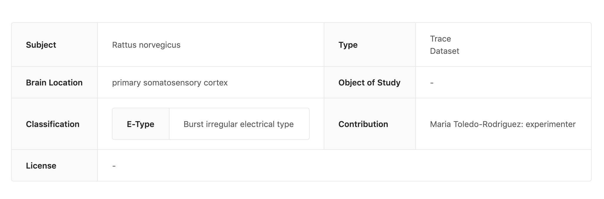

# Plugins
A resource returned by nexus delta API is usually a JSON-LD document. By default Fusion displays JSON-LD in a code editor. If the user has edit access to the document, they can update the resource in the editor.

Resources can represent a wide variety of scientific artifacts. It can be a neuron morphology, neuron electro physiology, a set of files to download, a set of images and so on. So a user may want to  extend Fusion to allow them to visualize or otherwise extend the presentation layer with logic specific to their resource type. Plugins are a way to accomplish this.

## What are Plugins
A core component of Studio is the ability for data curators to develop a domain-specific presentation layer for their resources in Nexus Web. This allows data consumers to visualize their datasets using graphs, charts, or 3D visualizations, and to present the relevant metadata to the user.

Plugins are developed using javascript and are loaded into the Nexus Fusion instance from in the /plugins folder.

## Plugin examples
Below you can find the screen shots from some plugins that can be integrated into Fusion. They extend the Fusion presentation layer.

Neuron Electro physiology viewer


MINDS Metedata viewer


Data download plugin


## Development

Your plugin must export a default function with the following signature:

```typescript
export default ({ ref: HTMLElement, nexusClient: NexusClient, resource: Resource<T> }) => {
  return () => {
    // optional callback when your plugin is unmounted from the page
  };
};
```

Nexus Plugins uses [SystemJS](https://github.com/systemjs/systemjs).

You have to transpile and bundle your code using SystemJS as output:

- with [rollup](https://rollupjs.org/guide/en/#outputformat): use `system` as output format
- with [webpack](https://webpack.js.org/configuration/output/#outputlibrarytarget): use `system` as `outputTarget`

### Configuring Nexus to run your plugins

Once you have your javascript bundled into a single file, you can place it in the `./plugins` folder at the root of your Nexus Web instance.

Plugins should follow this folder naming convention:

```
.
│   README.md
│
└───plugins
│   └───my-nexus-plugin
│       │   index.js
│   └───yet-another-nexus-plugin
│       │   index.js
│   ...
```

## Plugin Manifest

The plugin manifest should be available at the same remote endpoint as the plugins. This is so Nexus can find the plugins and apply them dynamically.

The plugin manifest is a json object with keys that correspond to the plugin name with a value that corresponds to a descriptive payload of where to find the manifest, as well as some information about it's development. It's similar to a package.json file.

```json
{
    "circuit": {
      "modulePath": "circuit.f7755e13c8b410efdf02.js",
      "name": "Circuit",
      "description": "",
      "version": "",
      "tags": [],
      "author": "",
      "license": "",
      "mapping": {}
    }
}
```

Plugin Config

The plugin config should be available as an object under the `mapping` key of the plugin manifest. This tells nexus when a plugin should be displayed, by matching a resource to a shape.

### Matching all resources

The following will show `nexus-plugin-test` for _every_ resource inside Nexus Web.

```json
{
    "nexus-plugin-test": {
      "modulePath": "nexus-plugin-test.js",
      "name": "Nexus Plugin Test",
      "description": "",
      "version": "",
      "tags": [],
      "author": "",
      "license": "",
      "mapping": {}
    }
}
```

### Matching a resource with a specific type and shape

The following will show `nexus-plugin-test` for any resource of type `File` but only if they have a `distribution.encodingFormat` property that's `application/swc`

```json
{
    "nexus-plugin-test": {
      "modulePath": "nexus-plugin-test.js",
      "name": "Nexus Plugin Test",
      "description": "",
      "version": "",
      "tags": [],
      "author": "",
      "license": "",
      "mapping": {
        "@type": "File",
        "distribution:" {
            "encodingFormat": "application/swc"
        }
    }
}
```

## Default Plugins

Default plugins are part of Fusion. They define the default presentation of resources.

### Admin Plugin

Admin Plugin displays JSON-LD in a code editor. If the user has edit access to the document, they can update the resource in the editor. It also has few additional tabs. History, Links and Graph. History tab displays the edit history of the resource. A user can explore the graph view of the resource in Graph tab. They can also view the incoming and out going links of the resource in Links tab.