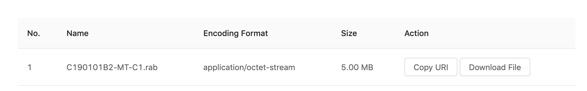
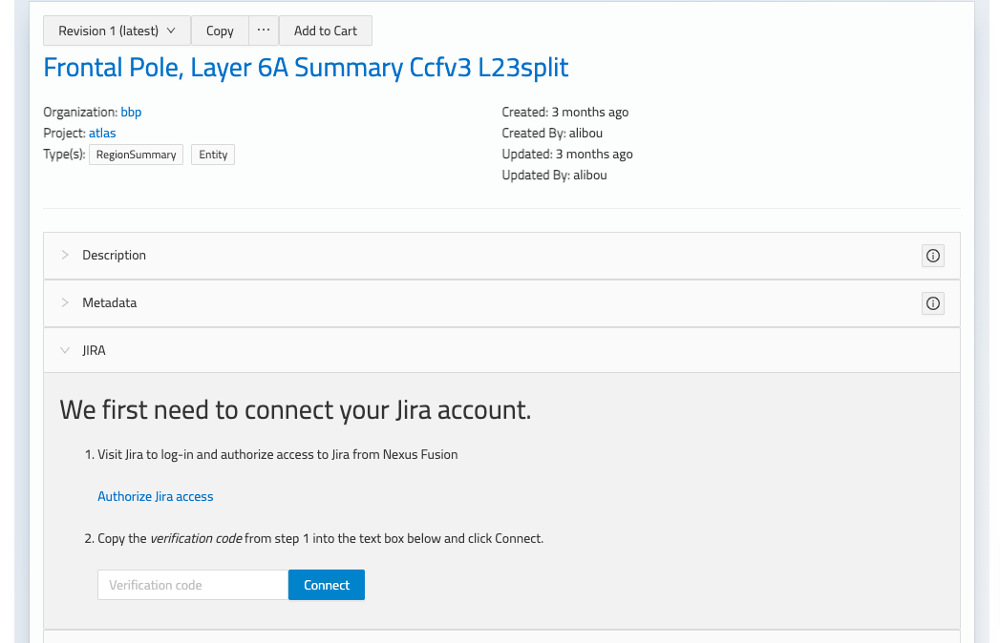

# Plugins
A resource returned by the Nexus Delta API is usually a JSON-LD document. By default, Nexus Fusion displays JSON-LD in a 
code editor. If the user has edit access to the document, they can update the resource in the editor.

Resources can represent a wide variety of scientific artifacts. It can be a neuron morphology, neuron electrophysiology, 
a set of files to download, a set of images and so on. So a user may want to extend Nexus Fusion to allow them to 
visualize or otherwise extend the presentation layer with logic specific to their resource type. Plugins are a way to 
accomplish this.

## What are Plugins
A core component of Studio is the ability for data curators to develop a domain-specific presentation layer for their 
resources in Nexus Fusion. This allows data consumers to visualize their datasets using graphs, charts, or 3D 
visualizations, and to present the relevant metadata to the user.

Plugins are developed using Javascript and are loaded into the Nexus Fusion instance from the 
@link:[/plugins](https://github.com/BlueBrain/nexus-web/tree/main/plugins){ open=new } folder.

## Plugin examples
Below you can find the screenshots from some plugins that can be integrated into Nexus Fusion. They extend the Nexus 
Fusion presentation layer.

Neuron Electro physiology viewer


MINDS Metedata viewer


Data download plugin


## Development

Your plugin must export a default function with the following signature:

```typescript
export default ({ ref: HTMLElement, nexusClient: NexusClient, resource: Resource<T> }) => {
  return () => {
    // optional callback when your plugin is unmounted from the page
  };
};
```

Nexus Plugins uses @link:[SystemJS](https://github.com/systemjs/systemjs){ open=new }.

You have to transpile and bundle your code using SystemJS as output:

- with @link:[rollup](https://rollupjs.org/guide/en/#outputformat){ open=new }: use `system` as output format
- with @link:[webpack](https://webpack.js.org/configuration/output/#outputlibrarytarget){ open=new }: use `system` as `outputTarget`

### Configuring Nexus Fusion to run your plugins

Once you have your Javascript bundled into a single file, you can place it in the `./plugins` folder at the root of your Nexus Fusion instance.

Plugins should follow this folder naming convention:

```
.
│   README.md
│
└───plugins
│   └───my-nexus-plugin
│       │   index.js
│   └───yet-another-nexus-plugin
│       │   index.js
│   ...
```

## Plugin Manifest

The plugin manifest should be available at the same remote endpoint as the plugins, this is so that Nexus Fusion can find 
the plugins and apply them dynamically.

The plugin manifest is a JSON object with keys that correspond to the plugin name with a value that corresponds to a 
descriptive payload of where to find the manifest, as well as some information about it's development. It's similar to 
a package.json file.

```json
{
    "circuit": {
      "modulePath": "circuit.f7755e13c8b410efdf02.js",
      "name": "Circuit",
      "description": "",
      "version": "",
      "tags": [],
      "author": "",
      "license": "",
      "mapping": {}
    }
}
```

Plugin Config

The plugin config should be available as an object under the `mapping` key of the plugin manifest. This tells Nexus 
Fusion when a plugin should be displayed, by matching a resource to a shape.

### Matching all resources

The following will show `nexus-plugin-test` for _every_ resource in Nexus Fusion.

```json
{
    "nexus-plugin-test": {
      "modulePath": "nexus-plugin-test.js",
      "name": "Nexus Plugin Test",
      "description": "",
      "version": "",
      "tags": [],
      "author": "",
      "license": "",
      "mapping": {}
    }
}
```

### Matching a resource with a specific type and shape

The following will show `nexus-plugin-test` for any resource of type `File` but only if they have a 
`distribution.encodingFormat` property that's `application/swc`

```json
{
    "nexus-plugin-test": {
      "modulePath": "nexus-plugin-test.js",
      "name": "Nexus Plugin Test",
      "description": "",
      "version": "",
      "tags": [],
      "author": "",
      "license": "",
      "mapping": {
        "@type": "File",
        "distribution": {
            "encodingFormat": "application/swc"
        }
      }
    }
}
```

## Default Plugins

Default plugins are part of Fusion.

### Advanced View Plugin

The Advanced View Plugin displays JSON-LD in a code editor. If the user has edit access to the document, they can update the 
resource in the editor. It also has few additional tabs. History, Links and Graph. History tab displays the edit 
history of the resource. A user can explore the graph view of the resource in Graph tab. They can also view the 
incoming and outgoing links of the resource in Links tab.

### Jira

The Jira plugin enables integration with an instance of Jira to facilitate discussions about resources. The Jira plugin must be enabled in Nexus Delta and configured in the Fusion Deployment. Links between a Jira issue and a Nexus resource  (or project) are stored in custom fields in  Jira which are required to be configured before usage. It is the Nexus URL that is used to link to the resource. Issues created with the Jira plugin have a discussion label applied to them in Jira.

#### Configuration

See the accompanying Delta Jira documentation for configuration of the Jira plugin in Delta and linking it with a Jira instance. In Fusion, there are several environment variables related to Jira that must be specified in order to configure its usage.

* JIRA_URL - URL of jira instance
* JIRA_RESOURCE_FIELD_NAME - the name of the custom field in Jira to use for storing the link to the Nexus resource
* JIRA_RESOURCE_FIELD_LABEL (defaults to `Nexus Resource`) - the label of the custom field in Jira being used for storing the link to the Nexus resource
* JIRA_PROJECT_FIELD_NAME - the name of the custom field in Jira to use for storing the link to the Nexus project
* JIRA_PROJECT_FIELD_LABEL (defaults to `Nexus Project`) - the label of the custom field in Jira being used for storing the link to the Nexus project

The custom fields in Jira should be created as `URL` type field and should be added to the required Jira screens and projects that you want to use with Nexus.

#### Authorization

The user will be required to authorize access to Jira prior to being able to use the Jira plugin in Fusion. From the Jira plugin the user is instructed to click the link to authorize access in Jira and then will be required to enter the provided verification code in Fusion to complete the authorization.



#### Usage

The Jira plugin is displayed for all resources, given that it's enabled. A resource can be linked to an issue in Jira from within the Jira plugin in Fusion by either choosing to create a new issue or by linking to an existing Jira issue.

Multiple issues can be associated with a resource and they will display in the table of linked resources in the Jira plugin. Issues can be removed from here also.


#### Project view

Besides the Jira plugin displaying in the Resource view, there is also a Jira plugin at the level of the project. It can be accessed via the Jira tab in the project view. In the Jira project view, all issues linked to resources within the project are listed along with their associated resource. Similar functionality to the Jira plugin on the resource is available here with the option to add/remove issues. Note that issues created within the Jira plugin at the project level are associated with the project only.

