# Project

The Nexus Fusion project page allows you to manage your project in a given Blue Brain Nexus deployment.
In particular, you can:

- List, create, edit and deprecate projects within an Organization,
- Check permissions on your Projects and Organizations,
- Create, view, edit, and deprecate resources within your projects,
- Query your Knowledge Graph with SPARQL and Elasticsearch views,
- Create new Studios (or edit or deprecate them, as Studios are resources),
- Check the indexing status of your projects.

> Note: Some organizations in Nexus Delta are created to support Nexus Fusion internals, such as the `webapps` organization. Be careful when deleting those.

# Creating a New Project

When creating a Project, you can configure the Base, Vocab and through the "Advanced Settings" the API Mappings for the project.
You can learn more about these settings in the [Delta Documentation](https://bluebrainnexus.io//docs/delta/api/projects-api.html#payload).
The current version allows the user to create a Project in different main parts of the application, Organization page, projects page, and also in the global search types pages.

@@@ div { .center }

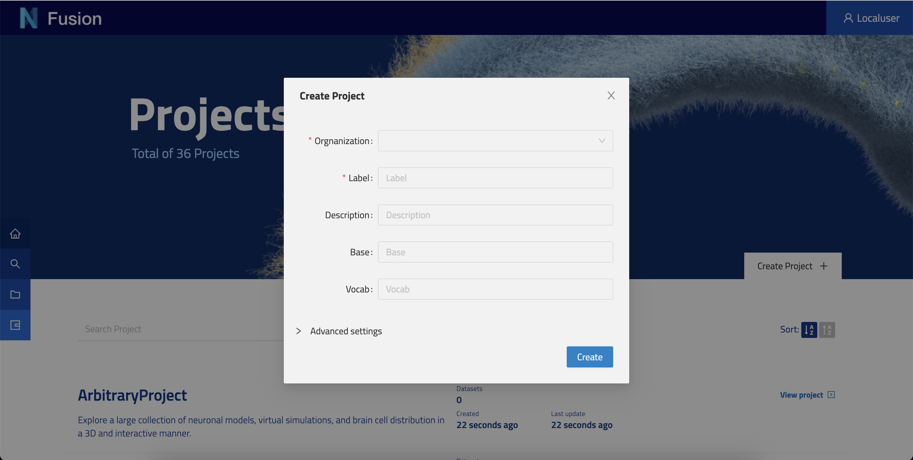

@@@

The project creation modal is configurable in way that can allow the user to select an organization when the user is not on the one of his organizations page.

# Project Page

The project view is the center stage to manage a project. Each tab is meant to give you functionalities that we will describe below.

@@@ div { .center }

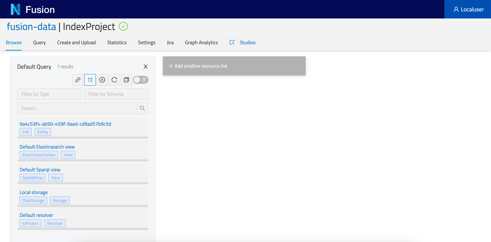

@@@

## Browse

The browse tab enables users to list all resources available in the current Project.


On the left hand side, you will find the @ref:[Default Query](project.md#query). You can filter and search resources, order them, as well as share that query with your peers. You can create as many queries as you like by clicking + Add another resource list.

### Resource Panel

#### Description

To enable users to visualize and describe their data, we have included a description viewer (this plugin) and editor (Advance View > Description Tab). This plugin will only show if the resource has a description property defined.
Resource descriptions are rendered first with a templating system, and then as markdown. This allows users to show off their resources using a combination of HTML and markdown that is useful to render resource properties, iterate through resource lists, or render images stored in Nexus Delta.			
Nexus Fusion saves descriptions as a simple string inside the Resource's description property.
Markdown is rendered using showdown, with templating provided by handlebars. This feature is also used in the @ref:Studio Description.

@@@ note
 The Handlebar templating will be resolved before converting markdown.	
@@@

Example Resource

```
{
  "@id": "9a4c53f4-ab50-459f-9aed-cd9ad57b9c5d",
  "@type": [
    "Entity",
    "Cell"
  ],
  "brainLocation": {
    "@type": "BrainLocation",
    "brainRegion": {
      "label": "primary somatosensory cortex"
    },
    "layer": {
      "label": "layer 4"
    }
  },
  "description": "# {{name}} | {{ objectOfStudy.label }}\n\n## Subject\nSpecies:  {{ subject.species.label }}\n<br/>\n\n\n## Brain Region\n{{ brainLocation.brainRegion.label }}",
  "name": "Cell #1029",
  "objectOfStudy": {
    "label": "Single Cell"
  },
  "subject": {
    "@type": "Subject",
    "age": {
      "period": "Post-natal",
      "unitCode": "days",
      "value": 13
    },
    "species": {
      "label": "Rattus norvegicus"
    }
  }
}
```

Example Description (in the editor)

Please note that the following syntax {{ json.path }} will present the data found in the resource’s matching json path. This way, JSON data can be injected into your description based on the resource’s JSON payload.

```
# {{name}} | {{ objectOfStudy.label }}

## Subject
Species:  {{ subject.species.label }}
<br/>


## Brain Region
{{ brainLocation.brainRegion.label }}

```

Please note that we are linking the image through the _self (not the @id) URI of an image stored in the Nexus instance as a resource of type File.

**Result**

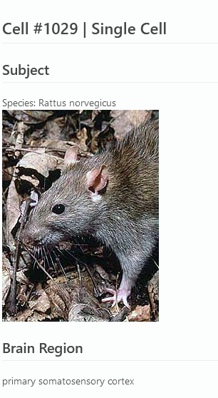

Users with write permissions on a Resource will have access to a tab called "Description" in the Advanced View plugin. There, you can use a full WYSIWYG editor to type out and preview a description before saving it.


#### Advanced View

This is a provided plugin that enables users to look into the resources they store in a given Project. This plugin offers multiple capabilities you will find in its tabs:

- JSON - to view the JSON-LD representation of the resource.
- Description - to edit the resource description in Markdown.
- History - to view all the revisions of this resource.
- Links - to view the incoming and Outgoing relations of this resource to other resources.
- Graph - to view the resource as a Graph representation.

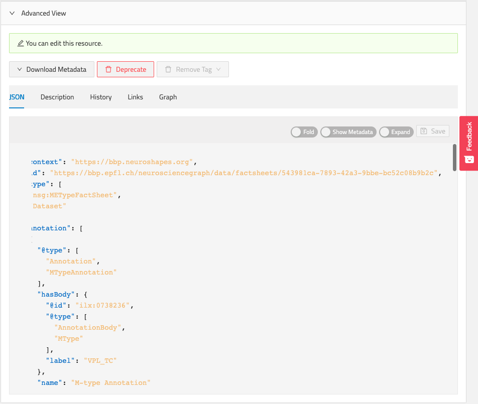

#### Preview

This plugin presents data that is stored in the distribution of the resource. Namely the Files that have been attached to this resource. When available, the files are listed and can be Downloaded. Some specific file types can be previewed (e.g. PDF, CSV).

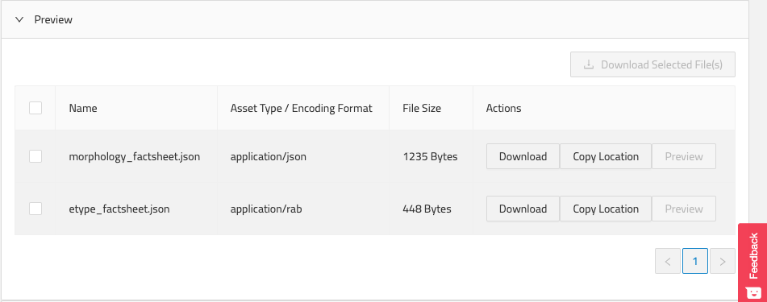

#### Image Viewer

This plugin presents Image files that are represented under the resource’s image property. The images are previewed and made downloadable for the user.

## Query

This tab enables a technical user to write queries against views configured in the project. Currently it supports SPARQL and Elasticsearch Views.

### Query SPARQL Views

Here you can write a SPARQL query, execute it and preview the results.


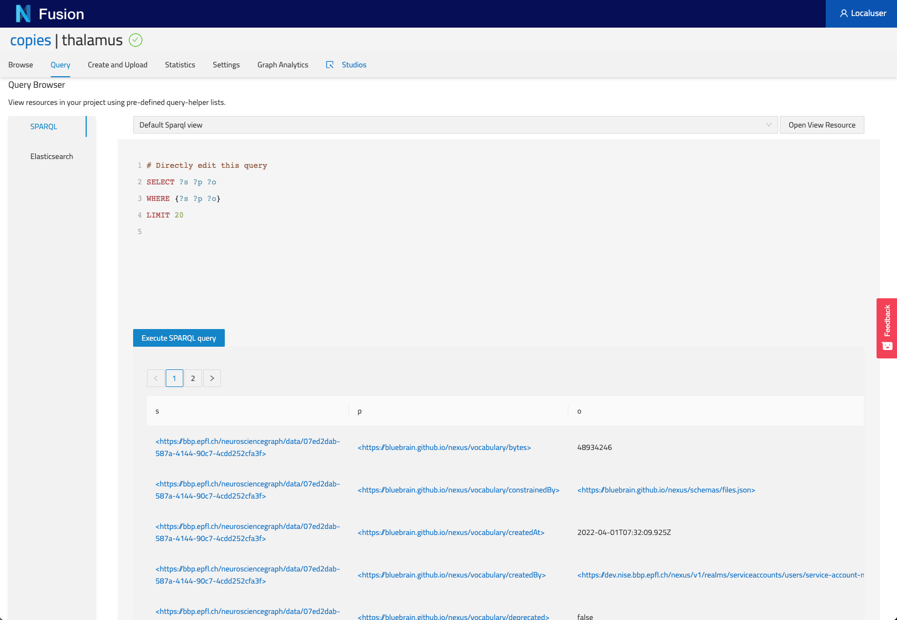

### Query Elasticsearch Views

Here you can write an Elasticsearch query, execute it and preview the results.


## Create and Upload

Here you can create new resources. The dropdown menu (Resource Type) at the top will give you access to predefined resources (e.g. Storage, Views), you can also create your from scratch. Finally you can drag and drop Files to be uploaded into Nexus.


## Statistics

If you have the privileges, you can view the count of resources as well as the quotas currently defined in your Nexus instance.

## Settings

In this tab you can configure several aspects of your project.

### General

This section allows users to configure the Base, Vocab and API Mappings of their project.

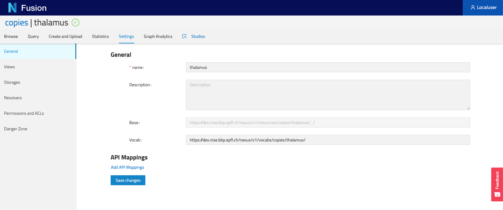

### Views

This section allows users to list all the Views currently configured in your project and trigger actions on them. More actions will be added in the future.

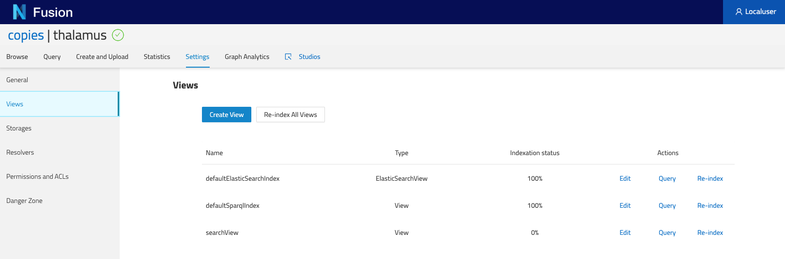

### Storage

This section allows users to list all configured Storages in this project.


### Resolvers

This section allows users to list all configured Resolvers [(API reference)](https://bluebrainnexus.io/docs/delta/api/resolvers-api.html) in this project. They are also ordered by their priorities as in the ID resolution process.

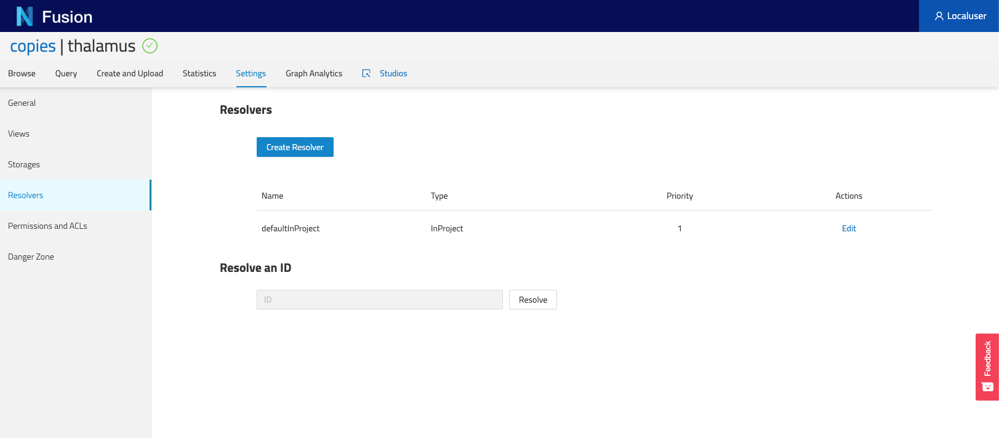

### Permissions and ACLs

This section allows users to view the Permissions set on various levels of the Nexus instance:

- / which is the root of all Organizations and Projects
- Organizations of the current project
- Specific Project
  Each of these level then list the users and groups onto which Permissions (i.e. ACLS) have been set.

  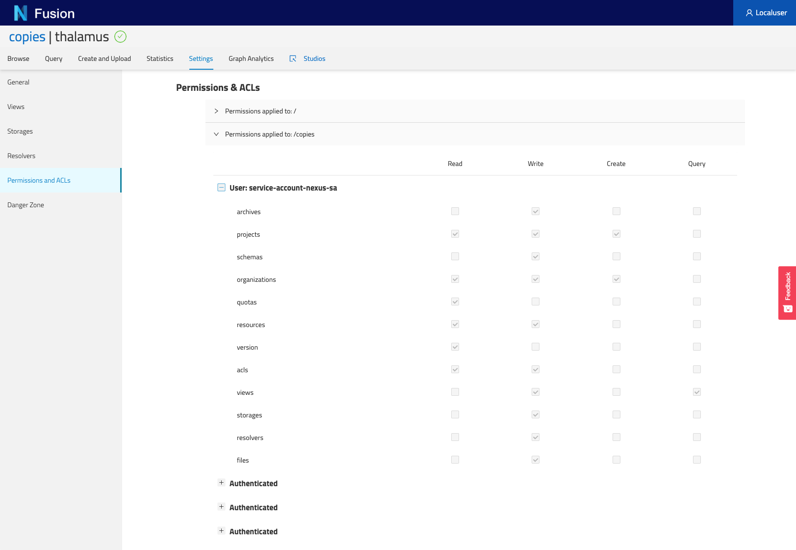

### Danger Zone

In this section, users can do potentially damaging actions such as deprecating a project.

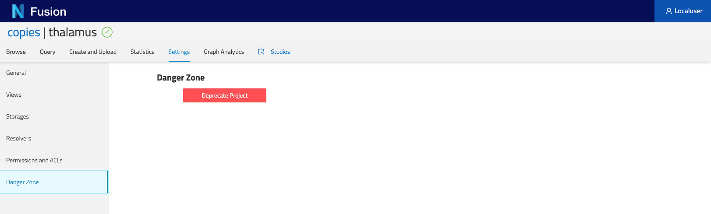

## JIRA

If you have the JIRA plugin configured in your Nexus instance, you can see all tickets created within this project, across all resources.

## Graph Analytics

This tab enables users to view the overall structure of the knowledge graph stored in this project. It only shows types as well as their relations to other resource types. Bear in mind that if a resource has multiple types, each type will show independently in this graph.
Furthermore, you can click on a type and view (on the right hand side panel) its property usage statistics as well as its relation statistics, this is useful to check the quality of your data.

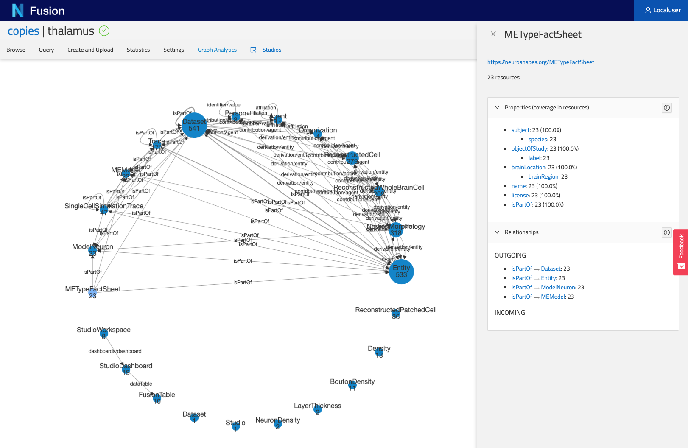

## Studios

This tab will take you to the Studio listing page for this specific project.
