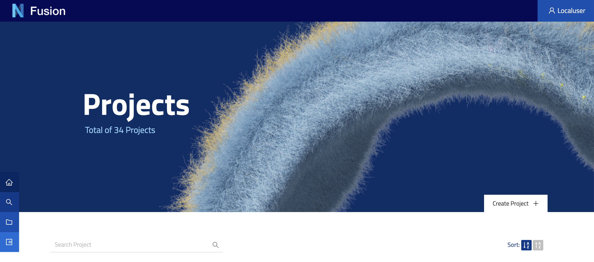

@@@ index

- @ref:[Project](project.md)

@@@

# Projects

The concept of a Project in Nexus Fusion represents a fundamental unit of data management that empowers users to effectively organize and manage a distinct set of data. The Projects page, available in two distinct modes, enables users to browse either all projects within the Nexus ecosystem or those specific to a particular organization.

Beyond simply listing projects, the Projects page also provides users with detailed statistics, including the total number of projects and the corresponding quantity of associated datasets.

Additionally, authorized users possess the ability to create new projects, a functionality that is accessible from various locations throughout the application, including the homepage and the global search types pages. Notably, when creating a new project, users are prompted to specify the organization to which the project will be affiliated, thus further reinforcing the organizational hierarchy within Nexus Fusion.

@@@ div { .center }

@@@
