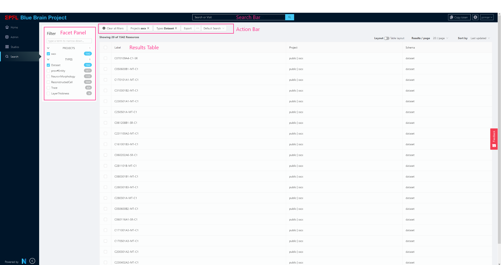
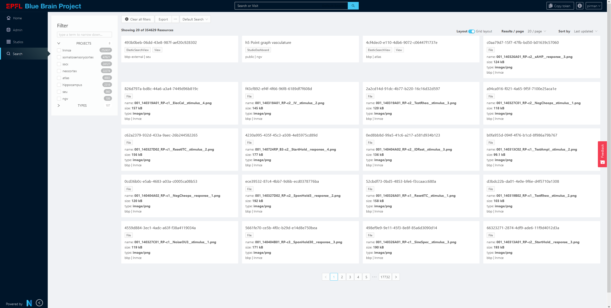
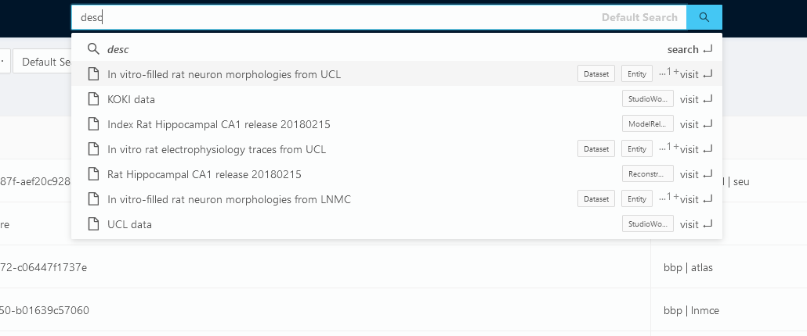

# Search

The Search SubApp enables users to search or filter data stored in Nexus Delta in various projects in a configurable way. It's intended as a global search tool for your Nexus instance.



The administrator who configures one or more `SearchConfigs` for their Search SubApp has power over what data is searchable, and how it will render in the Search interface.

@@@ note

### Powered by Elastic Search Views

This feature leverages the Elastic Search indexing capability of Nexus Delta. It uses the `SearchConfig` to decide how to query an @ref:[Elastic Search View](../delta/api/views/elasticsearch-view-api.md). Because it depends on the @ref:[Elastic Search View](../delta/api/views/elasticsearch-view-api.md) feature, make sure that your `mappings` property is properly configured to index the data in the way you expect. An incorrectly configured `mapping` property might not show the appropriate `Facets` you might expect, or it could simply result in nothing shown.

We recommend using an @ref:[Aggregate Search View](../delta/api/views/aggregated-es-view-api.md), so that you can query multiple projects at once. However, this feature is limited to 10 to 15 projects, depending on their index name length.

@@@

## Search Config

### Where are SearchConfigs stored?

Search configs are saved in a project as a simple @ref:[Resource](../delta/api/resources-api.md), with a type `nxv:SearchConfig`.

Nexus Fusion must be made aware of which project to look for these resources, either by using the env var `SEARCH_CONFIG_PROJECT`

```bash
  SEARCH_CONFIG_PROJECT=my-org/my-project
```

or Nexus Fusion will use the default `SEARCH_CONFIG_PROJECT` value, `webapps/nexus-web`

Signature:

```
{
  // A unique ID
  id: string;
  // A label to show in the interface to users
  label: string;
  // Which view will be used to query against? can be of type AggregatedElasticSearchView or ElasticSearchView
  view: string;
  // An optional description
  description?: string;
  // An array of facet configurations that will drive the facet panel
  facets?: FacetConfig[];
  // An array of Result Table Fields configurations that will dictate the Result Table rendering
  fields?: ResultTableFields[];
};
```

### Example SearchConfig

```
{
  "@type": [
    "nxv:SearchConfig"
  ],
  "description": "global dataset search",
  "facets": [
    {
      "key": "brainLocationLabel",
      "label": "Brain Region",
      "propertyKey": "brainLocation.brainRegion.label.raw",
      "type": "terms"
    },
    {
      "key": "objectOfStudyLabel",
      "label": "Object of Study",
      "propertyKey": "objectOfStudy.label.raw",
      "type": "terms"
    },
    {
      "key": "type",
      "label": "Type",
      "propertyKey": "@type",
      "type": "terms"
    }
  ],
  "fields": [
    {
      "dataIndex": "label",
      "displayIndex": 0,
      "key": "label",
      "title": "Label"
    },
    {
      "dataIndex": "@type",
      "displayIndex": 3,
      "key": "@type",
      "sortable": true,
      "title": "Type"
    },
    {
      "dataIndex": "objectOfStudy.label",
      "displayIndex": 2,
      "key": "objectOfStudyLabel",
      "title": "Object of Study"
    },
    {
      "dataIndex": "brainLocation.brainRegion.label",
      "displayIndex": 1,
      "key": "brain-region",
      "title": "Brain Region"
    }
  ],
  "label": "MINDS",
  "view": "https://my-nexus-deployment.com/v1/views/webapps/nexus-web/my-view-id"
}
```

### Facets

The Facet portion of the config dictates what will render in the left column of the Search interface that allows users to toggle facets or filters to narrow down their search. Each facet category is generated using an Elastic Search Aggregated query, and so far only supports [`term` aggregated queries](https://www.elastic.co/guide/en/elasticsearch/reference/current/search-aggregations-bucket-terms-aggregation.html), but may be expanded in the future to allow filtering search against things like dates.

Because of the `terms` limitation, it's only possible to create facets with the Elastic Search Mapping type of `object` or `text` and `keyword`

Signature:

```
  {
    // The full path to target property, according to the elastic search mapping
    propertyKey: string;
    // A unique key to distinguish against other Facet objects
    key: string;
    // The label to be used in the interface
    label: string;
    // The only available facet type
    type: "terms";
    // An optional value to sort the facets in the interface. A lower displayIndex value will render this option higher in the interface
    // Note, if this value is blank, the label will be used to sort alphabetically to be consistent.
    displayIndex?: number;
  }[]
```

#### Defaults

The Facet configs are an optional field. The default will allow users to filter by project and @type.

```
{
  propertyKey: '_project',
  key: 'projects',
  label: 'Projects',
  type: 'terms',
  displayIndex: 0,
},
{
  propertyKey: '@type',
  key: 'types',
  label: 'Types',
  type: 'terms',
  displayIndex: 1,
}
```

### Fields

The Fields property of the Search Config allows users to specify what properties to show in the Result Table. They correspond to table columns.

Signature:

```
{
  // The table column header title
  title: string;
  // The property to access, in dot notation (eg: "brainLocation.brainRegion.label" )
  dataIndex: string;
  // Optionally make the field sortable
  sortable?: boolean;
  // A unique key to identify this column
  key: string;
  // Lower numbers will appear to the left of the table. If no displayIndex is given, it will sort alphabetically by the "key" property
  displayIndex: number;
}[]
```

#### Special properties

The table will render the value found via the dataIndex property as simple text. However, there are some special rendering logic for the following keys, which will ignore the `dataIndex` property of the config.

- project: Will render the org and project info
- @type: Will render a list of @types as pills
- schema: Will render the schema (`_constrainedBy`) field with a tooltip
- label: Will render a human-readable label using the following:
  ```
  resource.prefLabel ||
  resource.label ||
  resource.name ||
  resource["@id"]
  ```
- description: Will render a description using the enriched markdown template viewer (see @ref:[Description Viewer](admin.md#resource-descriptions))

#### Defaults

IF no fields property exists on the `SearchConfig`, the following default values will be used:

```
{
  title: 'Label',
  dataIndex: 'label',
  key: 'label',
  displayIndex: 0,
},
{
  title: 'Project',
  dataIndex: '_project',
  sortable: true,
  key: 'project',
  displayIndex: 1,
},
{
  title: 'Types',
  dataIndex: '@type',
  sortable: true,
  key: '@type',
  displayIndex: 3,
},
```

## Search Results

The Search Results body displays the resources that match the search / filtering criteria in two ways: a Results Grid or a Results Table

### Result Grid

The Result Grid displays matched `Resources` in preview cards, to show off visual content of Data stored in Nexus Delta. These preview cards can be used to show snippets of code or preview images, for example.



#### Result View Cards

Each result card is rendered using an expanded version of the markdown + handlebars rendering used elsewhere in Nexus Fusion, but with some expanded functionality.

The Search SubApp will attempt to render a card using a markdown + handlebar template string found in the `previewTemplate` property of that `Resource`. If no `previewTemplate` property is found, it will render using the default template string:

```
<div style="display: block">
    <h3 class="title">{{ resourceLabel }}</h3>
    {{#if description}}
    <div class="description">
        <div class="overlay"></div>
        {{{ description }}}
    </div>
    {{/if}}
    <div style="display:flex;" class="types">
        {{#each type}}
            <li>
                <span class="ant-tag">{{this}}</span>
            </li>
        {{/each}}
    </div>
     {{#if fileData }}
        <div class="file-data">
           <span>name: <b>{{ _filename }}</b></span><br/>
           <span>size: <b>{{ fileData.humanReadableFileSize }}</b></span><br/>
           <span>type: <b>{{ _mediaType }}</b></span><br/>
        </div>
    {{/if}}
    <div>
    <span>{{ resourceAdminData.org }}</span> | <span>{{ resourceAdminData.project }}</span></div>
</div>
```

As you can see above, instead of just passing the `Resource` object to the template, the template has access to a few more properties:

```
// Properties offered in the Preview Template
{
  ...resource,
  // a human-readable label created from these values:
  // resource.prefLabel ||
  // resource.label ||
  // resource.name ||
  // resource["@id"]
  resourceLabel: string,
  // Useful metadat about the resource
  resourceAdminData: {
    url: string,
    deployment: string,
    apiVersion: string,
    entityType: string, // Corresponds to Schema
    org: string,
    project: string,
    id: string,
  },
  // if the resource is a file, a human-readable label
  // will show off the size of the file.
  fileData: {
    humanReadableFileSize: string
  } | null
}
```

### Result Table

The Result Table shows off data in a table, where each row corresponds to a `Resource` that matched the search and query criteria. The columns are defined by the `SearchConfig`.


## Search Bar

The Search Bar enables users to use full text search across their configured view, as well as navigate to matching `Resources`.



@@@ note

### Hotkey!

You can press `/` on most screens to focus the Search Bar for convenience.

@@@

@@@ note

### Caveats

Full text search is powered using the Elastic Search Mapping property called `__original_source`, and _must_ be add to your view's mapping to be useful, otherwise no results will show. The proper mapping is as follows:

```
{
  ...rest of mapping,
  "_all_fields": {
    "analyzer": "nexus",
    "type": "text"
  },
  "_original_source": {
    "analyzer": "nexus",
    "copy_to": "_all_fields",
    "type": "text"
  },
}

```

This uses a specially developed analyzer, and also requires the `__all_fields` property to exist. Simply copying these two properties should be sufficient.

@@@

## Action Bar

The action bar allows users to deselect filters, toggle between `SearchConfigs`, and export their search resuts.

### Exporting

#### CSV

This option will generate a CSV, whose columns are configured from the `fields` property of the `SearchConfig`

#### As ES Query

This option will copy the Elastic Search query used to generate the results, excluding the pagination properties `from` and `size`. You can then use this query that is in your clipboard to create an Elastic Search Studio, or query for yourself in the Query Elastic Search View of a project in the @ref:[Admin](admin.md) SubApp.
