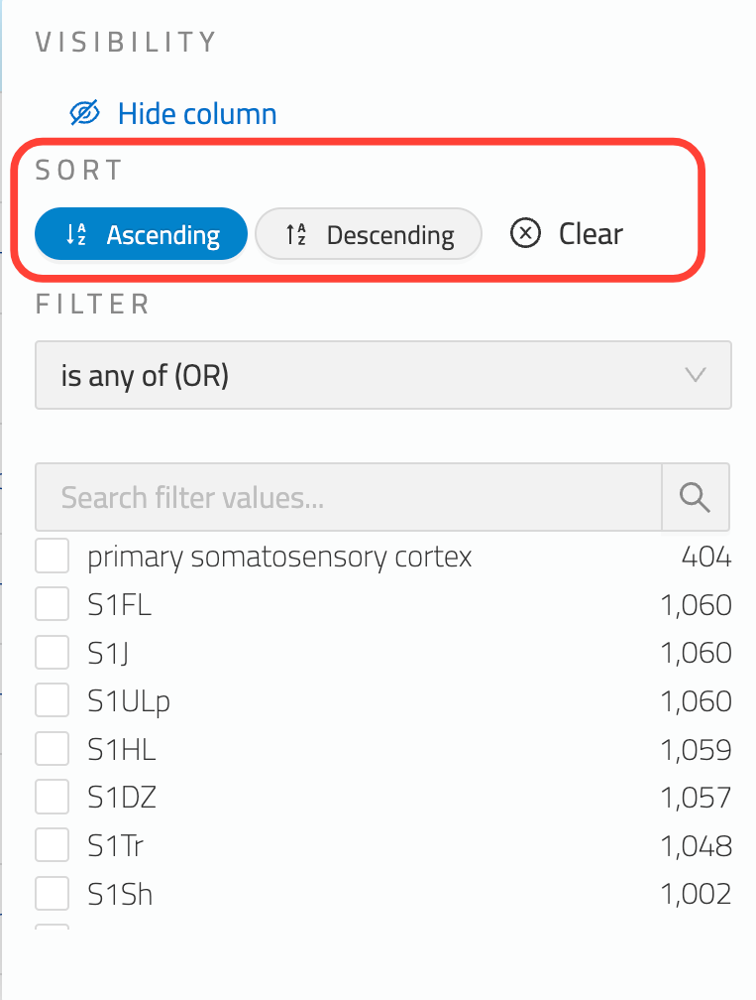

# Search

Search provides functionality to search across all data in Nexus. Search is accessible via the Search menu option and the Search bar.

@@@ note

Search requires Delta configuration. See the Delta Search documentation for details: @ref:[Delta Search Documentation](../delta/api/search-api.md)

@@@

## Search Bar

The search bar at the top of screen provides both instant access to full-text search as well as convenient navigation 
of Nexus. To activate, either click the search box or press the `/` key and begin typing.

### Full-text Search

Full-text search is the default option within the search bar and is listed first. Hitting enter on the keyboard will 
display the Search page showing the results for the given search criteria. On the search page additional filter criteria 
and customisations can be applied to the search results (sort, filter, etc) as described in subsequent sections.

### Jump to Project

Projects matching the search criteria are listed below the search text from which you can instantly jump to the given project.

## Sorting

Where no explicit sort criteria has been applied, search results are ordered by their ElasticSearch relevance score. 
Sort criteria can be applied to one or more fields to customise the ordering of results in the table.

In order to sort on a specific field, open the field’s dropdown menu and select one of `Sort Ascending` or `Sort Descending` (highlighted below).

Upon selecting a sort direction the sorting criteria will be applied and the results updated immediately. 
Click the `Clear` button to remove the sorting criteria for the field. Sort criteria can be applied to several fields.

@@@ note

If a field does not support sorting then the sorting option will not be displayed.

@@@

A summary of the status of sorted columns is displayed at the top of the search results table.
@@@ div { .center }

@@@

The Sort dialog shows all sort criteria currently applied to the search results (shown below).
@@@ div { .center }

@@@
The sort direction can be changed here as well as removed entirely.

## Filtering

Filters allow you to filter the search results further. The field’s dropdown menu provides access to the filter options. 
In the example below, the filter options for the Brain Region field are highlighted.

The Operator dropdown determines the type of filter operation and can be one of:

- is all of (AND) - resource must have all selected filter criteria
- is any of (OR) - resource must have one of the selected filter criteria
- is none of (NOT) - resource must not have any of the selected filter criteria
- is missing - resource must not have a value for the property

The list of filter values is displayed below the operator dropdown ordered by the terms that appear most frequently. 
The search box provides the ability to search for a specific filter term.

A summary showing the number of filters applied is displayed above the search results table. Clicking on it reveals the 
filter dialog (see below).

The filter dialog lists all currently applied filters and provides the ability to remove a filter.

## Numerical Filters

Columns with numerical values have some additional filters. The first is range selector which will allow you to limit the 
search to a range of values available in the column. Below the range selector, you can choose to see only "missing values" 
by checking the missing values check box.

In order to understand the data better, you can also the minimum, maximum, average and sum of the values in the column. 
At the very bottom, you can see a histogram of the values. Histogram can be viewed in bar or line graph using a radio button.

## Hidden Columns and Ordering

The search results table can be customised to display only the columns that you are interested in. The summary displaying 
the number of hidden columns is displayed at the top-left of the search results table (highlighted below).

Click on the hidden columns summary to open the hidden columns and column order configuration dialog which is shown below.

Each available column to display in the search results is listed along with a toggle to show or hide the column. 
The `(Show all Columns)` option provides a convenient way to show all columns.

### Column ordering

Columns can be reordered by clicking on the three vertical dots next to the column name and dragging to the desired location.

### Hiding column using the Field menu

An individual column can also be hidden using the field menu’s `Hide column` option (highlighted below).

## Pagination

The search results table is paginated to allow for convenient browsing of the search results. The paging controls for 
navigating the pages of results along with page size options are displayed at the top-right of the search results 
table (highlighted below).

By default, the page size is set to match the number of rows that fit your screen. You can however use the pagination 
dropdown in order to select a different page size. If a page size with more results than fit the page is selected, a 
scrollbar will display enabling vertical scrolling of the results.

## Reset Search Customisations

All customisations to the search results can be removed using the `Reset` option displayed above the search results table 
(highlighted in the screenshot below).

## Search Configurations

A search configuration is a predefined, named combination of columns, sort options and filters. You can find these 
configurations in the Search Config dropdown on the left top of the table. Choosing a search config from the dropdown 
will apply the config to the search table.

