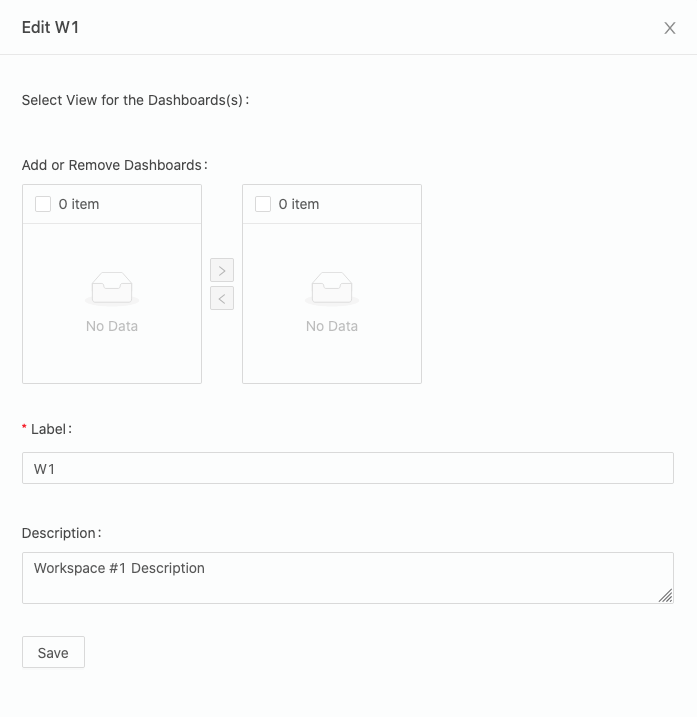

# Studios

Studios space allows data curators to display their data using customisable, persistent queries. Using custom plugins developed with JavaScript, data curators can format the presentation of the query results any way they like.

@@@ note
To configure the Studios space index for your Nexus instance, see at the @ref:[bottom of the page](studio.md#configuring-the-studios-index-page).
@@@

## What is a Studio

A `Studio` is a collection of persistent queries organized in a table layout for users to quickly access relevant data in a customizable way. `Studio` authors can create a studio to match a specific topic, and create organization schemes called @ref:[Workspaces](studio.md#workspaces) and @ref:[Dashboards](studio.md#dashboards) to access various aspects of that data.

@@@ note
Want to @ref:[configure a studio](studio.md#how-to-configure-a-studio) straightaway?
@@@

For example, a `Studio` might cover all datasets from the Neocortex, with a `Workspace` called Physiology and a `Dashboard` called Morphology Pipeline.

In essence, a `Studio` is a UI layer that performs queries according to a configuration that lives in a Nexus instance as a `Resource`. It has a label for a meaningful title and a description field to convey to the users what sort of data they can expect to find there. Most importantly, a `Studio` configuration has a `Workspace` collection.

```json
{
  "@context": "https://bluebrainnexus.io/studio/context",
  "@type": "https://bluebrainnexus.io/studio/vocabulary/Studio",
  "description": "",
  "label": "test",
  "workspaces": [
    "https://nexussandbox.io/org/project/3bdf8b08-7b9a-443b-b04d-be2a048893ba"
  ]
}
```

@@@ note
A `Studio` will be given a URI for navigation or sharing.
@@@

### About the Studio Context

In order for the `Studio` to work as intended with the UI, a context must be in the project. Its purpose is to direct the Knowledge Graph to understand how studio-specific properties behave, such as that `Workspaces` should be set (an unordered collection without duplicates).

If you create a `Studio` using the UI in Nexus Fusion, this resource will be created for you, if it doesn't exist already. If you plan on bootstrapping your own projects programmatically, such as through the API, then you might need to take care to include it.

Every `Studio` resource that is created should reference this context resource as the `@context` property. For an example, see the `Studio` resource mentioned above. The default Studio context `@id` for all our examples will be `https://bluebrainnexus.io/studio/context`, and it is what Nexus Fusion will use.

Here's what the context should look like:

```json
"{
  "@context": [
    {
      "@base": "https://bluebrainnexus.io/studio/",
      "@vocab": "https://bluebrainnexus.io/studio/vocabulary/",
      "label": {
        "@id": "http://www.w3.org/2000/01/rdf-schema#label"
      },
      "name": {
        "@id": "http://schema.org/name"
      },
      "description": {
        "@id": "http://schema.org/description"
      },
      "workspaces": {
        "@id": "https://bluebrainnexus.io/studio/vocabulary/workspaces",
        "@container": "@set",
        "@type": "@id"
      },
      "plugins": {
        "@id": "https://bluebrainnexus.io/studio/vocabulary/plugins",
        "@container": "@set"
      },
      "dashboards": {
        "@container": "@set"
      },
      "dashboard": {
        "@id": "https://bluebrainnexus.io/studio/vocabulary/dashboard",
        "@type": "@id"
      },
      "view": {
        "@id": "https://bluebrainnexus.io/studio/vocabulary/view",
        "@type": "@id"
      }
    }
  ],
  "@id": "https://bluebrainnexus.io/studio/context"
}"
```

### Workspaces

A workspace is a collection of `Dashboards` paired with a `View`. You can have any number of `Dashboard`-`View` pairings organized into a `Workspace`.
You can label a `Workspace` and add a description to help users understand what kind of content they can expect to find there.

```json
{
  "@context": "https://bluebrainnexus.io/studio/context",
  "@type": "StudioWorkspace",
  "dashboards": [
    {
      "dashboard": "https://bbp.epfl.ch/neurosciencegraph/data/8751df37-a75f-4858-b174-742264deb4e9",
      "view": "nxv:defaultSparqlIndex"
    },
    {
      "dashboard": "https://bbp.epfl.ch/neurosciencegraph/data/99982da8-ec3a-4f18-9388-a0cc81bfff0c",
      "view": "nxv:defaultSparqlIndex"
    }
  ],
  "description": "",
  "label": "MorphoTester"
}
```

### Dashboards

A `Dashboard` is simply a query with a description and a label. This will be used by the `Workspace` to query against the view paired with it inside the `Workspace` configuration. This way, you can write one query, and re-use it against multiple potential views.

An example `Dashboard` resource looks like this:

```json
{
  "@context": "https://bluebrainnexus.io/studio/context",
  "@type": "StudioDashboard",
  "dataQuery": "prefix nxv: <https://bluebrain.github.io/nexus/vocabulary/>\nprefix s: <http://schema.org/>\nSELECT DISTINCT ?self ?familyName ?givenName\nWHERE {\n?s nxv:constrainedBy <https://neuroshapes.org/dash/person> ;\n  nxv:self ?self ;\n  s:familyName ?familyName ; \n  s:givenName ?givenName\n}\nLIMIT 20",
  "description": "A list of every scientist",
  "label": "Scientists",
  "plugins": ["nexus-plugin-example"]
}
```

The `Dashboard`, once configured, will present the results of your SPARQL query in a table. Each item in the row will be clickable and lead to a details page showing the `Resource`, in this case, a list of scientists that have contributed data to the project.

## How to Configure a Studio

### Studio Creation

To create a new `Studio`, go to the Admin space, and select an organization and a project.
In the Project View, you will see the `Manage Studios for this project` button. It will bring you to the list of `Studios`.

Click the `Create Studio` button.

@@@ div { .half .center }

@@@

Fill in a form providing the following:

- `Label`: the name of your new Studio (required field)
- `Description` for your Studio

@@@ div { .half .center }

@@@

- Click `Save` and you will be navigated to the Studio View.

@@@ div { .center }

@@@

That's it! Your new `Studio` is empty for now, but don't worry!
We will add Workspaces and Dashboards later.

You can also find your Studios in the Resource List (for example, filter by type `Studio`, or Search by id) and view it in the Resource View.

#### Updating a Studio

Once created, the label and the description of a `Studio` can be changed. Just click `Edit Studio` button and update the `Label` and the `Description` fields.

#### Removing a Studio

To remove an unwanted `Studio`, deprecate it in the Resource View of your project in the Admin space.

### Workspace Creation

Inside any `Studio`, click the `Add Workspace` button.

Fill in a form providing the following:

- `Label`: the name of your new `Workspace` (required field)
- `Description` for your `Workspace`

@@@ div { .half .center }

@@@

Click `Save` and you will be navigated to the new workspace section of your `Studio View`, which is given a navigable URI.

@@@ div { .center }

@@@

Your `Workspace` is created, but it will need to have at least one `Dashboard`/`View` association for anything to show there.

You can also find your `Workspaces` as raw `JSON` configurations in the `Resource` list (for example, filter by type `StudioWorkspace`, or search by id) and view it in the `Resource View`.

#### Updating a Workspace

Inside any `Studio`, under a `Workspace` tab label, click on the `Edit` link. Then you'll be provided with a dialog where you can review and edit the `Workspace` configuration.

- `Select View`: The view of which to pair with _each `Dashboard` inside the follow transfer list_. The `Dashboard` queries will be run against the `View` listed inside this box. For now, using this Edit form, you can only pair one `View` for all `Dashboards`. If you were to create the configurations manually, you can pair each `Dashboard` with a different `View`.
- `Add or Remove Dashboards`: Add or remove a `Dashboard` to the collection in your `Workspace` configuration. The `Dashboards` listed are all the available non-deprecated ones in the project.
- `Name`: the name of your new `Workspace` (required field).
- `Description` for your `Workspace`.

@@@ div { .half .center }

@@@

After your forms have been edited, simple click `Save` to submit your changes.

#### Removing a Workspace

You can remove a `Workspace` by deprecating it from the `Resource View`.

### Dashboard Creation

Inside any `Studio View`, under a selected `Workspace`, click the `Add Dashboard` button.

Fill in a form providing the following:

- `Label`: the name of your new `Dashboard` (required field)
- `Description`: an optional description for your `Dashboard`
- `Sparql Query`: a valid @link:[SPARQL](https://www.w3.org/TR/rdf-sparql-query/){ open=new } query that conforms to the `dataQuery` field in the configuration.

@@@ div { .half .center }

@@@

> You can click on the `View query in Sparql Editor` to open the `Sparql Editor` in a new tab to work on your query while querying it against a `Sparql View` in your project, so you can make sure it works and provides the fields you want. Then, you can copy and past that back in the form.

> To understand more about the SPARQL queries requirements, @ref:[check below](studio.md#sparql-query-requirements).

Click `Save` and the `Dashboard` and its query results should show up!

You can now also add this `Dashboard` to other `Workspaces` across the project.

#### Updating a Dashboard

You'll find the edit `Dashboard` under the dashboard label. After your form has been edited, simple click `Save` to submit your changes.

#### Removing a Dashboard

You can remove a `Dashboard` by deprecating it from the `Resource View`.

### Sparql Query Requirements

#### The `?self` variable

In order for the UI to function as intended, you must provide a unique ID variable inside your SPARQL statement, labeled as `?self`. This will be used to generate the table and fetch resources when navigating to the details page of a row item. Ideally, this `?self` variable should correspond with the `_self` of a target `Resource` of which to center your query against as a subject. The `?self` variable will never be shown in the table, so you need some other variable in addition to view the results properly, or you'll end up with a table without any rows.

#### Making queries visible

In addition to the `?self` variable, you need to have at minimum one other variable defined, which will be displayed on each row. The variable name will label the header of the table column, capitalized.

#### The minimum functioning query with the `?self` variable defined

```sparql
# This is the minimum functioning query for Studio
prefix nxv: <https://bluebrain.github.io/nexus/vocabulary/>
SELECT DISTINCT ?subject ?self
WHERE {
   ?subject nxv:self ?self ;
}
LIMIT 20
```

### Example SPARQL Queries

Here's an example of fetching unique Persons using `https://schema.org` properties.

```sparql
prefix nxv: <https://bluebrain.github.io/nexus/vocabulary/>
prefix s: <http://schema.org/>
SELECT DISTINCT ?self ?familyName ?givenName
WHERE {
  ?s nxv:constrainedBy <https://neuroshapes.org/dash/person> ;
  nxv:self ?self ;
  s:familyName ?familyName ;
  s:givenName ?givenName
}
LIMIT 20
```

## Configuring the Studios index page

The Studios space lists all the `Studios` you have permissions to view or edit.

@@@ div { .half .center }

@@@

To enable this feature, the following should be done:

1. If you don't have a project to store the application data, create one.

2. Create an `Aggregated Elastic Search View` inside this project, and add all of the projects that contain Studio resources to the list. For example:

```json
{
  "@context": "https://bluebrain.github.io/nexus/contexts/view.json",
  "@id": "nxv:studioList",
  "@type": ["View", "AggregateElasticSearchView"],
  "views": [
    {
      "project": "c7d70552-4305-111a-trtr-75d757ed9a49",
      "viewId": "nxv:defaultElasticSearchIndex"
    },
    {
      "project": "86b0ee1e-a6a5-111b-rtrt-938b3c38dfc0",
      "viewId": "nxv:defaultElasticSearchIndex"
    },
    {
      "project": "a7d693345-8d1d-rtrt-111a-90b6b6ab94ee",
      "viewId": "nxv:defaultElasticSearchIndex"
    }
  ]
}
```

@@@ note

Ask a developer to add an ENV variable with the location of the 'AggregateElasticSearchView' as following:

`STUDIO_VIEW=[yourOrgLabel]/[yourProjectLabel]/[viewId]`

In our example it would be:

`STUDIO_VIEW=webapps/nexus-fusion/nxv:studioList`

Every time when you create a new `Studio`, the `AggregateElasticSearchView` needs to be updated.
@@@
