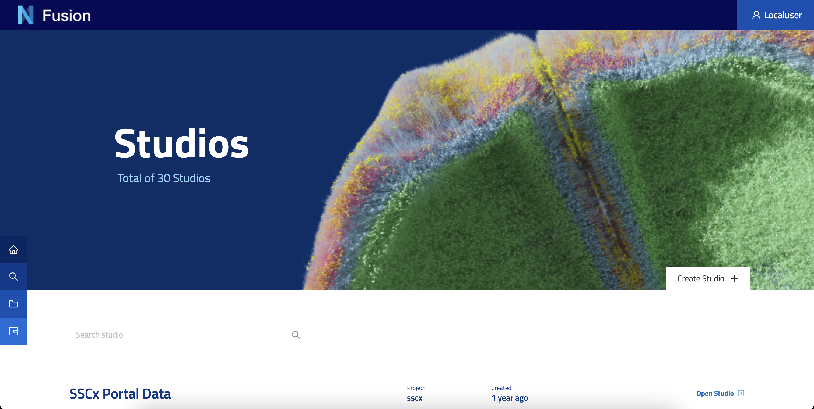

@@@ index

- @ref:[Studio](studio.md)

@@@

# Studios

The Studios space within the Nexus Fusion platform provides data curators with a powerful tool to showcase their data and can effectively visualize and communicate complex data sets to a broad audience. By developing custom plugins with JavaScript, curators can tailor the presentation of query results to meet specific requirements, including the formatting of charts, graphs, and other data visualization tools.

Users who possess the requisite permissions can create new Studios within the Nexus Fusion platform from several locations across the application, such as the homepage and the global search types pages. During the Studio creation process, users are prompted to designate the organization and project to which the Studio will be associated, reinforcing the hierarchical structure within the platform.

