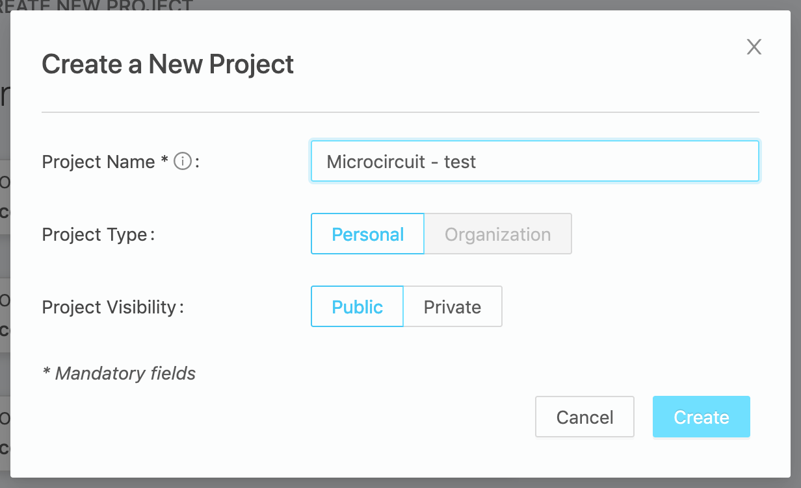
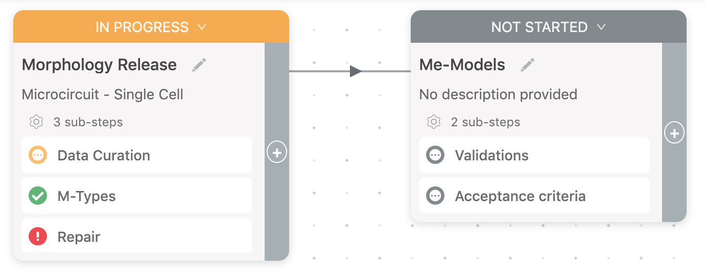

# Workflow (alpha)

Nexus Fusion’s goal is to bring together the information you have available in a structured and standardized format.

Fusion Workflow allows users to organize their work in clearly defined data-driven steps, and update their team on the progress.

Workflow makes it possible to visualize activities, data, code, notes, and configured inputs for each step.

Fusion Workflow (alpha) is available starting from Nexus version 1.5.

## Project

To create a new project, use `Create New Project Button` and fill in the form:

@@@ div { .center }

@@@

Then you can start adding Workflow Steps and data tables to your project.

## Workflow Steps

A Workflow Step acts as a bucket (grouping) of provenance activities.

Steps are represented by draggable cards and can be created manually in the Project View and Workflow Step View (for sub-steps).

@@@ div { .center }

@@@

Each Workflow Step card contains its title, description, a list of sub-steps and step's status: not started, in progress, blocked, and done.

Steps can be visually linked with previous steps. It can be done easily in the form that pops up when you click '+' button on a card.

@@@ div { .center }

@@@

To modify a Workflow Step, click `Step Info` button in the Workflow Step View and update fields in the form:

@@@ div { .center }

@@@

Notice, that the description supports markdown text.

### Canvas

The canvas is the place to organise your workflows. It’s an interactive space that can display components (for the moment only steps and tables). The root canvas (the one at the root of your project) can for now only display step cards and their relationships. Once you drill down in a step, it will have its own canvas. A step canvas can display nested steps and their relationships, but also data tables. Learn more about steps and data tables below.

### Tables

At the bottom right of the canvas, there is a "+" button. It allows a user to add three types of tables, a data set and a new step. The three types of tables are Data table, Activity Table and Input Table.

A data table has two key attributes. A query and a view. The view can be either a sparql view or an elastic search view. A user can customise the table by choosing whether to enable search, sort and filtering on tne table. User can also, exclude or include columns from search, sort and filtering. These customisations can be done in the "Edit table" form, accessible by clicking on the edit table button.

Activity and Input tables are Data tables, with built in query and view so that user does not have to select them. Activity table has a query that list all activities linked to the step. Input table has a query that lists all inputs in the step.

@@@ div { .center }

@@@

@@@ div { .center }

@@@
