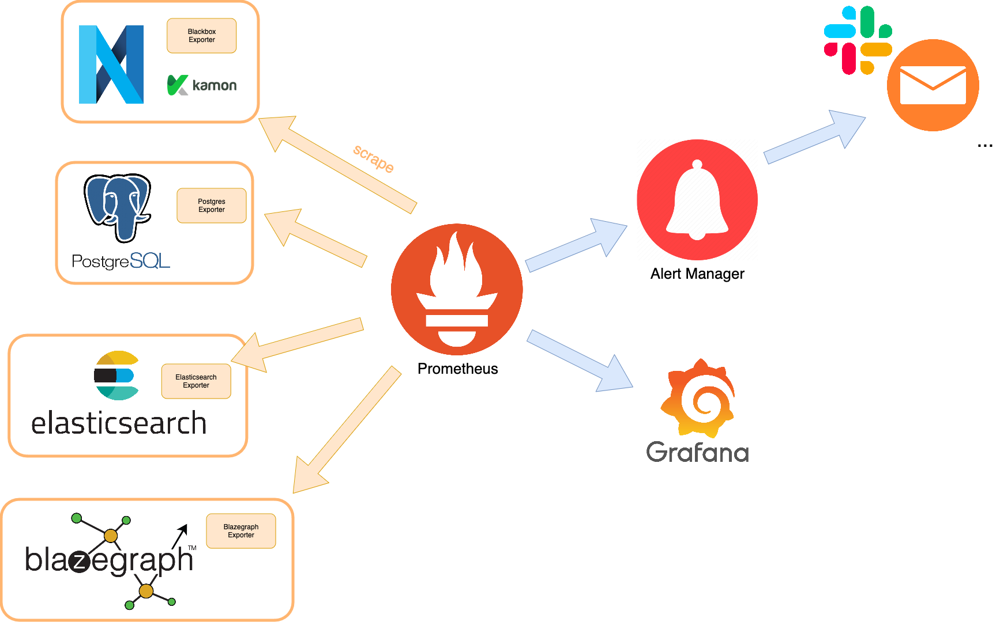

@@@ index

- @ref:[PostgreSQL](postgresql.md)
- @ref:[Elasticsearch](elasticsearch.md)
- @ref:[Blazegraph](blazegraph.md)
- @ref:[Nexus Delta](delta.md)
- @ref:[Configuration](configuration/index.md)
- @ref:[Search Configuration](search-configuration.md)

@@@

# Running Nexus

If you wish to quickly try out Nexus, we recommend the @ref:[Docker Compose approach](#docker-compose). 
For a production deployment on your in-house or cloud infrastructure, please refer to our @ref:[deployment guide](#on-premise-cloud-deployment).

## Run Nexus locally with Docker

### Requirements

#### Docker

Regardless of your OS, make sure to run a recent version of the Docker Engine. 
This was tested with version **26.0.0**.
The Docker Engine, along the Docker CLI, come with an installation of Docker Desktop. Visit the @link:[official Docker Desktop documentation](https://docs.docker.com/desktop/) for detailed installation steps.

Command
:
```shell
docker --version
```

Example
:
```shell
$ docker --version
Docker version 26.0.0, build 2ae903e86c
```

#### Memory and CPU limits

On macOS and Windows, Docker effectively runs containers inside a VM created by the system hypervisor.
Nexus requires at least **2 CPUs** and **8 GiB** of memory in total. You can increase the limits
in Docker settings in the menu *Settings* > *Resources*.

For a proper evaluation using Docker, we recommend allocating at least **16GiB** of RAM to
run the provided templates. Feel free to tweak memory limits in order to fit your hardware constraints. At the cost
of a slower startup and a decreased overall performance, you should be able to go as low as:

|    Service    | Memory [MiB] |
|:-------------:|:------------:|
|  PostgreSQL   |          512 |
| Elasticsearch |          512 |
|  Blazegraph   |         1024 |
|     Delta     |         1024 |

### Docker Compose

#### Set-up

* Download the @link:[Docker Compose template](docker/docker-compose.yaml){ open=new } into a directory of your choice, for instance
`~/docker/nexus/`.
* Download the @link:[Delta configuration](docker/delta.conf){ open=new } to the same directory.
* Download the @link:[http proxy configuration](docker/nginx.conf){ open=new } to the same directory.

#### Starting Nexus

From within the directory that contains the `docker-compose.yaml` you downloaded, run the containers using Docker Compose:

Command
:
```shell
docker compose --project-name nexus --file=docker-compose.yaml up --detach
```

Example
:
```shell
$ cd ~/docker/nexus
$ docker compose --project-name nexus --file=docker-compose.yaml up --detach
...
⠿ Network nexus_default             Created 0.0s
⠿ Container nexus-elasticsearch-1   Started 1.2s
⠿ Container nexus-postgres-1        Started 1.2s
⠿ Container nexus-blazegraph-1      Started 1.1s
⠿ Container nexus-delta-1           Started 1.6s
⠿ Container nexus-web-1             Started 1.8s
⠿ Container nexus-router-1          Started 2.1s
```

When running the command for the first time, Docker will pull all necessary images from Dockerhub if they are not available locally. Once all containers are running, wait one or two minutes and you should be able to access Nexus locally, on the port 80:

Command
:
```shell
curl http://localhost/v1/version
```

Example
:
```shell
$ curl http://localhost/v1/version | jq
{
  "@context": "https://bluebrain.github.io/nexus/contexts/version.json",
  "delta": "1.10.0",
  "dependencies": {
    "blazegraph": "2.1.6-SNAPSHOT",
    "elasticsearch": "8.15.1",
    "postgres": "16.4"
  },
  "environment": "dev",
  "plugins": {
    "archive": "1.10.0",
    "blazegraph": "1.10.0",
    "composite-views": "1.10.0",
    "elasticsearch": "1.10.0",
    "storage": "1.10.0"
  }
}
```

#### Using Fusion

Fusion can be accessed by opening `http://localhost` in your web browser. You can start by creating an organization from the `http://localhost/admin` page.

@@@ note { .warning }

This setup runs the Nexus ecosystem without an identity provider, and the anonymous user is given all default permissions; do not publicly expose the endpoints of such a deployment.

@@@

#### Administration

To list running services or access logs, please refer to the official Docker
@link:[documentation](https://docs.docker.com/reference/cli/docker/stack/){ open=new }.

#### Stopping Nexus

You can stop and delete the entire deployment with:

Command
:
```shell
docker compose --project-name nexus down --volumes
```

Example
:
```shell
$ docker compose --project-name nexus down --volumes
[+] Running 7/7
⠿ Container nexus-router-1         Removed  0.2s
⠿ Container nexus-web-1            Removed  0.3s
⠿ Container nexus-delta-1          Removed  0.5s
⠿ Container nexus-postgres-1       Removed  0.3s
⠿ Container nexus-blazegraph-1     Removed  10.3s
⠿ Container nexus-elasticsearch-1  Removed  1.0s
⠿ Network nexus_default            Removed  0.1s
```

@@@ note

As no data is persisted outside the containers, **everything will be lost** once you shut down the Nexus
deployment. If you'd like help with creating persistent volumes, feel free to contact us on
@link:[Github Discussions](https://github.com/BlueBrain/nexus/discussions){ open=new }.

@@@

### Endpoints

The provided reverse proxy (the `nginx` image) exposes several endpoints:

* [root](http://localhost): Nexus Fusion
* [v1](http://localhost/v1): Nexus Delta
* [elasticsearch](http://localhost/elasticsearch): Elasticsearch endpoint
* [blazegraph](http://localhost/blazegraph): Blazegraph web interface

If you'd like to customize the listening port or remove unnecessary endpoints, you can simply modify the `nginx.conf`
file.

## On premise / cloud deployment

There are several things to consider when preparing to deploy Nexus "on premise" because the setup depends a lot on the
various usage profiles, but the most important categories would be:

*   Availability
*   Latency & throughput
*   Capacity
*   Efficient use of hardware resources
*   Backup and restore
*   Monitoring & alerting

Nexus Delta, Nexus Fusion and "off the shelf" products can be deployed as a single instance or as a cluster (with one
exception at this point being Blazegraph which doesn't come with a clustering option). The advantages for deploying
clusters are generally higher availability, capacity and throughput at the cost of higher latency, consistency and
having to potentially deal with network instability.

The decision to go with single node deployments or clustered deployments can be revisited later on and mixed setups
(some services single node while others clustered) are also possible.

The Nexus distribution is made up of Docker images which can be run on any host operating system and each of the "off
the shelf" products that also offer Docker as a deployment option. We would generally recommend using a container
orchestration solution like @link:[Kubernetes](https://kubernetes.io/){ open=new } as it offers good management capabilities, discovery, load
balancing and self-healing. They also accommodate changes in hardware allocations for the deployments, changes that can
occur due to evolving usage patterns, software updates etc. Currently, the largest Nexus deployment is at EPFL and runs on Kubernetes.

Details on how to deploy, run and monitor the different components are described here:

* @ref:[PostgreSQL](postgresql.md)
* @ref:[Elasticsearch](elasticsearch.md)
* @ref:[Blazegraph](blazegraph.md)
* @ref:[Delta](delta.md)

### Choice of hardware

Depending on the target throughput, usage profiles and data volume the hardware specification can vary greatly; please
take a look at the @ref:[benchmarks section](../../delta/benchmarks/v1.4.2.md) to get an idea of what you should expect in terms
of throughput with various hardware configurations. When the usage profiles are unknown a couple of rules of thumb
should narrow the scope:

1.  Nexus uses a collection of data stores (@link:[PostgreSQL](https://www.postgresql.org/){ open=new },
    @link:[Elasticsearch](https://www.elastic.co/elasticsearch){ open=new }, 
    @link:[Blazegraph](https://blazegraph.com/){ open=new }) which depend performance wise to the underlying disk 
    access, so:
    *   prefer local storage over network storage for lower latency when doing IO,
    *   prefer SSD over HDDs because random access speed is more important than sequential access,
    *   one exception is the file storage (@ref:[file resources](../../delta/api/files-api.md) which are stored as
        binary blobs on the filesystem) where the network disks should not be a cause for concern, nor random access
        speed; this assumes that accessing attachments is not the at the top in the usage profile
2.  Nexus Delta and most of the "off the shelf" products are built to run on top of the JVM which usually
    require more memory over computing power.
    *   They should have sufficient memory to properly leverage the speed of the file system cache and
        have a properly defined JVM heap so that it is either not too small (so that it does not run out of memory)
        and not too large (to avoid long garbage collection times).
    *   Elasticsearch and Blazegraph also rely heavily on the file system cache so as a rule of thumb for the JVM heap, it
        is important to allocate less than 50% of the available RAM and never exceed 32GB of memory
3.  Due to the design for scalability of Nexus and the other components, the network is a very important
    characteristic of the deployment as frequent dropped packets or
    @link:[network partitions](https://en.wikipedia.org/wiki/Network_partition){ open=new } can seriously affect the 
    availability of the system. Clustered / distributed systems generally use some form of
    @link:[consensus](https://en.wikipedia.org/wiki/Consensus_%28computer_science%29)){ open=new } which is significantly affected by
    the reliability of the network. If the reliability of the network is a concern within the target deployment then
    vertical scalability is desirable over horizontal scalability: fewer host nodes with better specifications is better
    over more commodity hardware host nodes.

### Monitoring and alerting

Monitoring a Nexus deployment is important to identify its performance and its health.

While different approaches are possible depending on how and where Nexus is deployed, an example of monitoring stack can be:

* @link:[Prometheus](https://prometheus.io/) which is a open-source tool for monitoring
* @link:[Blackbox](https://github.com/prometheus/blackbox_exporter) can be used to probe endpoints over http
* @link:[Alert Manager](https://github.com/prometheus/alertmanager) for alerts
* @link:[Grafana](https://grafana.com/grafana/) for visualization
* @link:[Filebeats](https://www.elastic.co/beats/filebeat), @link:[Elasticsearch](https://www.elastic.co/elasticsearch) and @link:[Kibana](https://www.elastic.co/kibana) to collect and visualize Delta logs

Prometheus has been the historical solution for monitoring Nexus at BBP for its popularity and its versatility as it allows to
monitor all components.

