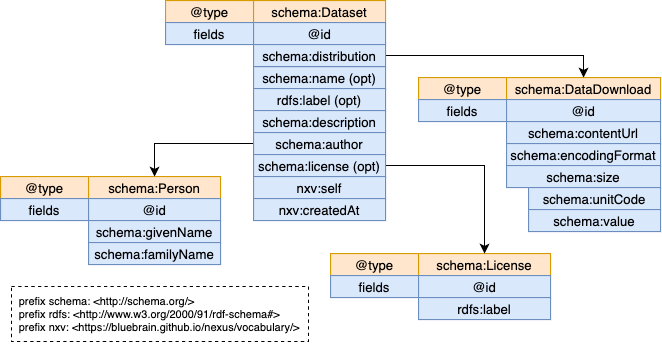

# Search configuration

Nexus provides global search functionality across all projects through the
@link:[search plugin](https://github.com/BlueBrain/nexus/tree/master/delta/plugins/search/src){ open=new }.

@@@ warning

The search plugin is experimental and its functionality and API can change without notice.

@@@

There are several aspects that have been taken into consideration when adding global search capabilities in Nexus:

- global search requires a common (index) data model for correct analysis, indexing and querying
- it must obey the configured access control (search results should include only entries that the client has access to)
- clients must be able to discover the data model in order to be able to build appropriate queries
- projects administrators should be able to control, reconfigure or opt out of presenting information in global search

## How Global Search works

Considering the requirements listed above, the implementation relies on existing Nexus features, namely:

- @ref:[Composite Views](../../delta/api/views/composite-view-api.md) as control resources for partitioning of indices,
  how data is indexed, what information to collect, what permissions are required for querying
- @ref:[Automatic provisioning](../../delta/plugins/index.md#dependency-injection) of project resources after creation
- @ref:[Plugins](../../delta/plugins/index.md) for orchestrating the behaviour and exposing specific endpoints

When the search plugin is enabled and configured it will automatically create within each project a CompositeView that
controls what resources are indexed and what information is collected for each resource. The reasons for using one
CompositeView per project are that resources shapes may differ between projects but also the indices must be
partitioned such that when consuming the query interface, the query must be dispatched only to the indices that the
client has access to. The CompositeView id is identical for each project: `https://bluebrain.github.io/nexus/vocabulary/searchView`.

Once the CompositeView is created by the plugin, it can be updated by each project administrator (specifically any
client that demonstrates `views/write` permission on the target project) to adjust the configuration based on the
specifics of the project (different access control, different resource shapes, custom selection of resources etc.).

CompositeViews have been chosen because they are quite versatile, support a wide range of configuration options:

- multiple sources
- multiple projections (indices)
- project graph traversal for collecting the necessary fields
- simple transformations

More information about CompositeViews can be found in the
@ref:[API Reference](../../delta/api/views/composite-view-api.md).

The search plugin introduces a new namespace (`/v1/search`) with two sub-resources (`query` and `config`).

The @ref:[query endpoint](../../delta/api/search-api.md#query) accepts submitting an
@link:[Elasticsearch query](https://www.elastic.co/guide/en/elasticsearch/reference/current/query-dsl.html)
via `POST`, similar to other views based on Elasticsearch, like `ElasticSearchView`, `AggregateElasticSearchView` or
`CompositeView` with configured Elasticsearch projections. The query will be dispatched to all ElasticSearch indices
managed by the CompositeViews created by the search plugin (the ones that share the id mentioned above) for which the
client has access to. This ensures that access to information is restricted based on each project's access control.

The @ref:[config endpoint](../../delta/api/search-api.md#configuration) allows clients to discover the underlying index
data model such that it can present users (like in the case of Fusion) an appropriate interface for querying, filtering,
sorting, aggregations etc. A minimal response for the config endpoint is like the following example:

```json
{
  "fields": [
    {
      "name": "project",
      "label": "Project",
      "array": false,
      "optional": false,
      "fields": [
        {
          "name": "identifier",
          "format": [
            "uri"
          ],
          "optional": false
        },
        {
          "name": "label",
          "format": [
            "keyword",
            "text"
          ],
          "optional": false
        }
      ]
    },
    {
      "name": "@type",
      "label": "Types",
      "array": true,
      "optional": false,
      "format": [
        "uri"
      ]
    }
  ]
}
```

... where the returned document describes a set of fields to be expected in the indices:

- `name`: String - the name of the field in the Elasticsearch document
- `label`: String - a human-readable label to be presented to users
- `array`: Boolean - true if the field can have multiple values, false otherwise
- `optional`: Boolean - true if the field may not exist in certain documents, false otherwise
- `format`: Array(String) - the expected formats of the field (e.g. `uri`, `keyword`, `text`, `boolean`, `number` etc.);
  `format` and `fields` cannot be present at the same time
- `fields`: Array(Object) - enumeration of nested fields; there are situations where a field value can (should) be handled
  differently depending on the intent, like for example ontological values that are represented by a Uri but also a
  String (name or label). Clients should be aware of such case to understand what to present to their users but also
  how to properly compute queries. `format` and `fields` cannot be present at the same time
- `fields.name`: String - the name of the sub-field in the Elasticsearch document
- `fields.format`: Array(String) - the expected formats of the field (e.g. `uri`, `keyword`, `text`, `boolean`, `number` etc.)
- `fields.optional`: Boolean - true if the field may not exist in certain documents, false otherwise

The config endpoint was created to allow clients to discover how resources are indexed and can be queried. It is
currently loaded as a static file (`plugins.search.fields={pathToFile}`) during Delta's bootstrapping, and it must match
the rest of the search configuration:

- `plugins.search.indexing.resource-types={pathToFile}` - the list of types which will be used to filter resources to be
  indexed in the ElasticSearch projection
- `plugins.search.indexing.query={pathToFile}` - SPARQL construct query that will be used to create triples which will
  be then compacted using the provided context and indexed in the ElasticSearch projection
- `plugins.search.indexing.context={pathToFile}` - the context which is used to transform the results of the SPARQL
  construct query into compacted JSON-LD which will be indexed in the ElasticSearch projection
- `plugins.search.indexing.mapping={pathToFile}` - the Elasticsearch mappings that will be used in the ElasticSearch
  projection
- `plugins.search.indexing.settings={pathToFile}`- additional Elasticsearch settings that will be used in the
  ElasticSearch projection

These additional settings pertain to the configuration of the CompositeViews that are automatically provisioned by the
search plugin. The @ref:[CompositeView API Reference](../../delta/api/views/composite-view-api.md) provides a detailed
explanation on how CompositeViews work and how these options affect the generation of the indices.

## Example use case

This section describes a search configuration for a hypothetical data model presented in the diagram below. The example
uses four related data types (`Dataset`, `DataDownload`, `Person` and `License`) and the intent is to provide the
ability to query resources of type `Dataset` along with information registered in related resources (of type
`DataDownload`, `Person` or `License`).

[](../assets/search-use-case.png)

There are a couple of things to notice in the data model diagram:

- `schema:name` and `rdfs:label` are both optional but mostly used for the same purpose; the information should be
  collected from one with a fallback on the other
- `schema:license` is also optional, not all datasets may have a license
- when some fields are marked as optional it means that the resource of type `Dataset` may not include those fields, but
  this doesn't mean that all related resources exist (a `Dataset` may refer to a `Person` that does not exist in the project)

The goal is that indexing will produce Elasticsearch documents that has the following structure:

```json
{
  "@id": "...",
  "@type": ["http://schema.org/Dataset", "http://other..."],
  "name": "<name or label>",
  "description": "...",
  "author": "<givenName> <familyName> if exists",
  "license": "<label> if exists",
  "distributionContentUrl": "...",
  "distributionEncodingFormat": "...",
  "distributionSize": "<value> <unitCode>",
  "self": "...",
  "createdAt": "..."
}
```

The first step is to define which types of resources should be considered for indexing as a JSON document (provided via
the `plugins.search.indexing.resource-types={pathToFile}` setting). In this example the intent is to index only
resources of type `Dataset`, but there are situations where a more specific list of types should be considered.

```json
[
  "http://schema.org/Dataset"
]
```

The next step is to write the appropriate SPARQL query that collects the required information by traversing the RDF
graph maintained by the CompositeView. The type of query that is required is a `CONSTRUCT` query, where one can create
a new RDF graph based on the information collected from the original graph. The `CONSTRUCT` query is provided to Delta
using the `plugins.search.indexing.query={pathToFile}` setting.

```
prefix rdfs: <http://www.w3.org/2000/01/rdf-schema#>
prefix schema: <http://schema.org/>
prefix nxv: <https://bluebrain.github.io/nexus/vocabulary/>
prefix f: <http://localhost/field/> # this is the new namespace to be used for
                                    # all fields; using a separate namespace
                                    # simplifies the transformation of the new
                                    # RDF graph to JSON.

CONSTRUCT {
  {resource_id}  a                             ?type ;
                 f:name                        ?nameOrLabel ;
                 f:description                 ?description ;
                 f:author                      ?author ;
                 f:license                     ?license ;
                 f:self                        ?self ;
                 f:createdAt                   ?createdAt ;
                 f:distributionContentUrl      ?contentUrl ;
                 f:distributionEncodingFormat  ?encodingFormat ;
                 f:distributionSize            ?size .
}
WHERE {
  # bind first all values that must exist for the document to be produced
  {resource_id}  a                                                    ?type ;
                 schema:description                                   ?description ;
                 nxv:self                                             ?self ;
                 nxv:createdAt                                        ?createdAt ;
                 schema:distribution / schema:contentUrl              ?contentUrl ;
                 schema:distribution / schema:encodingFormat          ?encodingFormat ;
                 schema:distribution / schema:size / schema:unitCode  ?unitCode ;
                 schema:distribution / schema:size / schema:value     ?value .

  # create the size value by concatenating the distribution size value and unitCode
  BIND (CONCAT(STR(?value), STR(" "), STR(?unitCode)) as ?size) .

  # bind shema:name or rdfs:label
  OPTIONAL { {resource_id} schema:name  ?name } .
  OPTIONAL { {resource_id} rdfs:label  ?label } .
  BIND (IF(BOUND(?name), ?name, ?label) as ?nameOrLabel).

  # bind optional author
  OPTIONAL {
    {resource_id}  schema:author     ?personId .
    ?personId      a                 schema:Person ;
                   schema:givenName  ?givenName ;
                   schema:familyName ?familyName .
    BIND (CONCAT(?givenName, STR(" "), ?familyName) as ?author) .
  }

  # bind optional license
  OPTIONAL {
    {resource_id}  schema:license  ?licenceId .
    ?licenceId     a               schema:License ;
                   rdfs:label      ?license .
  }
}
```

The `CONSTRUCT` query example above may seem intimidating, but the gist of it is the following:

- it is generating a new RDF graph (the one described in the `CONSTRUCT` block) using values collected (bound) by
  following the original RDF graph relationships (the ones described in the `WHERE` block)
- the entrypoint for the query is always the current resource id (for which the query is being run) which is filled in
  by the system by replacing `{resouce_id}` with the actual value. Note: this query is executed to produce the new graph
  each type a resource identified by `{resource_id}` is created, updated or deprecated such that the corresponding
  Elasticsearch document is created, updated or deleted
- the `BIND` statements merely assigns a value to a variable, sometimes using a conditional statement or by
  concatenating the values of two existing variables
- the `OPTIONAL` blocks instruct the generation of the new RDF graph to ignore the cases where the variables described
  within cannot be bound (usually because they are not found); so, for example: the statement
  `?licenceId a schema:License` may not match because the referred license (`{resource_id}  schema:license  ?licenceId`)
  does not have the type `schema:License`; in this case the `?license` variable will not be bound and the field will be
  ignored in the new RDF graph; if these statements would not have been encased in an `OPTIONAL` block, a new RDF graph
  would not be generated resulting in a missing document in the index

The next step is to define the context that when applied to the resulting RDF graph (the one created by executing the
`CONSTRUCT` query) it will produce the Elasticsearch document. Because all the predicates in the query used the `f`
prefix (the `http://localhost/field/` namespace) the context document (provided via the
`plugins.search.indexing.context={pathToFile}` setting) becomes quite simple:

```json
{
  "@vocab": "http://localhost/field/",
  "createdAt": {
    "@type": "http://www.w3.org/2001/XMLSchema#dateTime"
  }
}
```

The next step is to define the Elasticsearch index setting (provided via the
`plugins.search.indexing.settings={pathToFile}` setting) that will configure how fields are analysed, number of shards
etc. The following example would work for most cases where values are word split, trimmed and set to lowercase. The
number of shards depends on the volume of data that will be indexed (see the
@link:[Elasticsearch recommendation](https://www.elastic.co/guide/en/elasticsearch/reference/current/size-your-shards.html)).

```json
{
  "analysis": {
    "analyzer": {
      "nexus": {
        "type": "custom",
        "tokenizer": "classic",
        "filter": [
          "trim",
          "word_delimiter_nexus",
          "lowercase"
        ]
      }
    },
    "filter": {
      "word_delimiter_nexus": {
        "type": "word_delimiter_graph",
        "split_on_numerics": false,
        "preserve_original": true
      }
    }
  },
  "index": {
    "number_of_shards": 1
  }
}
```

The next step is to define the Elasticsearch mapping (provided via the `plugins.search.indexing.mapping={pathToFile}`
setting) that will instruct Elasticsearch how to interpret the values in the documents. A lot of customisations can be
defined, but the following example shows the use of `dynamic_templates` to handle all text fields except for
`@id` and `self` which should be handled as keywords only.

```json
{
  "dynamic_templates": [
    {
      "strings": {
        "match_mapping_type": "string",
        "mapping": {
          "type": "text",
          "analyzer": "nexus",
          "fields": {
            "keyword": {
              "type": "keyword"
            }
          }
        }
      }
    }
  ],
  "properties": {
    "@id": {
      "type": "keyword"
    },
    "self": {
      "type": "keyword"
    }
  }
}
```

The final step is to define the config JSON document (provided via the `plugins.search.fields={pathToFile}` setting)
that the `/v1/search/config` endpoint will return as means of data model discovery:

```json
{
  "fields": [
    {
      "array": true,
      "format": [
        "uri"
      ],
      "label": "Types",
      "name": "@type",
      "optional": false
    },
    {
      "array": false,
      "format": [
        "text"
      ],
      "label": "Name",
      "name": "name",
      "optional": false
    },
    {
      "array": false,
      "format": [
        "text"
      ],
      "label": "Description",
      "name": "description",
      "optional": false
    },
    {
      "array": false,
      "format": [
        "uri"
      ],
      "label": "Download",
      "name": "distributionContentUrl",
      "optional": false
    },
    {
      "array": false,
      "format": [
        "keyword"
      ],
      "label": "Media Type",
      "name": "distributionEncodingFormat",
      "optional": false
    },
    {
      "array": false,
      "format": [
        "text"
      ],
      "label": "Content Size",
      "name": "distributionSize",
      "optional": false
    },
    {
      "array": false,
      "format": [
        "text"
      ],
      "label": "Author",
      "name": "author",
      "optional": true
    },
    {
      "array": false,
      "format": [
        "text"
      ],
      "label": "License",
      "name": "license",
      "optional": true
    },
    {
      "array": false,
      "format": [
        "text"
      ],
      "label": "Created",
      "name": "createdAt",
      "optional": false
    },
    {
      "array": false,
      "format": [
        "uri"
      ],
      "label": "Resource Address",
      "name": "self",
      "optional": false
    }
  ]
}
```

This completes the configuration required to enable Global Search capabilities into Nexus. It may seem quite cumbersome,
but all the configuration options presented are required for a good end-user experience. A different, more complex
configuration example can be found in the
@link:[test project](https://github.com/BlueBrain/nexus/tree/master/tests/docker/config).