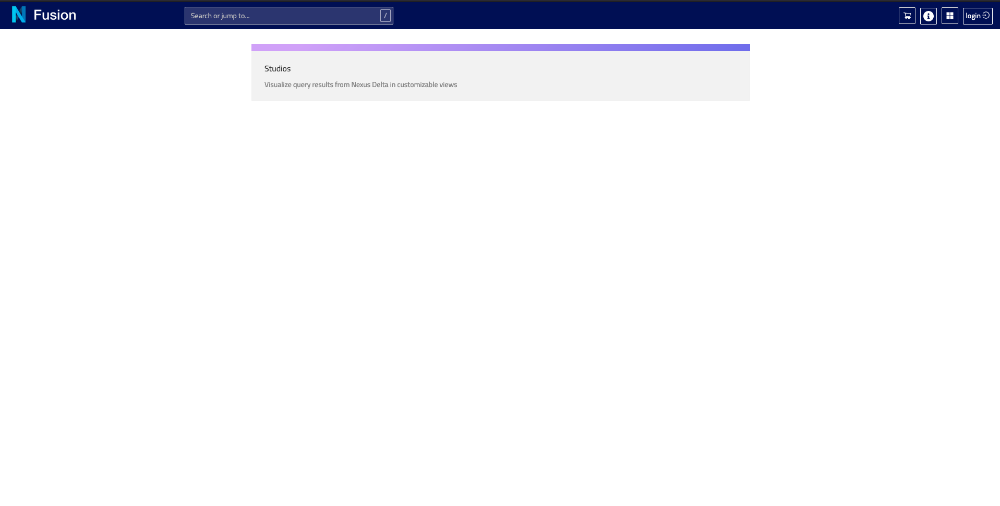
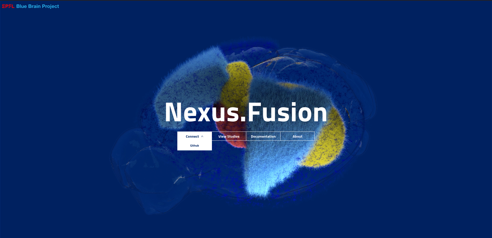
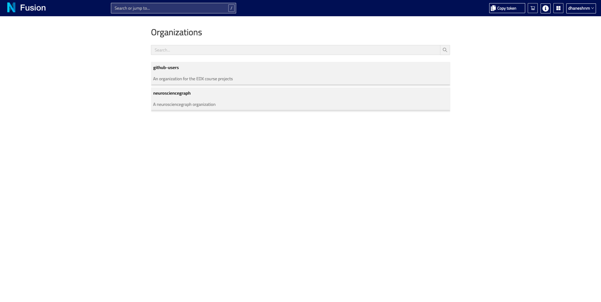
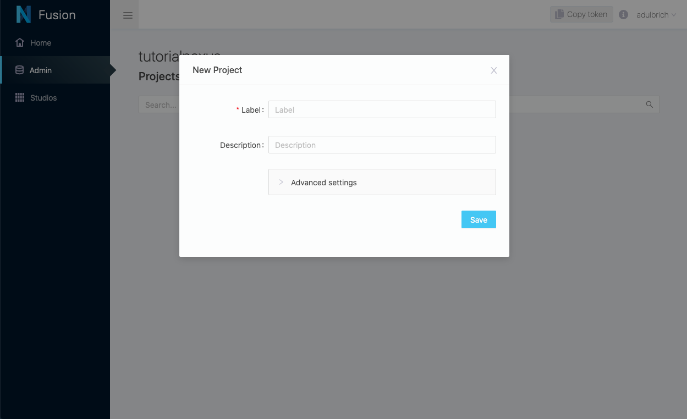

# Try Nexus

In this tutorial, you will use the core features of the Nexus ecosystem through our sandbox. This requires minimal technical knowledge but the ability to install a Python library and run a jupyter notebook.

In the @ref:[first step](try-nexus.md#configuring-your-project-in-nexus-fusion), you'll learn:

- to login into our [Nexus Sandbox](https://sandbox.bluebrainnexus.io/),
- create an organization and project,
- get your personal token.

In the @ref:[second step](try-nexus.md#working-with-data-in-nexus-forge), you'll learn:

- to install Nexus forge,
- configure your project,
- transform your data,
- loading the data into Nexus,
- writing a SARQL query.

In the @ref:[third step](try-nexus.md#exploring-the-graph-in-nexus-fusion), you'll learn:

- to create a Studio in Nexus Fusion,
- to visualize resources.

Finally, check our @ref:[Learn More](try-nexus.md#learn-more) section for more advanced tutorials based on the same datasets.

## Configuring your Project in Nexus Fusion

The [Nexus Sandbox](https://sandbox.bluebrainnexus.io/) is a deployment of Nexus Delta and Fusion publicly available to anybody.

Nexus Fusion is the web interface that you will use in order to interact with Nexus Delta (the web services that manages the underlying knowledge graph).

@@@ div { .center }

@@@

The first step is to login, by clicking in the upper right corner of the screen. You can login with your Github credentials.

@@@ div { .center }

@@@

Once logged in, you can navigate to the @ref:[Admin](../fusion/admin.md) interface through the left navigation sidebar, in order to create the correct organizations and projects for your data to live.

For this tutorial, you can use an existing organization called `nexustutorial` (by clicking on the so-named organization), or you can create your own organization (by clicking the `Create Organization` button at the top).

@@@ div { .center }

@@@

In an organization, you will find the list of existing projects, and you can create your own. Projects (as well as organizations) support permissions, which means that you cannot edit any organizations or projects.

For this tutorial, you will need to create your own project.

@@@ div { .center }

@@@

Choose a name and a description for your project. For more information about advanced settings, see @ref:[here](../fusion/admin.md#organizations-and-projects-indexes).

@@@ div { .center }

@@@

Once the project is created, you'll land on the project view. There is no resources at first. Wait for it.

@@@ div { .center }

@@@

You will quickly see that the project has finished indexing (top right corner).

@@@ div { .half .center }

@@@

Which means that the system has created default indices and storage for you.

@@@ div { .center }

@@@

We're all set! We now have a project to host our ressources and datasets. Let's move on to the second part of this turotial.

## Working with Data in Nexus Forge

## Exploring the Graph in Nexus Fusion

## Learn More

> todo: link to forge notebooks
