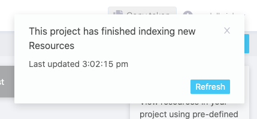

# Try Nexus

In this tutorial, you will use the core features of the Nexus ecosystem through our sandbox. This requires minimal technical knowledge but the ability to install a Python library and run a jupyter notebook.

In the @ref:[first step](try-nexus.md#configuring-your-project-in-nexus-fusion), you'll learn:

- to login into our [Nexus Sandbox](https://sandbox.bluebrainnexus.io/),
- create an organization and project,
- get your personal token.

In the @ref:[second step](try-nexus.md#working-with-data-in-nexus-forge), you'll learn:

- install Nexus Forge,
- configure a Knowledge Graph forge,
- transform data,
- load the transformed data into the project,
- search for data using a SPARQL query.

In the @ref:[third step](try-nexus.md#exploring-the-graph-in-nexus-fusion), you'll learn:

- create a Studio in Nexus Fusion,
- visualize and filter loaded data.

Finally, check our @ref:[Learn More](try-nexus.md#learn-more) section for more advanced tutorials based on the same datasets.

## Configuring your Project in Nexus Fusion

The [Nexus Sandbox](https://sandbox.bluebrainnexus.io/) is a deployment of Nexus Delta and Fusion publicly available to anybody.

Nexus Fusion is the web interface that you will use in order to interact with Nexus Delta (the web services that manages the underlying knowledge graph).

Please bear in mind that the data stored in the Nexus Sandbox is being purged at regular intervals. We recommend you do not store any sensitive data in this environment since it is accessible to many other users.

@@@ div { .center }

@@@

The first step is to login, by clicking in the upper right corner of the screen. You can login with your Github credentials.

@@@ div { .center }

@@@

Once logged in, you can navigate to the @ref:[Admin](../fusion/admin.md) interface through the left navigation sidebar, in order to create the correct organizations and projects for your data to live.

For this tutorial, you can use an existing organization called `nexustutorial` (by clicking on the so-named organization), or you can create your own organization (by clicking the `Create Organization` button at the top).

@@@ div { .center }

@@@

In an organization, you will find the list of existing projects, and you can create your own. Projects (as well as organizations) support permissions, which means that you cannot edit any organizations or projects.

For this tutorial, you will need to create your own project.

@@@ div { .center }

@@@

Choose a name and a description for your project. For more information about advanced settings, see @ref:[here](../fusion/admin.md#organizations-and-projects-indexes).

@@@ div { .center }

@@@

Once the project is created, you'll land on the project view. There is no resources at first. Wait for it.

@@@ div { .center }

@@@

You will quickly see that the project has finished indexing (top right corner).

@@@ div { .half .center }

@@@

Which means that the system has created default indices and storage for you.

@@@ div { .center }

@@@

We're all set! We now have a project to host our ressources and datasets. Let's move on to the second part of this turotial.

## Working with Data in Nexus Forge

We’ll load the [MovieLens](http://files.grouplens.org/datasets/movielens/) dataset into the created project within Nexus Delta using the python framework [Nexus Forge](https://nexus-forge.readthedocs.io/en/latest/).

A [jupyter](https://mybinder.org/v2/gh/BlueBrain/nexus/master?filepath=docs%2Fsrc%2Fmain%2Fparadox%2Fdocs%2Fgetting-started%2Fnotebooks%2Fbuilding_a_kg.ipynb) notebook is available for this part of the tutorial and can be spawn easily using Binder.

For local execution, Nexus Forge can be installed using these [instructions](https://nexus-forge.readthedocs.io/en/latest/#installation). Make sure that the jupyter notebook|lab is launched in the same virtual environment where Nexus Forge is installed. Alternatively, set up a specialized [kernel](https://ipython.readthedocs.io/en/stable/install/kernel_install.html).

### Libraries

```python
import getpass
import yaml
import pandas as pd
import numpy as np
import nexussdk as nxs
from kgforge.core import KnowledgeGraphForge
```

### Setup

Then you need to define the Nexus Sandbox API endpoint, as well as the organization and project configured in the first part of the tutorial.
Please remember to change to the appropriate organization and project in the code below.

```python
ORGANIZATION = "tutorialnexus"
PROJECT = "mytutorial" # Provide your project label here
DEPLOYMENT = "https://sandbox.bluebrainnexus.io/v1" # Using version 1 of the Nexus Delta API
```

In order to authenticate yourself, go to the [Nexus Sandbox](https://sandbox.bluebrainnexus.io/) and copy your token. You can then run the following line of code and input the token:

```python
TOKEN = getpass.getpass() # Provide your Blue Brain Nexus token. It can be obtained after login into the sandbox: https://sandbox.bluebrainnexus.io/
```

As we will be using the MovieLens data, it's useful to describe the context for the entities that we want to import in the knowledge graph. Here's an example of how to define the context.

```python
context = {
  "@id": "https://context.org",
  "@context": {
    "@vocab": "https://sandbox.bluebrainnexus.io/v1/vocabs/",
    "schema": "http://schema.org/",
    "Movie": {
      "@id": "schema:Movie"
    },
    "Rating": {
      "@id": "schema:Rating"
    }
  }
}
```

The next step is thus to push that context as a resource to your project (i.e. knowledge graph):

```python
nxs.config.set_environment(DEPLOYMENT)
nxs.config.set_token(TOKEN)
nxs.resources.create(ORGANIZATION, PROJECT, context)
```

To let Nexus Forge work with the Nexus Delta store, we need a bit of configuration. Let's write the configuration, and store it in a YAML file to be used by the Forge.

```python
config = {
    "Model": {
        "name": "RdfModel",
        "origin": "store",
        "source": "BlueBrainNexus",
        "context": {
            "iri": "https://context.org",
            "bucket": f"{ORGANIZATION}/{PROJECT}"
        }
    },
    "Store": {
        "name": "BlueBrainNexus",
        "endpoint": DEPLOYMENT,
        "versioned_id_template": "{x.id}?rev={x._store_metadata._rev}",
        "file_resource_mapping": "../../configurations/nexus-store/file-to-resource-mapping.hjson",
    },
    "Formatters": {
        "identifier": "https://movielens.org/{}/{}"
    }
}

with open("./config.yml", "w") as f: # Creates the YAML file in the current directory
    yaml.dump(config, f)
```

Now setup the Forge:

```python
forge = KnowledgeGraphForge("./config.yml", token=TOKEN, bucket=f"{ORGANIZATION}/{PROJECT}")
```

### MovieLens Data

Let's download the MovieLens datasets and load the data in Python:

```python
# Download the data using curl and unzipping the file
# Please note that the prefix '!' is meant to execute a shell command from inside a notebook, you will have to remove it if you do it from a terminal.
!curl -s -O http://files.grouplens.org/datasets/movielens/ml-latest-small.zip && unzip -qq ml-latest-small.zip && cd ml-latest-small && ls 

directory  = "./ml-latest-small" # Location of the files (from unzipping)

movies_df  = pd.read_csv(f"{directory}/movies.csv")
ratings_df = pd.read_csv(f"{directory}/ratings.csv", dtype={"movieId":"string"})
tags_df    = pd.read_csv(f"{directory}/tags.csv", dtype={"movieId":"string"})
links_df   = pd.read_csv(f"{directory}/links.csv")

movies_links_df = pd.merge(movies_df, links_df, on='movieId') # Merge movies and links
```

### Resources in Nexus Forge

Let's define the types of our data frames:

```python
movies_links_df["type"] = "Movie"
ratings_df["type"] = "Rating"
tags_df["type"] = "Tag"
```

We can also apply some data transformations. We split the `genres`, and format the `Id`:

```python
movies_links_df["id"] = movies_links_df["movieId"].apply(lambda x: forge.format("identifier", "movies", x))
movies_links_df["genres"] = movies_links_df["genres"].apply(lambda x: x.split("|"))
ratings_df["movieId.id"] = movies_links_df["movieId"].apply(lambda x: forge.format("identifier", "movies", x))
tags_df["movieId.id"] = tags_df["movieId"].apply(lambda x: forge.format("identifier", "movies", x))
```

Finally, let's register these data frames as Forge resources:

```python
movies_resources = forge.from_dataframe(movies_links_df, np.nan, ".")
ratings_resources = forge.from_dataframe(ratings_df, np.nan, ".")
tags_resources = forge.from_dataframe(tags_df, np.nan, ".")
```

Visualize the results:

```python
print(movies_resources[0])
print(ratings_resources[0])
print(tags_resources[629])
```

### Register Resources into Nexus Delta

Now that we have the resources, let's push them to our Sandbox deployment:

```python
forge.register(movies_resources)
forge.register(ratings_resources)
forge.register(tags_resources)
```

That's it! You can check your project in the web interface to see the newly created resources.

### Query Resources with Nexus Forge from Nexus Delta

As the resources are being indexed in the elasticsearch and blazegraph indices, that means that we can soon query those resources using a SPARQL query.

@@@ note
If you are new to SPARQL, that's ok, you can watch this [introduction video](https://www.youtube.com/watch?v=FvGndkpa4K0) before moving further.
@@@

Let's list thought provoking movies. First we write the query:

```python
query = """
    PREFIX vocab: <https://sandbox.bluebrainnexus.io/v1/vocabs/>
    PREFIX nxv: <https://bluebrain.github.io/nexus/vocabulary/>
    SELECT ?id ?title
    WHERE {
        ?id a Movie ;
            nxv:deprecated false ;
            vocab:title ?title ;
            ^vocab:movieId / vocab:tag "thought-provoking" . 
    }
"""
```

We can then use the Forge to query the endpoint:

```python
resources = forge.sparql(query, limit=100, debug=True)
set(forge.as_dataframe(resources).title)
movie = forge.retrieve(resources[0].id)
print(movie)
movie._store_metadata
```

If you want to try some other examples of Nexus Forge, you can use these [notebooks](https://mybinder.org/v2/gh/BlueBrain/nexus-forge/master?filepath=examples%2Fnotebooks%2Fgetting-started).

The next step is to use this query to create a Studio view in Nexus Fusion.

## Exploring the Graph in Nexus Fusion

## Learn More

### Querying knowledge graph using SPARQL

This tutorial introduces the basics of SPARQL, a query language for querying RDF based knowledge graph. It also demonstrates how to query a Nexus SparqlView.

You'll build queries to explore and navigate a knowledge graph using SPARQL and Nexus.

You'll learn:

- the basics of the SPARQL query language,
- how to connect to and query a SparqlView in Nexus.

You'll need Python 3.5 or higher with support for Jupyter notebook.

This tutorial code is available on:

- [Github](https://github.com/BlueBrain/nexus/blob/master/docs/src/main/paradox/docs/getting-started/notebooks/Query_Sparql_View.ipynb)
- [Google Colab](https://colab.research.google.com/github/BlueBrain/nexus/blob/master/docs/src/main/paradox/docs/getting-started/notebooks/Query_Sparql_View.ipynb)

### Querying a Knowledge Graph using Elasticsearch

The goal of this notebook is to learn how to connect to an Elasticsearch view and run queries against it.

It is not a tutorial about the Elasticsearch DSL language for which many well written [learning resources are available](https://www.elastic.co/guide/en/elasticsearch/reference/current/query-dsl.html).

You'll build a simple python client to connect to a Nexus ElasticSearchView and query a knowledge graph using Elasticsearch DSL.

You'll learn how to connect to and query a ElasticSearchView in Nexus.

You'll need Python 3.5 or higher with support for Jupyter notebook.

The tutorial code is available on:

- [Github](https://github.com/BlueBrain/nexus/blob/master/docs/src/main/paradox/docs/getting-started/notebooks/Querying_ElasticSearchView.ipynb)
- [Google Colab](https://colab.research.google.com/github/BlueBrain/nexus/blob/master/docs/src/main/paradox/docs/getting-started/notebooks/Querying_ElasticSearchView.ipynb)

### Linking data on the web

In this tutorial, we demonstrate how to consume structured data published on the web according to the Linked data principles to extend and enrich a knowledge graph.

You'll build a simple pipeline to query entities managed within Blue Brain Nexus, connect them with entities available on the web as structured data and extend and enrich their metadata.

You'll learn:

- an understanding of linked data principles,
- how to query data stored in a Nexus SparqlView,
- how to query structured data on the web,
- how to extend the metadata of entities managed within Blue Brain Nexus with external structured data on the web: we target [Wikidata](https://www.wikidata.org/wiki/Wikidata:Main_Page) as an example,
- how to update entities within Blue Brain Nexus using the [SDK](https://github.com/BlueBrain/nexus-python-sdk) and enrich their metadata.

You'll need Python 3.5 or higher with support for Jupyter notebook.

This tutorial code is available on:

- [Github](https://github.com/BlueBrain/nexus/blob/master/docs/src/main/paradox/docs/getting-started/notebooks/Linking%20data%20on%20the%20web.ipynb)
- [Google Colab](https://colab.research.google.com/github/BlueBrain/nexus/blob/master/docs/src/main/paradox/docs/getting-started/notebooks/Linking%20data%20on%20the%20web.ipynb)
