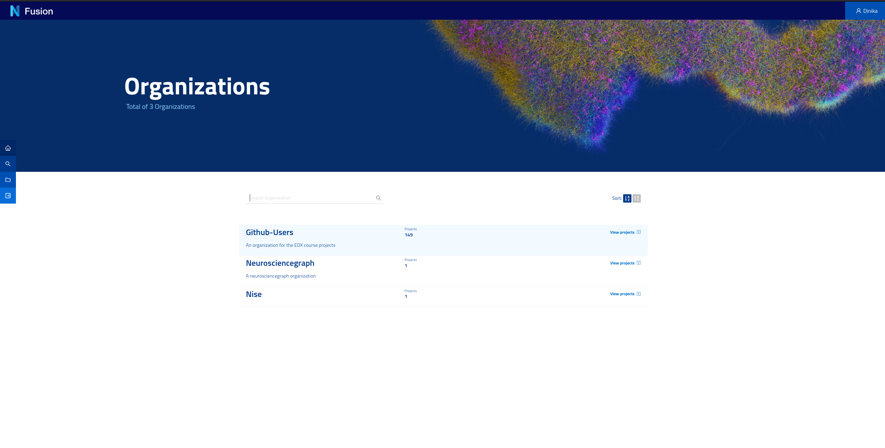
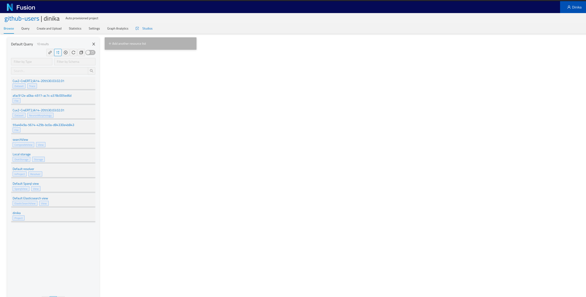
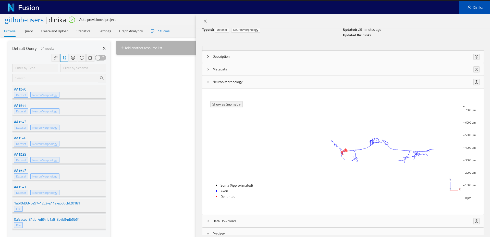
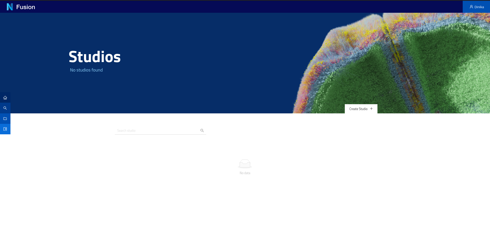
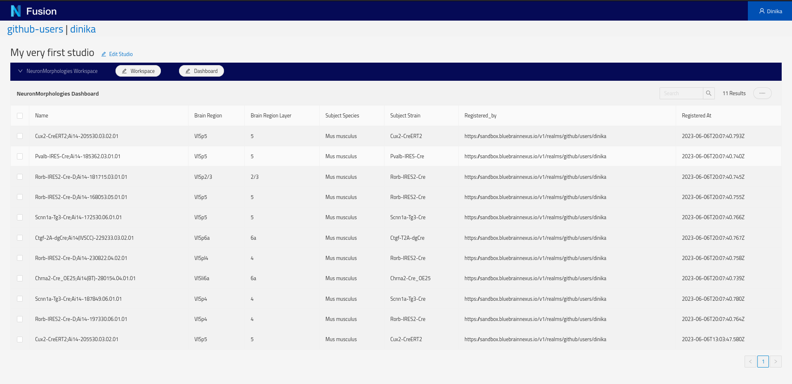

# Try Nexus with Neuroscience Datasets

Welcome to our Nexus tutorial! Nexus is an open-source data and metadata management suite. With Nexus, your data is catalogued and indexed as a knowledge graph, all interconnected.

Nexus consists of different products, such as:

- Nexus Delta: our core data management platform
- Nexus Fusion: your web interface to access the metadata and data stored in the knowledge graph
- Nexus Forge: a Python library to work with knowledge graphs, and in particular Nexus Delta

In this tutorial, you'll learn to interact with the knowledge graph through these different tools. Nexus can be used for any kind of data although this tutorial focuses on neuroscience data.

> This tutorial is also part of the @link:[edX EPFL Simulation Neuroscience MOOC](https://www.edx.org/course/simulation-neuroscience).

In @ref:[Step 0](try-nexus.md#step-0-python-setup), you'll learn to setup your Python environment if you want to run 
the Jupyter notebooks locally. You can skip this step if you use Binder or Google Colaboratory (preferred).

In @ref:[Step 1](try-nexus.md#step-1-nexus-setup), you'll learn about the Nexus Sandbox deployment, a dedicated 
environment for this tutorial. You'll use Nexus Fusion to login and access your dedicated project instantiated in Nexus Delta.

In @ref:[Step 2](try-nexus.md#step-2-download-and-register-data-from-a-single-source), you'll learn to download and 
register data from the Allen Institute for Brain Science (AIBS). You'll use Nexus Forge in a Jupyter notebook to interact with Nexus Delta.

In @ref:[Step 3](try-nexus.md#step-3-download-and-register-data-from-multiple-sources), you'll learn to download and 
register data from multiple sources (AIBS and MouseLight). You'll use Nexus Forge in a Jupyter notebook to interact with Nexus Delta.

In @ref:[Step 4](try-nexus.md#step-4-organize-and-visualize-cells-in-nexus-fusion), you'll learn to organize your data 
on the web for easier sharing and publishing. You'll use Nexus Fusion on the Sandbox deployment.

In @ref:[Step 5](try-nexus.md#step-5-finding-similar-datasets-using-recommendations), you'll learn to prepare your data
in order to search for similar datasets across the data you have integrated in Blue Brain Nexus.


Let's go!

> You can use the side menu to navigate between the page's sections.

## Step 0: Python Setup

In this tutorial, you are encouraged to run @link:[Nexus Forge](https://github.com/BlueBrain/nexus-forge){ open=new } to interact with Nexus. Nexus Forge is a python library. We provide Jupyter Notebooks with examples.

You can either run the notebooks in @link:[Binder](https://mybinder.org/){ open=new } or @link:[Google Colaboratory](https://colab.research.google.com/){ open=new }, or run them locally.

### Running Python and Jupyter Locally

Here is a step-by-step guide to setup your Python environment to work with @link:[Nexus Forge](https://github.com/BlueBrain/nexus-forge){ open=new }, @link:[Jupyter](https://jupyter.org/){ open=new }, and the @link:[Allen SDK](https://allensdk.readthedocs.io/en/latest/index.html){ open=new }.

This is not mandatory, feel free to use your preferred method. If you are using Binder or Google Colaboratory, you can skip this section.

#### Install Miniconda

Go to @link:[Miniconda](https://docs.conda.io/en/latest/miniconda.html){ open=new } and download and install the latest for your operating system.

#### Create an environment

Open the terminal and type:

```bash
conda create -yn kgforge python=3.7
```

> The Allen SDK is rated for Python 3.6 and 3.7. You can try installing a more recent version of Python but it might not work. Nexus Forge works with Python 3.6 and above.

#### Switch to the environment

In the terminal, type:

```bash
conda activate kgforge
```

### Install @link:[Nexus Forge](https://github.com/BlueBrain/nexus-forge){ open=new }

In the terminal, with the environment active, type:

```bash
pip install nexusforge
```

You can also install the development version directly from GitHub:

```bash
pip install git+https://github.com/BlueBrain/nexus-forge.git@<branch-name>
```

#### Install Additional Packages

To avoid any issues, install @link:[Jupyter](https://jupyter.org/){ open=new } in your environment.

```bash
pip install jupyterlab
```

You will need the @link:[Allen SDK](https://allensdk.readthedocs.io/en/latest/index.html){ open=new } to get data from their database.

```bash
pip install allensdk
```

To work with morphologies, you will need @link:[Blue Brain's NeuroM](https://neurom.readthedocs.io/en/stable/index.html){ open=new } package. This will install Blue Brain's MorphIO as well.

```bash
pip install neurom
```

#### Clone the Nexus Repository

The notebooks used for this tutorial are maintained in the Nexus GitHub repository under `/docs/src/main/paradox/docs/getting-started/notebooks`.

To clone the repository, you will need to install @link:[Git](https://git-scm.com/){ open=new } (if not already present on your system), then open the terminal, navigate to your preferred location, and type:

```bash
git clone https://github.com/BlueBrain/nexus.git
```

### Running Notebooks in Binder or Google Colaboratory

## Step 1: Nexus Setup

We run the latest version of Nexus publicly for education. You can also use the instance in your organization (if any), or setup Nexus from scratch.

### 1.1. Using the Sandbox

The @link:[Sandbox](https://sandbox.bluebrainnexus.io/web/){ open=new } is a deployment of Nexus for educational purposes.

Once on the Sandbox homepage, click on the top right corner on the login button.

@@@ div { .center }

@@@

We offer for the moment one identity providers (IdP):

- Github

You will need an account on either one to be able to continue this tutorial.

Click on the IdP of your choice and allow Nexus to have access. You are now logged in.

Once logged in, you can get your token. The token is your secure, private, code that you will use in the rest of this tutorial to interact with Nexus.

Additionally, the Sandbox environment automatically provisions a project for you so you don't have to. Navigate to the Admin page and you will see the list of organisations in Nexus. 
A project is contained in an organisation. The organisation where your project is created depends on your identity provider. 
If you logged in with GitHub for example, your project was create under the `github-users` organisation.

@@@ div { .center }

@@@

Navigate to the correct organisation then search or scroll down to find your project (i.e. your username). You will need the names of the organisation and project for the next parts of the tutorial.

### 1.2. Running your Own Instance of Nexus

We do not recommend to setup your own instance for this tutorial. If you are interested to install your own instance, @ref:[check our guide](./running-nexus/index.md).

## Step 2: Download and Register Data from a Single Source

In this section, you will learn about metadata (and MINDS), provenance, and integrate data from the Allen Institute for Brain Science in Nexus.

### 2.1. Data vs Metadata

When we talk about data, we're mostly talking about binary or text files. When we hear metadata, it means "data about the data".

In neuroscience, you will have images of brain slices. You will have images of stained cells. You will find files of 3D-morphologies or electrophysiology recordings of the cell or neuron.

The brain is big, and the amount of data collected grows every second.

As a result, it quickly become extremely difficult for groups of scientists to manage, track, share, and work with this data.

To solve this growing pain, we can add metadata, or context, to the data collected. Specifically for neuroscience, we designed MINDS. MINDS is the Minimal Information about a Neuroscience DataSet.

@@@ div { .center }

@@@

In the diagram above, you can see that your data (which we will call @link:[Dataset](https://schema.org/Dataset){ open=new } from now on) has now additional properties:

- Subject: Species, age etc. of subject from which dataset was generated
- Brain Location: Brain region or 3D coordinates within a brain atlas
- Data Types: Type of the data stored in the dataset
- Contributions: The agent (scientists, organizations) to whom the dataset is attributed to
- Distribution: Direct link to the dataset binaries (downloadURL) or web page describing how to download them (accessURL)
- License: Dataset license (e.g. CC BY 4.0)

You can check the details of MINDS by visiting @link:[Neuroshapes](https://incf.github.io/neuroshapes/){ open=new }. Neuroshapes provide open schemas for @link:[F.A.I.R.](https://en.wikipedia.org/wiki/FAIR_data){ open=new } neuroscience data.

### 2.2. Provenance

You have just seen how we can add metadata to our datasets to give more context. This allows scientists to find their data as well as their peers' more easily.

Another important factor to consider is where the data comes from, i.e. what experiment generated it, who conducted the experiment, and what data was used to derive the new data.

Luckily for us, some good folks have defined a @link:[provenance data model](https://www.w3.org/TR/prov-o/){ open=new } that we can use.

@@@ div { .center }

@@@

The diagram above is the basic representation of provenance. Our Dataset is an extension of the Entity. 
The Entity itself was generated by an Activity, which itself used (or not) another Entity. 
Finally, the Activity is associated with an Agent (e.g. a Person or Institution).

There are ways to add more details, for example with "qualified" relations. You can read more about it in the @link:[W3C PROV specification](https://www.w3.org/TR/prov-o/){ open=new }.

### 2.3. Allen Institute for Brain Science Data

The goal of the Allen Institute for Brain Science (AIBS) is to accelerate the understanding of how the brain works.

The AIBS has its data (mouse and human brains) available online for free. For the purpose of this tutorial, 
we're mostly interested in Cells. Check out their @link:[data portal](https://celltypes.brain-map.org/){ open=new }.

You can for example access a @link:[cell's morphology page](https://celltypes.brain-map.org/experiment/morphology/614777438){ open=new } 
and browse and download the morphology data. Or you can head to the 
@link:[cell's electrophysiology page](https://celltypes.brain-map.org/experiment/electrophysiology/614777438){ open=new } to do the same.

You can either download and get the required information directly from their portal, or use the Allen SDK (Software Development Kit) to do so from your Python script (as shown in the example notebooks).

### 2.5. Mappers

In Nexus Forge, a mapper will map, transform, and format fields from one source into another. In the case of Nexus, it will map the fields from a data source such as the AIBS to the formats supported by Nexus (the JSON payloads or resources).

More specifically, let's imagine that we have a data source `x` that contains the following fields:

```json
{ 
    "id" : 123,
    "givenName" : "john",
    "familyName" : "doe",
    "gender" : "male"
}
```

We want to map these to the fields `id`, `name`, and `gender`. This is how it could look like:

```json
{ 
    "id" : forge.format("identifier", x.id)
    "name" : f"{x.givenName}/{x.familyName}",
    "sex" : forge.resolve(text=x.gender, scope="ontologies", target="terms")
}
```

We see that the original `id` will be formatted to a type identifier, that the `givenName` and `familyName` were 
concatenated, and finally that for the `gender`, we will check to see if the value exists in an ontology (and is thus 
already standardized).

@link:[Read more about mapping with Forge.](https://nexus-forge.readthedocs.io/en/latest/interaction.html#mapping){ open=new }

In the code available, we will integrate data from two sources: the AIBS and MouseLight (see Step 3). We will provide 
mappers for both data sources. You can check the mappers 
@link:[directly on GitHub](https://github.com/BlueBrain/nexus/tree/master/docs/src/main/paradox/docs/getting-started/notebooks/mappings){ open=new }. 
There are two mappers for the AIBS, one for neuron morphologies and another for electrophysiology data. 
For MouseLight, there's only one mapper, as both morphologies and traces are in the same data source.

### 2.6. Running the Notebook

- @link:[Github](https://github.com/BlueBrain/nexus/blob/master/docs/src/main/paradox/docs/getting-started/notebooks/one_cell_minds.ipynb){ open=new }
- @link:[Google Colab](https://colab.research.google.com/github/BlueBrain/nexus/blob/master/docs/src/main/paradox/docs/getting-started/notebooks/one_cell_minds.ipynb){ open=new }
- @link:[Binder](https://mybinder.org/v2/gh/BlueBrain/nexus/HEAD?filepath=%2Fdocs%2Fsrc%2Fmain%2Fparadox%2Fdocs%2Fgetting-started%2Fnotebooks%2F){ open=new }

To run the notebook locally, open your terminal, clone the @link:[Nexus repository](https://github.com/BlueBrain/nexus){ open=new }, go to the notebook directory, and run Jupyter:

```bash
git clone https://github.com/BlueBrain/nexus.git
```

```bash
cd nexus
```

```bash
cd docs/src/main/paradox/docs/getting-started/notebooks
```

```bash
jupyter notebook one_cell_minds.ipynb
```

### 2.7. Check Resources in the Sandbox

Once you have registered resources through Nexus Forge (in the notebook), you can check that they are effectively present in Nexus. 
Navigate to the @link:[Sandbox](https://sandbox.bluebrainnexus.io/web/){ open=new } then to the correct organisation and project. 
In the project page, you will have the list of all resources present in your project (Default Query), including the 
ones that you just integrated. Depending on how you ran the notebook, you should find at least one NeuronMorphology and 
one Trace resource.

@@@ div { .center }

@@@

Click on a card to open the resource view. In the admin section of the view, you can see the actual JSON payload (explained in part 4) and additional metadata related to your dataset.

@@@ div { .center }

@@@

## Step 3: Download and Register Data from Multiple Sources

In this section, you will integrate additional data from MouseLight and the Allen Institute for Brain Science.

### 3.1. MouseLight Data

The @link:[Janelia Research Campus](https://www.janelia.org/){ open=new } makes MouseLight available to the scientific community. 
@link:[MouseLight](http://mouselight.janelia.org/){ open=new } generates complete morphological reconstructions of 
individual neurons from datasets of whole mouse brains imaged at sub-micron resolution.

You can access the @link:[MouseLight data](http://ml-neuronbrowser.janelia.org/){ open=new } directly in the browser. 
You can also access it programmatically through different endpoints, 
such as @link:[GraphQL](http://ml-neuronbrowser.janelia.org/graphql/){ open=new }.

The example notebooks will use these endpoints to collect and download the datasets and their metadata.

### 3.2. Running the Notebook

- @link:[Github](https://github.com/BlueBrain/nexus/blob/master/docs/src/main/paradox/docs/getting-started/notebooks/dataset_from_different_sources.ipynb){ open=new }
- @link:[Google Colab](https://colab.research.google.com/github/BlueBrain/nexus/blob/master/docs/src/main/paradox/docs/getting-started/notebooks/dataset_from_different_sources.ipynb){ open=new }
- @link:[Binder](https://mybinder.org/v2/gh/BlueBrain/nexus/HEAD?filepath=%2Fdocs%2Fsrc%2Fmain%2Fparadox%2Fdocs%2Fgetting-started%2Fnotebooks%2F){ open=new }

To run the notebook locally, open your terminal, clone the @link:[Nexus repository](https://github.com/BlueBrain/nexus){ open=new }, go to the notebook directory, and run Jupyter:

```bash
git clone https://github.com/BlueBrain/nexus.git
```

```bash
cd nexus
```

```bash
cd docs/src/main/paradox/docs/getting-started/notebooks
```

```bash
jupyter notebook dataset_from_different_sources.ipynb
```

### 3.3. Check Resources in the Sandbox

Go back to @ref:[section 2.7](try-nexus.md#2-7-check-resources-in-the-sandbox) to learn how to check resources in the Sandbox.

## Step 4: Organize and Visualize Cells in Nexus Fusion

Nexus Fusion allows you to browse the data stored in Nexus. Our extensible architecture also enables the development of visualization plugins.

### 4.1. SPARQL and RDF

@link:[SPARQL](https://www.w3.org/TR/sparql11-query/){ open=new } is an RDF query language. In other words, it's a way 
to request a subset of data from a database that conforms to the 
@link:[RDF (Resource Description Framework)](https://en.wikipedia.org/wiki/Resource_Description_Framework){ open=new } model.

When writing data to Nexus, the different payloads are stored in a long table, each row representing a resource. 
The data is then synced to our RDF database and thus converted to a graph. When reading the data, you can query this 
graph with SPARQL.

Let us take a JSON-LD example payload:

```json
{
  "@type": [
    "http://schema.org/Dataset",
    "http://www.w3.org/ns/prov#Entity"
  ],
  "http://schema.org/description": "My first dataset",
  "http://schema.org/name": "Dataset",
  "http://schema.org/distribution": [
    {
      "@type": "http://schema.org/DataDownload",
      "http://schema.org/contentUrl": {
        "@id": "http://example.com/cfb62f82-6d54-4e35-ab5e-3a3a164a04fb"
      },
      "http://schema.org/name": "mesh-gradient.png"
    }
  ]
}
```

You can copy and paste this JSON-LD payload in the @link:[JSON-LD Playground](https://json-ld.org/playground/){ open=new } and see the expanded results.

Here's what it would look like as an RDF graph:

@@@ div { .center }

@@@

The graph is composed of triples of the form `Subject - predicate -> Object`. In the example above, `_:b0` would be a 
subject (in our case `_:b0` is just an arbitrary ID for the payload), `<http://schema.org/name>` is a predicate, and `Dataset` an object.

If we want to query this graph and return only the name and description of `Dataset` data types, we can write a simple SPARQL query:

```sparql
SELECT ?name ?description
WHERE {
    ?resource <http://www.w3.org/1999/02/22-rdf-syntax-ns#type> <http://schema.org/Dataset> ;
              <http://schema.org/name>                          ?name ;
              <http://schema.org/description>                   ?description .
}
```

This would result in the following table:

| name | description |
|------|-------------|
| Dataset | My first dataset |

Let's decompose this query. The `SELECT` statement lists all the fields (i.e. variables) that we want to display. 
The `WHERE` clause shows how to get to these fields: which graph paths (or traversals) do we need to do to get to that 
field. In the `WHERE` clause, semi-colons `;` indicate that we are still talking about the same `Subject` but with 
different `predicate`s. A full stop `.` indicates that the statement is finished, i.e. that we have finished talking 
about a specific `Subject`. A `WHERE` clause can have multiple statements. If an `Object` in the statement has a value, 
it has to match, otherwise it won't give any results. If the `Object` is prefixed by a question mark `?` it becomes a 
variable. Variables can have any names.

If not using semi-colons, we could have written the query as three separate statements:

```sparql
SELECT ?name ?description
WHERE {
    ?resource <http://www.w3.org/1999/02/22-rdf-syntax-ns#type> <http://schema.org/Dataset> .
    ?resource <http://schema.org/name>                          ?name .
    ?resource <http://schema.org/description>                   ?description .
}
```

Let's imagine that we now want to also get the `contentUrl`, the query can be adapted to:

```sparql
SELECT ?name ?description ?contentUrl
WHERE {
    ?resource       <http://www.w3.org/1999/02/22-rdf-syntax-ns#type>   <http://schema.org/Dataset> ;
                    <http://schema.org/name>                            ?name ;
                    <http://schema.org/description>                     ?description ;
                    <http://schema.org/distribution>                    ?distribution .
    ?distribution   <http://schema.org/contentUrl>                      ?contentUrl .
}
```

This would result in the following table:

| name | description | contentURL |
|------|-------------|------------|
| Dataset | My first dataset | <http://example.com/cfb62f82-6d54-4e35-ab5e-3a3a164a04fb> |

If there were more resources that matched the same graph patterns, the query would have returned them as well.

#### 4.1.1. (Optional) Improving JSON-LD: ID, Context and More

The JSON-LD payload above is quite verbose. Let's have a look at the different ways to improve it.

The first thing to notice is that if I want to reference my dataset, I don't have an identifier. The node in the graph 
is a blank node `_:b0`. I can easily add an ID like this:

```json
{
  "@id": "http://example.com/my_gradient_dataset",
  "@type": [
    "http://schema.org/Dataset",
    "http://www.w3.org/ns/prov#Entity"
  ],
  "http://schema.org/description": "My first dataset",
  "http://schema.org/name": "Dataset",
  "http://schema.org/distribution": [
    {
      "@type": "http://schema.org/DataDownload",
      "http://schema.org/contentUrl": {
        "@id": "http://example.com/cfb62f82-6d54-4e35-ab5e-3a3a164a04fb"
      },
      "http://schema.org/name": "mesh-gradient.png"
    }
  ]
}
```

Instead of `_:b0`, the node will be identified by `http://example.com/my_gradient_dataset`. The `@id` uniquely identifies node objects.

Can we now make the JSON-LD less verbose and easier to read? Yes, by defining a context. A context defines the short-hand names used in the JSON-LD payload. In particular, a context can contain a `vocab`.

```json
{
  "@context" : {
    "@vocab" : "http://schema.org/"
  },
  "@id" : "http://example.com/my_gradient_dataset",
  "@type": [
    "Dataset",
    "http://www.w3.org/ns/prov#Entity"
  ],
  "description": "My first dataset",
  "name": "Dataset",
  "distribution": [
    {
      "@type": "DataDownload",
      "contentUrl": {
        "@id": "http://example.com/cfb62f82-6d54-4e35-ab5e-3a3a164a04fb"
      },
      "name": "mesh-gradient.png"
    }
  ]
}
```

If you copy the above snippet to the @link:[JSON-LD Playground](https://json-ld.org/playground/){ open=new } and look 
at the expanded form, you will notice that the properties all expand with  the `http://schema.org/` prefix. 
Don't hesitate to do the same for the ones below. Play a little with the payload to see what happens to the expanded form.

But what if we want to shorten specific values? We can add them in the context as well.

```json
{
  "@context" : {
    "@vocab" : "http://schema.org/",
    "Entity" : "http://www.w3.org/ns/prov#Entity"
  },
  "@id" : "http://example.com/my_gradient_dataset",
  "@type": [
    "Dataset",
    "Entity"
  ],
  "description": "My first dataset",
  "name": "Dataset",
  "distribution": [
    {
      "@type": "DataDownload",
      "contentUrl": {
        "@id": "http://example.com/cfb62f82-6d54-4e35-ab5e-3a3a164a04fb"
      },
      "name": "mesh-gradient.png"
    }
  ]
}
```

Finally, the last improvement would be to shorten our IDs. For this we can use a base.

```json
{
  "@context" : {
    "@base" : "http://example.com/",
    "@vocab" : "http://schema.org/",
    "Entity" : "http://www.w3.org/ns/prov#Entity"
  },
  "@id" : "my_gradient_dataset",
  "@type": [
    "Dataset",
    "Entity"
  ],
  "description": "My first dataset",
  "name": "Dataset",
  "distribution": [
    {
      "@type": "DataDownload",
      "contentUrl": {
        "@id": "cfb62f82-6d54-4e35-ab5e-3a3a164a04fb"
      },
      "name": "mesh-gradient.png"
    }
  ]
}
```

By default, in Nexus, the base (resp. vocab) defaults to your project, e.g. `https://bbp.epfl.ch/nexus/v1/resources/github-users/adulbrich/_/` (resp. `https://bbp.epfl.ch/nexus/v1/vocabs/github-users/adulbrich/`).

The context can also point to another resource so that it is defined once and can be re-used in multiple resources. 
In Nexus, a default context for the @link:[Nexus-specific metadata](https://bluebrain.github.io/nexus/contexts/metadata.json){ open=new } is defined.

There's much more to the @link:[JSON-LD syntax](https://w3c.github.io/json-ld-syntax/){ open=new }. Don't hesitate to 
have a look for a more detailed explanation.

#### 4.1.2. (Optional) Improving SPARQL: Prefixes

The SPARQL query above was quite verbose in the sense that we had to write the full URI for predicates, similarly to 
the full properties URIs in the JSON payload.

There is a way to shorten these with `PREFIX` statements. Prefixes are similar to the base and vocabs for JSON-LD in their use.

```sparql
PREFIX rdf: <http://www.w3.org/1999/02/22-rdf-syntax-ns#>
PREFIX schema: <http://schema.org/>
SELECT ?name ?description ?contentUrl
WHERE {
    ?resource       rdf:type            schema:Dataset ;
                    schema:name         ?name ;
                    schema:description  ?description ;
                    schema:distribution ?distribution .
    ?distribution   schema:contentUrl   ?contentUrl .
}
```

The new query will yield the exact same results as the one defined earlier, but is much more readable. By defining prefixes, 
we can replace long URIs by the prefix and the actual property. This means that for example `<http://schema.org/distribution>` becomes `schema:distribution`.

> You will often see that instead of `rdf:type` (the shortened version of `<http://www.w3.org/1999/02/22-rdf-syntax-ns#type>`), people use `a`. This is an RDF specific keyword to point to types. In the example above, the line would then be `?resource a schema:Dataset`.

You can learn more about SPARQL in the @link:[official documentation](https://www.w3.org/TR/sparql11-query/).

### 4.2. Project and Resource Views

As you saw in the example above, we can use SPARQL to query the cells in our Nexus project.

Let's start by accessing your Nexus instance or the @link:[Sandbox](https://sandbox.bluebrainnexus.io/web/){ open=new }. 
Go to Admin page (from the left hand side menu), and navigate to your organization and project.

> In the Sandbox, the organization corresponds to the identity provider used, and the project to your username. For example, if you used GitHub, the organization will be `github-users` and your project will be your GitHub username.

In the Project view, you will have the list of all resources that you've registered within your project. You can filter 
by type or search for a specific term in the name, label, or description.

@@@ div { .center }

@@@

Click on a resource to open the Resource view.

@@@ div { .center }

@@@

Depending on the resource data type, you might see one or more "plugins". Plugins are components that will show up for 
specific resources or properties. For example, if you registered a neuron morphology and the data is properly attached 
through the distribution, you will be able to see a 3D morphology browser plugin.

@@@ div { .center }

@@@

More importantly, you will find the Admin plugin at the bottom of the view. Expand it and you will see the actual 
resource payload stored by Nexus, and navigate the graph through links, or visualize the surrounding graph in the graph tab.

@@@ div { .center }

@@@

Here's an example of the JSON payload of the neuron morphology resource previously registered (context left out for clarity):

```json
{
  "@context": {...},
  "@id": "https://bbp.epfl.ch/neurosciencegraph/data/neuronmorphologies/491ea474-34f1-4143-8e1d-9f077602d36e",
  "@type": [
    "Dataset",
    "NeuronMorphology"
  ],
  "apicalDendrite": "spiny",
  "brainLocation": {
    "@type": "BrainLocation",
    "brainRegion": {
      "@id": "mba:778",
      "label": "VISp5"
    },
    "coordinatesInBrainAtlas": {
      "valueX": 8881,
      "valueY": 953.839501299405,
      "valueZ": 7768.22695782726
    },
    "hemisphere": "right",
    "layer": "5"
  },
  "cell_reporter_status": "positive",
  "contribution": {
    "@type": "Contribution",
    "agent": {
      "@id": "https://www.grid.ac/institutes/grid.417881.3",
      "@type": "Organization",
      "label": "Allen Institute for Brain Science"
    }
  },
  "csl__normalized_depth": 0.478343598387418,
  "distribution": {
    "@type": "DataDownload",
    "atLocation": {
      "@type": "Location",
      "store": {
        "@id": "https://bluebrain.github.io/nexus/vocabulary/diskStorageDefault"
      }
    },
    "contentSize": {
      "unitCode": "bytes",
      "value": 83865
    },
    "contentUrl": "https://sandbox.bluebrainnexus.io/v1/files/github-users/adulbrich/30704eaf-7c87-4d74-8d41-50f673961580",
    "digest": {
      "algorithm": "SHA-256",
      "value": "833a94e1b6de4b4bc5beef4ccc75f84cfec9d5e5f40752d7cefb0ed1f545bbda"
    },
    "encodingFormat": "application/swc",
    "name": "reconstruction.swc"
  },
  "generation": {
    "@type": "Generation",
    "activity": {
      "@type": "NeuronMorphologyReconstruction",
      "hadProtocol": {}
    }
  },
  "identifier": 485909730,
  "license": {
    "@id": "https://alleninstitute.org/legal/terms-use/",
    "@type": "License"
  },
  "name": "Cux2-CreERT2;Ai14-205530.03.02.01",
  "nr__average_contraction": 0.891127894162828,
  "nr__average_parent_daughter_ratio": 0.844376941289302,
  "nr__max_euclidean_distance": 446.97383394351,
  "nr__number_bifurcations": 18,
  "nr__number_stems": 7,
  "nr__reconstruction_type": "dendrite-only",
  "objectOfStudy": {
    "@id": "http://bbp.epfl.ch/neurosciencegraph/taxonomies/objectsofstudy/singlecells",
    "@type": "ObjectOfStudy",
    "label": "Single Cell"
  },
  "subject": {
    "@type": "Subject",
    "age": {
      "period": "Post-natal"
    },
    "identifier": 485250100,
    "name": "Cux2-CreERT2;Ai14-205530",
    "sex": {},
    "species": {
      "label": "Mus musculus"
    },
    "strain": {
      "label": "Cux2-CreERT2"
    }
  },
  "tag__apical": "intact"
}
```

### 4.3. Query Neuroscience Data

Going back to the project view, you will notice a link to the `SPARQL Query Editor`. Let's click on it and start experimenting.

@@@ div { .center }

@@@

We want to list the morphologies that we previously registered in our project. Let's write some SPARQL to retrieve it.

```sparql
PREFIX nxv: <https://bluebrain.github.io/nexus/vocabulary/>
PREFIX nsg: <https://neuroshapes.org/>
PREFIX schema: <http://schema.org/>
PREFIX prov: <http://www.w3.org/ns/prov#>
PREFIX rdf: <http://www.w3.org/1999/02/22-rdf-syntax-ns#>
PREFIX rdfs: <http://www.w3.org/2000/01/rdf-schema#>
PREFIX skos: <http://www.w3.org/2004/02/skos/core#>
SELECT DISTINCT ?self ?name  ?brainRegion ?brainRegionLayer ?subjectSpecies ?subjectStrain ?registered_by ?registeredAt
WHERE {
?entity nxv:self                                            ?self ;
        a                                                   nsg:NeuronMorphology ;
        schema:name                                         ?name ;
        nxv:createdBy                                       ?registered_by ;
        nxv:createdAt                                       ?registeredAt ;
        nxv:deprecated                                      false ;
        nsg:brainLocation / nsg:brainRegion / rdfs:label    ?brainRegion ;
        nsg:brainLocation / nsg:layer                       ?brainRegionLayer ;
        nsg:subject / nsg:species / rdfs:label              ?subjectSpecies ;
        nsg:subject / nsg:strain / rdfs:label               ?subjectStrain.    
} 
LIMIT 1000     
```

We list a couple more prefixes in this query. Even though we don't use most of them, they are common ones.

We introduce a new notation to traverse the graph: slashes `/`. This helps us writing more succinct queries by not 
referencing a temporary variable every time we want to traverse a node.

Finally, you will notice the `self`. This is an internal Nexus property (in addition to `createdBy` and `createdAt`, 
as illustrated by the use of the `nxv` prefix) that points to the actual source of the resource. We will need the self 
to open the resource view from a Studio (see next section).

> Note that we have have a `LIMIT 1000` clause at the end. This will limit the number of returned results in case there are more than 1000.

Here's the result of the above query:

| self | name | brainRegion | brainRegionLayer | subjectSpecies | subjectStrain | registered_by | registeredAt |
|------|------|-------------|------------------|----------------|---------------|---------------|--------------|
<https://sandbox.bluebrainnexus.io/v1/resources/github-users/adulbrich/_/...> | Cux2-CreERT2;Ai14-205530.03.02.01 | VISp5 | 5 | Mus musculus | Cux2-CreERT2 | <https://sandbox.bluebrainnexus.io/v1/realms/github/users/adulbrich> | 2021-07-27T18:58:45.238Z

### 4.4. Create a Studio

Go back to your project view in the Admin section of the Sandbox. In the top right corner, click on "Manage Studios 
for this Project".

@@@ div { .center }

@@@

You will land on:

@@@ div { .center }

@@@

On this page you can create a new studio. A Studio is a dedicated web page in your project that you can organise into 
pages (workspaces) and sections (dashboards) and list your data in a logical way. The tables are powered by SPARQL 
queries and the data present in your project.

@@@ div { .center }

@@@

Start by creating a Workspace.

@@@ div { .center }

@@@

Then create a Dashboard, using the SPARQL query above.

@@@ div { .center }

@@@

Because we are using the self, clicking on a row of the newly created table will open the resource view.

It's your turn now to add a dashboard to list your Neuron Electrophysiology data. Create the dashboard and modify the 
SPARQL query above. The results should look like this:

> TODO: ADD SCREENSHOT OF EPHYS TABLE

Congratulations! You've created your very first studio, which completes this tutorial step.

## Step 5: Finding Similar Datasets using Recommendations

In this section, you will first learn about recommendation systems, then reuse the data you have integrated in Nexus in 
previous steps and build a recommendation system to find datasets that are similar to a chosen neuron morphology or 
electrophysiology recording. 

### 5.1. Introduction to Recommendations

Recommendation systems are widely used in many domains, for example, streaming services provide recommendations for 
movies or songs, online stores generate product recommendations, etc. Such systems allow selecting the most relevant 
entities from the vast space of all the available choices. This selection can be based on different criteria, 
for example, various features of target entities (movie genre, country, cast), user profiles, and interactions with 
the entities of interest (for example, previously watched movies). 

In a similar way, there is a need for recommendation systems that help us to explore our Knowledge Graphs when they 
become overwhelmingly large. Given a node in a Knowledge Graph (corresponding to, for example, a neuron morphology 
dataset), we may want to recommend a set of most similar nodes according to some complex criteria.

One of the most common techniques for building a recommendation system is based on entity embedding that represents 
each entity with a numerical vector. Given a starting entity (a neuron morphology dataset), the task of finding similar 
entities can be reduced to a simple search for the nearest neighbors in the vector space of our embedding.

One of the first modern approaches to entity embedding reflecting their semantic similarity was developed by the 
Natural Language Processing (NLP) community and is called @link:[word2vec](https://arxiv.org/abs/1301.3781). To 
generate vector representations of words, it trains a neural network on a large text corpus from which word contexts 
are extracted. The resulting vector representation is able to capture the semantic similarity between different words.
 
Similarity to word2vec, @link:[node2vec](https://dl.acm.org/doi/abs/10.1145/2939672.2939754) builds vector 
representations of graph nodes. To generate 'context' for different nodes, this approach performs random walks and 
explores the neighborhood of a given node. 

Finally, another derivative of word2vec, adapted specifically for building node embedding on Knowledge Graphs, is 
called @link:[rdf2vec](https://madoc.bib.uni-mannheim.de/41307/1/Ristoski_RDF2Vec.pdf). 

In this tutorial, we use rdf2vec in order to build a toy recommendation system for exploring similar neuron morphologies 
and electrophysiology recordings.

Further reads on graph embedding:

- @link:[Graph embedding techniques, applications, and performance: A survey](https://www.sciencedirect.com/science/article/pii/S0950705118301540)
- @link:[Knowledge Graph Embedding: A Survey of Approaches and Applications](https://ieeexplore.ieee.org/abstract/document/8047276)

### 5.2. Running the Notebook

- @link:[Github](https://github.com/BlueBrain/nexus/blob/master/docs/src/main/paradox/docs/getting-started/notebooks/MOOC_Content_based_Recommender_System_using_Blue_Brain_Nexuss.ipynb){ open=new }
- @link:[Google Colab](https://colab.research.google.com/github/BlueBrain/nexus/blob/master/docs/src/main/paradox/docs/getting-started/notebooks/MOOC_Content_based_Recommender_System_using_Blue_Brain_Nexus.ipynb){ open=new }
- @link:[Binder](https://mybinder.org/v2/gh/BlueBrain/nexus/HEAD?filepath=%2Fdocs%2Fsrc%2Fmain%2Fparadox%2Fdocs%2Fgetting-started%2Fnotebooks%2F){ open=new }

To run the notebook locally, open your terminal, clone the @link:[Nexus repository](https://github.com/BlueBrain/nexus){ open=new }, go to the notebook directory, and run Jupyter:

```bash
git clone https://github.com/BlueBrain/nexus.git
```

```bash
cd nexus
```

```bash
cd docs/src/main/paradox/docs/getting-started/notebooks
```

```bash
jupyter notebook MOOC_Content_based_Recommender_System_using_Blue_Brain_Nexus.ipynb
```

Well done! You have now completed the last part of this tutorial. To learn more, scroll down or 
navigate to our documentation, or start contributing to our Github repositories.

If you have reached this tutorial via the @link:[Simulation Neuroscience MOOC](https://www.edx.org/course/simulation-neuroscience),
you can now head back to the @link:[edX platform](https://www.edx.org/course/simulation-neuroscience) and complete this week assignment.

## Learn More

### Another Tutorial with the MovieLens Dataset

Nexus can be used to manage more than neuroscience data. If you want to try it, head over to our @ref:[MovieLens Tutorial](./try-nexus-movielens.md)!
