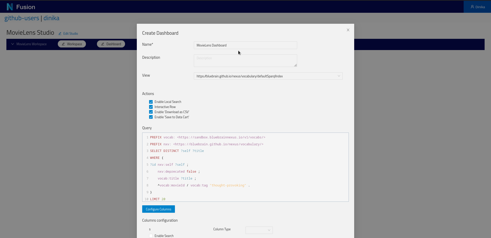
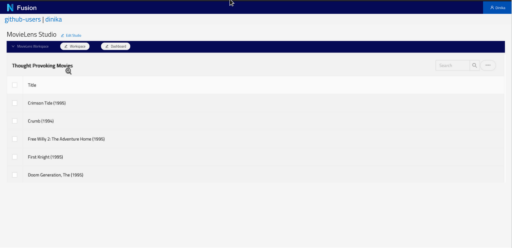

# Try Nexus

In this tutorial, you will use the core features of the Nexus ecosystem through our sandbox. This requires minimal technical knowledge but the ability to install a Python library and run a jupyter notebook.

In the @ref:[first step](try-nexus.md#configuring-your-project-in-nexus-fusion), you'll learn:

- to login into our @link:[Nexus Sandbox](https://sandbox.bluebrainnexus.io/){ open=new },
- create an organization and project,
- get your personal token.

In the @ref:[second step](try-nexus.md#working-with-data-in-nexus-forge), you'll learn:

- install Nexus Forge,
- configure a Knowledge Graph forge,
- transform data,
- load the transformed data into the project,
- search for data using a SPARQL query.

In the @ref:[third step](try-nexus.md#exploring-the-graph-in-nexus-fusion), you'll learn:

- create a Studio in Nexus Fusion,
- visualize and filter loaded data.

Finally, check our @ref:[Learn More](try-nexus.md#learn-more) section for more advanced tutorials based on the same datasets.

## Configuring your Project in Nexus Fusion

The @link:[Nexus Sandbox](https://sandbox.bluebrainnexus.io/){ open=new } is a deployment of Nexus Delta and Fusion 
publicly available to anybody.

Nexus Fusion is the web interface that you will use in order to interact with Nexus Delta (the web services that manages 
the underlying knowledge graph).

Please bear in mind that the data stored in the Nexus Sandbox is being purged at regular intervals. We recommend you do 
not store any sensitive data in this environment since it is accessible to many other users.

@@@ div { .center }

@@@

The first step is to login, by clicking in the upper right corner of the screen. You can login with your Github credentials.

@@@ div { .center }

@@@

Once logged in, you can navigate to the @ref:[Admin](../fusion/admin.md) interface through the left navigation sidebar, 
in order to create the correct organizations and projects for your data to live.

For this tutorial, you can use an existing organization called `nexustutorial` (by clicking on the so-named 
organization), or you can create your own organization (by clicking the `Create Organization` button at the top).

@@@ div { .center }

@@@

In an organization, you will find the list of existing projects, and you can create your own. Projects (as well as 
organizations) support permissions, which means that you cannot edit any organizations or projects.

For this tutorial, you will need to create your own project.

@@@ div { .center }

@@@

Choose a name and a description for your project. For more information about advanced settings, see 
@ref:[here](../fusion/admin.md#organizations-and-projects-indexes).

@@@ div { .center }

@@@

Once the project is created, you'll land on the project view. There is no resources at first. Wait for it.

@@@ div { .center }

@@@

You will quickly see that the project has finished indexing (top right corner).

@@@ div { .half .center }

@@@

Which means that the system has created default indices and storage for you.

@@@ div { .center }

@@@

We're all set! We now have a project to host our ressources and datasets. Let's move on to the second part of this turotial.

## Working with Data in Nexus Forge

We’ll load the @link:[MovieLens](http://files.grouplens.org/datasets/movielens/){ open=new } dataset into the created 
project within Nexus Delta using the python framework @link:[Nexus Forge](https://nexus-forge.readthedocs.io/en/latest/){ open=new }.

A @link:[jupyter](https://jupyter.org/){ open=new } notebook is available for this part of the tutorial and can be spawn 
easily using Google Colab, binder, or locally:

- @link:[Google Colab](https://colab.research.google.com/github/BlueBrain/nexus/blob/master/docs/src/main/paradox/docs/getting-started/notebooks/building_a_kg.ipynb){ open=new }
- @link:[binder](https://mybinder.org/v2/gh/BlueBrain/nexus/master?filepath=docs%2Fsrc%2Fmain%2Fparadox%2Fdocs%2Fgetting-started%2Fnotebooks%2Fbuilding_a_kg.ipynb){ open=new }
- @link:[Github](https://github.com/BlueBrain/nexus/blob/master/docs/src/main/paradox/docs/getting-started/notebooks/building_a_kg.ipynb){ open=new }

For local execution, Nexus Forge can be installed using these 
@link:[instructions](https://nexus-forge.readthedocs.io/en/latest/#installation){ open=new }. Make sure that the jupyter 
notebook|lab is launched in the same virtual environment where Nexus Forge is installed. Alternatively, set up a 
specialized @link:[kernel](https://ipython.readthedocs.io/en/stable/install/kernel_install.html){ open=new }.

If you want to try some other examples of Nexus Forge, you can use these 
@link:[notebooks](https://mybinder.org/v2/gh/BlueBrain/nexus-forge/master?filepath=examples%2Fnotebooks%2Fgetting-started){ open=new }.

The next step is to use this query to create a Studio view in Nexus Fusion.

## Exploring the Graph in Nexus Fusion

Login the Sandbox and navigate your your previously created project.

Click on the `Manage Studios for this project` button on the top right corner of the project.

@@@ div { .center }

@@@

Studios are listed here. Click on `Create Studio`.

@@@ div { .center }

@@@

Give a name to your Studio and click `Save`.

@@@ div { .center }

@@@

Here's your empty Studio. Click the button to `Add Workspace`.

@@@ div { .center }

@@@

Give a name to your Workspace and click `Save`.

@@@ div { .center }

@@@

You now have one Workspace configured. Click the button to `Add Dashboard`.

@@@ div { .center }

@@@

In order to query the graph in a Studio Dashboard, a small modification of the previous query is necessary. You can 
find more information about it in the @ref:[Studio docs](../fusion/studio.md#sparql-query-requirements).

```sparql
PREFIX vocab: <https://sandbox.bluebrainnexus.io/v1/vocabs/>
PREFIX nxv: <https://bluebrain.github.io/nexus/vocabulary/>
SELECT DISTINCT ?self ?title
WHERE {
?id nxv:self ?self ;
    nxv:deprecated false ;
    vocab:title ?title ;
    ^vocab:movieId / vocab:tag "thought-provoking" .
}
LIMIT 20
```

Choose a name for your Dashboard, copy the query. Click `Save`.

@@@ div { .center }

@@@

And there are the results:

@@@ div { .center }

@@@

Good job! You just finished the introductory course to Nexus using our Sandbox. You can now install Nexus locally or 
continue with the tutorials below.

## Learn More

### Querying knowledge graph using SPARQL

This tutorial introduces the basics of SPARQL, a query language for querying RDF based knowledge graph. It also 
demonstrates how to query a Nexus SparqlView.

You'll build queries to explore and navigate a knowledge graph using SPARQL and Nexus.

You'll learn:

- the basics of the SPARQL query language,
- how to connect to and query a SparqlView in Nexus.

You'll need Python 3.5 or higher with support for Jupyter notebook.

This tutorial code is available on:

- @link:[Github](https://github.com/BlueBrain/nexus/blob/master/docs/src/main/paradox/docs/getting-started/notebooks/Query_Sparql_View.ipynb){ open=new }
- @link:[Google Colab](https://colab.research.google.com/github/BlueBrain/nexus/blob/master/docs/src/main/paradox/docs/getting-started/notebooks/Query_Sparql_View.ipynb){ open=new }

### Querying a Knowledge Graph using Elasticsearch

The goal of this notebook is to learn how to connect to an Elasticsearch view and run queries against it.

It is not a tutorial about the Elasticsearch DSL language for which many well written 
@link:[learning resources are available](https://www.elastic.co/guide/en/elasticsearch/reference/current/query-dsl.html){ open=new }.

You'll build a simple python client to connect to a Nexus ElasticSearchView and query a knowledge graph using Elasticsearch DSL.

You'll learn how to connect to and query a ElasticSearchView in Nexus.

You'll need Python 3.5 or higher with support for Jupyter notebook.

The tutorial code is available on:

- @link:[Github](https://github.com/BlueBrain/nexus/blob/master/docs/src/main/paradox/docs/getting-started/notebooks/Querying_ElasticSearchView.ipynb){ open=new }
- @link:[Google Colab](https://colab.research.google.com/github/BlueBrain/nexus/blob/master/docs/src/main/paradox/docs/getting-started/notebooks/Querying_ElasticSearchView.ipynb){ open=new }

### Linking data on the web

In this tutorial, we demonstrate how to consume structured data published on the web according to the Linked data 
principles to extend and enrich a knowledge graph.

You'll build a simple pipeline to query entities managed within Blue Brain Nexus, connect them with entities available 
on the web as structured data and extend and enrich their metadata.

You'll learn:

- an understanding of linked data principles,
- how to query data stored in a Nexus SparqlView,
- how to query structured data on the web,
- how to extend the metadata of entities managed within Blue Brain Nexus with external structured data on the web: we 
target @link:[Wikidata](https://www.wikidata.org/wiki/Wikidata:Main_Page){ open=new } as an example,
- how to update entities within Blue Brain Nexus using the @link:[SDK](https://github.com/BlueBrain/nexus-python-sdk){ open=new } 
and enrich their metadata.

You'll need Python 3.5 or higher with support for Jupyter notebook.

This tutorial code is available on:

- @link:[Github](https://github.com/BlueBrain/nexus/blob/master/docs/src/main/paradox/docs/getting-started/notebooks/Linking%20data%20on%20the%20web.ipynb){ open=new }
- @link:[Google Colab](https://colab.research.google.com/github/BlueBrain/nexus/blob/master/docs/src/main/paradox/docs/getting-started/notebooks/Linking%20data%20on%20the%20web.ipynb){ open=new }
