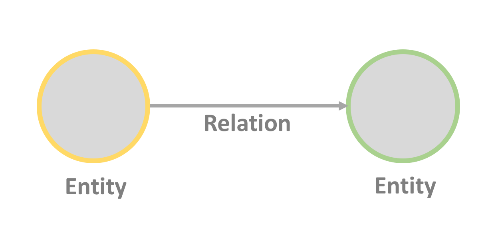

# Understanding Knowledge Graphs

This section will help you understand knowledge graphs and related standards and technologies.

## What is a Knowledge Graph?

A knowledge graph is a [graph](https://en.wikipedia.org/wiki/Graph_%28abstract_data_type%29) structure that links entities
together. The links between the entities contain knowledge, based on how the entities connect to each other. For example,
an apple can be connected to a tree (to show that it grows on trees) or in another case connected to a pie recipe
(to show that it is part of a recipe). It is a kind of formalized knowledge that enables programmatical reasoning
about concepts in the world around us.

In [this introduction to knowledge graphs](https://doi.org/10.1007/978-3-030-37439-6_1) the authors conclude that there is
no clear definition of what a knowledge graph is. The term itself was coined in 2012 by Google
as they [introduced their Knowledge Graph](https://googleblog.blogspot.com/2012/05/introducing-knowledge-graph-things-not.html) as a mean of finding more relevant related search results by linking connected
data on the web. As an idea, knowledge graphs are similar to [semantic networks](https://en.wikipedia.org/wiki/Semantic_network) which date back to the 60's and 70's.
The difference mainly lies in the size of the network, with knowledge graphs being larger. Knowledge graphs are also often
generated in a rather manual way (data ingestion, data cleaning) instead of being generated and governed by a set of strict logical rules.

For a further introduction to knowledge graphs the ["What is a knowledge graph"](https://www.youtube.com/watch?v=bvwjG-3qAmY) video from the [CS520 Stanford course](https://web.stanford.edu/class/cs520/) is a good resource.

### The graph structure
A knowledge graph consists of entities (nodes) that are connected to each other with relations (edges).

The entity is an object with properties that describe it. For example, a person, a company, an event, a thing... These properties
can be called the entity's "metadata".

The relation describes how entities are connected. For example, being member of, visiting a place, belonging to a country...


It's worth noting that having this kind of graph data structure makes it easy to merge new data into an existing graph by connecting new entities and new relations.

### Describing knowledge in a graph

After deciding what concept or idea that we wish to model in a knowledge graph, we need to collect the metadata that describes our entities.
In order to make our data interoperable with other data and to allow us to import data from existing sources we should use a shared language when describing entities and relations.
This is achieved using an [ontology](https://en.wikipedia.org/wiki/Ontology_%28information_science%29).

The ontology is a kind of dictionary containing types that can be used to describe entities. The metadata is created by picking a type from the ontology
that matches what you wish to describe and defining the properties of the chosen type. E.g. a person can be described by a [Person](https://schema.org/Person) type.
The name of the person can be encoded in a [givenName](https://schema.org/givenName) property. This results in a set of data that can be processed both by humans and computers (as it is structured).

For example, in the image below, you can see that the entity **Toy Story** is an **Animated movie** (also known as the **type** of the entity)
and it has a property **Release date** for this the value is **March 29th, 1995**.

 

### Inferring new data from existing relationships

Since the entities are encoded using well-defined ontologies it allows us to draw conclusions based on the data we have and create new inferred data.
This is done by giving the knowledge graph to an [inference engine](https://en.wikipedia.org/wiki/Inference_engine) that can apply a
set of logical rules to the data to derive new information. For example, if we have a knowledge graph containing persons and their
birth year we could create an inference engine with rules that determine whether a person is a child or a retired person.
 
In the second example below, we have **Toy Story**, it has characters (using the relation called **Character**) and we have asserted the cast of characters.
Having defined this, we can now define a rule that instructs the inference engine to create
new relations **Voice Cast** whenever we find the **Cast** of a **Character**. This enables us to query the graph
and directly get **Toy Story**'s voices cast without having to navigate through its cast first.

 

In reality inferring knowledge is a complex topic. [This video lecure](https://www.youtube.com/watch?v=AUtk6NBqEFY) shows some
real-world examples of algorithms and rules for inference engines. E.g. [reasoning about a persons creditworthiness based on what
their home address is](https://youtu.be/AUtk6NBqEFY?t=3867) or trying to spot fake papers that have been submitted to a journal.

### Growing a knowledge graph

A graph is a flexible data structure, and an ontology can evolve as new data comes in. As a result, data can 
continually be added to help serve new use cases.

 The illustration below shows how the initial graph representing **Toy Story** can be augmented to capture many other related
domains such as:

 - Toy Story's similar movies (e.g. Cars)
 - Cities and associations related to motion picture production (e.g. Motion Picture Association of America)
 - Places and people connected to animation movies (e.g. Steve Jobs)

 

## Understanding RDF, JSON-LD, and other standards

### RDF
How do you encode knowledge graphs in a way that is interoperable with other applications and can be integrated with
other data sources? You use some kind of a common formalism, a language, to describe your entities and relationships.
For knowledge graphs this format is RDF. [RDF (Resource Description Framework)](https://en.wikipedia.org/wiki/RDF) is
a data format where every piece of knowledge can be broken down into a structure (subject, predicate and object) called triple.


RDF-formatted data can be queried using a query language such as [SPARQL](https://en.wikipedia.org/wiki/SPARQL). This
allows us to create applications that can process knowledge graphs, for example, to infer new data or get answers to
questions we may have for the data that is stored in the knowledge graph.

### JSON-LD

RDF is however only a part of what we need in order to encode a graph. We also need an implementation, a
["concrete RDF syntax"](https://www.w3.org/TR/rdf11-concepts/#dfn-concrete-rdf-syntax) that shows how to write down an
RDF-formatted graph in a format that can be shared e.g. between applications. One syntax that can be used is [JSON-LD](https://json-ld.org/). It stands for JSON for Linking Data.

We start by looking at a simple [JSON](https://en.wikipedia.org/wiki/JSON) example:

```json
[
  	 {
  		"name":"python",
  		"loadedFrom":"java"
  	 },
  	{
  		"name":"java",
  		"testedFrom":"java"
  	 }

  ]
```

After reading the above JSON we can ask ourselves what this data describes? Is it related to the [Python](https://en.wikipedia.org/wiki/Python_%28programming_language%28) and [Java](https://en.wikipedia.org/wiki/Java_%28programming_language%29) programming languages?
Or perhaps a specefic [kind of snake](https://en.wikipedia.org/wiki/Pythonidae)? Or coffee from the [Indonesian island of Java](https://en.wikipedia.org/wiki/Java)?
There is clearly a lack of context resulting in an ambiguity. JSON-LD allows to solve the ambiguity problem by enabling a semantic-preserving data encoding.
This is achieved by adding an **@context** object where every key is associated with an identifier.

If we extend the JSON example with the payload below, then both a machine and a human can look up the context to find out which Java this JSON data concerns.

```json
  [
  	 {
  	    "@context":"https://json-ld.org/contexts/programminglanguage.jsonld",
  		"name":"python",
  		"loadedFrom":"java"
  	 },
  	{
  	    "@context":"https://json-ld.org/contexts/programminglanguage.jsonld",
  		"name":"java",
  		"testedFrom":"java"
  	 }

  ] 
  
```

In the [JSON-LD playground](https://json-ld.org/playground/) you can try examples of JSON-LD.

### Using Schema.org as a common vocabulary
Having defined a grammar (RDF) and a concrete syntax (JSON-LD) to encode knowledge graphs, there is one more
thing to add in order to achieve interoperability with other knowledge graphs. We need a common
vocabulary that defines which properties an entity should have - an ontology.

One such ontology that is commonly used is the [Schema.org](https://schema.org/) vocabulary. You can look
up how different concepts are described by searching for them on the schema.org web page. For example,
a [video game entity](https://schema.org/VideoGame) is described by properties such as `cheatCode` or `gamePlatform`.

### Reasoning with OWL
If you wish to reason about knowledge that is stored in a knowledge graph it is useful to have a language that
can express properties and relations for the entities in the ontology (the dictionary) that your knowledge graph consists of.
[OWL (Web Ontology Language)](https://www.w3.org/TR/owl2-primer/#What_is_OWL_2.3F) is such a language.
It is built on top of RDF (which can be seen as the grammar for OWL) and it is different from JSON-LD, since JSON-LD
merely describes the syntax we use to encode our knowledge graph.

With OWL you can [form axioms and expressions for the entities](https://www.w3.org/TR/owl2-primer/#Modeling_Knowledge:_Basic_Notions)
in your ontology. For example, expressing that a woman is a subclass of a person:
```
SubClassOf( :Woman :Person )
```

### References and resources:
The sections below contain references and resources that can be used to learn more about knowledge graphs.

1. [Introduction: What Is a Knowledge Graph?](https://doi.org/10.1007/978-3-030-37439-6_1) in Knowledge Graphs: Methodology, Tools and Selected Use Cases  
Author: Fensel, Dieter et al  
Published: Springer International Publishing, 2020  
DOI: 10.1007/978-3-030-37439-6_1

1. [What are some knowledge graph inference algorithms?](https://www.youtube.com/watch?v=AUtk6NBqEFY)  
Published: 23.04.2020, Youtube.com

1. [What is the role of knowledge graphs in machine learning? - Challenges for explainable AI](https://youtu.be/VRe5yOjmuEY?t=3669)  
Published: 20.05.2020, Youtube.com

1. [Programming the Semantic Web](https://www.oreilly.com/library/view/programming-the-semantic/9780596802141/)  
Author: Segaran, Toby et al   
Published: O’Reilly Media, Inc., 2009  
ISBN: 9780596153816

1. [What is a knowledge graph?](https://www.youtube.com/watch?v=bvwjG-3qAmY)  
Published: 23.04.2020, Youtube.com

1. [RDF 1.1 primer](https://www.w3.org/TR/rdf11-primer/)   
   Author: W3C Working Group  
   Editors: Schreiber, G., Raimond, Y  
   Published: 24.06.2014
   
1. [JSON-LD 1.1](https://www.w3.org/TR/json-ld11/)  
   Editors: Kellogg G., Champin P-A., Longley D.  
   Published: 16.07.2020
   
1. [JSON LD - curated resources](https://json-ld.org/)  
   This is probably one of the best resources to start with if you are interested in JSON-LD.

1. [OWL 2 Web Ontology Language
    Document Overview (Second Edition)](https://www.w3.org/TR/owl2-overview/)   
   Author: W3C Working Group  
   Published: 11.12.2012
