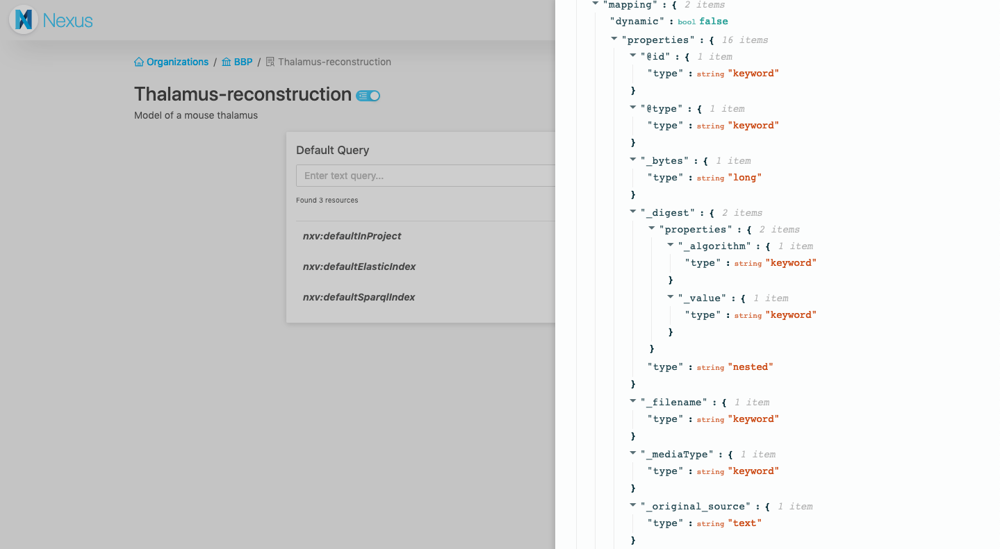

# v1.0 Release Notes

> This is the first major release of Blue Brain Nexus after almost two years of development.

Also referred to as "_Nexus V1_", this initial release is our first big milestone in our quest to build a Knowledge
Graph platform uniquely combining flexible graph database, powerful search engine and scalable data store to enable:

*   Easy unification and integration of fragmented and disparate data from heterogeneous domains to break data and
    metadata silos
*   Better data governance with the ability to specify and enforce organization’s best practices for data collection,
    storage and description through high quality metadata
*   Data lineage and provenance recording and description
*   FAIR (Findable, Accessible, Interoperable, Re-usable) data and metadata management

We've been running this software in production for more than a year getting good feedback on its design and we are
confident that the current API meets our current and longer term goals.

This release represents a commitment to backwards compatibility in all future releases of the `v1.y.z` series.

@@@ note { title=Versioning }

Nexus artifacts are versioned using @link:[semantic versioning]{ open=new } and while services and web applications that 
make up Nexus are versioned independently to address specific improvements or bugfixes, their versions are synchronized 
across minor releases. This means, for example, that services and applications are compatible with each other if their 
_major_ and _minor_ numbers match regardless of the value of the _patch_ numbers.

@@@

The behaviour of the system is described across the documentation, but here are some notable changes from the previous
`v0.y.z` series.

### Functionality & Behaviour

#### Nexus web interface



Previously, the web interface was dubbed _Nexus Explorer_, and could only be used to browse the data stored in your
Nexus instance. For the _Nexus V1_ release, we decided to build a new web application, called @link:[Nexus Web]{ open=new }, 
that also enables operational management, data management and search capabilities on the system. At this stage of development, 
this application is likely to be most useful to technical users who work on integrating their data into Nexus.

The web application is set to offer most of the features you can get with the raw API, as well as additional
conveniences for Nexus users.

At the time of the _Nexus V1_ release, you can use it to:

- Login into Nexus
- Browse and search organizations, projects and resources you have access to
- See the raw JSON-LD payload of a resources
- Make advanced ElasticSearch and SPARQL queries
- Create, edit and deprecate organizations and projects
- Make a project publicly accessible
- Create resources through an interactive JSON editor

#### Isolated data scopes

The `v0.y.z` series handled data within one single space and while it did provide some benefits with respect to the
ability to query the entire system, it also provided severe limitations with respect to data evolution, scalability
and future developments. We move on from this monolithic approach towards a multi scoped system, where data is
bucketed and managed independently in projects.

What we previously referred to as _domains_ are now called _projects_ and represent data and configuration boundaries
within the system (we decided to change the naming as we have found that the term "domain" was understood to imply
a certain data organization scheme centered around business or scientific domains; this was not intended).

Introducing these boundaries has opened the door to make several performance and functional improvements to the system
as follows:

*   data indexing can now be configured at the project level without impacting the overall system; we've introduced a
    new resource type _View_ that controls how and where the data is being indexed. They can be managed at runtime
    by the clients with "administrative" privileges enabling the development of applications specific to the area of
    interest. An example of that is the @link:[BBP Nexus Search]{ open=new } application designed specifically to 
    address the needs of the BlueBrain Project.
*   indexing processes are now created for each individual project increasing the indexing throughput and allowing
    the use of distinct indexing targets.
*   the uniqueness of a resource within the system was determined by the resource id which comprised of the
    "organization", "domain", "schema" name and version and the resource id. Introducing these data boundaries allowed
    us to relax this constraint and allow multiple resources to share the same id if they are scoped in different
    projects.
*   access control lists are now restricted to either root (`/`), organization (`/{org}`) or project
    (`/{org}/{project}`) removing the need to index these definitions along with the data.

#### Client defined identifiers

The `v0.y.z` series was very opinionated on how resource ids are defined and prohibited client provided identifiers. The
choice at the time was that a resource id needs to be resolvable (the resource id needed to match the url to access it).
This strong constraint tied the resource ids to the Nexus deployment where they were managed. While this was probably
fine for most data within the system, it was nearly impossible to manage data from external sources that came with its
own identification scheme (e.g. ontologies).

The decision was made to remove this constraint and allow clients to specify their own identifiers. In order to
maintain the same API simplicity with respect to accessing resources we came up with a aliasing and curie scheme
configurable at the project level (_apiMappings_) that handles bidirectional compaction and expansion of resource
identifiers.

A simple http proxying configuration with URL rewriting deployed in front of the Nexus API allows resources to continue
to be resolvable.

#### Resolution mechanisms for shared resources

During the past year of production use of Nexus we have noticed that users tend to develop schemas and contexts as
reusable components. An example of that is the @link:[Neuroshapes]{ open=new } initiative, a community effort for a 
shared vocabulary and collection of constraints for neuroscience.

The use of schemas and contexts in the `v0.y.z` series applied a restriction on the locality of constrained resources,
specifically resources could only be created in the same _domain_ with schemas.

In the new iteration we've introduced a configurable resolution mechanism that allows users to make use of schemas
and contexts that reside in other projects. The resources that control this behaviour are called _Resolvers_ and they
behave like dependency management systems in programming language ecosystems.

_Resolvers_  can now be created and configured to look up schemas and contexts in arbitrary locations, scoped within
projects. The resolution mechanism takes into account all the resolvers defined in a project using the priorities of
each resolver and attempts to resolve the referenced resource based on its `@id` value.
Current supported resolvers are:

*   _InProject_: a default project resource created along with a project that looks up referenced resources in the same
    project.
*   _CrossProject_: a type of resolver that can be created by clients to look up referenced resources in projects other
    than the current one.

Future developments will include additional resolver types that are capable of resolving resources in other Nexus
deployments or shared repositories (e.g.: a git repository).

Schema imports through the `owl:imports` clause works recursively as before, but it applies the resolution mechanism at
each iteration. Context references work recursively as before applying the resolution mechanism at each iteration.

_Note:_ Contexts are no longer handled differently, as special kind of resources. Any resource id can be used as a
context reference; the system will resolve the referenced resource and apply _only_ the `@context` value from its
representation to the resource that references it.

#### Improved handling of binary resources

The `v0.y.z` series handled binary resources as sub-resources, called _attachments_, following the model pioneered by
@link:[CouchDB]{ open=new }. While it provided a guarantee that every binary resource is properly described with 
metadata, the model did not work well in the following situations:

*   uploading binaries for later organization: the parent resource required creation before a binary could be attached
    to it, which in the cases where users were just interested in storing binaries in Nexus it required two API calls
    instead of one.
*   conflicting vocabulary definitions: a lot of the data modeling effort relied on the Nexus metadata for the uploaded
    binaries which forced the use of a certain vocabulary and metadata structure in Nexus

This model of handling binaries has been superseded by full class support for binaries through _files_, a new kind of
resource managed just like the other types of resources within the system. _Files_ have their own lifecycle and can
be independently updated.
Description of _files_, for example in the case of _datasets_, can now be done external to the file resource within a
separate resource. This model allows for many-to-many relationships between files and other resources.

#### New mechanism for stable resource references

The `v0.y.z` series was quite opinionated on the use of stable references ensuring the structural and semantic
immutability of a resource revision. Schemas and Contexts had to be published before they could be used and once
published their lifecycle would finish, preventing further updates.

This behaviour was replaced by giving the client the control on the immutability guarantees through the use of revisions
and tags. The schema versions are no longer present in the API and the mechanism for unpacking schema references are
aware of possible tag and revision references provided as query parameters. A _tag_ is a new type of sub-resource that
represents a pointer to a resource revision.

Assuming the following entry in the project `apiMappings`:
```
{
  "prefix": "persons",
  "namespace": "http://nexus.example.com/schemas/person?tag=v1.0.0"
}
```
... would ensure that resources are constrained with a stable version of a schema:
```
curl -XPOST http://nexus.example.com/resources/{org}/{proj}/persons -d '{}'
```

Additionally, the use of curies is also available, leaving the door open to providing schema versions per resource.
Considering the following entry in the project `apiMappings`:
```
{
  "prefix": "persons",
  "namespace": "http://nexus.example.com/schemas/person?tag="
}
```
... resources can be constrained with a dynamic version of a schema provided at the time of resource creation:
```
curl -XPOST http://nexus.example.com/resources/{org}/{proj}/persons:v1.0.0 -d '{}'
```

Revision query params can be used in the exact same manner as tag params.
When omitting `rev` or `tag` query params when referring to schema, it is implied that the latest version should be used
every time that schema is resolved.

Context references follow the very same behaviour. Context `iri` values can be augmented with a `tag` or `rev` query
parameter to point to a specific immutable reference of the resource.

_Note_: the behaviour depends on the new resource reference resolution process; a change in the resolver resources (a
different resolution process configuration) can not provide an immutability guarantee of the references.

#### Client configurable indexing process

As mentioned previously, the indexing processes are now applied at the level of each project and can be customized
by the client. Each index process is represented by a newly introduced resource _View_ which has the following
classification:

*   _ElasticSearchView_: the process replays the project event log, filters out undesired resources based on
    configuration, applies minimal data transformation and updates an ElasticSearch index.
*   _AggregateElasticSearchView_: this view does not directly manage an indexing process, but rather represents a
    collection of referenced _ElasticSearchView_s that would be proxied (queried at the same time) when querying this
    view.
*   _SparqlView_: the process replays the project event log applies minimal data transformation and updates an RDF
    store (currently BlazeGraph).

A default _ElasticSearchView_ and a default _SparqlView_ are automatically created along with a project. The default
_ElasticSearchView_ is used by Nexus internally to power resource listing.

Since access control lists are now limited to nesting up to the level of a project, these views do not require indexing
the acl configuration and can be proxied by the system supporting their native APIs.

_ElasticSearchView_s expose a `/_search` sub-resource that represents the native API for interacting with ElasticSearch.
Client HTTP requests are checked for authentication and authorization and then forwarded to their respective backends.
In the case of an _AggregateElasticSearchView_ the requests executed on all the referenced indices.

_SparqlView_s expose a `/sparql` sub-resource that represents the native API for interacting with the SPARQL endpoint of
the RDF store. Client HTTP requests are checked for authentication and authorization and then forwarded to the
respective backend.

The previously supported query DSL has been dropped in favour of the direct interaction with the indices via their
native APIs. The attempt to provide a general query interface on top of both indices was very ambitious but
production use has proven it unsatisfactory.
The change gives clients a lot more power in terms of function, flexibility, expressiveness and query optimization. It
also opens the door to support additional index backends without having to reconcile them with the query DSL.

#### Client provided information vs Nexus metadata and vocabulary

Since it was often unclear which information was user provided and which was generated by the system as new rule has
been introduced such that:

*   all user provided information predicates are kept unchanged
*   all Nexus metadata is now presented with a leading `_`, example: `"_deprecated": true` or `"_rev": 4"`.
*   the Nexus metadata vocabulary is now namespaced to `https://bluebrain.github.io/nexus/vocabulary/`

### Technical Notes

#### IAM service updates

IAM has been redesigned such that it no longer attempts to proxy calls to the configured OIDC provider. Instead, it
introduces a new resource type (_Realm_) that represent runtime configuration for the accepted OIDC providers. Based on
the well known configuration document of the realm it finds and extracts some of the important provider addresses (e.g.
the authorization and token endpoints), the signature keys and the issuer description.
This allows for token identification and validation without the need to contact the provider and there's no need to
mediate the interaction with the provider. We therefore dropped the iam integration services as they were not needed
anymore.

Now it also expects that `group` information is present in the _access token_ as a claim, either as an array or a comma
separated list of group values.

The service also introduces another resource (_permissions_) as a singleton resource that manages (or enumerates) the
permissions that are allowed to be set as values in the ACL definitions.

All IAM resources are now protected from _blind writes_ (also known as _lost update problem_) by means of the `rev`
query parameter, similar to the other services.

#### Introduced a new service: Admin

A new service has been introduced, named _Admin_ that manages the scoping (and its configuration) within the Nexus
ecosystem. Organizations and Projects (previously named _domains_) are now managed by this service, allowing other
future services to take advantage of the functionality provided without a direct dependency on the KG service. The
service dependency tree is now as follows:

```
  +-----------+         +-----------+         +-----------+
  |           |         |           |         |           |
  |    IAM    <---------+   Admin   <---------+    KG     |
  |           |         |           |         |           |
  +-----+-----+         +-----------+         +-+---------+
        ^                                       |
        |                                       |
        +---------------------------------------+
```

Access control lists are now restricted to either root (`/`), organization (`/{org}`) or project (`/{org}/{project}`)
removing the need to index these definitions along with the data in their respective service boundaries.

#### Introduced Javascript SDK for Nexus


We released a @link:[Javascript SDK for Nexus]{ open=new } that helps integrating with the Blue Brain Nexus API from 
Javascript and Typescript code. It aims at giving easy access to all the features offered by the API. It also offers 
Typescript declarations.

This is the library of top of which the Nexus Web interface is built, but it remains framework-agnostic.

#### Introduced Python SDK for Nexus

We released a @link:[Python SDK for Nexus]{ open=new } that helps integrating with the Blue Brain Nexus API from Python.
It aims at giving easy access to all the features offered by the API.

#### Introduced a Command Line Interface (CLI) for Nexus

We released a @link:[Nexus CLI]{ open=new } that helps interaction with Nexus from the command line.
This tool is built on top of the @link:[Python SDK for Nexus]{ open=new }.
It aims at giving easy access to all the features offered by the API and facilitate your data management with Nexus.
The use of the CLI is extensively demonstrated in our [Nexus Tutorial].

#### Migration from v0.y.z series

The semantics of the API and managed resources in between the `v0.y.z` and `v1.y.z` series has changed considerably
making an automatic migration almost impossible without understanding the structure of the data stored in Nexus. We
recommend building a tailored migration script. Please find us on @link:[Gitter]{ open=new } for help and advice on how 
to do this effectively depending on your use of Nexus.

#### Removed of dependency on Kafka

Services have been updated to expose their event logs or subsets via HTTP through @link:[Server Sent Events]{ open=new }, 
removing the need to use Kafka as means of service to service communication. It uses the same authentication and 
authorization mechanism as with the rest of the API, thus ensuring that the information exchanged in guarded by the ACLs 
defined.

The change reduces the additional operational burden of maintaining a Kafka cluster and also opens up the system for
extension as the event logs can be consumed by third party applications in an efficient manner without the need of
direct access to the message broker.

#### In memory indices

Versions `v0.y.z` of _iam_ and later on _admin_ services depended on ElasticSearch and BlazeGraph to maintain indices of
the resources managed. Since these resources easily fit in memory on a single node, the dependency on these external
systems has been removed in favour of in memory indices to provide a consistent view on the data and increase the
general availability. In between nodes, when services are deployed as a cluster, the indices are replicated by using
@link:[CRDTs]{ open=new } which are natively supported by @link:[Akka Distributed Data]{ open=new }.

[semantic versioning]: https://semver.org/
[Server Sent Events]: https://www.w3.org/TR/eventsource/
[CRDTs]: https://en.wikipedia.org/wiki/Conflict-free_replicated_data_type
[Akka Distributed Data]: https://doc.akka.io/docs/akka/2.5/distributed-data.html
[Gitter]: https://gitter.im/BlueBrain/nexus
[BBP Nexus Search]: https://github.com/bluebrain/nexus-search-webapp
[Nexus Web]: https://github.com/bluebrain/nexus-web
[Javascript SDK for Nexus]: https://github.com/BlueBrain/nexus-js
[Python SDK for Nexus]: https://github.com/BlueBrain/nexus-python-sdk
[Nexus CLI]: https://github.com/BlueBrain/nexus-cli
[Neuroshapes]: https://incf.github.io/neuroshapes/
[CouchDB]: https://docs.couchdb.org/en/stable/api/document/common.html#attachments
