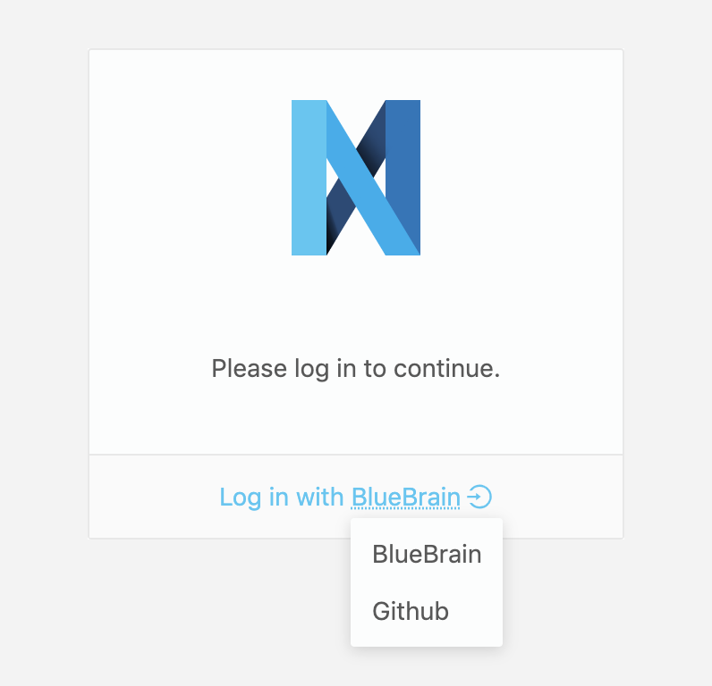
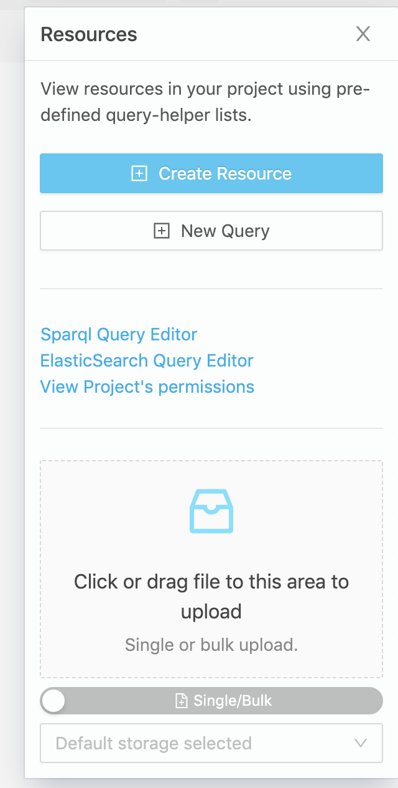
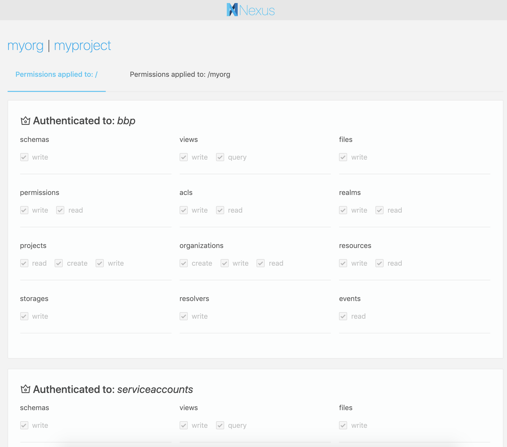
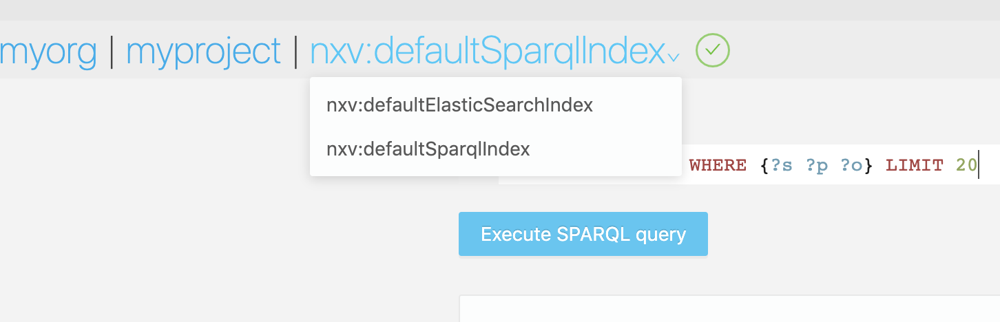

# v1.1 Release Notes

> This is an incremental software release that adds several improvements across the board. The API is backwards
compatible to v1.0 but the cassandra store and indices require a migration due to changes in the underlying event model
and resource representation. If you are updating from v1.0 please follow the
@ref:[migration instructions](v1.0-to-v1.1-migration.md).

## Highlights

The goal of this release is to expose the event log through an API and to provide a configurable storage where to save files.
These two key features enables users to 

1. Build custom applications based on Nexus event log .
2. Save files in different storage backends (S3, POSIX compatible, local File System).

## Service event logs

Services now expose new API endpoints to replay their global event log or the virtual event logs specific to certain
resource types or scope (organization, project). This new API allows building applications that integrate with Nexus
to provide custom functionality for the data stored in the system. It allows applications to listen to events as they
are emitted and react accordingly.

An example application would be a custom index for data within a project where as new resources or updates are recorded
in Nexus, the application is notified and updates the appropriate index.

The implementation follows the @link:[Server Sent Events](https://www.w3.org/TR/eventsource/){ open=new } specification 
and gives clients the responsibility of maintaining a cursor while replaying an event log. The event log is exposed 
over HTTP in a JSON-LD event representation.

The new endpoints require proof of identity by passing within the `Authorization` header a ''Bearer'' token. An
`Anonymous` identity is assumed if the client does not pass a token.

Example:

```bash
curl -s -H "Authorization: Bearer $TOKEN" "http://localhost/v1/resources/myorg/myproj/events"

data:{"@context":"https://bluebrain.github.io/nexus/contexts/resource.json","@type":"Updated","_resourceId":"http://localhost/v1/resources/myorg/myproj/_/7fb43a6a-33f2-4106-8cb3-531f2d67c1e3","_source":{"@context":{"@base":"http://localhost/v1/resources/myorg/myproj/_/","@vocab":"http://schema.org/"},"@id":"7fb43a6a-33f2-4106-8cb3-531f2d67c1e3","@type":"Person","age":34,"name":"John Doe"},"_types":["http://schema.org/Person"],"_projectUuid":"fadc3e6c-fca0-45d8-b65c-a984a012c689","_organizationUuid":"d363ee88-5426-420a-8078-f8e9d9652fe9","_rev":2,"_instant":"2019-07-24T10:58:03.830114Z","_subject":"http://localhost/v1/anonymous"}
event:Updated
id:e8fac660-ae01-11e9-b31a-71e2858070d7

data:

^C
```

### Full service event logs

Designed primarily for applications that aim to be extensions to Nexus, the following service specific endpoints have
been added. It is assumed that these endpoints would not be consumed by browsers or command line clients, but rather
stateful applications that run within the same network. If that not the case, the deployment requires a proxy that does
URL rewriting to avoid the path collision.

- `http(s)://{kg_service_address}/v1/events`; exposes the entire event log of the KG service; requires `events/read`
  permission on `/`.
- `http(s)://{admin_service_address}/v1/events`; exposes the entire event log of the Admin service; requires
  `events/read` permission on `/`.
- `http(s)://{iam_service_address}/v1/events`; exposes the entire event log of the KG service; requires `events/read`
  permission on `/`.
- `http(s)://{nexus_address}/v1/events`; exposes the entire event log of the KG service; requires `events/read`
  permission on `/`.

### Resource specific event logs

Designed primarily for applications that target a single resource type or a specific scope, the following endpoints have
been added:

- `http(s)://{nexus_address}/v1/permissions/events`; exposes the event log for permissions; requires `permissions/read`
  permission on `/`.
- `http(s)://{nexus_address}/v1/realms/events`; exposes the event log for realms; requires `realms/read`
  permission on `/`.
- `http(s)://{nexus_address}/v1/acls/events`; exposes the event log for access control lists; requires `acls/read`
  permission on `/`.
- `http(s)://{nexus_address}/v1/orgs/events`; exposes the event log for organizations; requires `organizations/read`
  permission on `/`.
- `http(s)://{nexus_address}/v1/projects/events`; exposes the event log for projects; requires `projects/read`
  permission on `/`.
- `http(s)://{nexus_address}/v1/resources/{org}/events`; exposes the event log for all resources in the selected
  organization; requires `resources/read` permission on `/{org}`.
- `http(s)://{nexus_address}/v1/resources/{org}/{project}/events`; exposes the event log for all resources in the
  selected project; requires `resources/read` permission on `/{org}/{project}`.

## Configurable storage backends

Prior to this release the KG service used an implicit storage medium, a filesystem directory (either local or mounted)
accessible by the service. We've noticed, however, both internally and through questions raised by organizations using
Nexus that certain usecases require a higher degree of control on how data is stored and managed by the system.

An example of that is registering fairly large files into Nexus; performing a file upload just for the purpose of
recording the file location and checksum is not efficient, especially in cases where the existing files are present on
the same storage medium as the one mounted for use by Nexus.

To address this issue the new release introduces a new resource type specific to KG that controls the configuration of
storage mediums in Nexus on a project basis. The new resource type is called `Storage` with three sub-types:
`DiskStorage`, `RemoteDiskStorage`, `S3Storage` and uses the `/v1/storage` resource type specific endpoint.

Each project can be configured with multiple storage resources. Creating a storage resource requires `storages/write`
permission on the target project or inherited from the parent organization or `/`.

See the @ref:[storages API](../delta/api/current/kg-storages-api.md) for more information.

Additionally, a new file operation has been introduced that allows registering an existing file (already present on 
that storage) into the system just by specifying its `name`, `path`, `mediaType` and optionally a `storage` identifier 
to be used:

```bash
curl -s -XPUT "http://localhost/v1/files/myorg/myproj/myfile.png?storage=mystorage" -d \
'{
    "filename": "myfile.png",
    "path": "relative/path/to/myfile.png",
    "mediaType": "image/png"
}'
```

### DiskStorage

When new projects are being created, a new `DiskStorage` resource is automatically created for that project and set as
default, thus preserving the previous behaviour. Additionally new configuration options have been implemented:

- `default`: boolean, mandatory, whether the storage resource is the default one for a project
- `volume`: string, mandatory, the root filesystem directory where Nexus can store files for this project
- `maxFileSize`: int, optional, the maximum file size (in bytes) allowed for clients to upload
- `readPermission`: string, optional, defaults to `resources/read`, the permission required for downloading files from
  this storage medium
- `writePermission`: string, optional, defaults to `files/write`, the permission required for uploading files to
  this storage medium

Arbitrary permissions can be used as values for `readPermission` and `writePermission` as long as they are defined in
the global permission collection (`/v1/permissions`).

### RemoteDiskStorage

This storage type relies on a remote HTTP service that exposes basic file operations of an underlying POSIX file-system.
In terms of deployment configuration it allows separating the Nexus and the storage mediums in different networks and
possibly physical locations. An example usecase is running a distributed network storage (such as Ceph, Gluster, GPFS,
Lustre, ...) that can't or shouldn't be mounted directly on the system where Nexus runs.

The following configuration options are available for this storage type:

- `default`: boolean, mandatory, whether the storage resource is the default one for a project
- `endpoint`: string, optional, the base address of the remote disk storage integration service, defaults to the value
  set in the @link:[environment variables of KG](https://github.com/BlueBrain/nexus-kg/blob/master/src/main/resources/app.conf){ open=new }
- `credentials`: string, optional, the oauth2 bearer token to be used for authenticating to the remote disk storage
  integration service, defaults to the value set in the 
  @link:[environment variables of KG](https://github.com/BlueBrain/nexus-kg/blob/master/src/main/resources/app.conf){ open=new }
- `folder`: string, mandatory, the name of the folder where files are to be stored for this project
- `maxFileSize`: int, optional, the maximum file size (in bytes) allowed for clients to upload
- `readPermission`: string, optional, defaults to `resources/read`, the permission required for downloading files from
  this storage medium
- `writePermission`: string, optional, defaults to `files/write`, the permission required for uploading files to
  this storage medium

### S3Storage

This storage type (`S3Storage`) allows the use S3 compatible object storage as a backend.

The following configuration options are available for this storage type:

- `default`: boolean, mandatory, whether the storage resource is the default one for a project
- `bucket`: string, mandatory, the name of the s3 bucket where files are to be stored
- `endpoint`: string, optional, the s3 storage endpoint, defaulting to `s3.amazonaws.com`
- `accessKey`: string, optional, the access key to be used for authenticating to the service
- `secretKey`: string, optional, the secret key to be used for authenticating to the service,
  defaults to the value set in the
  @link:[environment variables of KG](https://github.com/BlueBrain/nexus-kg/blob/master/src/main/resources/app.conf){ open=new }
- `maxFileSize`: int, optional, the maximum file size (in bytes) allowed for clients to upload
- `readPermission`: string, optional, defaults to `resources/read`, the permission required for downloading files from
  this storage medium
- `writePermission`: string, optional, defaults to `files/write`, the permission required for uploading files to
  this storage medium

## Stable ElasticSearch views

Both `ElasticSearchView` and `AggregateElasticSearchView` have been promoted from _alpha_ to _stable_. Creation or
update no longer require the use of the `Alpha` type to be provided.

New configuration options have been introduced for `ElasticSearchView`: `resourceTypes` and `includeDeprecated`. These
options allow a finer grain filtering of the resources considered for indexing by the view.

## Configurable SparqlView

The `SparqlView` has been promoted from _alpha_ to _stable_. Creation or update no longer require the use of the
`Alpha` type to be provided.

Configuration options have been introduced such that it is consistent with the `ElasticSearchView`:

- `resourceSchemas`: array of ids, optional, defaults to empty, configures the view to consider for indexing only
  the resources constrained by any of the specified schemas; an empty array implies all resources.
- `resourceTypes`: array of ids, optional, defaults to empty, configures the view to consider for indexing only the
  the resources that have at least one of the specified types at the revision selected by the `tag` option; if a `tag`
  is not specified, the latest revision is assumed.
- `tag`: string, optional, selects only the resources that are tagged with the provided value; the tagged revision is
  considered for indexing.
- `includeMetadata`: boolean, optional, defaults to false, configures the view to index resources without injecting
  the resource metadata in the resource graph.
- `includeDeprecated`: boolean, optional, defaults to true, configures the view to include or exclude the deprecated
  resources.

## AggregateSparqlView

A new view type has been introduced (`AggregateSparqlView`), the dual of `AggregateElasticSearchView` that allows for
query time aggregation of results. The configuration is mostly identical to the `AggregateElasticSearchView` which is
merely a set of `SparqlView` references:

```json
{
  "@id": "{someid}",
  "@type": [ "View", "AggregateSparqlView"],
  "views": [
    {
        "project": "{project}",
        "viewId": "{viewId}"
    },
    ...
  ]
}
```

**Note:** this is not implemented in terms of SPARQL Federation but just simple result aggregation. The query sent to
this view is dispatched to all BlazeGraph namespaces and the results are aggregated without preserving the view order.
The implication is that triples in one namespace cannot be filtered using predicates from another namespace, 
furthermore, path traversals cannot be performed between the selected namespaces.

As with the `AggregateElasticSearchView` since the subject that creates an aggregate view may be different than the
subject that queries the view, before dispatching the query the target namespaces are filtered based on the permissions
of the caller for each individual view. This behaviour is completely transparent to the client.

## Index progress

Indexing in Nexus is asynchronous, meaning once a resource is created or modified the change is not immediately visible
in the respective indices (maintained by the views). The reason for this asynchrony is to break the coupling between
the stores (Cassandra, ElasticSearch, BlazeGraph) during a client request. This provides many benefits:

- reduces the latency of write operations
- requests succeed regardless of the availability of the secondary stores
- transient failures while indexing can be retried
- indices can be rebuilt at will (through project, view updates or by resetting the indexing progress and restarting
  the service)
- no synchronization is needed between view management and resource write operations

Unfortunately the index progress for each view was not made available to clients which meant users had no way of knowing
if their queries hit an index while it was rebuilt or stale.

All views have now been updated to expose a `statistics` sub-resource that provides information on the state of
indexing:

```bash
curl -s -H "Authorization: Bearer $TOKEN" "http://localhost/v1/views/myorg/myproj/nxv:defaultElasticSearchIndex/statistics" | jq
{
  "@context": "https://bluebrain.github.io/nexus/contexts/view.json",
  "delayInSeconds": 0,
  "discardedEvents": 0,
  "evaluatedEvents": 585721,
  "lastEventDateTime": "2019-08-06T08:47:20.958Z",
  "lastProcessedEventDateTime": "2019-08-06T08:47:20.545Z",
  "processedEvents": 585721,
  "remainingEvents": 1,
  "totalEvents": 585722
}
```

... where:

- `totalEvents`: total number of events in the project
- `processedEvents`: number of events that have been considered by the view
- `remainingEvents`: number of events that remain to be considered by the view
- `discardedEvents`: number of events that have been discarded (were not evaluated due to filters, e.g. did not match
  schema, tag or type defined in the view)
- `evaluatedEvents`: number of events that have been used to update an index
- `lastEventDateTime`: timestamp of the last event in the project
- `lastProcessedEventDateTime`: timestamp of the last event processed by the view
- `delayInSeconds`: number of seconds between the last processed event timestamp and the last known event timestamp

Additionally the service maintains and exposes counters and gauges for monitoring with Prometheus such that data
ingestion and indexing velocity and global event counts can be monitored.

For example, the query:

```
kg_indexer_gauge{project="myorg/myproj"}
```

... yields:

```
Element	Value
kg_indexer_gauge{instance="localhost:9095",job="kg",organization="myorg",project="myorg/myproj",type="elasticsearch",viewId="https://bluebrain.github.io/nexus/vocabulary/defaultElasticSearchIndex"}	585721
kg_indexer_gauge{instance="localhost:9095",job="kg",organization="myorg",project="myorg/myproj",type="eventCount"}	585722
kg_indexer_gauge{instance="localhost:9095",job="kg",organization="myorg",project="myorg/myproj",type="sparql",viewId="https://bluebrain.github.io/nexus/vocabulary/defaultSparqlIndex"}	585617
```

## Other API Improvements

The release contains numerous improvements to the API, the most significant being the following.

### Resource content negotiation

Added DOT, n-triples formats and compacted/expanded variants for json-ld. The selection of the format is done via the
`Accept` header value and in case of `application/ld+json` the query param `format` with `compacted` or `expanded`
values.

DOT representation is requested using the `text/vnd.graphviz` value for the `Accept` header:

```bash
curl -s -H "Authorization: Bearer $TOKEN" \
-H "Accept: text/vnd.graphviz" \
"http://localhost/v1/resources/myorg/myproj/_/7fb43a6a-33f2-4106-8cb3-531f2d67c1e3"

digraph {
  "http://localhost/v1/resources/myorg/myproj/_/7fb43a6a-33f2-4106-8cb3-531f2d67c1e3" -> "http://localhost/v1/resources/myorg/myproj/_/7fb43a6a-33f2-4106-8cb3-531f2d67c1e3/outgoing" [label = "https://bluebrain.github.io/nexus/vocabulary/outgoing"]
  "http://localhost/v1/resources/myorg/myproj/_/7fb43a6a-33f2-4106-8cb3-531f2d67c1e3" -> "2019-07-24T10:58:03.830114Z" [label = "https://bluebrain.github.io/nexus/vocabulary/updatedAt"]
  "http://localhost/v1/resources/myorg/myproj/_/7fb43a6a-33f2-4106-8cb3-531f2d67c1e3" -> "John Doe" [label = "http://schema.org/name"]
  "http://localhost/v1/resources/myorg/myproj/_/7fb43a6a-33f2-4106-8cb3-531f2d67c1e3" -> "http://localhost/v1/resources/myorg/myproj/_/7fb43a6a-33f2-4106-8cb3-531f2d67c1e3/incoming" [label = "https://bluebrain.github.io/nexus/vocabulary/incoming"]
  "http://localhost/v1/resources/myorg/myproj/_/7fb43a6a-33f2-4106-8cb3-531f2d67c1e3" -> "2019-02-05T12:52:05.510Z" [label = "https://bluebrain.github.io/nexus/vocabulary/createdAt"]
  "http://localhost/v1/resources/myorg/myproj/_/7fb43a6a-33f2-4106-8cb3-531f2d67c1e3" -> "http://localhost/v1/anonymous" [label = "https://bluebrain.github.io/nexus/vocabulary/updatedBy"]
  "http://localhost/v1/resources/myorg/myproj/_/7fb43a6a-33f2-4106-8cb3-531f2d67c1e3" -> "http://localhost/v1/resources/myorg/myproj/_/7fb43a6a-33f2-4106-8cb3-531f2d67c1e3" [label = "https://bluebrain.github.io/nexus/vocabulary/self"]
  "http://localhost/v1/resources/myorg/myproj/_/7fb43a6a-33f2-4106-8cb3-531f2d67c1e3" -> 34 [label = "http://schema.org/age"]
  "http://localhost/v1/resources/myorg/myproj/_/7fb43a6a-33f2-4106-8cb3-531f2d67c1e3" -> 2 [label = "https://bluebrain.github.io/nexus/vocabulary/rev"]
  "http://localhost/v1/resources/myorg/myproj/_/7fb43a6a-33f2-4106-8cb3-531f2d67c1e3" -> false [label = "https://bluebrain.github.io/nexus/vocabulary/deprecated"]
  "http://localhost/v1/resources/myorg/myproj/_/7fb43a6a-33f2-4106-8cb3-531f2d67c1e3" -> "https://bluebrain.github.io/nexus/schemas/unconstrained.json" [label = "https://bluebrain.github.io/nexus/vocabulary/constrainedBy"]
  "http://localhost/v1/resources/myorg/myproj/_/7fb43a6a-33f2-4106-8cb3-531f2d67c1e3" -> "http://localhost/v1/anonymous" [label = "https://bluebrain.github.io/nexus/vocabulary/createdBy"]
  "http://localhost/v1/resources/myorg/myproj/_/7fb43a6a-33f2-4106-8cb3-531f2d67c1e3" -> "http://localhost/v1/projects/myorg/myproj" [label = "https://bluebrain.github.io/nexus/vocabulary/project"]
  "http://localhost/v1/resources/myorg/myproj/_/7fb43a6a-33f2-4106-8cb3-531f2d67c1e3" -> "http://schema.org/Person" [label = "http://www.w3.org/1999/02/22-rdf-syntax-ns#type"]
}
```

N-triples representation is requested using the `application/n-triples` value for the `Accept` header:

```bash
curl -s -H "Authorization: Bearer $TOKEN" \
-H "Accept: application/n-triples" \
"http://localhost/v1/resources/myorg/myproj/_/7fb43a6a-33f2-4106-8cb3-531f2d67c1e3"

<http://localhost/v1/resources/myorg/myproj/_/7fb43a6a-33f2-4106-8cb3-531f2d67c1e3> <https://bluebrain.github.io/nexus/vocabulary/updatedAt> "2019-07-24T10:58:03.830114Z"^^<http://www.w3.org/2001/XMLSchema#dateTime> .
<http://localhost/v1/resources/myorg/myproj/_/7fb43a6a-33f2-4106-8cb3-531f2d67c1e3> <https://bluebrain.github.io/nexus/vocabulary/createdAt> "2019-02-05T12:52:05.510Z"^^<http://www.w3.org/2001/XMLSchema#dateTime> .
<http://localhost/v1/resources/myorg/myproj/_/7fb43a6a-33f2-4106-8cb3-531f2d67c1e3> <https://bluebrain.github.io/nexus/vocabulary/createdBy> "http://localhost/v1/anonymous" .
<http://localhost/v1/resources/myorg/myproj/_/7fb43a6a-33f2-4106-8cb3-531f2d67c1e3> <https://bluebrain.github.io/nexus/vocabulary/constrainedBy> <https://bluebrain.github.io/nexus/schemas/unconstrained.json> .
<http://localhost/v1/resources/myorg/myproj/_/7fb43a6a-33f2-4106-8cb3-531f2d67c1e3> <https://bluebrain.github.io/nexus/vocabulary/outgoing> "http://localhost/v1/resources/myorg/myproj/_/7fb43a6a-33f2-4106-8cb3-531f2d67c1e3/outgoing" .
<http://localhost/v1/resources/myorg/myproj/_/7fb43a6a-33f2-4106-8cb3-531f2d67c1e3> <http://www.w3.org/1999/02/22-rdf-syntax-ns#type> <http://schema.org/Person> .
<http://localhost/v1/resources/myorg/myproj/_/7fb43a6a-33f2-4106-8cb3-531f2d67c1e3> <https://bluebrain.github.io/nexus/vocabulary/updatedBy> "http://localhost/v1/anonymous" .
<http://localhost/v1/resources/myorg/myproj/_/7fb43a6a-33f2-4106-8cb3-531f2d67c1e3> <https://bluebrain.github.io/nexus/vocabulary/deprecated> "false"^^<http://www.w3.org/2001/XMLSchema#boolean> .
<http://localhost/v1/resources/myorg/myproj/_/7fb43a6a-33f2-4106-8cb3-531f2d67c1e3> <https://bluebrain.github.io/nexus/vocabulary/project> <http://localhost/v1/projects/myorg/myproj> .
<http://localhost/v1/resources/myorg/myproj/_/7fb43a6a-33f2-4106-8cb3-531f2d67c1e3> <http://schema.org/age> "34"^^<http://www.w3.org/2001/XMLSchema#integer> .
<http://localhost/v1/resources/myorg/myproj/_/7fb43a6a-33f2-4106-8cb3-531f2d67c1e3> <https://bluebrain.github.io/nexus/vocabulary/incoming> "http://localhost/v1/resources/myorg/myproj/_/7fb43a6a-33f2-4106-8cb3-531f2d67c1e3/incoming" .
<http://localhost/v1/resources/myorg/myproj/_/7fb43a6a-33f2-4106-8cb3-531f2d67c1e3> <https://bluebrain.github.io/nexus/vocabulary/self> "http://localhost/v1/resources/myorg/myproj/_/7fb43a6a-33f2-4106-8cb3-531f2d67c1e3" .
<http://localhost/v1/resources/myorg/myproj/_/7fb43a6a-33f2-4106-8cb3-531f2d67c1e3> <https://bluebrain.github.io/nexus/vocabulary/rev> "2"^^<http://www.w3.org/2001/XMLSchema#long> .
<http://localhost/v1/resources/myorg/myproj/_/7fb43a6a-33f2-4106-8cb3-531f2d67c1e3> <http://schema.org/name> "John Doe" .
```

The default representation for `application/ld+json` is `compacted`. Passing along the `?format=expanded` removes the
context from the resource:

```bash
curl -s -H "Authorization: Bearer $TOKEN" \
-H "Accept: application/ld+json" \
"http://localhost/v1/resources/myorg/myproj/_/7fb43a6a-33f2-4106-8cb3-531f2d67c1e3?format=expanded" | jq

{
  "@id": "http://localhost/v1/resources/myorg/myproj/_/7fb43a6a-33f2-4106-8cb3-531f2d67c1e3",
  "@type": "http://schema.org/Person",
  "http://schema.org/age": 34,
  "http://schema.org/name": "John Doe",
  "https://bluebrain.github.io/nexus/vocabulary/constrainedBy": {
    "@id": "https://bluebrain.github.io/nexus/schemas/unconstrained.json"
  },
  "https://bluebrain.github.io/nexus/vocabulary/createdAt": "2019-02-05T12:52:05.510Z",
  "https://bluebrain.github.io/nexus/vocabulary/createdBy": "http://localhost/v1/anonymous",
  "https://bluebrain.github.io/nexus/vocabulary/deprecated": false,
  "https://bluebrain.github.io/nexus/vocabulary/incoming": "http://localhost/v1/resources/myorg/myproj/_/7fb43a6a-33f2-4106-8cb3-531f2d67c1e3/incoming",
  "https://bluebrain.github.io/nexus/vocabulary/outgoing": "http://localhost/v1/resources/myorg/myproj/_/7fb43a6a-33f2-4106-8cb3-531f2d67c1e3/outgoing",
  "https://bluebrain.github.io/nexus/vocabulary/project": {
    "@id": "http://localhost/v1/projects/myorg/myproj"
  },
  "https://bluebrain.github.io/nexus/vocabulary/rev": 2,
  "https://bluebrain.github.io/nexus/vocabulary/self": "http://localhost/v1/resources/myorg/myproj/_/7fb43a6a-33f2-4106-8cb3-531f2d67c1e3",
  "https://bluebrain.github.io/nexus/vocabulary/updatedAt": "2019-07-24T10:58:03.830114Z",
  "https://bluebrain.github.io/nexus/vocabulary/updatedBy": "http://localhost/v1/anonymous"
}
```

### Additional query params in listings

Listing resources now support additional query parameters, namely: `type`, `rev`, `deprecated`, `createdBy` and
`updatedBy`. This is applies for any resource types (files, schemas, resolvers, storages, views or plain resources).

The general form is:

```
GET /v1/resources/{org_label}/{project_label}?from={from}&size={size}&deprecated={deprecated}&rev={rev}&type={type}&createdBy={createdBy}&updatedBy={updatedBy}&schema={schema}&q={q}
```

... where:

- `{from}`: number, the parameter that describes the offset for the current query; defaults to 0
- `{size}`: number, the parameter that limits the number of results; defaults to 20
- `{deprecated}`: boolean, can be used to filter the resulting resources based on their deprecation status
- `{rev}`: number, can be used to filter the resulting resources based on their revision value
- `{type}`: iri, can be used to filter the resulting resources based on their @type value. This parameter can appear
  multiple times, filtering further the @type value.
- `{createdBy}`: iri, can be used to filter the resulting resources based on their creator
- `{updatedBy}`: iri, can be used to filter the resulting resources based on the person which performed the last
  update
- `{schema}`: iri, can be used to filter the resulting resources based on the conformant schema
- `{q}`: string, can be provided to select only the resources in the collection that have attribute values matching
  (containing) the provided string

### Incoming and Outgoing links

The `incoming` and `outgoing` sub-resources have been added to all resources in KG such that the provide a listing of
known relationships of the current resource.

The general forms are:

```
GET /v1/resources/{org_label}/{project_label}/{schema_id}/{resource_id}/incoming?from={from}&size={size}
GET /v1/resources/{org_label}/{project_label}/{schema_id}/{resource_id}/outgoing?from={from}&size={size}&includeExternalLinks={includeExternalLinks}
```

... where:

- `{from}`: number, the parameter that describes the offset for the current query; defaults to 0
- `{size}`: number, the parameter that limits the number of results; defaults to 20
- `{includeExternalLinks}`: boolean, flag to decide whether or not external links are to be included; external links
  are references to resources in other projects, or even resources external to Nexus; defaults to true

Additionally, the resource metadata now includes links (`_incoming` and `_outgoing`) for these endpoints.

For example, considering the following resource:

```json
{
  "@context": [
    {
      "@base": "http://localhost/v1/resources/myorg/myproj/_/",
      "@vocab": "http://schema.org/",
      "logo": {
        "@id": "http://schema.org/logo",
        "@type": "@id"
      }
    },
    "https://bluebrain.github.io/nexus/contexts/resource.json"
  ],
  "@id": "7fb43a6a-33f2-4106-8cb3-531f2d67c1e3",
  "@type": "Person",
  "age": 34,
  "logo": "a713b0e4-c745-4a89-a2ad-84b19c244bd5",
  "name": "John Doe",
  "_self": "http://localhost/v1/resources/myorg/myproj/_/7fb43a6a-33f2-4106-8cb3-531f2d67c1e3",
  "_constrainedBy": "https://bluebrain.github.io/nexus/schemas/unconstrained.json",
  "_project": "http://localhost/v1/projects/myorg/myproj",
  "_rev": 4,
  "_deprecated": false,
  "_createdAt": "2019-02-05T12:52:05.510Z",
  "_createdBy": "http://localhost/v1/anonymous",
  "_updatedAt": "2019-08-06T09:53:02.151413Z",
  "_updatedBy": "http://localhost/v1/anonymous",
  "_incoming": "http://localhost/v1/resources/myorg/myproj/_/7fb43a6a-33f2-4106-8cb3-531f2d67c1e3/incoming",
  "_outgoing": "http://localhost/v1/resources/myorg/myproj/_/7fb43a6a-33f2-4106-8cb3-531f2d67c1e3/outgoing"
}
```

... the `outgoing` link will return the logo relationship along with the `paths`, `@type` and resource metadata:

```bash
curl -s -H "Authorization: Bearer $TOKEN" \
"http://localhost/v1/resources/myorg/myproj/_/7fb43a6a-33f2-4106-8cb3-531f2d67c1e3/outgoing" | jq

{
  "@context": [
    "https://bluebrain.github.io/nexus/contexts/search.json",
    "https://bluebrain.github.io/nexus/contexts/resource.json"
  ],
  "_total": 1,
  "_results": [
    {
      "@id": "http://localhost/v1/resources/myorg/myproj/_/a713b0e4-c745-4a89-a2ad-84b19c244bd5",
      "@type": "https://bluebrain.github.io/nexus/vocabulary/File",
      "paths": "http://schema.org/logo",
      "_self": "http://localhost/v1/files/myorg/myproj/http://localhost/v1/resources/myorg/myproj/_/a713b0e4-c745-4a89-a2ad-84b19c244bd5",
      "_constrainedBy": "https://bluebrain.github.io/nexus/schemas/file.json",
      "_project": "http://localhost/v1/projects/myorg/myproj",
      "_rev": 1,
      "_deprecated": false,
      "_createdAt": "2019-07-24T10:57:32.707Z",
      "_createdBy": "http://localhost/v1/anonymous",
      "_updatedAt": "2019-07-24T10:57:32.707Z",
      "_updatedBy": "http://localhost/v1/anonymous"
    }
  ]
}
```

### Resource id resolution

Resolvers provide means of retrieving dependent resources, but until now they offered no means to see these resources
or their origin (i.e. through their metadata).

The release adds the ability to query resolvers or the entire collection of resolvers (respecting their priority) for
resource ids such that resolved resources can be viewed.

The general query form is:

```
GET /v1/resolvers/{org_label}/{project_label}/{resolver_id}/{resource_id}
```

Additionally, the `resolver_id` can be omitted (replaced with `_`) such that the entire collection of non-deprecated
resolvers in the project is used to resolve the resource id:

```
GET /v1/resolvers/{org_label}/{project_label}/_/{resource_id}
```

The desired tag or revision can be requested via the `tag` or `rev` query params. These params are mutually exclusive.

Example, using the default `InProject` resolver to fetch a specific resource:

```bash
curl -s -H "Authorization: Bearer $TOKEN" \
"http://localhost/v1/resolvers/myorg/myproj/_/7fb43a6a-33f2-4106-8cb3-531f2d67c1e3" | jq

{
  "@context": [
    {
      "@base": "http://localhost/v1/resources/myorg/myproj/_/",
      "@vocab": "http://schema.org/",
      "logo": {
        "@id": "http://schema.org/logo",
        "@type": "@id"
      }
    },
    "https://bluebrain.github.io/nexus/contexts/resource.json"
  ],
  "@id": "7fb43a6a-33f2-4106-8cb3-531f2d67c1e3",
  "@type": "Person",
  "age": 34,
  "logo": "a713b0e4-c745-4a89-a2ad-84b19c244bd5",
  "name": "John Doe",
  "_self": "http://localhost/v1/resources/myorg/myproj/_/7fb43a6a-33f2-4106-8cb3-531f2d67c1e3",
  "_constrainedBy": "https://bluebrain.github.io/nexus/schemas/unconstrained.json",
  "_project": "http://localhost/v1/projects/myorg/myproj",
  "_rev": 4,
  "_deprecated": false,
  "_createdAt": "2019-02-05T12:52:05.510Z",
  "_createdBy": "http://localhost/v1/anonymous",
  "_updatedAt": "2019-08-06T09:53:02.151413Z",
  "_updatedBy": "http://localhost/v1/anonymous",
  "_incoming": "http://localhost/v1/resources/myorg/myproj/_/7fb43a6a-33f2-4106-8cb3-531f2d67c1e3/incoming",
  "_outgoing": "http://localhost/v1/resources/myorg/myproj/_/7fb43a6a-33f2-4106-8cb3-531f2d67c1e3/outgoing"
}
```

See @ref:[resolvers API](../delta/api/current/kg-resolvers-api.md) for more details.

### Paginate beyond 10,000 results

The KG service uses ElasticSearch with a default project view to power listing of resources within a project. Due to the
@link:[restriction](https://www.elastic.co/guide/en/elasticsearch/reference/current/search-request-body.html#request-body-search-from-size){ open=new }
set by this store when using `from` and `size` resources could not be listed after reaching 10,000 with the applied
additional filters.

To address this issue, a new link (`_next`) has been added to all listing results such that following this link will
continue the pagination over the imposed limit; the implementation relies on the searchAfter API which does not suffer
from this restriction:

```bash
curl -s -H "Authorization: Bearer $TOKEN" "http://localhost/v1/resources/myorg/myproj?size=2" | jq

{
  "@context": [
    "https://bluebrain.github.io/nexus/contexts/search.json",
    "https://bluebrain.github.io/nexus/contexts/resource.json"
  ],
  "_total": 8,
  "_results": [{...}, {...}],
  "_next": "http://localhost/v1/resources/myorg/myproj?size=2&after=%5B1549370708063,%22https://bluebrain.github.io/nexus/vocabulary/defaultSparqlIndex%22%5D"
}
```

Following the `_next` link yields additional two results and a new `_next` value to continue from there:

```bash
curl -s -H "Authorization: Bearer $TOKEN" "http://localhost/v1/resources/myorg/myproj?size=2&after=%5B1549370708063,%22https://bluebrain.github.io/nexus/vocabulary/defaultSparqlIndex%22%5D" | jq

{
  "@context": [
    "https://bluebrain.github.io/nexus/contexts/search.json",
    "https://bluebrain.github.io/nexus/contexts/resource.json"
  ],
  "_total": 8,
  "_results": [{...}, {...}],
  "_next": "http://localhost/v1/resources/myorg/myproj?size=2&after=%5B1549371125510,%22http://localhost/v1/resources/myorg/myproj/_/7fb43a6a-33f2-4106-8cb3-531f2d67c1e3%22%5D"
}
```

### Organization and Project UUIDs

Internally, the organization and project labels are mapped to UUIDs to allow future functionality to relabel
organizations and / or projects. These unique ids are exposed in the organization and project representations and in the
event log through Server Sent Events, but until this release there was no way to resolve these UUIDS to organizations
and / or projects.

The entire API now accepts UUIDs instead of organization or project segments, for example, getting the project and
organization uuid:

```bash
curl -s -H "Authorization: Bearer $TOKEN" "http://localhost/v1/projects/myorg/myproj" | jq

{
  "@context": [
    "https://bluebrain.github.io/nexus/contexts/admin.json",
    "https://bluebrain.github.io/nexus/contexts/resource.json"
  ],
  "@id": "http://localhost/v1/projects/myorg/myproj",
  "@type": "Project",
  "base": "http://localhost/v1/resources/myorg/myproj/_/",
  "vocab": "http://schema.org/",
  "apiMappings": [],
  "_uuid": "fadc3e6c-fca0-45d8-b65c-a984a012c689",
  "_label": "myproj",
  "_organizationUuid": "d363ee88-5426-420a-8078-f8e9d9652fe9",
  "_organizationLabel": "myorg",
  "_rev": 3,
  "_deprecated": false,
  "_createdAt": "2019-02-06T14:57:28.680Z",
  "_createdBy": "http://localhost/v1/anonymous",
  "_updatedAt": "2019-02-06T14:57:28.680Z",
  "_updatedBy": "http://localhost/v1/anonymous"
}
```

... and using them to list resources:

```bash
curl -s -H "Authorization: Bearer $TOKEN" "http://localhost/v1/resources/d363ee88-5426-420a-8078-f8e9d9652fe9/fadc3e6c-fca0-45d8-b65c-a984a012c689?size=2" | jq

{
  "@context": [
    "https://bluebrain.github.io/nexus/contexts/search.json",
    "https://bluebrain.github.io/nexus/contexts/resource.json"
  ],
  "_total": 8,
  "_results": [{...}, {...}],
  "_next": "http://localhost/v1/resources/d363ee88-5426-420a-8078-f8e9d9652fe9/fadc3e6c-fca0-45d8-b65c-a984a012c689?size=2&after=%5B1549370708063,%22https://bluebrain.github.io/nexus/vocabulary/defaultSparqlIndex%22%5D"
}

```

## Nexus Web improvements

This is the first fully supported version of Nexus Web, now freshly graduated from beta. Its v1.1 version reflects the 
feature set supporting the Nexus v1.1 release and will be kept in step with that project.

####[v1.1 Release Notes](https://github.com/BlueBrain/nexus-web/releases/tag/v1.1.0)

### Feature highlights

The login page now allows users to select the OpenId Connect provider:

@@@ div { .half }



@@@

Ability to discriminate between Nexus specific resources (eg. Views, Resolvers) and user created resources:

@@@ div { .half }


@@@

Display the project ACLs via _View Project's permissions_ link in the right panel:

@@@ div { .half }



@@@

@@@ div



@@@

Ability to query user defined views, by using the drop-down presented in the query interface and additionally showing
the index progress for the selected view (either as a green check if up to date, or a gauge with the percentage
otherwise):

@@@ div { .half }



@@@

## Other changes

- The Javascript and Python SDKs and the CLI have been updated to support the additionally introduced functionality.
- The http client in the Python SDK / CLI has been configured to use connection pooling which brings a 4x+ performance
  boost due to removing the latency penalty for opening new connections.
- The CLI has been updated such that a user can login with username and password if the selected realm and provided
  client id supports Direct Access Grants. By convention the CLI defaults to `nexus-public` client.
- ElasticSearch compatibility has been updated to 7.x, please see the
  @ref:[migration instructions](v1.0-to-v1.1-migration.md).
- Other @link:[Bug Fixes](https://github.com/BlueBrain/nexus/issues?q=is%3Aissue+is%3Aclosed+milestone%3AV1.1+label%3Abug+label%3Aservices){ open=new }.
