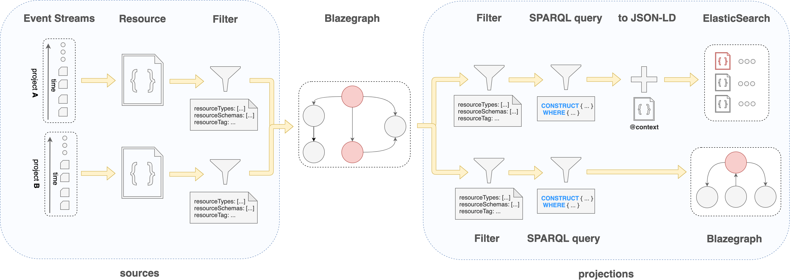

# v1.3 Release Notes

> This is an incremental software release that adds several improvements across the board. The API is backwards
compatible to v1.2 (and the rest of the v1.x releases, i.e. v1.1 and v1.0) but requires rebuilding all indices. Please
visit the @ref:[migration instructions](v1.2-to-v1.3-migration.md) for the exact steps necessary to upgrade from the
previous release.

## Highlights

The goal of this release is to expand on the benefits of using a fully managed data and knowledge graph system with
new capabilities around data search, transformation and exchange.

### Studio

TODO: Fix the links to the appropriate section inside the studio page.

@ref:[Studio](../fusion/studio.md) (a new feature in Nexus Web) allows users to define a user interface to
browse and view the data in Nexus’ knowledge graph. Multiple @ref:[Workspaces](../fusion/studio.md) can be
created within a __Studio__ allowing for arbitrary grouping of datasets to be shown. A __Workspace__ can be configured
with multiple @ref:[Dashboards](../fusion/studio.md), each presenting data of possibly different types
(and shapes within the graph).

Each row in a __Dashboard__ corresponds to a resource in the system, but the values shown can be collected from related
resources. A very simple example of that would be showing a listing of __Person__ names and the name of the
__Organizations__ that they are affiliated to (following `schema:affiliation`) where each Person and Organization are
managed as independent resources in the system:

        +--------+               +--------------+
        | Person +-------------->+ Organization |
        +--------+  affiliation  +--------------+
         |                         |
         +->name                   +->name

Selecting an entry in a Dashboard will open a detailed view of the corresponding resource that can be fully customized
by means of @ref:[plugins](../fusion/plugins.md).

Please head over to the @ref:[Studio](../fusion/studio.md) section of the documentation for more information.

#### Graph View

In order to improve the user understanding of the linked entities of the knowledge graph, we have added Graph View. It presents the outgoing entities linked and enable users to graphically navigate to them.

### Data Aggregation, Transformation and Projection

One of the most important features of Nexus is to bridge the gap between the management of data and its consumption
while not sacrificing on security. It does that by supporting customizable managed indices of the data (represented by
__View__ resources).

Prior to this release, two main type of indices were made available ( __ElasticSearchView__ and __SparqlView__) and their
__Aggregated*__ variants (for querying multiple indices at the same time). They enable fantastic search capabilities
on the managed data. But while these types of indices are very powerful on their own, we found that bringing them
closer together can raise the bar even further by taking advantage of their best use: an RDF graph is very powerful
for data integration and exploration, while ElasticSearch is very powerful for full text and faceted search.

This release introduces a new type of managed index (represented by __CompositeView__ resources) that allows the use
of these indices together at their best. It allows integrating data from multiple sources (projects) in a single RDF
graph to perform queries that generate documents to be stored in one or many ElasticSearch indices. The approach is
extremely flexible as it allows the use of semantic web technologies to integrate, transform and filter data
(via queries) to produce arbitrary document structures in ElasticSearch. (Sparql CONSTRUCT) queries can span across
graphs of multiple resources removing the coupling on the data shapes for management vs search.

Additionally, the new views support sources of different (remote) Nexus projects introducing the first of many
federation features. This first iteration allows collecting data from different Nexus deployments to produce local
indices that enable fast local searches. For the best search user experience, data needs to be pre-indexed such that
responses are delivered with minimal latency (distributed joins are significantly slower that local ones). The
incremental indexing approach promoted by the system allows for near instant data synchronization between the sources
and the local indices.

For more details on CompositeViews, please read below.

## Details

### CompositeViews

CompositeViews are yet another type of view introduced (currently in Beta) to enable new indexing capabilities:

- ability to collect data to be indexed from multiple sources (current project, other projects, remote Nexus
  deployments);
- ability to apply transformations to the indexed data by means of `SPARQL CONSTRUCT` queries that are executed on the
  entire RDF graph generated from all data sources;
- ability to project data to multiple indices;
- ability to query multiple projections of the same type;
- ability to query the entire RDF graph generated from all data sources.

The name stems from its unique characteristic of aggregating data from multiple sources and managing multiple
projections.

[](../delta/api/current/assets/views/compositeview_pipeline.png)

A CompositeView can define several sources of data of different types:

- ProjectEventStream: the event log of the project where the CompositeView is defined
- CrossProjectEventStream: the event log of an arbitrary project within the same Nexus deployment
- RemoteProjectEventStream: the event log of an arbitrary project within a different Nexus deployment

The sources are consumed as a collection of event streams, either from the primary store or via Server Sent Events in
the case of the RemoteProjectEventStream. Each event is either exchanged with the resource for which it was emitted
or dropped (if the filters defined in the originating source exclude it). The resource is then transformed into an
RDF graph and stored in a temporary namespace of BlazeGraph.

Projections are then executed by querying the temporary namespace via the `SPARQL CONSTRUCT` queries defined as part of
their configuration. These queries allow constructing an arbitrary RDF graph by traversing the temporary one starting
from the IRI node representing the originating resource id (the system recognizes the `{resource_id}` token in the
provided query and replaces it with the corresponding value).

CompositeViews allow defining multiple projections; the current supported types are:

- ElasticSearchProjection: data is projected as documents in an ElasticSearch index
- SparqlProjection: data is projected as an RDF named graph in a BlazeGraph namespace

Projections include filtering configuration to allow resources of different types or constrained by different schemas to
be indexed separately. An obvious use case is to index resources of different shapes in different ElasticSearch indices
with appropriate mapping definitions for each variation.

The complete configuration options can be found in the @ref:[api reference](../delta/api/current/views/composite-view-api.md).

### View Offsets

Views now expose `offset` as a sub-resource allowing the retrieval of the last consumed event id. The event id values
are the same as the ones presented via @ref:[Server Sent Events](../delta/api/current/kg-resources-api.md#resources-server-sent-events).

```
GET /v1/views/{org_label}/{project_label}/{view_id}/offset
```

An example response:

```json
{
  "@context": "https://bluebrain.github.io/nexus/contexts/offset.json",
  "@type": "TimeBasedOffset",
  "instant": "2020-02-14T09:31:41.400Z",
  "value": "ceaf0580-4f0c-11ea-98d9-dff6b2cf55b4"
}
```

Deleting the `offset` sub-resource instructs the system to rebuild the corresponding index by restarting the event
replay and indexing process.

```
DELETE /v1/views/{org_label}/{project_label}/{view_id}/offset
```

The system acknowledges the command by providing a `NoOffset` response:

```json
{
  "@context": "https://bluebrain.github.io/nexus/contexts/offset.json",
  "@type": "NoOffset"
}
```

In the case of CompositeViews where the entire process handles multiple offsets at the same time (a product of sources
and projections) dedicated endpoints have been added to select a specific offset or perform a listing:

```
/v1/views/{org_label}/{project_label}/{view_id}/sources/{source_id}/offset
/v1/views/{org_label}/{project_label}/{view_id}/sources/_/offset
/v1/views/{org_label}/{project_label}/{view_id}/projections/{projection_id}/offset
/v1/views/{org_label}/{project_label}/{view_id}/projections/_/offset
```

These endpoints also accept deletion instructing the system to restart only a part of the process. For example,
executing a deletion on the following endpoint will cause the system to only rebuild the projections without having to
restart the collection of resources in the temporary RDF graph:

```
DELETE /v1/views/{org_label}/{project_label}/{view_id}/projections/_/offset
```

### JavaScript, Python SDKs and the CLI

The JavaScript SDK has been updated to support the new APIs exposed in this release, maintaining feature parity.

The Python SDK and Nexus CLI have not yet been updated, as we're working on redesigning these components to provide a
better user experience. Since the release is fully backwards compatible with the previous releases, the Python SDK and
Nexus CLI can be used just as before, but they don't support the newly added APIs.

We will announce their release at a later date.

### Other Changes

The SparqlViews can now also @ref:[be queried](../delta/api/current/views/sparql-view-api.md#sparql-query) using the GET
HTTP method by providing the query string in the `query` parameter:

```
GET /v1/views/{org_label}/{project_label}/{view_id}/sparql?query={query}
```

Sorting of results can be controlled now via the repeatable `sort` query parameter. The parameter accepts an
ElasticSearch document field name to be used for sorting the result set ascending. The order can be reversed by
prefixing the field name with a `-` character. The `sort` parameter can be repeated multiple times to specify multiple
fields to be used for sorting. For example, the following call will return all resources in the specified project
ordered by the user that made the last change in each resource and then by last updated time descending (more recent
updates first).

```
GET /v1/resources/{org_label}/{project_label}?sort=_updatedBy&sort=-_updatedAt
```

New ElasticSearch indices are automatically configured to perform word split and properly handle UUIDs. The new
index configuration yields better full text search results.

Additional reported issues were @link:[fixed](https://github.com/BlueBrain/nexus/issues?q=is%3Aissue+milestone%3Av1.3.0+is%3Aclosed+label%3Abug){ open=new }.
