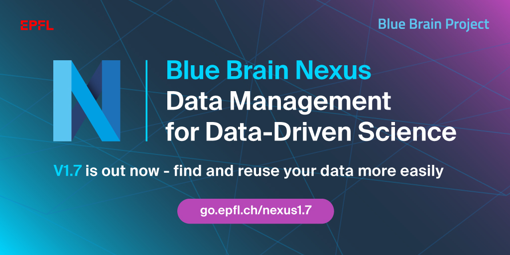
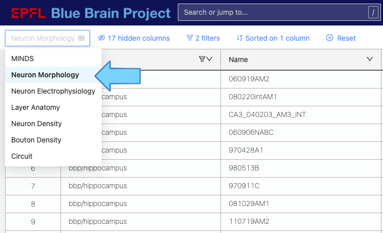
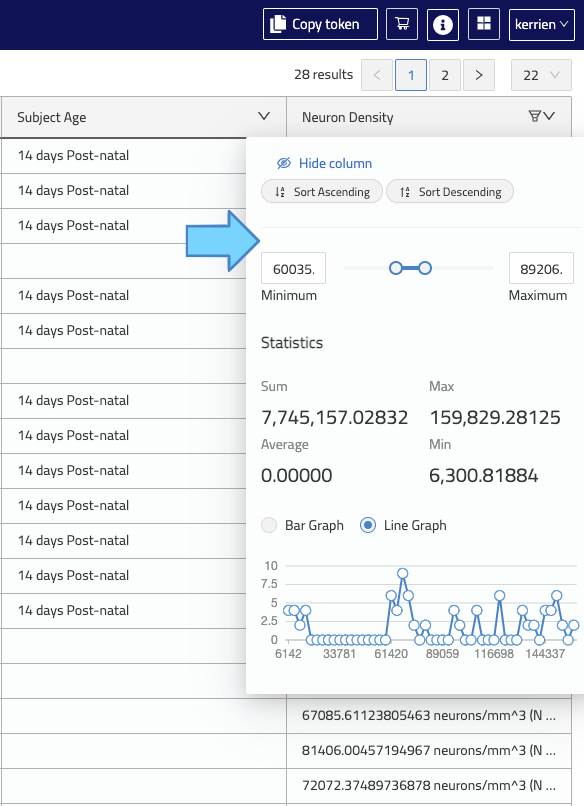
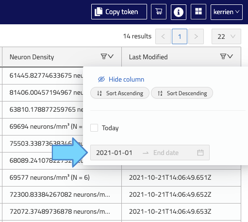
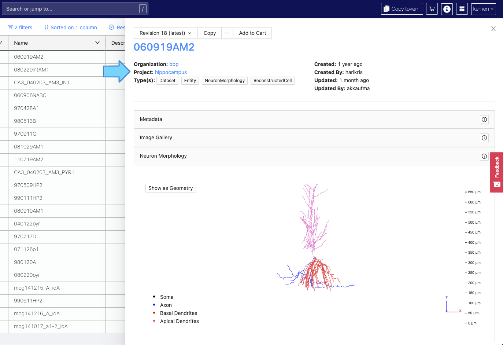
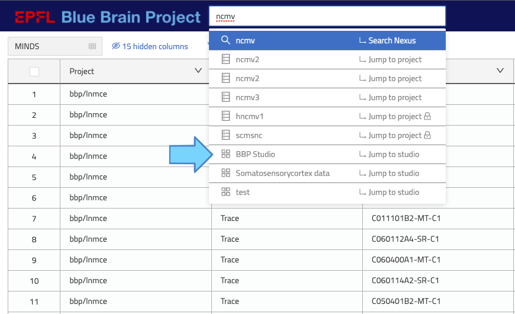
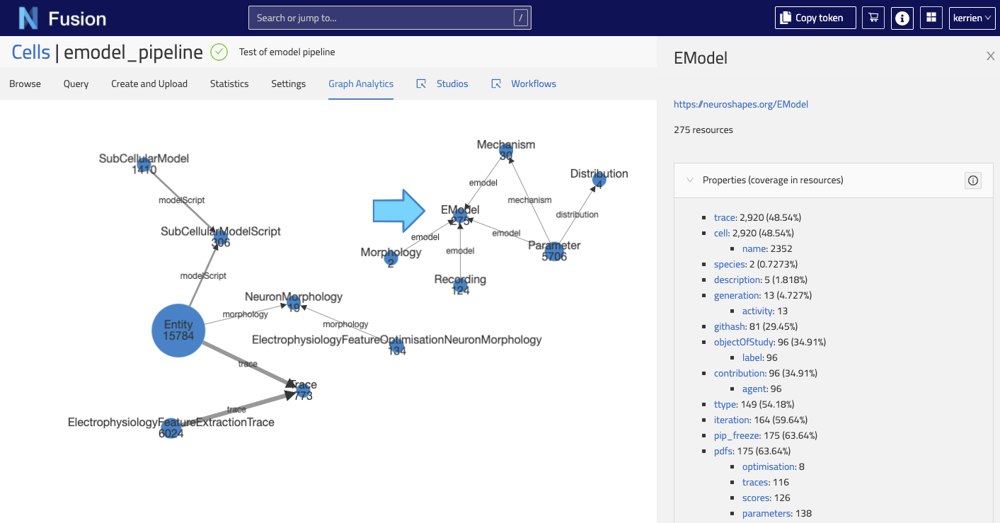

# v1.7 Release Notes

> This is an incremental software release that adds several improvements across the board. The API is backwards
> compatible to v1.6.

For the detailed list of updates in this release, see the
@link:[list of addressed issues](https://github.com/BlueBrain/nexus/issues?q=is%3Aissue+is%3Aclosed+closed%3A2021-10-14..2022-03-14+){ open=new }
since v1.6.

If you are currently using Nexus Delta from 1.6.x, please
visit the @ref:[migration instructions](v1.6-to-v1.7-migration.md) for the necessary steps to successfully upgrade.

## Highlights

As you grow your Knowledge Graph every day, it is becoming more and more challenging to find relevant data to fuel your 
data driven activities. In October 2021, We introduced a powerful new feature: Global Search. It allows you to make all 
Nexus Projects searchable and the data within discoverable. We have received a lot of feedbacks and recently focused on 
improving further its usability. We are delighted to announce the public release of Nexus 1.7 and here are the highlights.

### Preconfigured Searches

In order to allow you to jump quickly and easily to the relevant data, you can now use the preconfigured searches.
More can be added and relevant columns preselected.

### Specialised Filters

We now support filtering for additional columns types.
With the new Numeric column support, you can plot an overview of your selection and easily narrow it down to what is 
really useful to you. Similarly, you can now filter using Date columns.

### Resource Panel

When clicking on search results, you can view more details.
The resource panel was improved to highlight important information and actions at the top.
Plugins are continuously improved using your feedbacks.

### Search Bar

The search bar now allows you to find and open Studios or Projects from anywhere in Fusion.

### For Power Users and Admins

As you add more of your scientific data into Nexus, you can review the structure of your Knowledge Graph.
You can see how resources are connected together and what properties are used to describe them.

And now, let's take a look at the details of this release across Delta and Fusion.

## Nexus Delta

The main goal of this release is to provide support for an enhanced search experience in Fusion as well as to introduce
a new extensible model to define Elasticsearch views based on pipes.

Secondary goals include:

- Allow the use of an external configuration file for Delta.
- Allow deleting tags on resources.
- Allow tagging deprecated storages and views.
- Refactor `graph-analytics` plugin to make indexing faster.
- Add a group identifier in Elasticsearch projections of composite views.
- @link:[Terminate support of the Nexus CLI](https://bluebrainnexus.io/v1.5.x/docs/utilities/index.html#nexus-cli). At this stage, no replacement is provided but due to the backward compatibility of the Delta API, the CLI should still work. We will announce when a new CLI is made available.
- @link:[Removal of the docker based client](https://bluebrainnexus.io/v1.5.x/docs/utilities/projections.html). 

A @link:[series of bugs](https://github.com/BlueBrain/nexus/issues?page=1&q=is%3Aissue+is%3Aclosed+closed%3A2021-10-14..2022-03-08+label%3Abug+label%3Adelta){ open=new } have also been fixed with this new release.

### Elasticsearch pipes

With 1.7, Elasticsearch views now rely on pipes to filter and transform data before indexing.
This feature was primarily motivated by user requests of our partners at SWITCH, [some usage examples are detailed here](https://github.com/BlueBrain/nexus/issues/2549).

More details @ref:[here](../delta/api/views/elasticsearch-view-api.md)

This change implies a @ref:[migration when updating Nexus Delta to 1.7](v1.6-to-v1.7-migration.md).

### Allow the use of an external configuration file for Delta

Besides JVM properties and environment variables, Delta configuration can now be defined via a external file.

More details @ref:[here](../getting-started/running-nexus/configuration/index.md)

### Deleting tags on resources

From 1.7, it is now possible to delete tags on resources, files and schemas.

### Tagging deprecated storages and views

Storages and views can now be tagged even after they have been deprecated.

### Graph analytics

Graph analytics indexing is now faster.

If you enabled this plugin in your 1.6 deployment, @ref:[there are migration steps to follow](v1.6-to-v1.7-migration.md).

### KG Dashboard update

In order to reduce the dependencies to third party systems (InfluxDB and Grafana) and further invest in those we already support (ElasticSearch), we have redesigned our Knowledge Graph Dashboard to support the usecase of monitoring the data ingested into Nexus.

A default configuration for this dashboard will [soon be provided](https://github.com/BlueBrain/nexus/issues/3145) so that everyone can give it a try with minimal efforts.

### Deprecations

In the upcoming version, the support of Cassandra as a primary store for Nexus Delta will be removed in favour of PostgreSQL to focus development efforts on features rather than supporting multiple databases. 
For very large deployments there are commercial options that are wire compatible to PostgreSQL.

Tools will be provided to enable migration from Cassandra to PostgreSQL for existing Delta deployments.

## Nexus Fusion

### Graph Analytics
Fusion now enables users to inspect properties and relationships of resources in a given project via the new Graph Analytics plugin.

### Studios Elasticsearch Support
Support Elasticsearch and Composite views has been added to [Studios](../fusion/studio.md). Studios targeting an Elasticsearch view provide the option for more performant Studios compared to those targetting a Sparql view. The Studio data model has changed to support this, see migration notes for migrating existing Studios.

### Search Enhancements

#### Search configurations
[Search](../fusion/search.md) configurations have been introduced to provide convenient access to apply common search criteria.

#### Support for Numerical and Date columns
Numerical and date type column support has been added providing the ability to [filter search results](../fusion/search.md#filtering) appropriately for these data types.

#### Jump to Studio
The [Search bar](../fusion/search.md#search-bar) can now be used to search for Studios and navigate to them directly.

### Better Preview support for PDFs
Enhanced support for previewing PDFs in the resource preview plugin provides the ability to zoom in and pan large PDFs.

### Versioned Links
Resource links to other resources can now be version-specific.

### Remove Tag from Resource
Tags can now be removed from a resource directly in Fusion.

### UI Enhancements
The following UI enhancements have been made in this version:

- Redesigned Resource Panel with quick access to high-level details of resource. 
- Plugin opened/closed status is also persisted improving the UX when wanting to view the same plugin(s) for several resources.
- Colour scheme has been updated to better align with our style guide.
- Navigation has moved from the sidebar to the header giving more screen real-estate.

### Bug fixes

A @link:[series of bugs](https://github.com/BlueBrain/nexus/issues?page=1&q=is%3Aissue+is%3Aclosed+closed%3A2021-10-14..2022-03-14+label%3Abug+label%3Afusion){ open=new } have also been fixed.

