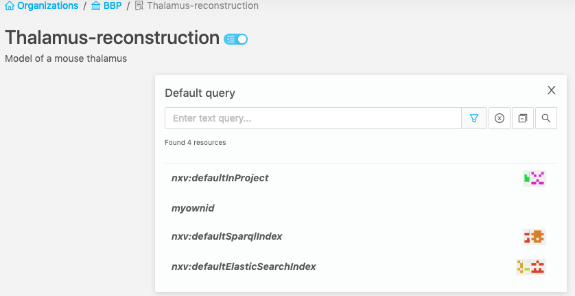
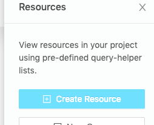
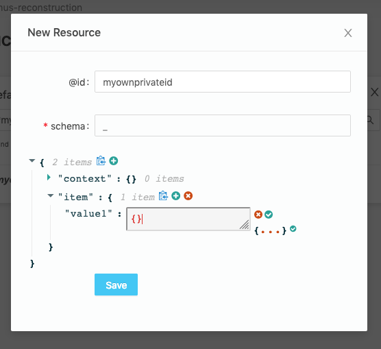

# Browsing data

To group and control access to your data, Nexus provides you Organizations and Projects. Much like in Github (if you're familiar with it), there are Organizations which contain Projects (Repositories in Github), which in turn contain your data (files in GitHub, Resources in Nexus).

In Nexus Web, the landing page will show you the list of Organizations you have access to.

After selecting an organization, you will see the list of Projects you have access to inside this organization.

Select a Project, you'll get to the list of its Resources.

## Creating Resources

Navigate to the project where you want to create a resource. Click on the "Create Resource" button in the right sidebar. Build the JSON payload with the help of the interactive editor, then hit "Save".

## Advanced use-cases

If you want to have several filtered lists of resources side by side, you can create additional filterable lists by using the "New Query" button in the side panel. It can be handy to make comparisons, or to build a set of ElasticSearch queries we want to reuse in an IPython Notebook or in a script.

You can also clone one of the active Queries to use it as a starting point.

If you need to make complex ElasticSearch queries or if you want to see the raw payload returned by ElasticSearch, you can click on "ElasticSearch query editor". Results will be displayed in JSON-LD format.

For graph and RDF-related queries, we also offer a SPARQL query editor that runs against our triple-store. Results are displayed in a table.

