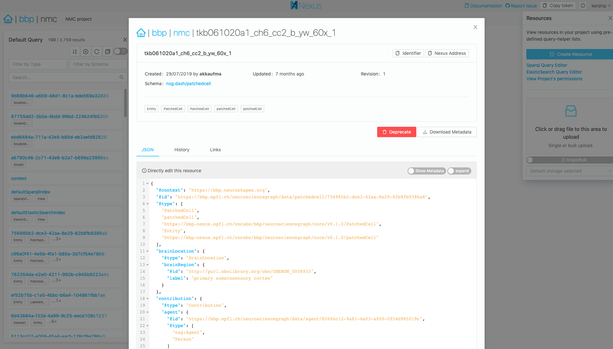
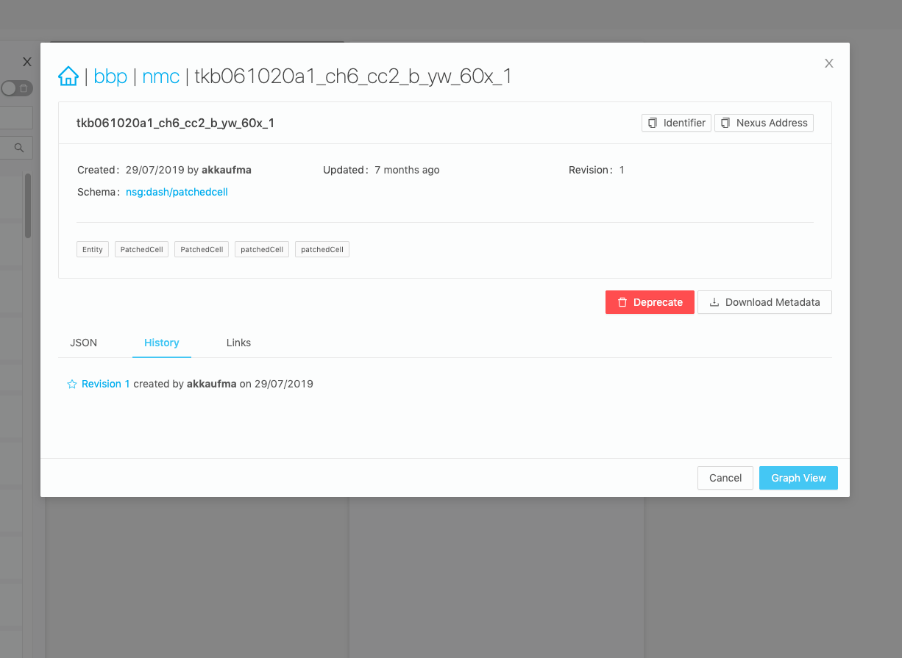
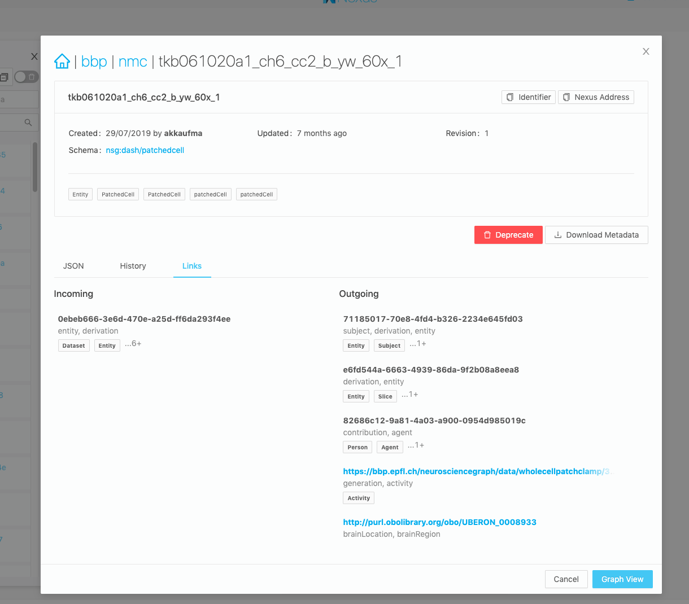
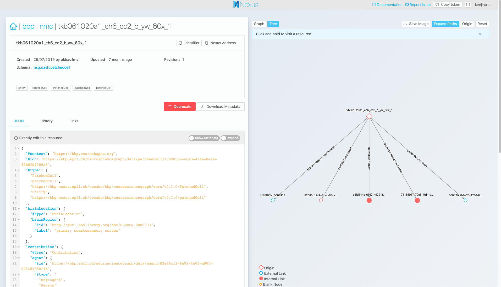

# Resource Details View

Click on a resource and you'll see a more detailed view with important metadata displayed on a card on the top, as well as a JSON-lD form that may or not be editable, depending on the selected resource's schema (uploaded files cannot be edited, for example.)

## History View

Inside the Details Page, you'll find a tab labeled `History`. Here you'll find a descending timeline of revisions commited to this resource, and by whom it was changed. You can also navigate to a specific revision in time by clicking on the `Revision` label

## Links View

Inside the Details View you'll find a tab called Links. Here you can find two lists,
one for Incoming Links and one for Outgoing Links. Incoming Links are other datasets that reference this dataset. Outgoing links are other datasets that are referenced inside this one. This is very helpful to navigate down the chains of references you have, by clicking on a link you'll be taken to that resource's details page, or brought to the web url if it's an external resource (a referenced URI, but not a resource integrated into the platform)

## Graph View

Inside the Details View you'll also find a tab that contains a graph visualizer. You can navigate here by clicking "Graph View" on the bottom of a resource page. If you've navigated to the resource via a direct shareable URL, you'll land directly on this page instead of the smaller modal view.

This is helpful to visualize how the dataset connects to other resources in the knowledge graph. Only outgoing links are displayed.

You can also expand (Internal) nodes by clicking on them, or navigate to that resource's details page by clicking and holding on the node.

