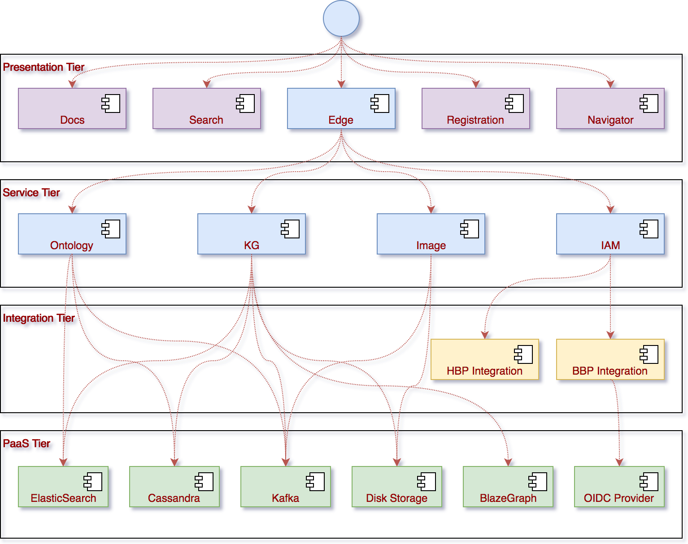
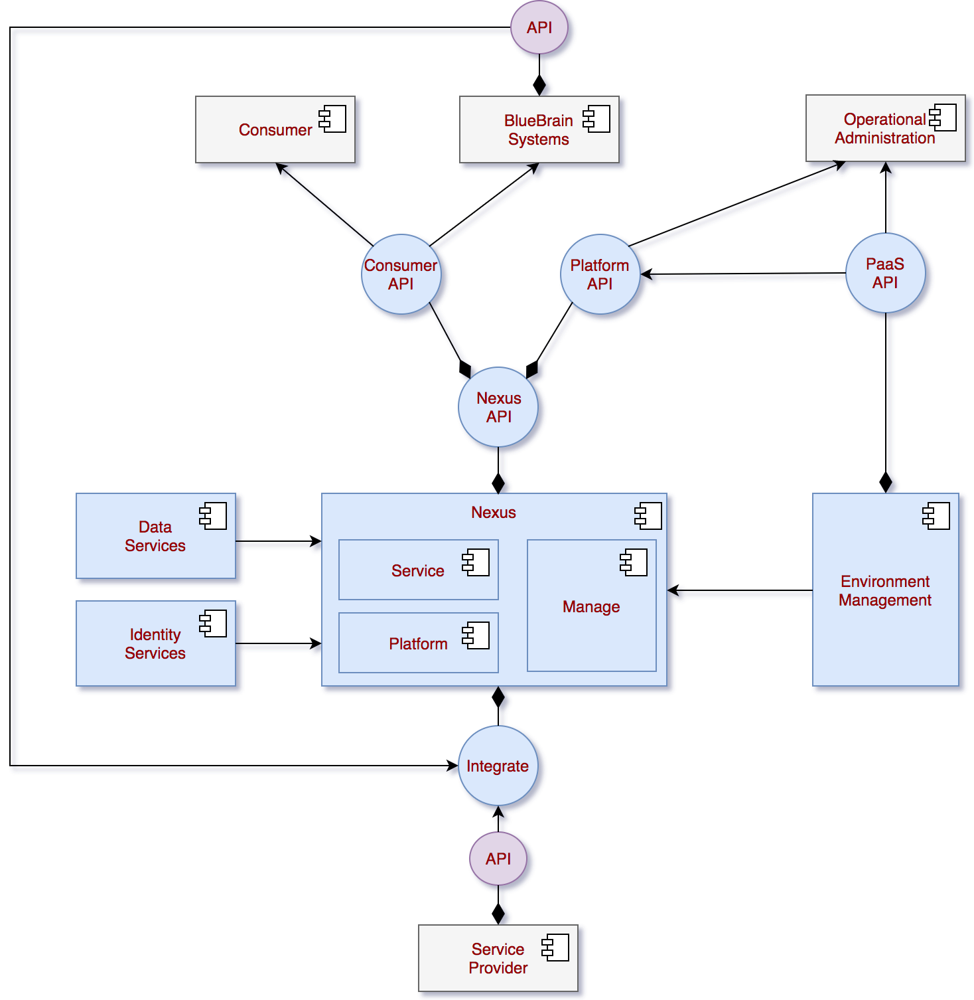

# Platform Overview

Please take a look at [these slides](https://www.slideshare.net/BogdanRoman1/bluebrain-nexus-technical-introduction-91266871)
for a short technical introduction to Nexus.

## Component View

The diagram below describes the reference component view of the platform.  Some of the listed components may be in
different implementation stages.

As depicted in the above diagram the platform follows a 4 tier architecture:

### Presentation Tier

The presentation tier hosts web applications bundled as static assets and a configurable HTTP router / proxy (Edge)
that selects the target service based on the target resource address and content negotiation schemes.

None of the deployable units in this tier host and data.  Interaction is done solely over HTTP.

### Service Tier

This tier hosts all the (micro) services that make up the platform.  Each of the listed services host their own data
making use of the deployments in the PaaS Tier.  The only way services are allowed access to other service data is via
their API, no exceptions.

Services exchange data over HTTP for synchronous communication or over Kafka for asynchronous communication.  The
generally adopted format for data is Json-LD.

### Integration Tier

The integration tier exists to mediate communication between services and third party systems.  This ensures a single
consistent implementation of the core service logic, while integration services manage different data formats and
communication strategies.  An example is the integration with multiple downstream OpenID Connect identity providers that
although follow a single protocol, the information provided in the JWT token and user information may differ.

### PaaS Tier

The PaaS tier represents the collection of tools and / or services that are provided to the platform by the underlying
infrastructure.  The technologies chosen generally offer good horizontal scalability for massive volumes of data and
traffic.

## Integration View

The diagram below describes the general integration framework for services within the platform.

While it may not immediately obvious, all services follow the same integration pattern north-bound in and south-bound
out.  Services will always consume other services' APIs only, no exceptions.

## Deployment

While deployment views are specific to the every deployment we endorse the use of docker images in a container
orchestration system such as [Kubernetes](https://kubernetes.io/).

Services are built to be run either as singleton deployments or clustered for higher availability and throughput.  The
technology behind most (all current) services is [Akka](http://akka.io/) which enables the deployment of clustered
services in high numbers.