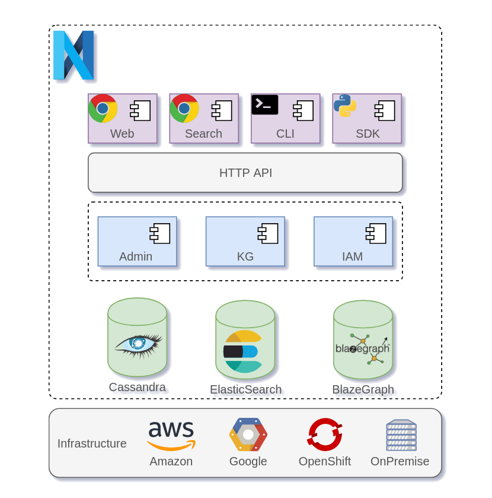

# Components

The Nexus platform is made up of a collection of services and web applications that work together to manage data stored
within the system. The services and web applications are powered by a collection of libraries and tools built
specifically to address the needs of the platform. Underneath it all there are popular open source technologies that
we all know and love.

## Nexus Services

### Nexus KnowledgeGraph

This service is the heart of the BlueBrain Nexus platform. It allows users to define their domain, populate the
knowledge graph with data, attach files to data. It also provides semantic search facilities to discover similar and
relevant data in the platform.

[Source Code](https://github.com/BlueBrain/nexus-kg) | @ref:[Documentation](../../api/current/kg/index.md)

### Nexus Admin

This service manages the platform wide scopes for data and their configuration (i.e.: the API mapping).

[Source Code](https://github.com/BlueBrain/nexus-admin) | @ref:[Documentation](../../api/current/admin/index.md)

### Nexus IAM

This service manages the access to data within the platform. It makes use of configurable downstream OpenID Connect
compliant identity providers to authenticate clients and manages the access controls for the entire platform.

[Source Code](https://github.com/BlueBrain/nexus-iam) | @ref:[Documentation](../../api/current/iam/index.md)

## Nexus Web Applications

### Nexus Web

This is the web interface to the platform. It allows users to browse the data within the system and perform administration tasks.

[Source Code](https://github.com/BlueBrain/nexus-web) | @ref:[Documentation](../../getting-started/webapps.md#nexus-web)

### Nexus Docs

Generated documentation for the platform (this website).

[Source Code](https://github.com/BlueBrain/nexus) | [Website](../../)

## Domains (Schemas, Vocabularies)

### Nexus Core Schemas

#### nexus-schemaorg

[SHACL](https://www.w3.org/TR/shacl/) version of a subset of schemas defined by
[schema.org](http://schema.org/docs/full.html) that are commonly used in Blue Brain Nexus.

[Source Code](https://github.com/BlueBrain/nexus-schemaorg)

#### nexus-prov

Data management oriented [SHACL](https://www.w3.org/TR/shacl/) version of
[W3C PROV-O](http://www.w3.org/ns/prov-o-20130430).

[Source Code](https://github.com/BlueBrain/nexus-prov)

### Nexus domain specific components

#### Nexus BBP Data models

Data models that Blue Brain has developed in order to facilitate the integration of specific neuroscience data.

[Source Code](https://github.com/BlueBrain/nexus-bbp-domains)

#### Neuroshapes

A community effort to develop open SHACL schemas for FAIR (Findable, Accessible, Interoperable, Reproducible)
neuroscience data.

[Source Code](https://github.com/INCF/neuroshapes)

## Nexus tools

### Nexus CLI

A command line interface (CLI) to operate basic operation on a Nexus deployment.

[Source Code](https://github.com/BlueBrain/nexus-cli)

### Nexus Python SDK

This library will help Python users to integrate their tools with the Blue Brain Nexus platform.

[Source Code](https://github.com/BlueBrain/nexus-python-sdk) | [Documentation](https://bluebrain.github.io/nexus-python-sdk/)

### JS SDK for Nexus

A set of helpers to abstract the Nexus API and build Javascript / Typescript applications.

[Source Code](https://github.com/BlueBrain/nexus-sdk-js) | @ref:[Documentation](../sdk.md#js-sdk-for-nexus)
