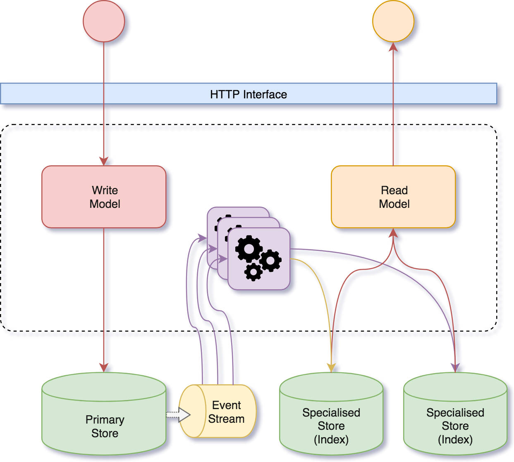

# Services anatomy

Nexus services are assembled by a series of components

- **Write Model**: This component is executed when a customer performs a write API operation (create, update, tag, ...). The business logic is triggered (validation, state computation, Json and Graph manipulations, etc). As a result, an Event gets stored into the Primary Store or a rejection is delivered to the client.
- **Event Stream**: This is an asynchronous process that gets triggered as soon as there are elements to be read from the Primary Store. The stream runs several operations that take the stored Events and transform them. The result is then saved into a target index.
- **Write Model**: This component gets triggered when a customer performs a read API operation (get, list). A call to the index is performed. The resulting data is transformed if required and delivered to the client.

The service structure and workflow has been designed following the [CQRS](https://martinfowler.com/bliki/CQRS.html) and [Event sourcing]([Event sourcing](https://martinfowler.com/eaaDev/EventSourcing.html)) strategies. The distinction between the write and read model, as well as the use of event streams is a perfect match to CQRS and Event Sourcing.

