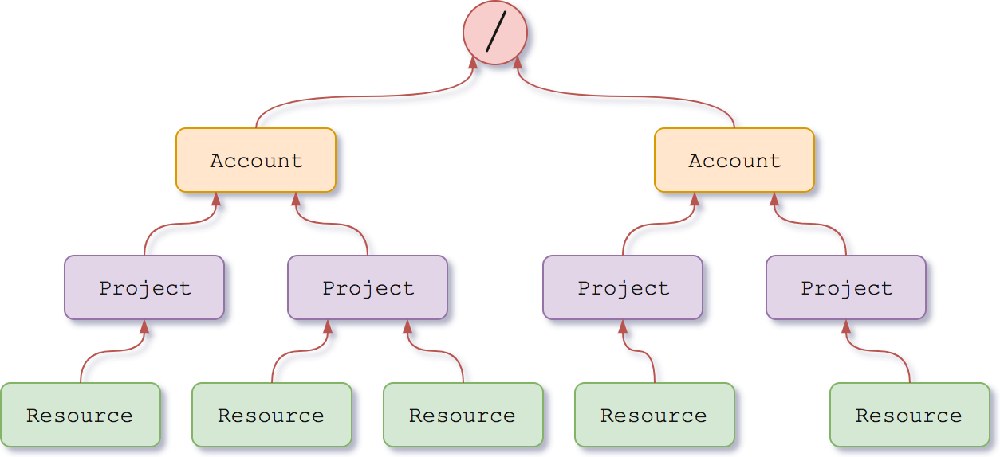
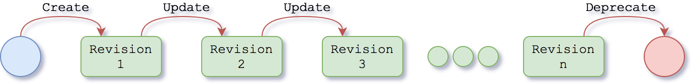

@@@ index

* [Services anatomy](anatomy.md)
* [Operating on resources](operating-on-resources.md)
* [Admin API](admin/index.md)
* [KnowledgeGraph API](kg/index.md)
* [IAM API](iam/index.md)
* [Error Signaling](error-signaling.md)

@@@

# 1.0

@@@ note { .warning title="API deprecated" }

The following documentation applies to the deprecated version of Nexus.

Please consider moving to the API v1.1. Find more information about how to migrate @ref:[here](../../releases/1.1/migration.md)

@@@

All Nexus services expose a RESTful interface over HTTP(S) for synchronous communication. The generally adopted transport format is JSON based, specifically [JSON-LD](https://json-ld.org/).

The services operates on 3 primary types of resources: Organizations, Projects and Resources. Each of them is constrained by a set of [SHACL] constraints, grouped in what is called a Schema.

* An **@ref:[organization](./admin/admin-orgs-api.md)** is used to organize and categorize its sub-resources.
* A **@ref:[project](./admin/admin-projects-api.md)** is rooted on a given `organization`. It is used to organize and categorize its sub-resources while providing a way to [interact with them conveniently](./admin/admin-projects-api.html#prefix-mappings).
* A **@ref:[resource](./kg/kg-resources-api.md)** is rooted on a given `project`. In this level of the hierarchy, multiple types of resources can be found. Each of them has a different purpose:
  - A **@ref:[schema](./kg/kg-schemas-api.md)** is a resource that defines a set of constraints using [SHACL].
  - A **@ref:[resolvers](./kg/kg-resolvers-api.md)**: is a resource that defines the way ids are retrieved inside a project.
  - A **@ref:[views](./kg/kg-views-api.md)**: is a resource that describes the way indexing is applied to certain resources inside a project.
  - A **@ref:[file](./kg/kg-files-api.md)**: is a binary resource.

## Resource Lifecycle

Our services are build using the [event sourcing](https://martinfowler.com/eaaDev/EventSourcing.html) approach. This strategy captures all changes to an application state as a sequence of events.

All resources in the system generally follow the very same lifecycle, as depicted in the diagram below. Every interaction with an API resource (creation, updates, state changes) is recorded into the system as revisions.

Data is never removed from the system, but rather is marked as deprecated. Depending on the type of resource, the deprecation flag may have various semantics:

- **Organizations**: the resource itself and sub-resources cannot be updated. Views and resolvers contained within this organization will not be considered during indexing and resolution processes.
- **Projects**: the resource itself and sub-resources cannot be updated. Views and resolvers contained within this project will not be considered during indexing and resolution processes.
- **Schemas**: the resource itself cannot be updated and new data conformant to it cannot be created
- **Resolvers**: the resource itself will not be considered during the resolution process
- **Views**: the resource itself will not be considered during the indexing process
- **Files**: attachments cannot be added/deleted
- **Data**: the resource itself cannot be updated

Future policies may use this flag to determine if or when the deprecated data may be archived.

[SHACL]: https://www.w3.org/TR/shacl/

