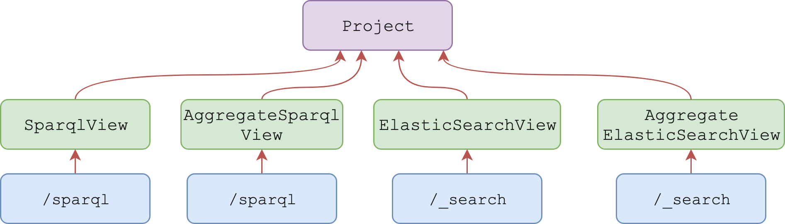
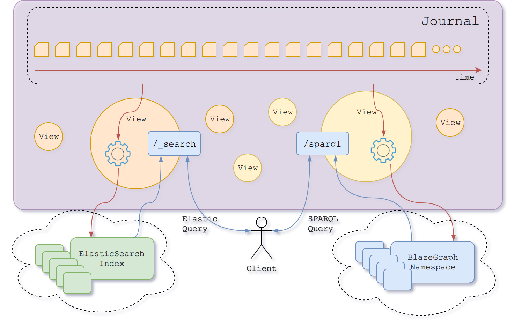

# Views

Views are rooted in the `/v1/views/{org_label}/{project_label}` collection and are used to index the selected resources into a bucket. 


Each view... 

- belongs to a `project` identifier by the label `{project_label}` 
- inside an `organization` identifier by the label `{org_label}` 
- it is validated against the [view schema](https://bluebrainnexus.io/schemas/view.json).

Access to resources in the system depends on the access control list set for them. Depending on the access control list, a caller may need to prove its identity by means of an **access token** passed to the `Authorization` header (`Authorization: Bearer {token}`). Please visit @ref:[Authentication](../iam/authentication.md) to learn more about how to retrieve an access token.

@@@ note { .tip title="Authorization notes" }	

When  modifying views, the caller must have `views/write` permissions on the current path of the project or the ancestor paths.

When  querying views, the caller must have `views/query` permissions on the current path of the project or the ancestor paths.

When  reading views, the caller must have `resources/read` permissions on the current path of the project or the ancestor paths.

@@@

## View types




There are several types of views, which relies on different technology to perform the indexing

### SparqlView

This view creates a SPARQL `namespace` where it stores the selected resources inside the view `project`.

A default view gets automatically created when the project is created but other views can be created.


**SparqlView payload**
```
{
  "@id": "nxv:defaultSparqlIndex",
  "@type": [ "View", "SparqlView" ],
  "resourceSchemas": [ "{resourceSchema}", ...],
  "resourceTag": "{tag}",
  "includeMetadata": {includeMetadata}
}
```

where...

- `{resourceSchema}`: Iri - It selects the resources that are validated against the provided schema Iri. This field is optional.
- `{tag}`: String - It selects the resources with the provided tag. This field is optional.
- `{includeMetadata}`: Boolean - If true, the resource's nexus metadata (`_constrainedBy`, `_deprecated`, ...) will be stored in the Sparql graph. Otherwise it won't. The default value is `false`.


### ElasticSearchView


This view creates an ElasticSearch `index` where it stores the selected resources inside the view `project`.

A default view gets automatically created when the project is created but other views can be created.

**ElasticSearchView payload**
```
{
  "@id": "{someid}",
  "@type": [ "View", "ElasticSearchView"],
  "resourceSchemas": [ "{resourceSchema}", ...],
  "resourceTag": "{tag}",
  "sourceAsText": {sourceAsText},
  "includeMetadata": {includeMetadata},
  "mapping": _elasticsearch mapping_
}
```

where...
 
- `{resourceSchema}`: Iri - It selects the resources that are validated against the provided schema Iri. This field is optional.
- `{tag}`: String - It selects the resources with the provided tag. This field is optional.
- `_elasticsearch mapping_`: Json object - It defines the value types for the Json keys, as stated at the [ElasticSearch mapping documentation](https://www.elastic.co/guide/en/elasticsearch/reference/current/indices-put-mapping.html#indices-put-mapping).
- `{sourceAsText}`: Boolean - If true, the resource's payload will be stored in the ElasticSearch document as a single escaped string value of the key `_original_source`. If false, the resource's payload will be stored normally in the ElasticSearch document. The default value is `false`.
- `{includeMetadata}`: Boolean - If true, the resource's nexus metadata (`_constrainedBy`, `_deprecated`, ...) will be stored in the ElasticSearch document. Otherwise it won't. The default value is `false`.
- `{someid}`: Iri - the @id value for this view.


### AggregateElasticSearchView


This view is an aggregate of ElasticSearchViews. The view itself does not create any index, but it references the already existing indices of the linked ElasticSearchViews.

When performing queries on the `_search` endpoint, this view will make use of the [multi-index](https://www.elastic.co/guide/en/elasticsearch/reference/current/multi-index.html) query capabilities of ElasticSearch in order to select the indices of every view present on this aggregate view.

If the caller does not have the permission `views/query` on all the projects defined on the aggregated view, only a subset ofindices (or none) will be selected, respecting the defined permissions.


**AggregateElasticSearchView payload**
```
{
  "@id": "{someid}",
  "@type": [ "View", "AggregateElasticSearchView"],
  "views": [ 
    {
        "project": "{project}",
        "viewId": "{viewId}"
    },
    ...
  ]
}
```

where...
 
- `{project}`: String - the project, defined as `{org_label}/{project_label}`, where the `{viewId}` is located.
- `{viewId}`: Iri - The view @id value to be aggregated.


### AggregateSparqlView


This view is an aggregate of SparqlViews. The view itself does not create any index, but it references the already existing indices of the linked SparqlViews.

When performing queries on the `sparql` endpoint, this view will query all the underlying SparqlViews and then aggregate the results. The order how the results across the different SparqlView gets merged it is not deterministic.

If the caller does not have the permission `views/query` on all the projects defined on the aggregated view, only a subset ofindices (or none) will be selected, respecting the defined permissions.

**AggregateSparqlView payload**
```
{
  "@id": "{someid}",
  "@type": [ "View", "AggregateSparqlView"],
  "views": [ 
    {
        "project": "{project}",
        "viewId": "{viewId}"
    },
    ...
  ]
}
```

where...
 
- `{project}`: String - the project, defined as `{org_label}/{project_label}`, where the `{viewId}` is located.
- `{viewId}`: Iri - The view @id value to be aggregated.


## Create an ElasticSearchView using POST

```
POST /v1/view/{org_label}/{project_label}
  {...}
```

The json payload: 

- If the `@id` value is found on the payload, this @id will be used.
- If the `@id` value is not found on the payload, an @id will be generated as follows: `base:{UUID}`. The `base` is the `prefix` defined on the view's project (`{project_label}`).

**Example**

Request
:   @@snip [view-elastic.sh](../assets/views/view-elastic.sh)

Payload
:   @@snip [view-elastic.json](../assets/views/view-elastic.json)

Response
:   @@snip [view-elastic-ref-new.json](../assets/views/view-elastic-ref-new.json)


## Create an ElasticSearchView using PUT

This alternative endpoint to create a view is useful in case the json payload does not contain an `@id` but you want to specify one. The @id will be specified in the last segment of the endpoint URI.
```
PUT /v1/views/{org_label}/{project_label}/{view_id}
  {...}
```
 
Note that if the payload contains an @id different from the `{view_id}`, the request will fail.

**Example**

Request
:   @@snip [view-elastic-put.sh](../assets/views/view-elastic-put.sh)

Payload
:   @@snip [view-elastic-put.json](../assets/views/view-elastic-put.json)

Response
:   @@snip [view-elastic-ref-new.json](../assets/views/view-elastic-ref-new.json)


## Update an ElasticSearchView

This operation overrides the payload.

In order to ensure a client does not perform any changes to a view without having had seen the previous revision of
the view, the last revision needs to be passed as a query parameter.

```
PUT /v1/views/{org_label}/{project_label}/{view_id}?rev={previous_rev}
  {...}
```
... where `{previous_rev}` is the last known revision number for the view.


**Example**

Request
:   @@snip [view-elastic-update.sh](../assets/views/view-elastic-update.sh)

Payload
:   @@snip [view-elastic-put.json](../assets/views/view-elastic-put.json)

Response
:   @@snip [view-elastic-ref-updated.json](../assets/views/view-elastic-ref-updated.json)

## Create an AggregateElasticSearchView using PUT

This alternative endpoint to create a view is useful in case the json payload does not contain an `@id` but you want to specify one. The @id will be specified in the last segment of the endpoint URI.
```
PUT /v1/views/{org_label}/{project_label}/{view_id}
  {...}
```
 
Note that if the payload contains an @id different from the `{view_id}`, the request will fail.

**Example**

Request
:   @@snip [view-agg-put.sh](../assets/views/view-agg-put.sh)

Payload
:   @@snip [view-agg-put.json](../assets/views/view-agg-put.json)

Response
:   @@snip [view-agg-ref-new.json](../assets/views/view-agg-ref-new.json)


## Tag a View

Links a view's revision to a specific name. 

Tagging a view is considered to be an update as well.

```
POST /v1/views/{org_label}/{project_label}/{view_id}/tags?rev={previous_rev}
  {
    "tag": "{name}",
    "rev": {rev}
  }
```
... where 

- `{previous_rev}`: Number - the last known revision for the resolver.
- `{name}`: String - label given to the view at specific revision.
- `{rev}`: Number - the revision to link the provided `{name}`.

**Example**

Request
:   @@snip [view-tag.sh](../assets/views/view-tag.sh)

Payload
:   @@snip [tag.json](../assets/tag.json)

Response
:   @@snip [view-elastic-ref-tagged.json](../assets/views/view-elastic-ref-tagged.json)

## Deprecate a view

Locks the view, so no further operations can be performed. It also stops indexing any more resources into it.

Deprecating a view is considered to be an update as well. 

```
DELETE /v1/views/{org_label}/{project_label}/{view_id}?rev={previous_rev}
```

... where `{previous_rev}` is the last known revision number for the view.

**Example**

Request
:   @@snip [view-deprecate.sh](../assets/views/view-deprecate.sh)

Response
:   @@snip [view-elastic-ref-deprecated.json](../assets/views/view-elastic-ref-deprecated.json)


## Fetch a view (current version)

```
GET /v1/views/{org_label}/{project_label}/{view_id}
```

**Example**

Request
:   @@snip [view-fetch.sh](../assets/views/view-fetch.sh)

Response
:   @@snip [view-fetched.json](../assets/views/view-fetched.json)


## Fetch a view (specific version)

```
GET /v1/views/{org_label}/{project_label}/{view_id}?rev={rev}
```
... where `{rev}` is the revision number of the view to be retrieved.

**Example**

Request
:   @@snip [view-fetch-revision.sh](../assets/views/view-fetch-revision.sh)

Response
:   @@snip [view-fetched.json](../assets/views/view-fetched.json)


## Fetch a view (specific tag)

```
GET /v1/views/{org_label}/{project_label}/{view_id}?tag={tag}
```

... where `{tag}` is the tag of the view to be retrieved.


**Example**

Request
:   @@snip [view-fetch-tag.sh](../assets/views/view-fetch-tag.sh)

Response
:   @@snip [view-fetched-tag.json](../assets/views/view-fetched-tag.json)

## Fetch view statistics

```
GET /v1/views/{org_label}/{project_label}/{view_id}/statistics
```

@@@ note

View statistics are currently unavailable for `AggregateElasticSearchView`.

@@@

**Example**

Request
:   @@snip [view-fetch.sh](../assets/views/view-statistics.sh)

Response
:   @@snip [view-fetched.json](../assets/views/view-statistics.json)

where:

 - `totalEvents` - total number of events in the project
 - `processedEvents` - number of events that have been considered by the view
 - `remainingEvents` - number of events that remain to be considered by the view
 - `discardedEvents` - number of events that have been discarded (were not evaluated due to filters, e.g. did not match schema, tag or type defined in the view)
 - `evaluatedEvents` - number of events that have been used to update an index
 - `lastEventDateTime` - timestamp of the last event in the project
 - `lastProcessedEventDateTime` - timestamp of the last event processed by the view
 - `delayInSeconds` - number of seconds between the last processed event timestamp and the last known event timestamp

## List views

```
GET /v1/views/{org_label}/{project_label}?from={from}&size={size}&deprecated={deprecated}&rev={rev}&type={type}&createdBy={createdBy}&updatedBy={updatedBy}
```

where...

- `{full_text_search_query}`: String - can be provided to select only the views in the collection that have attribute values matching (containing) the provided token; when this field is provided the results will also include score values for each result
- `{from}`: Number - is the parameter that describes the offset for the current query; defaults to `0`
- `{size}`: Number - is the parameter that limits the number of results; defaults to `20`
- `{deprecated}`: Boolean - can be used to filter the resulting views based on their deprecation status
- `{rev}`: Number - can be used to filter the resulting views based on their revision value
- `{type}`: Iri - can be used to filter the resulting views based on their `@type` value. This parameter can appear multiple times, filtering further the `@type` value.
- `{createdBy}`: Iri - can be used to filter the resulting views based on their creator
- `{updatedBy}`: Iri - can be used to filter the resulting views based on the person which performed the last update


**Example**

Request
:   @@snip [view-list.sh](../assets/views/view-list.sh)

Response
:   @@snip [view-list.json](../assets/views/view-list.json)


## ElasticSearch query

Provides search functionality on the `ElasticSearchView` or `AggregateElasticSearchView` content.

```
POST /v1/views/{org_label}/{project_label}/{view_id}/_search
  {...}
```
The supported payload is defined on the [ElasticSearch documentation](https://www.elastic.co/guide/en/elasticsearch/reference/current/search-request-body.html)

The string `documents` is used as a prefix of the default ElasticSearch `view_id`

**Example**

Request
:   @@snip [elastic-view-search.sh](../assets/views/elastic-view-search.sh)

Response
:   @@snip [elastic-view-search.json](../assets/views/elastic-view-search.json)

## SparQL query

Provides search functionality on the `SparqlView` content.

```
POST /v1/views/{org_label}/{project_label}/graph/sparql
  "..."
```
The supported payload is defined on the [SparQL documentation](https://www.w3.org/TR/rdf-sparql-query/#basicpatterns)
The `Content-Type` HTTP header for this request is `application/sparql-query`.

**Example**

Request
:   @@snip [sparql-view-search.sh](../assets/views/sparql-view-search.sh)

Response
:   @@snip [sparql-view-search.json](../assets/views/sparql-view-search.json)

## Views internals

When an asynchronous process that reads the view events from the Primary Store gets triggered, a new index (SparQL or ElasticSearch) gets created. After that, an endpoint (`/sparql` for SparQL view or `/_search` for ElasticSearch view) becomes available. The client can then perform queries against those endpoints.

The view provides the configuration of the index and defines which Events are going to be indexed.



