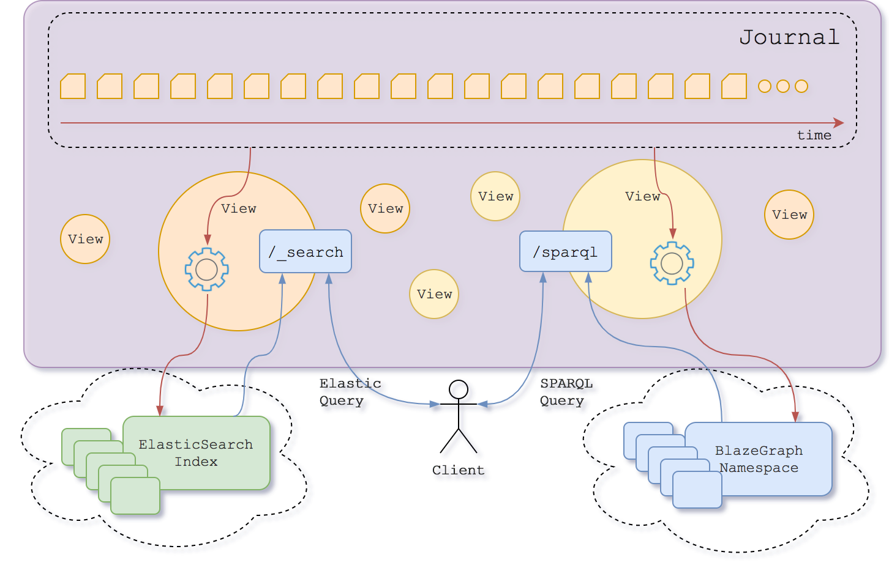

# Views

Views are rooted in the `/v1/views/{org_label}/{project_label}` collection and are used to index the selected resources into a bucket. 


Each view... 

- belongs to a `project` identifier by the label `{project_label}` 
- inside an `organization` identifier by the label `{org_label}` 
- it is validated against the [view schema](https://bluebrain.github.io/nexus/schemas/view).

Any resources in the system might be protected using an **access token**, provided by the HTTP header `Authorization: Bearer {access_token}`. Visit @ref:[Authentication](../iam/authentication.md) in order to learn more about how to retrieve an access token.

@@@ note { .tip title="Running examples with Postman" }

The simplest way to explore our API is using [Postman](https://www.getpostman.com/apps). Once downloaded, import the [views collection](../assets/view-postman.json).

If your deployment is protected by an access token: 

Edit the imported collection -> Click on the `Authorization` tab -> Fill the token field.

@@@

## View types


There are several types of views, which relies on different technology to perform the indexing

### SparqlView

This view creates a SPARQL `namespace` where it stores all the resource's graph inside the view `project`.

This view gets automatically created when the project is created and it cannot be modified.


**SparqlView payload**
```
{
  "@id": "nxv:defaultSparqlIndex",
  "@type": [ "View", "SparqlView" ]
}
```

### ElasticView

@@@ note

The described features are in `@Alpha` phase of development. The operations might change in the future.

@@@

This view creates an ElasticSearch `index` where it stores the selected resources inside the view `project`.

A default view gets automatically created when the project is created but other views can be created.

**ElasticView payload**
```
{
  "@id": "{someid}",
  "@type": [ "View", "ElasticView", "Alpha" ],
  "resourceSchemas": [ "{resourceSchema}", ...],
  "resourceTag": "{tag}",
  "sourceAsText": {sourceAsText},
  "includeMetadata": {includeMetadata},
  "mapping": _elasticsearch mapping_
}
```

where...
 
- `{resourceSchema}`: Iri - It selects the resources that are validated against the provided schema Iri. This field is optional.
- `{tag}`: String - It selects the resources with the provided tag. This field is optional.
- `_elasticsearch mapping_`: Json object - It defines the value types for the Json keys, as stated at the [ElasticSearch mapping documentation](https://www.elastic.co/guide/en/elasticsearch/reference/current/indices-put-mapping.html#indices-put-mapping).
- `{sourceAsText}`: Boolean - If true, the resource's payload will be stored in the ElasticSearch document as a single escaped string value of the key `_original_source`. If false, the resource's payload will be stored normally in the ElasticSearch document. The default value is `false`.
- `{includeMetadata}`: Boolean - If true, the resource's nexus metadata (`_constrainedBy`, `_deprecated`, ...) will be stored in the ElasticSearch document. Otherwise it won't. The default value is `false`.
- `{someid}`: Iri - the @id value for this view.


## Create an ElasticView using POST

```
POST /v1/view/{org_label}/{project_label}
  {...}
```

The json payload: 

- If the `@id` value is found on the payload, this @id will be used.
- If the `@id` value is not found on the payload, an @id will be generated as follows: `base:{UUID}`. The `base` is the `prefix` defined on the view's project (`{project_label}`).

**Example**

Request
:   @@snip [view-elastic.sh](../assets/view-elastic.sh)

Payload
:   @@snip [view-elastic.json](../assets/view-elastic.json)

Response
:   @@snip [view-elastic-ref-new.json](../assets/view-elastic-ref-new.json)


## Create an ElasticView using PUT

This alternative endpoint to create a view is useful in case the json payload does not contain an `@id` but you want to specify one. The @id will be specified in the last segment of the endpoint URI.
```
PUT /v1/views/{org_label}/{project_label}/{view_id}
  {...}
```
 
Note that if the payload contains an @id different from the `{view_id}`, the request will fail.

**Example**

Request
:   @@snip [view-elastic-put.sh](../assets/view-elastic-put.sh)

Payload
:   @@snip [view-elastic-put.json](../assets/view-elastic-put.json)

Response
:   @@snip [view-elastic-ref-new.json](../assets/view-elastic-ref-new.json)


## Update an ElasticView

This operation overrides the payload.

In order to ensure a client does not perform any changes to a view without having had seen the previous revision of
the view, the last revision needs to be passed as a query parameter.

```
PUT /v1/views/{org_label}/{project_label}/{view_id}?rev={previous_rev}
  {...}
```
... where `{previous_rev}` is the last known revision number for the view.


**Example**

Request
:   @@snip [view-elastic-update.sh](../assets/view-elastic-update.sh)

Payload
:   @@snip [view-elastic-put.json](../assets/view-elastic-put.json)

Response
:   @@snip [view-elastic-ref-updated.json](../assets/view-elastic-ref-updated.json)


## Tag an ElasticView

Links a view's revision to a specific name. 

Tagging a view is considered to be an update as well.

```
PUT /v1/views/{org_label}/{project_label}/{view_id}/tags?rev={previous_rev}
  {
    "tag": "{name}",
    "rev": {rev}
  }
```
... where 

- `{previous_rev}`: Number - the last known revision for the resolver.
- `{name}`: String - label given to the view at specific revision.
- `{rev}`: Number - the revision to link the provided `{name}`.

**Example**

Request
:   @@snip [view-tag.sh](../assets/view-tag.sh)

Payload
:   @@snip [tag.json](../assets/tag.json)

Response
:   @@snip [view-elastic-ref-tagged.json](../assets/view-elastic-ref-tagged.json)

## Add attachment to a view

Adds a binary to an already existing view

```
PUT /v1/views/{org_label}/{project_label}/{view_id}/atachments/{name}?rev={previous_rev}
```
...where

- `{previous_rev}`: is the last known revision number for the view.
- `{name}`: String - the attachment identifier. This value is uniquely identifying the attachment per project.

**Example**

Request
:   @@snip [view-attach.sh](../assets/view-attach.sh)

Response
:   @@snip [view-elastic-ref-attached.json](../assets/view-elastic-ref-attached.json)

## Delete attachment from a view

Deletes the attachment metadata from the latest revision of the view. The attachment will still be accessible accessing the previous revision.

```
DELETE /v1/views/{org_label}/{project_label}/{view_id}/atachments/{name}?rev={previous_rev}
```
...where

- `{previous_rev}`: is the last known revision number for the view.
- `{name}`: String - the attachment identifier. This value is uniquely identifying the attachment per project.

**Example**

Request
:   @@snip [view-unattach.sh](../assets/view-unattach.sh)

Response
:   @@snip [view-elastic-ref-unattached.json](../assets/view-elastic-ref-unattached.json)

## Fetch attachment from a view (current revision)

```
GET /v1/views/{org_label}/{project_label}/{view_id}/atachments/{name}
```
...where `{name}` is the attachment identifier.

**Example**

Request
:   @@snip [view-attach-fetch.sh](../assets/view-attach-fetch.sh)

## Fetch attachment from a view (specific revision)

```
GET /v1/views/{org_label}/{project_label}/{view_id}/atachments/{name}?rev={rev}
```
... where 
- `{name}` - String:  is the attachment identifier.
- `{rev}` - Long: is the revision number of the view to be retrieved.

**Example**

Request
:   @@snip [view-attach-fetch-rev.sh](../assets/view-attach-fetch-rev.sh)

## Fetch attachment from a view (specific tag)

```
GET /v1/views/{org_label}/{project_label}/{view_id}/atachments/{name}?tag={tag}
```
... where 
- `{name}` - String:  is the attachment identifier.
- `{tag}` - String: is the tag of the view to be retrieved.

**Example**

Request
:   @@snip [view-attach-fetch-tag.sh](../assets/view-attach-fetch-tag.sh)

## Deprecate a view

Locks the view, so no further operations can be performed. It also stops indexing any more resources into it.

Deprecating a view is considered to be an update as well. 

```
DELETE /v1/views/{org_label}/{project_label}/{view_id}?rev={previous_rev}
```

... where `{previous_rev}` is the last known revision number for the view.

**Example**

Request
:   @@snip [view-deprecate.sh](../assets/view-deprecate.sh)

Response
:   @@snip [view-elastic-ref-deprecated.json](../assets/view-elastic-ref-deprecated.json)


## Fetch a view (current version)

```
GET /v1/views/{org_label}/{project_label}/{view_id}
```

**Example**

Request
:   @@snip [view-fetch.sh](../assets/view-fetch.sh)

Response
:   @@snip [view-fetched.json](../assets/view-fetched.json)


## Fetch a view (specific version)

```
GET /v1/views/{org_label}/{project_label}/{view_id}?rev={rev}
```
... where `{rev}` is the revision number of the view to be retrieved.

**Example**

Request
:   @@snip [view-fetch-revision.sh](../assets/view-fetch-revision.sh)

Response
:   @@snip [view-fetched.json](../assets/view-fetched.json)


## Fetch a view (specific tag)

```
GET /v1/views/{org_label}/{project_label}/{view_id}?tag={tag}
```

... where `{tag}` is the tag of the view to be retrieved.


**Example**

Request
:   @@snip [view-fetch-tag.sh](../assets/view-fetch-tag.sh)

Response
:   @@snip [view-fetched-tag.json](../assets/view-fetched-tag.json)


## List views

```
GET /v1/views/{org_label}/{project_label}?from={from}&size={size}&deprecated={deprecated}&q={full_text_search_query}
```

where...

- `{full_text_search_query}`: String - can be provided to select only the views in the collection that have attribute values matching (containing) the provided token; when this field is provided the results will also include score values for each result
- `{from}`: Number - is the parameter that describes the offset for the current query; defaults to `0`
- `{size}`: Number - is the parameter that limits the number of results; defaults to `20`
- `{deprecated}`: Boolean - can be used to filter the resulting views based on their deprecation status


**Example**

Request
:   @@snip [view-list.sh](../assets/view-list.sh)

Response
:   @@snip [view-list.json](../assets/view-list.json)


## ElasticSearch query

Provides search functionality on the `ElasticView` content.

```
POST /v1/views/{org_label}/{project_label}/{view_id}/_search
  {...}
```
The supported payload is defined on the [ElasticSearch documentation](https://www.elastic.co/guide/en/elasticsearch/reference/current/search-request-body.html)

The string `documents` is used as a prefix of the default ElasticSearch `view_id`

**Example**

Request
:   @@snip [elastic-view-search.sh](../assets/elastic-view-search.sh)

Response
:   @@snip [elastic-view-search.json](../assets/elastic-view-search.json)

## SparQL query

Provides search functionality on the `SparqlView` content.

```
POST /v1/views/{org_label}/{project_label}/graph/sparql
  "..."
```
The supported payload is defined on the [SparQL documentation](https://www.w3.org/TR/rdf-sparql-query/#basicpatterns)
The `Content-Type` HTTP header for this request is `application/sparql-query`.

**Example**

Request
:   @@snip [sparql-view-search.sh](../assets/sparql-view-search.sh)

Response
:   @@snip [sparql-view-search.json](../assets/sparql-view-search.json)

## Views internals

When an asynchronous process that reads the view events from the Primary Store gets triggered, a new index (SparQL or ElasticSearch) gets created. After that, an endpoint (`/sparql` for SparQL view or `/_search` for ElasticSearch view) becomes available. The client can then perform queries against those endpoints.

The view provides the configuration of the index and defines which Events are going to be indexed.



