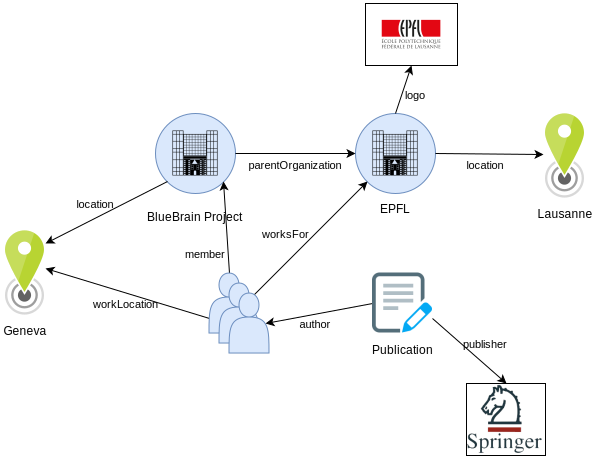
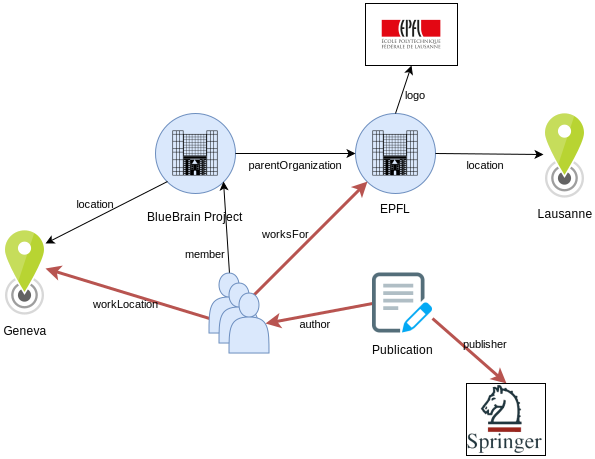
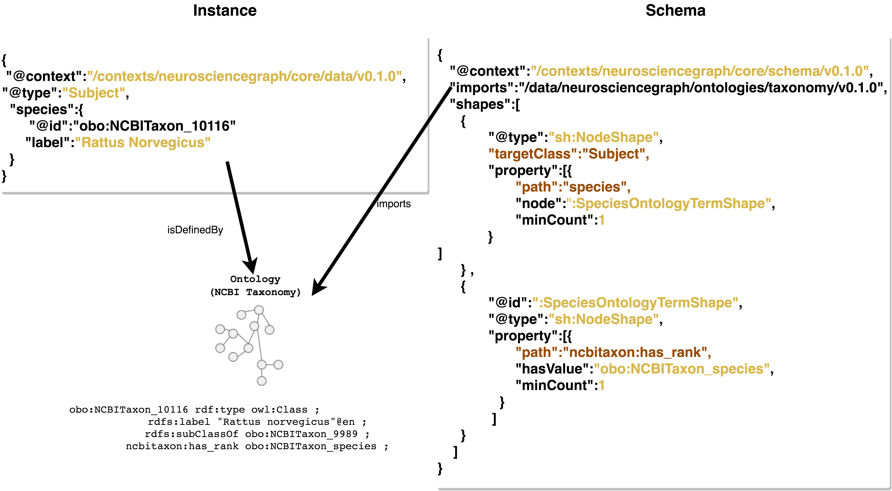
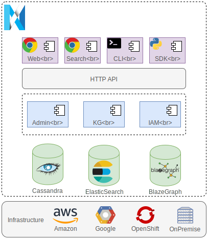
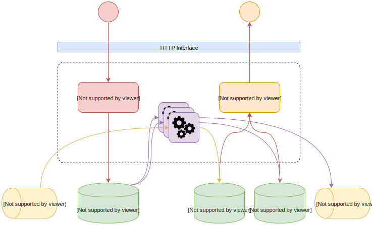
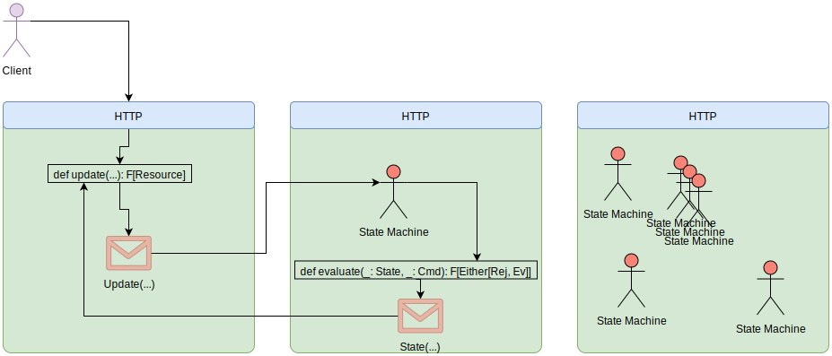
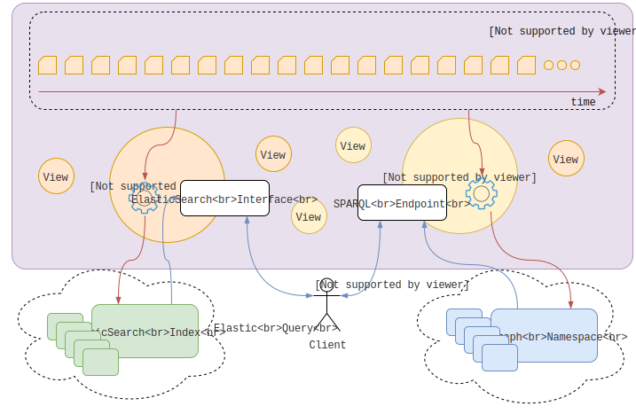

layout: true

<div class="my-footer">
  
  <p>Blue Brain Project | 2019</p>
</div>

---

class: center, middle

# BlueBrain Nexus

## Building a knowledge graph for data driven science

### March 6, 2019

???
Hello.
There's no linear story in this talk, I invite you to stop me and ask questions at any time.

---

## Who we are

### The Blue Brain Project

* Not the Human Brain Project
* Own entity under EPFL governance
* 120+ people
* 9 sections
* Supercomputer at the CSCS in Lugano

[https://bluebrain.epfl.ch](https://bluebrain.epfl.ch)

[https://portal.bluebrain.epfl.ch](https://portal.bluebrain.epfl.ch)

???
If you're curious about the scientific aspects of the Blue Brain,
I invite you to check out our website and portal.

---

## Who we are

### Two teams

* Neuroinformatics
  * Back-end
  * Front-end
  * UI/UX
* Data & knowledge engineering
  * Modeling (vocabularies, taxonomies, ontologies, schemas)
  * Literature curation
  * Image reconstruction & atlasing

We build Nexus.

Presentation and documentation: [https://bluebrain.github.io/nexus](https://bluebrain.github.io/nexus)

Public instance: [https://nexus-sandbox.io/web](https://nexus-sandbox.io/web)

???
We're actually two teams.
I won't go in too many details about how you can use, you can try out
our public sandbox. In particular there's a tutorial that teaches you how to
ingest the MovieLens dataset and run a few queries from a Python notebook.

---

## What do we do?


???
In short, Nexus' goal is to be the platform at the center of the data gathering
that drives the scientific work that is done here.

---

## Why a knowledge graph?



???
Given that there's no lack of databases and document stores out there, you might ask
why we need a knowledge graph?

I'm sure a lot of you are familiar with the concept, and here's a fairly simple
example around a scientific article that could have been published by researchers here.

But first, I'll explain the technology a bit.

---

## RDF in a nutshell


???
We use semantic web, it's built on a pretty simple concept: and that is, relationships
in the form subject - predicate - object. It's basic but powerful and can represent arbitrarily shaped graphs.

--

Example from [Wikipedia](https://en.wikipedia.org/wiki/Resource_Description_Framework):

```xml
<rdf:RDF xmlns:contact="http://www.w3.org/2000/10/swap/pim/contact#"
         xmlns:eric="http://www.w3.org/People/EM/contact#"
         xmlns:rdf="http://www.w3.org/1999/02/22-rdf-syntax-ns#">
  <rdf:Description rdf:about="http://www.w3.org/People/EM/contact#me">
    <contact:fullName>Eric Miller</contact:fullName>
  </rdf:Description>
  <rdf:Description rdf:about="http://www.w3.org/People/EM/contact#me">
    <contact:mailbox rdf:resource="mailto:e.miller123@example.com"/>
  </rdf:Description>
  <rdf:Description rdf:about="http://www.w3.org/People/EM/contact#me">
    <contact:personalTitle>Dr.</contact:personalTitle>
  </rdf:Description>
  <rdf:Description rdf:about="http://www.w3.org/People/EM/contact#me">
    <rdf:type rdf:resource="http://www.w3.org/2000/10/swap/pim/contact#Person"/>
  </rdf:Description>
</rdf:RDF>
```

Other representation formats: N-Triples, Turtle, JSON-LD, etc.

???
RDF is the original format that was designed and specified by the W3C.
As you can see it's quite verbose. But if you look closely, you'll realize
that subjects and predicates are URIs, and objects are either URIs and literal.
Fortunately there are better representation formats.

---

## N-Triples

```xml
<http://www.w3.org/People/EM/contact#me> <http://www.w3.org/2000/10/swap/pim/contact#mailbox> <mailto:e.miller123@example.com> .
<http://www.w3.org/People/EM/contact#me> <http://www.w3.org/1999/02/22-rdf-syntax-ns#type> <http://www.w3.org/2000/10/swap/pim/contact#Person> .
<http://www.w3.org/People/EM/contact#me> <http://www.w3.org/2000/10/swap/pim/contact#fullName> "Eric Miller" .
<http://www.w3.org/People/EM/contact#me> <http://www.w3.org/2000/10/swap/pim/contact#personalTitle> "Dr." .
```

???
It's a bit hard to display on a slides but this format shows the subject - predicate - object relationships.

---

## JSON-LD

```json
{
  "@context": {
    "contact": "http://www.w3.org/2000/10/swap/pim/contact#",
    "eric": "http://www.w3.org/People/EM/contact#",
    "rdf": "http://www.w3.org/1999/02/22-rdf-syntax-ns#",
    "rdfs": "http://www.w3.org/2000/01/rdf-schema#",
    "xsd": "http://www.w3.org/2001/XMLSchema#"
  },
  "@id": "eric:me",
  "@type": "contact:Person",
  "contact:fullName": "Eric Miller",
  "contact:mailbox": {
    "@id": "mailto:e.miller123@example.com"
  },
  "contact:personalTitle": "Dr."
}
```

???
Here's the same content encoded in JSON-LD. Keys that start with an at sign are RDF specific.

---

## SPARQL

What are five names of people that published
a paper in Springer, working for EPFL in Geneva?

???
SPARQL is the query language to access RDF data.

--



???
You can see on the graph the relationships needed to answer this query.

---

## SPARQL

```sql
SELECT DISTINCT ?name
WHERE {
  ?person      a             :Person   .
  ?person      :name         ?name     .
  ?publication :author       ?person   .
  ?publication :publisher    "Springer".
  ?person      :worksFor     "EPFL"    .
  ?person      :workLocation "Geneva"  .
}
LIMIT 5
```

???
And here is the actual query.

---

## SHACL

```ttl
@prefix schema: <http://schema.org/> .
@prefix sh: <http://www.w3.org/ns/shacl#> .
@prefix xsd: <http://www.w3.org/2001/XMLSchema#> .

schema:PersonShape
    a sh:NodeShape ;
    sh:targetClass schema:Person ;
    sh:property [
        sh:path schema:givenName ;
        sh:datatype xsd:string ;
        sh:name "given name" ;
    ] ;
    sh:property [
        sh:path schema:birthDate ;
        sh:lessThan schema:deathDate ;
        sh:maxCount 1 ;
    ] ;
    sh:property [
        sh:path schema:gender ;
        sh:in ( "female" "male" ) ;
    ] ;
    sh:property [
        sh:path schema:address ;
        sh:node schema:AddressShape ;
    ] .
```

???
SHACL is a constraint language that we use to define schemas.
You use Scala for strong and expressive types (or I hope, at least),
this is the same thing here.

---

## In practice



???
This shows a concrete example here at the BBP.
On the left is a document that describes some experiment on a rat.
On the right you see the schema that constraint the class of type Subject,
it needs to have a field called "species".

---

class: center, middle

# Nexus services

???
Now I'm going to give a brief overview of our micro-services. Again I'm not going to show you
much of the REST API.

---

## Overview

.center[]

???
We have 3 micro-services, a couple applications and libraries that consume the API.
Under the hood, we use Cassandra as our primary store, Elasticsearch, and Blazegraph, which is our triple store.
And we run it on-premises in OpenShift, which is just a Kubernetes distribution.
We also run the sandbox in AWS for now, but we'll migrate it to on-premises soon.

---

## Resource hierarchy

.center[]

???
First, we want to organize resources in our graph in different projects, that belong to an organization.
You can think of GitHub organizatio and repos, it's pretty similar.

---

## Resource life-cycle


Example with resources:

```
POST /v1/resources/{org_label}/{project_label}/{schema_id}
```

```
PUT /v1/resources/{org_label}/{project_label}/{schema_id}/{resource_id}?rev={prev}
```

```
GET /v1/resources/{org_label}/{project_label}/{schema_id}/{resource_id}
```

```
GET /v1/resources/{org_label}/{project_label}/{schema_id}/{resource_id}?rev={rev}
```

```
DELETE /v1/resources/{org_label}/{project_label}/{schema_id}/{resource_id}?rev={prev}
```

???
As for resources themselves, here's an example of a complete life-cycle.
POST to create the resource, PUT to update it, then you can fetch the last revision with GET,
or a specific one. And finally, DELETE to deprecate the resource, which is never really deleted.

---

## Identity & access management

* Authentication providers (OpenID Connect)
  * Realms
* Identities
  * Users
  * Groups
  * Authenticated
  * Anonymous
* Permissions
  * Arbitrary strings, e.g. `projects/create` or `schemas/write`
* ACLs
  * Resource path -> (Identity, Permissions)

```scala
case class AccessControlLists(value: Map[Path, AccessControlList])

case class AccessControlList(value: Map[Identity, Set[Permission]])
```

???
The first service handles authentication and authorization.
We support OIDC authentication providers and use Keycloak ourselves.
It allows us to create ACLs. ACLs map paths in the system to pairs of
identities and permissions.
The service is agnostic and allows for abitrary permission strings.
We can discriminate between anonymous, authenticated, or specific groups, and specific users.

---

## Admin

* Organizations
* Projects
  * Base
  * Vocabulary
  * API mappings (prefixes)

.center[]

???
Admin is the service that manages organization and project.
It store some settings for projects but that's not important.

---

## Knowledge graph

* Schemas
* Resolvers
* Views
  * Elasticsearch
  * SPARQL
* Files (binary attachments)
* Resources

???
Finally, the knowledge graph is the main service.
Internally, everything is a resource. But they can have different types.
We have SHACL schemas like I explained before
Resolvers that define how and where to resolve IDs, for instance if you have an ID that points to a resource
in another project.
Views expose how the data is indexed, and an endpoint that you can query.
Files are binary attachment you can add to a resource.
And finally, resources, validated against a schema or not.

---

class: center, middle

# Nexus components

???
Now I'm going to talk about specific components and how they're implemented.
The goal is mostly to show you where to look in our codebase if you want to do something similar.

---

## Event sourcing & CQRS

[https://github.com/BlueBrain/nexus-sourcing](https://github.com/BlueBrain/nexus-sourcing)



???
Our event sourcing is contained in a library. It doesn't have many dependencies and you should be able
to use it as-is.

CQRS stands for Command and Query Responsibility Segregation.
It basically segregates writes and reads.
If you remember the slide a bit earlier, here Cassandra is our primary store, Elasticsearcha and Blazegraph
are the indices.

---

## Example: State

```scala
sealed trait State extends Product with Serializable

case object Initial extends State

final case class Current(
      id: Id[ProjectRef],
      rev: Long,
      types: Set[AbsoluteIri],
      deprecated: Boolean,
      tags: Map[String, Long],
      created: Instant,
      updated: Instant,
      createdBy: Subject,
      updatedBy: Subject,
      schema: Ref,
      source: Json
  ) extends State
```

???
I'll show you an example. This is how we handle resources in the knowledge graph.
First we define a state. It has an ID, rooted in project. It has a revision, types, tags and other metadata.
We store the schema it's validated against, and the original JSON payload.

---

## Example: Command

```scala
sealed trait Command extends Product with Serializable {
  def id: Id[ProjectRef]
  def rev: Long
  def instant: Instant
  def subject: Subject
}
```

```scala
final case class Create(
    id: Id[ProjectRef],
    schema: Ref,
    types: Set[AbsoluteIri],
    source: Json,
    instant: Instant,
    subject: Subject
) extends Command {
  val rev: Long = 0L
}
```

???
Now we would need to define commands, to perform actions on resources.
Here's Create. It holds the necessary metadata that is either provided by the call, or generated, like the timestamp.
We would of course also need commands for Update, Deprecate, and so on.

---

## Example: Event

```scala
sealed trait Event extends Product with Serializable {
  def id: Id[ProjectRef]
  def rev: Long
  def instant: Instant
  def subject: Subject
}
```

```scala
final case class Created(
    id: Id[ProjectRef],
    schema: Ref,
    types: Set[AbsoluteIri],
    source: Json,
    instant: Instant,
    subject: Subject
) extends Event {
  val rev: Long = 1L
}
```

???
Now, to implement the state machine, from a state and a command, we'll generate events.
It looks pretty similar to the data in the command. You can see that we set the revision to 1 when a resource
is created.

---

## Example: Evaluation

```scala
  def eval(state: State, cmd: Command): Either[Rejection, Event] = cmd match {
      case cmd: Create => create(state, cmd)
      // Update, Deprecate, Tag, ...
    }

  def create(state: State, c: Create): Either[Rejection, Created] =
    state match {
      case Initial => Right(Created(c.id, c.schema, c.types, c.source, c.instant, c.subject))
      case _       => Left(ResourceAlreadyExists(c.id.ref))
    }
```

```scala
class Repo[F[_]: Monad](agg: Agg[F], clock: Clock, toIdentifier: ResId => String) {

  def create(id: ResId, schema: Ref, types: Set[AbsoluteIri],
             source: Json, instant: Instant = clock.instant)(
             implicit subject: Subject): EitherT[F, Rejection, Resource] =
    evaluate(id, Create(id, schema, types, source, instant, subject))
}
```

???
We can then implement the actual logic to accept or reject
a command given a state. For instance here, if you try to create a resource with an id that corresponds
to an existing resource you'll get a rejection.

At the bottom I show you a component called Repo that abstracts all the operations on resources.
More on that in a bit.

---

## Example: State machine

```scala
def next(state: State, ev: Event): State =
  (state, ev) match {
    case (Initial, e @ Created(id, schema, types, value, tm, ident)) =>
      Current(id, e.rev, types, false,
              Map.empty, None, tm, tm,
              ident, ident, schema, value)
    case (c: Current, Updated(_, rev, types, value, tm, ident)) =>
      c.copy(rev = rev, types = types,
             source = value, updated = tm,
             updatedBy = ident)
    // Deprecated, TagAdded, ...
  }

```

???
Now that we have the state, command and event generation, this would be a bit of our state machine, that is
used to go through the log of our event stream.
If you fold over the events with this method, you'll get the last state.

---

## Example: State machine



---

## Example: Aggregate

```scala
type Agg[F[_]] = Aggregate[F, String, Event, State, Command, Rejection]
```

```scala
def aggregate[F[_]: Effect: Timer](implicit as: ActorSystem,
      mt: ActorMaterializer, sourcing: SourcingConfig, F: Monad[F]): F[Agg[F]] =
  AkkaAggregate.sharded[F](
        name = "resources",
*       Initial,
*       next,
*       (state, cmd) => F.pure(eval(state, cmd)),
        sourcing.passivationStrategy,
        Retry(sourcing.retry.retryStrategy),
        sourcing.akkaSourcingConfig,
        sourcing.shards
      )
```

???
I'll let you look up the definition of an aggregate in domain-driven design, but in Nexus
it represents resources, because that's the only kind of domain object we have.

If you remember our Repo above, this is how we create its aggregate.
I've highlighted the important part, namely the initial state, the next function of the state machine
and the eval function that generates events.

---

## Aggregate

```scala
trait Aggregate[F[_], Id, Event, State, Command, Rejection]
    extends StatefulEventLog[F, Id, Event, State] {

    def evaluate(id: Id, command: Command): F[Either[Rejection, (State, Event)]]
}
```

Using Akka cluster sharding, we construct it like this:

```scala
object AkkaAggregate {

  def shardedF[F[_]: Effect, Event, State, Command, Rejection](...) = {
    val shardExtractor = { case msg: Msg =>
      math.abs(msg.id.hashCode) % shards toString
    }
    val entityExtractor = { case msg: Msg => (msg.id, msg) }
    val props = AggregateActor.shardedProps(name, initialState, next,
                                            evaluate, passivationStrategy, config)
    val ref = ClusterSharding(as).start(name, props, settings,
                                        entityExtractor, shardExtractor)
    // route all messages through the sharding coordinator
    val selection = ActorRefSelection.const(ref)
    new AkkaAggregate(name, selection, retry, config)
  }
}
```

???
This is pretty specific to Akka. Since the actors will run on multiple nodes, we need
a function to extract the shard in a deterministic way. Here it's simply using the resource ID hash code.

---

## Clustered Akka aggregate

```scala
class AkkaAggregate[F[_]: Async, Event: ClassTag, State, Command, Rejection] (
    override val name: String,
    selection: ActorRefSelection[F],
    retry: Retry[F, Throwable],
    config: AkkaSourcingConfig,
)(implicit as: ActorSystem, mat: ActorMaterializer)
    extends Aggregate[F, String, Event, State, Command, Rejection] {

  override def evaluate(id: String, command: Command):
      F[Either[Rejection, (State, Event)]] =
    send(id, Evaluate(id, command), r => r.value)

  private def send[Reply, A](id: String, msg: Msg, f: Reply => A)
      (implicit Reply: ClassTag[Reply]): F[A] =
    selection(name, id).flatMap { ref =>
*     val future = IO(ref ? msg)
      val fa     = IO.fromFuture(future).to[F]
      fa.flatMap[A] {
          case Reply(value) => F.pure(f(value))
          case e            => F.raiseError(e)
        }
        .retry
    }
}
```

???
Here I show you how it sends the Evaluate message to actor that's going to perform the actual evaluation.
It's only one line really. We've wrapped the futures in Cats IO so that we can use a generic effect type.
In practice in our codebase, we use Monix Task.

---

## Persistent aggregate actor

```scala
class AggregateActor[F[_]: Effect, Event, State, Command, Rejection](
    name: String,
    initialState: State,
    next: (State, Event) => State,
    evaluate: (State, Command) => F[Either[Rejection, Event]],
    passivationStrategy: PassivationStrategy[State, Command],
    config: AkkaSourcingConfig,
) extends PersistentActor with Stash with ActorLogging {

  private def evaluateCommand(cmd: Command, test: Boolean = false): Unit = {
    val eval = for {
      _ <- IO.shift(config.commandEvaluationExecutionContext)
      r <- evaluate(state, cmd).toIO.timeout(config.commandEvaluationMaxDuration)
      _ <- IO.shift(context.dispatcher)
      _ <- IO(self ! r)
    } yield ()
    val io = eval.onError { ... } // error handling
    io.unsafeRunAsyncAndForget()
  }
}
```

???
Then in the actor, we run the evaluate function. Again every future is wrapped in IO.
That's pretty much it for writes, what about reads?

---

## Indexing



???
I've talked about views before. They describe and implement two things:
How we index the data and where we can query it.

---

## Indexing

```scala
case class IndexerConfig[F[_], Event, MappedEvt, Err, O <: OffsetStorage](
    tag: String,
    pluginId: String,
    name: String,
    mapping: Event => F[Option[MappedEvt]],
*   index: List[MappedEvt] => F[Unit],
    init: F[Unit],
    batch: Int,
    batchTo: FiniteDuration,
    retry: Retry[F, Err],
    storage: O)
```

```scala
trait StreamByTag[F[_], A] {

  def fetchInit: F[A]

  def source(init: A): Source[A, _]
}
```

???
To implement indexers, we need a function that will process the event, and a bunch of settings, in particular
the retry mechanism and batch size.
We abstract our stream of event as an Akka Source.

---

## Indexing

```scala
class VolatileStreamByTag[F[_]: Effect, Event, MappedEvt, Err](
      config: IndexerConfig[F, Event, MappedEvt, Err, Volatile])
      extends StreamByTag[F, Offset] {

  def batchedSource(initialOffset: Offset):
        Source[(Offset, List[IdentifiedEvent]), NotUsed] = {
      val eventsByTag =
        PersistenceQuery(as)
        .readJournalFor[EventsByTagQuery](config.pluginId)
        .eventsByTag(tag, initialOffset)
      // ... casting, mapping, batching
      eventsBatched
    }

  def fetchInit: F[Offset] =
    if (config.storage.restart)
      config.init.retry *> F.pure(NoOffset)
    else
      config.init.retry.flatMap(_ => projection.fetchLatestOffset.retry)
}
```

???
Here's an example of a stream by tag.
Fetch init tries to get the initial offset based on configuration.
And batchedSource will deal with all stages, from querying the primary store
to transforming and grouping events.

---

## Indexing

```scala
class VolatileStreamByTag[F[_]: Effect, Event, MappedEvt, Err](
      config: IndexerConfig[F, Event, MappedEvt, Err, Volatile])
      extends StreamByTag[F, Offset] {

  def source(initialOffset: Offset): Source[Offset, NotUsed] = {

    val eventsIndexed = batchedSource(initialOffset).mapAsync(1) {
      case (offset, events) =>
        val index =
*         config.index(events.map { case (_, _, mapped) => mapped })
          .retry
          .recoverWith(recoverIndex(offset, events))
        F.toIO(index.map(_ => offset)).unsafeToFuture()
    }

    val eventsStoredProgress = eventsIndexed.mapAsync(1) { offset =>
      F.toIO(projection.storeLatestOffset(offset)
      .retry
      .map(_ => offset))
      .unsafeToFuture()
    }

    eventsStoredProgress
  }
}
```

???
And here you can see the actual processing. Again, it's one line really
It returns an Akka Source.

---

## Indexing: how it's used

* Define indexers
  * Elasticsearch
  * Triple store (Blazegraph)
  * Akka Distributed Data
* Wrap the Akka source in an coordinator actor
* Run the coordinator as an Akka Cluster Singleton or Cluster Sharded actor.

---

## Interservice communication

We had Kafka

* Easy to integrate with Alpakka Kafka
* Drawbacks:
  * One more thing to operate (several nodes + ZooKeeper)
  * Exposing event streams to external users

Solution: server sent events

* Support included in Akka HTTP
* Plain HTTP
  * Access restriction with Nexus ACLs

---

## SSE: producer

```scala
val pq = PersistenceQuery(as).readJournalFor[EventsByTagQuery](queryJournalPlugin)

def source(
    tag: String,
    offset: Offset
)(implicit enc: Encoder[Event]): Source[ServerSentEvent, NotUsed] =
  pq.eventsByTag(tag, offset)
    .flatMapConcat(eventEnvelope => Source(eventToSse(eventEnvelope).toList))
    .keepAlive(10 seconds, () => ServerSentEvent.heartbeat)

def lastEventId: Directive1[Offset] =
  optionalHeaderValueByName(`Last-Event-ID`.name)
    .map(_.map(id => `Last-Event-ID`(id)))
    .flatMap {
      case Some(header) =>
        Try[Offset](TimeBasedUUID(UUID.fromString(header.id)))
          .orElse(Try(Sequence(header.id.toLong))) match {
          case Success(value) => provide(value)
          case Failure(_)     => reject(validationRejection("Invalid header"))
        }
      case None => provide(NoOffset)
    }
```

???
We query the primary store exactly like before.
Then we have a function that transforms the event envelope.
At the bottom we can see how we grab the initial offset from the HTTP headers.
The client could store its offset, exactly like a Kafka consumer.

---

## SSE: consumer

```scala
class EventSource[A: Decoder] {

  def send(request: HttpRequest)(
      implicit cred: Option[AuthToken]): Future[HttpResponse] =
    http.singleRequest(addCredentials(request)).map { resp =>
      if (!resp.status.isSuccess())
        logger.warn(s"Error when performing SSE request: '${resp.status}'")
      resp
    }

  def apply(iri: AbsoluteIri, offset: Option[String])(
      implicit cred: Option[AuthToken]): Source[A, NotUsed] =
*    SSESource(iri.toAkkaUri, send, offset, sseRetryDelay).flatMapConcat { sse =>
      decode[A](sse.data) match {
        case Right(ev) => Source.single(ev)
        case Left(err) =>
          logger.error(s"Failed to decode admin event '$sse'", err)
          Source.empty
      }
    }
}
```

???
On the consumer side, we just need to define a function that performs the HTTP request.
In our case we add the credentials.
Alpakka provides that SSESource, and we decode the events with Circe.

---

## Monitoring

We use Kamon with two reporters:

* Prometheus for metrics, plotted in Grafana
* Jaeger for tracing
* Be careful not to generate too many metrics
  * `operationName` directive creates a new histogram for every different request path
  * Start with a reasonable sampling rate

---

## Nexus RDF

[https://github.com/BlueBrain/nexus-rdf](https://github.com/BlueBrain/nexus-rdf)

IRI

* Superset of URI that supports unicode, used by RDF
* Custom parser implemented with Parboiled2
* Manipulation (scheme, host, port, path, segments, query, ...)
* Conversion (absolute, relative, URL, URN, CURIE, ...)

Graph

* Construction
* Manipulation
  * Nodes
  * Triples
* Serialization
  * JSON-LD with Circe and Jena
  * N-Triples
  * DOT graph format

---

## Application: Nexus Search

[https://bbp.epfl.ch/nexus/search/](https://bbp.epfl.ch/nexus/search/)

---

class: middle, center

# Questions?