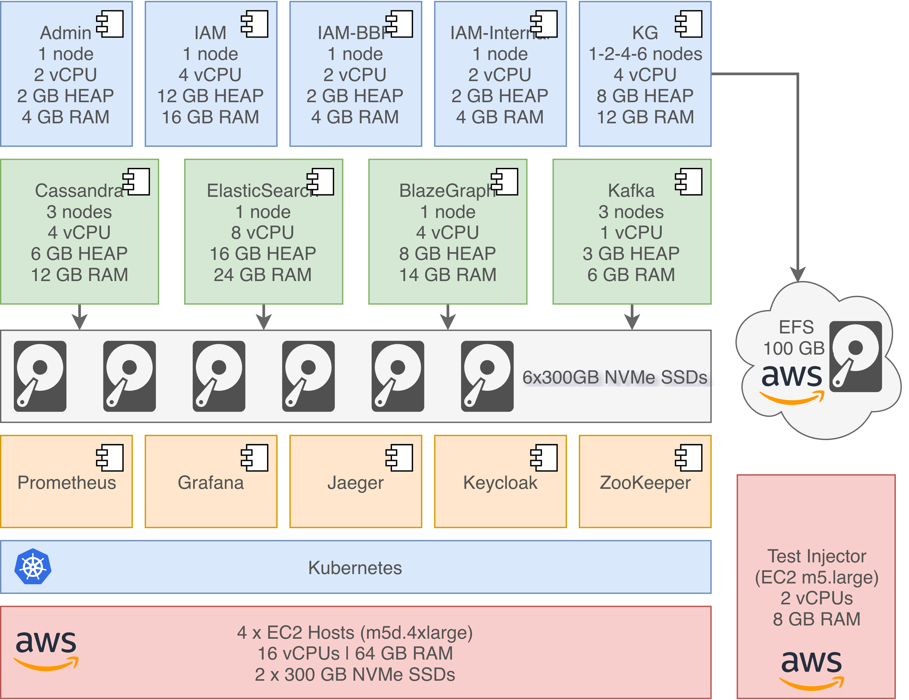

# Deployment Configuration

The tests were performed against Nexus services deployed in Kubernetes cluster provisioned by [Amazon EKS](https://aws.amazon.com/eks/).
The deployment configuration and the number of nodes assigned to each Nexus service are presented in the following diagram:

The benchmarks were run on a AWS EC2 `m5.2xlarge` server outside of the Kubernetes cluster.