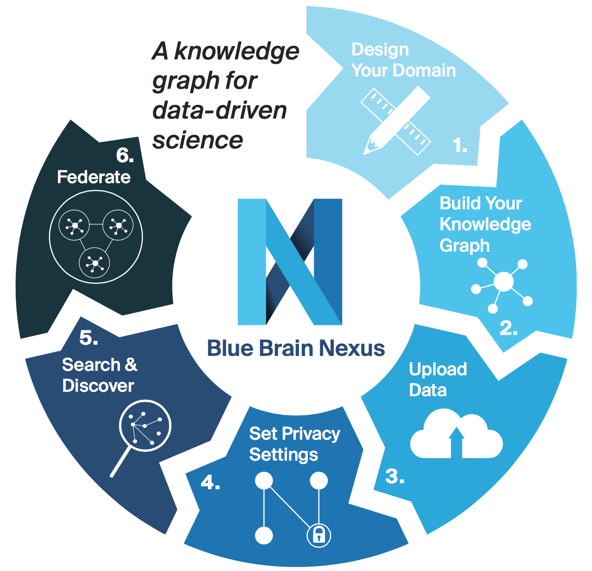

@@@ index

* [Nexus concepts](nexus-concepts.md)
* [Running Nexus](running-nexus/index.md)
* [Tutorials](tutorials.md)

@@@

# Getting Started Guide

## Overview

Blue Brain Nexus is an open source, data and knowledge management platform designed to enable open data-driven science by enabling the [FAIR principles](https://www.go-fair.org/fair-principles/), tracking data provenance and supporting data longevity in a secure and scalable manner.

A key component of the platform is the **Knowledge Graph**, which acts as a **data repository** and **metadata catalog**. The data ingested in the Knowledge Graph is structured in a semantically meaningful way and can be linked to other data. This allows users to assess the quality of data, and consequently enables them to build trust.

