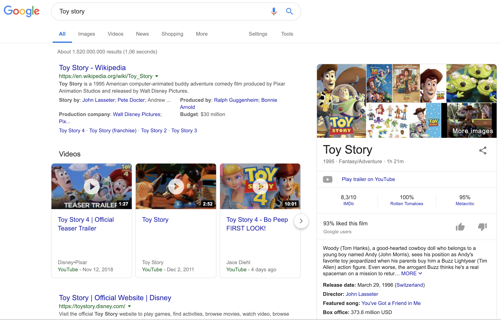

@@@ index

* [Thinking in Graph](thinking-in-graph.md)
* [RDF and JSON-LD](understanding-jsonld.md)
@@@

# Understanding knowledge graphs

## Overview

How does Google display information card like in the following search ? Well they use the [Google Knowledge Graph](https://developers.google.com/knowledge-graph/).
Knowledge graphs are now ubiquitous and serves as data integration hub to integrate and connect data of different types, formats and sources.

## What you'll build

* Queries to explore and navigate a knowledge graph using Sparql

## What you'll learn

* An understanding of what is a knowledge graph
* Understanding RDF and JSON-LD data model

## What you'll need

* A Python 3.5 or higher  with support of Jupyter notebook
