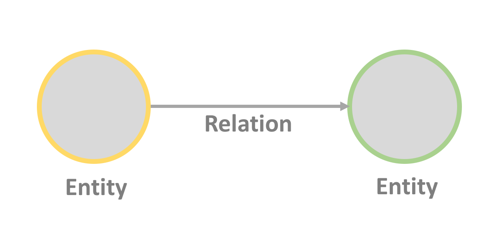
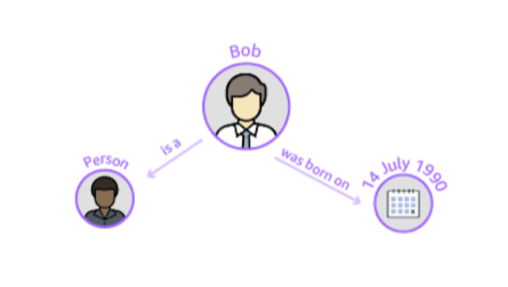
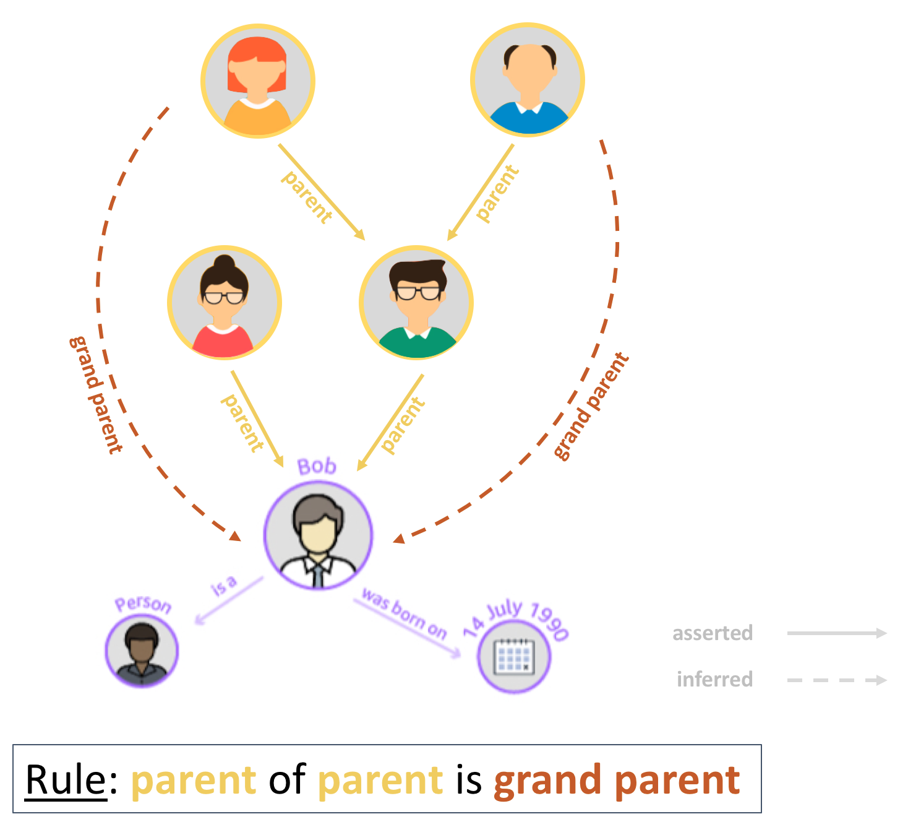
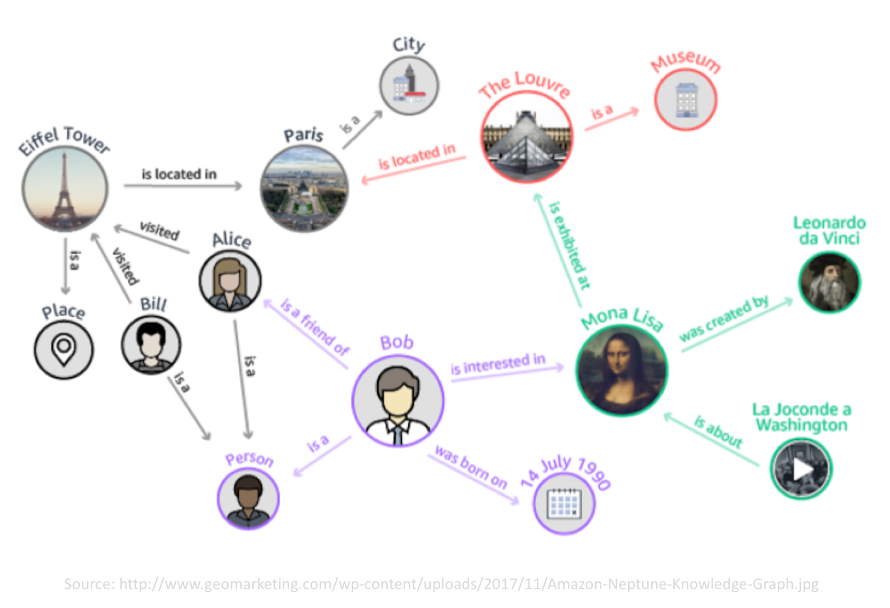

# Thinking in graph

## What is a Knowledge Graph ?

In this section, we will explain what a Knowledge Graph and some of the advantages of using them.

### It is a graph structure

 A knowledge graph uses a graph data structure to represent information, it uses the concept of nodes and edges to
represent respectively entities and their relations. An entity could be a person, a company, a product. Each entity can
have properties that describes it, for example, a person could have a first name, last name, address, birth date  and
age. These properties are also refered to as the entity's metadata.

 Relations between entities are first class citizen, consequently, it becomes easy to traverse and discover related
entities. Examples of relations could be a person is friend with an other person (John --friend--> Ann)  or a person works
for a company (Eric --works for--> EPFL).

 Furthermore, a graph data structure makes it easy to merge new data in existing graph.

 

### It is semantic

 The metadata definition is encoded, alongside the metadata, in an
[ontology][1]. This is a formal description that both humans
and computers can understand and process. The metadata is said to be self descriptive.

 In the example below, you can see that the entity **Bob** is a **Person** (also known as the **type** of the entity)
and he has a property **was born on** for this the value is **14 July 1990**.

 

 [1]: https://en.wikipedia.org/wiki/Ontology_(information_science)

### It is smart

 Since all this information is represented in an ontology, it enables us to run a tool called an inference engine on
the data and derive new information from explicitly asserted data. This inference can make information easier to
discover.

 In the example below, we have **Bob**, he has parents (using the relation called **parent**) and we have asserted that
his father also has parents. Having define this, we can now define a rule that instructs the inference engine to create
new relations **grand parent** whenever we find the **parent** of a **parent**. This enables us to query the graph
and directly get **Bob**'s grand parents without having to navigate through his parents first.

 

### It is alive

 A graph is a flexible data structure, and an ontology can evolve as new data comes in. As a result, Data can be
continually be added to help serve new usecases.

 The illustration below shows how the initial graph representing **Bob** can be augmented to capture many other related
domains such as:

 - Bob's social network (e.g. Friends)
 - People's tourism destinations (e.g. Eiffel Tower)
 - Towns and tourism landmarks (e.g. Louvre)
 - Pieces of arts and where they are located (e.g. Mona Lisa)

 
